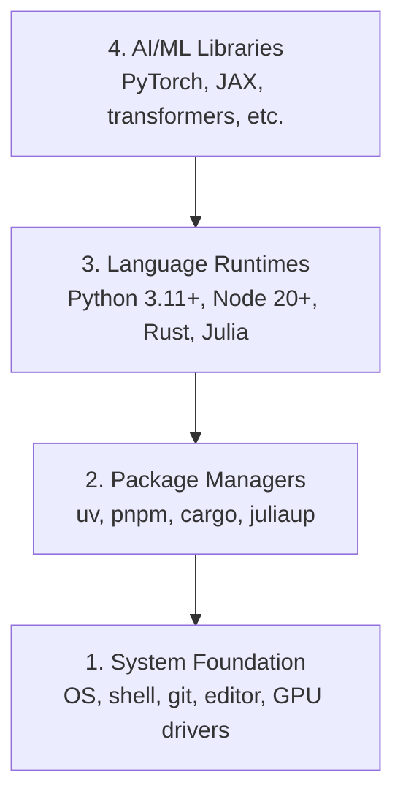

# 开发环境

> 工具塑造思维。花一次时间把它配好,把它配对。

**Type:** Build
**Languages:** Python, Node.js, Rust
**Prerequisites:** None
**Time:** ~45 minutes

## Learning Objectives

- 从零搭建 Python 3.11+、Node.js 20+、Rust 工具链
- 配置虚拟环境与包管理器,确保构建可复现
- 验证 GPU 访问能力(CUDA/MPS)并跑通一个张量测试
- 理解四层栈结构:系统层、包管理层、运行时层、AI 库层

## The Problem

接下来的 200+ 节课程会带你用 Python、TypeScript、Rust、Julia 学完 AI 工程。如果环境没装好,每一节课都会变成跟工具的战斗,而不是学习。

大多数人跳过环境配置。结果花数小时调试 import 错误、版本冲突、缺 CUDA 驱动。我们这次一次配齐,一劳永逸。

## The Concept

一个 AI 工程环境由四层组成:



我们自底向上安装。每一层都依赖下面那一层。

## Build It

### Step 1: System Foundation

检查系统并安装基础工具。

```bash
# macOS
xcode-select --install
brew install git curl wget

# Ubuntu/Debian
sudo apt update && sudo apt install -y build-essential git curl wget

# Windows (use WSL2)
wsl --install -d Ubuntu-24.04
```

### Step 2: Python with uv

我们用 `uv` —— 比 pip 快 10–100 倍,而且会自动管理虚拟环境。

```bash
curl -LsSf https://astral.sh/uv/install.sh | sh

uv python install 3.12

uv venv
source .venv/bin/activate  # Windows 上用 .venv\Scripts\activate

uv pip install numpy matplotlib jupyter
```

验证一下:

```python
import sys
print(f"Python {sys.version}")

import numpy as np
print(f"NumPy {np.__version__}")
a = np.array([1, 2, 3])
print(f"Vector: {a}, dot product with itself: {np.dot(a, a)}")
```

### Step 3: Node.js with pnpm

给 TypeScript 章节用的(agent、MCP server、Web 应用)。

```bash
curl -fsSL https://fnm.vercel.app/install | bash
fnm install 22
fnm use 22

npm install -g pnpm

node -e "console.log('Node', process.version)"
```

### Step 4: Rust

给对性能有要求的章节用(推理、系统级)。

```bash
curl --proto '=https' --tlsv1.2 -sSf https://sh.rustup.rs | sh

rustc --version
cargo --version
```

### Step 5: Julia (Optional)

Julia 擅长的数学密集型章节会用到。

```bash
curl -fsSL https://install.julialang.org | sh

julia -e 'println("Julia ", VERSION)'
```

### Step 6: GPU Setup (If You Have One)

```bash
# NVIDIA
nvidia-smi

# 安装带 CUDA 的 PyTorch
uv pip install torch torchvision torchaudio --index-url https://download.pytorch.org/whl/cu124
```

```python
import torch
print(f"CUDA available: {torch.cuda.is_available()}")
if torch.cuda.is_available():
    print(f"GPU: {torch.cuda.get_device_name(0)}")
```

没有 GPU 也没关系。大部分章节 CPU 就能跑。训练重的章节再用 Google Colab 或云上 GPU。

### Step 7: Verify Everything

跑一下验证脚本:

```bash
python phases/00-setup-and-tooling/01-dev-environment/code/verify.py
```

## Use It

环境配好后,本课程所有章节都能直接开干。下面是各语言的使用场景:

| Language | Used In | Package Manager |
|----------|---------|-----------------|
| Python | Phases 1-12 (ML, DL, NLP, Vision, Audio, LLMs) | uv |
| TypeScript | Phases 13-17 (Tools, Agents, Swarms, Infra) | pnpm |
| Rust | Phases 12, 15-17 (Performance-critical systems) | cargo |
| Julia | Phase 1 (Math foundations) | Pkg |

## Ship It

本节产出一个验证脚本,任何人都能跑它来检查自己的环境是否就绪。

`outputs/prompt-env-check.md` 里有一个 prompt,可以让 AI 助手帮你排查环境问题。

## Exercises

1. 跑一遍验证脚本,把失败项修掉
2. 为本课程创建一个 Python 虚拟环境,并装上 PyTorch
3. 用四种语言各写一个 "hello world" 并跑通
