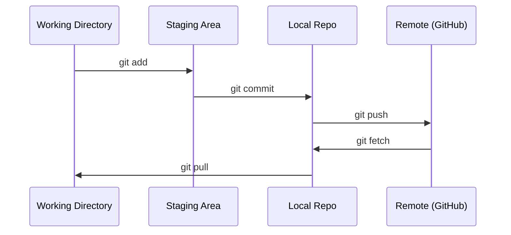

# Git 与协作

> 版本控制不是可选项。你在这里写的每一个实验、每一个模型、每一节课,都得被记录下来。

**Type:** Learn
**Languages:** --
**Prerequisites:** Phase 0, Lesson 01
**Time:** ~30 minutes

## Learning Objectives

- 配置 git 身份,掌握 add、commit、push 的日常流程
- 创建并合并分支,在不破坏 main 的前提下做独立实验
- 写一份 `.gitignore`,把模型 checkpoint 和大体积二进制文件排除掉
- 用 `git log` 翻看提交历史,理解项目是怎么一步步演化的

## The Problem

接下来 20 个 phase、几百个代码文件,没有版本控制你一定会丢东西、搞坏代码却回不去,也完全没法跟别人协作。

Git 是工具,GitHub 是代码的家。本节只讲本课程用得到的那部分,不讲别的。

## The Concept



记住三件事:
1. 经常存(`git commit`)
2. 推到远端(`git push`)
3. 拿分支做实验(`git checkout -b experiment`)

## Build It

### Step 1: Configure git

```bash
git config --global user.name "Your Name"
git config --global user.email "you@example.com"
```

### Step 2: The daily workflow

```bash
git status
git add file.py
git commit -m "Add perceptron implementation"
git push origin main
```

### Step 3: Branching for experiments

```bash
git checkout -b experiment/new-optimizer

# ... 做改动、提交 ...

git checkout main
git merge experiment/new-optimizer
```

### Step 4: Working with this course repo

```bash
git clone https://github.com/rohitg00/ai-engineering-from-scratch.git
cd ai-engineering-from-scratch

git checkout -b my-progress
# 按顺序做每一节,提交你的代码
git push origin my-progress
```

## Use It

本课程你只会用到下面这些命令,够用了:

| Command | When |
|---------|------|
| `git clone` | 拉取课程仓库 |
| `git add` + `git commit` | 保存你的工作 |
| `git push` | 备份到 GitHub |
| `git checkout -b` | 不破坏 main,大胆试新东西 |
| `git log --oneline` | 看自己做过什么 |

就这些。rebase、cherry-pick、submodules 这套本课程用不上。

## Exercises

1. clone 这个仓库,建一个叫 `my-progress` 的分支,新建一个文件,提交,推送
2. 写一份 `.gitignore`,把模型 checkpoint 文件(`.pt`、`.pth`、`.safetensors`)排除掉
3. 用 `git log --oneline` 看一遍本仓库的提交历史,读读课程是怎么一步步加进来的

## Key Terms

| Term | What people say | What it actually means |
|------|----------------|----------------------|
| Commit | "保存一下" | 整个项目在某一时刻的一份完整快照 |
| Branch | "一个副本" | 指向某个 commit 的指针,你提交时它会跟着往前走 |
| Merge | "合并代码" | 把一个分支上的改动套用到另一个分支上 |
| Remote | "云端" | 你的仓库在别处(GitHub、GitLab 等)的一份拷贝 |
