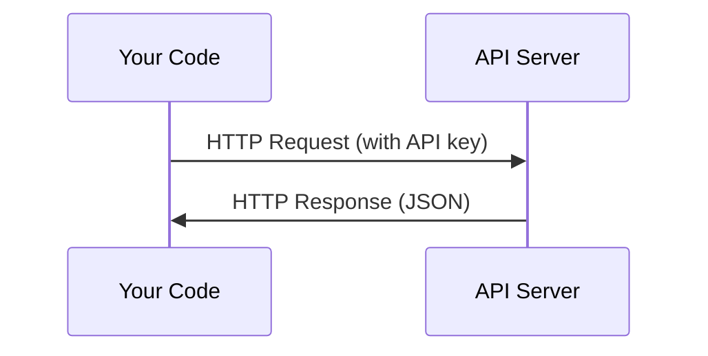

# API 与密钥

> 每个 AI API 的玩法都一样:发请求,拿响应。细节会变,模式不变。

**Type:** Build
**Languages:** Python, TypeScript
**Prerequisites:** Phase 0, Lesson 01
**Time:** ~30 minutes

## Learning Objectives

- 用环境变量和 `.env` 文件安全地存 API key
- 分别用 Anthropic Python SDK 和裸 HTTP 调一次 LLM API
- 对比 SDK 和裸 HTTP 的请求/响应格式,方便调试
- 识别并处理常见的 API 错误,包括鉴权失败和限流

## The Problem

从 Phase 11 开始你要调 LLM API(Anthropic、OpenAI、Google)。Phase 13–16 你要建在循环里反复调这些 API 的 agent。你得先搞清楚 API key 怎么用、怎么安全存、以及怎么发出第一次调用。

## The Concept



每一次 API 调用都由四样东西组成:
1. 端点(URL)
2. API key(身份认证)
3. 请求体(你想干啥)
4. 响应体(服务端返回啥)

## Build It

### Step 1: Store API keys safely

永远别把 API key 写进代码里。用环境变量。

```bash
export ANTHROPIC_API_KEY="sk-ant-..."
export OPENAI_API_KEY="sk-..."
```

或者用 `.env` 文件(记得加进 `.gitignore`):

```
ANTHROPIC_API_KEY=sk-ant-...
OPENAI_API_KEY=sk-...
```

### Step 2: First API call (Python)

```python
import anthropic

client = anthropic.Anthropic()

response = client.messages.create(
    model="claude-sonnet-4-20250514",
    max_tokens=256,
    messages=[{"role": "user", "content": "What is a neural network in one sentence?"}]
)

print(response.content[0].text)
```

### Step 3: First API call (TypeScript)

```typescript
import Anthropic from "@anthropic-ai/sdk";

const client = new Anthropic();

const response = await client.messages.create({
  model: "claude-sonnet-4-20250514",
  max_tokens: 256,
  messages: [{ role: "user", content: "What is a neural network in one sentence?" }],
});

console.log(response.content[0].text);
```

### Step 4: Raw HTTP (no SDK)

```python
import os
import urllib.request
import json

url = "https://api.anthropic.com/v1/messages"
headers = {
    "Content-Type": "application/json",
    "x-api-key": os.environ["ANTHROPIC_API_KEY"],
    "anthropic-version": "2023-06-01",
}
body = json.dumps({
    "model": "claude-sonnet-4-20250514",
    "max_tokens": 256,
    "messages": [{"role": "user", "content": "What is a neural network in one sentence?"}],
}).encode()

req = urllib.request.Request(url, data=body, headers=headers, method="POST")
with urllib.request.urlopen(req) as resp:
    result = json.loads(resp.read())
    print(result["content"][0]["text"])
```

SDK 底层就是做这件事的。理解了裸 HTTP 调用,以后调试就省事多了。

## Use It

本课程里你会碰到的几个 API:

| API | When you need it | Free tier |
|-----|-----------------|-----------|
| Anthropic (Claude) | Phases 11-16 (agents, tools) | $5 credit on signup |
| OpenAI | Phase 11 (comparison) | $5 credit on signup |
| Hugging Face | Phases 4-10 (models, datasets) | Free |

现在不用全装。哪节课要用到再装就好。

## Ship It

本节产出:
- `outputs/prompt-api-troubleshooter.md` —— 帮你诊断常见 API 错误

## Exercises

1. 申请一个 Anthropic API key,跑通你的第一次 API 调用
2. 试一下裸 HTTP 版本,对比一下响应格式跟 SDK 版的有什么不同
3. 故意填一个错的 API key,看看错误信息长啥样

## Key Terms

| Term | What people say | What it actually means |
|------|----------------|----------------------|
| API key | "API 的密码" | 一串唯一字符串,用来识别你的账号并授权请求 |
| Rate limit | "被限流了" | 每分钟/小时最多能发多少请求,用来防滥用、保证公平 |
| Token | "一个字"(API 语境下) | 计费单位,输入 token 和输出 token 分开计费 |
| Streaming | "实时响应" | 不等整段响应生成完,一个字一个字地边生成边返回 |
