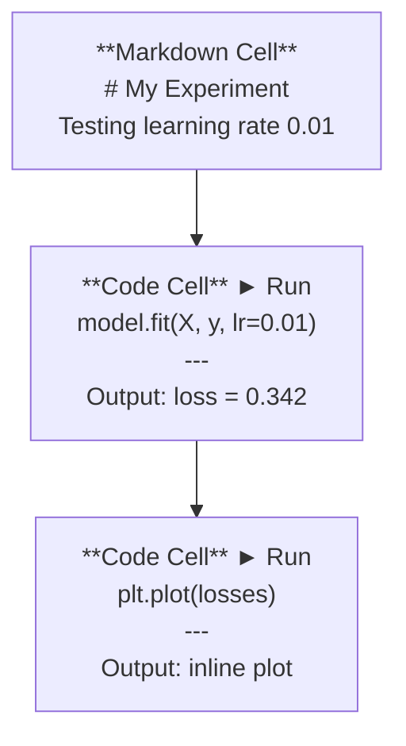
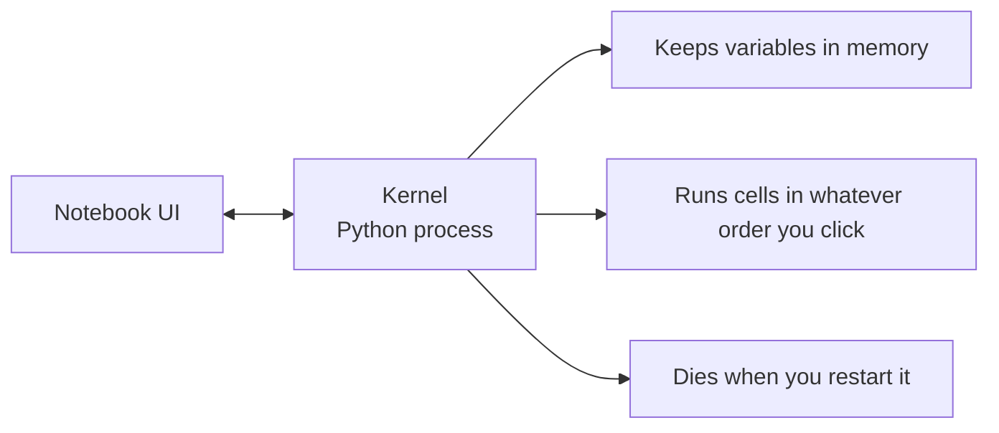

# Jupyter Notebook

> Notebook 是 AI 工程的实验台。先在这里打样,行得通的再搬到生产环境。

**Type:** Build
**Languages:** Python
**Prerequisites:** Phase 0, Lesson 01
**Time:** ~30 minutes

## Learning Objectives

- 安装并启动 JupyterLab、Jupyter Notebook,或者装上 Jupyter 扩展的 VS Code
- 用魔法命令(`%timeit`、`%%time`、`%matplotlib inline`)做 benchmark 和内嵌可视化
- 区分什么时候用 notebook、什么时候用脚本,养成 "notebook 探索,脚本落地" 的工作流
- 识别并避开 notebook 常见陷阱:乱序执行、隐藏状态、内存泄漏

## The Problem

每一篇 AI 论文、每一篇教程、每一个 Kaggle 比赛都在用 Jupyter notebook。它让你一段一段跑代码、内嵌看输出、代码和解释混在一起、快速迭代。不学 notebook 就直接做 AI,等于做数学作业不打草稿。

但 notebook 也有真实的坑。有人什么都用 notebook 干,包括那些它根本不擅长的场景。知道什么时候该用 notebook、什么时候该用脚本,能让你少踩无数调试的坑。

## The Concept

notebook 就是一列 cell。每个 cell 要么是代码,要么是文本。



kernel 是后台跑着的 Python 进程。你跑一个 cell,就把代码发给 kernel,kernel 执行完把结果送回来。所有 cell 共用同一个 kernel,所以变量在 cell 之间是共享的。



"想点哪个就点哪个"这一点,既是 notebook 的超能力,也是它最大的坑。

## Build It

### Step 1: Pick your interface

三种界面,同一种格式:

| Interface | Install | Best for |
|-----------|---------|----------|
| JupyterLab | `pip install jupyterlab` then `jupyter lab` | 完整 IDE 体验,多标签、文件浏览器、终端 |
| Jupyter Notebook | `pip install notebook` then `jupyter notebook` | 简单轻量,一次只开一个 notebook |
| VS Code | 装 "Jupyter" 扩展 | 跟现有编辑器整合,带 git 和调试功能 |

三种都读写同一种 `.ipynb` 文件。挑一个顺手的就行。AI 圈最常见的是 JupyterLab。

```bash
pip install jupyterlab
jupyter lab
```

### Step 2: Keyboard shortcuts that matter

你会在两种模式之间切。按 `Esc` 进命令模式(左边蓝条),按 `Enter` 进编辑模式(绿条)。

**命令模式(最常用):**

| Key | Action |
|-----|--------|
| `Shift+Enter` | 跑当前 cell,跳到下一个 |
| `A` | 在上面插一个 cell |
| `B` | 在下面插一个 cell |
| `DD` | 删除 cell |
| `M` | 转成 markdown |
| `Y` | 转成 code |
| `Z` | 撤销 cell 操作 |
| `Ctrl+Shift+H` | 看所有快捷键 |

**编辑模式:**

| Key | Action |
|-----|--------|
| `Tab` | 自动补全 |
| `Shift+Tab` | 看函数签名 |
| `Ctrl+/` | 切换注释 |

`Shift+Enter` 是你一天要点上千次的键,先把它背熟。

### Step 3: Cell types

**Code cell** 跑 Python 并显示输出:

```python
import numpy as np
data = np.random.randn(1000)
data.mean(), data.std()
```

输出: `(0.0032, 0.9987)`

**Markdown cell** 渲染格式化文本。用来记录你在做什么、为什么这么做。支持标题、加粗、斜体、LaTeX 公式(`$E = mc^2$`)、表格、图片。

### Step 4: Magic commands

这些不是 Python,是 Jupyter 特有的命令,以 `%`(行魔法)或 `%%`(cell 魔法)开头。

**给代码计时:**

```python
%timeit np.random.randn(10000)
```

输出: `45.2 us +/- 1.3 us per loop`

```python
%%time
model.fit(X_train, y_train, epochs=10)
```

输出: `Wall time: 2.34 s`

`%timeit` 跑很多次取平均,`%%time` 只跑一次。微基准用 `%timeit`,训练这种长任务用 `%%time`。

**打开内嵌绘图:**

```python
%matplotlib inline
```

之后所有 `plt.plot()` 或 `plt.show()` 都会直接画在 notebook 里。

**不用退出 notebook 就能装包:**

```python
!pip install scikit-learn
```

加 `!` 前缀就能跑 shell 命令。

**看环境变量:**

```python
%env CUDA_VISIBLE_DEVICES
```

### Step 5: Display rich output inline

notebook 会自动把 cell 的最后一个表达式渲染出来。但你也能显式控制:

```python
import pandas as pd

df = pd.DataFrame({
    "model": ["Linear", "Random Forest", "Neural Net"],
    "accuracy": [0.72, 0.89, 0.94],
    "training_time": [0.1, 2.3, 45.6]
})
df
```

这样渲染出来的是格式化好的 HTML 表格,不是纯文本。绘图也一样:

```python
import matplotlib.pyplot as plt

plt.figure(figsize=(8, 4))
plt.plot([1, 2, 3, 4], [1, 4, 2, 3])
plt.title("Inline Plot")
plt.show()
```

图片直接出在 cell 下面。AI 圈被 notebook 统治不是没道理 —— 数据、图、代码全在一块儿。

图片的话:

```python
from IPython.display import Image, display
display(Image(filename="architecture.png"))
```

### Step 6: Google Colab

Colab 就是云端免费版 Jupyter notebook。送你一块 GPU、预装各种库、还能跟 Google Drive 打通。零配置。

1. 打开 [colab.research.google.com](https://colab.research.google.com)
2. 把本课程里任意 `.ipynb` 文件上传上去
3. Runtime > Change runtime type > T4 GPU(免费)

Colab 跟本地 Jupyter 的区别:
- 会话之间文件不保留(要存 Drive 或下载)
- 预装了 numpy、pandas、matplotlib、torch、tensorflow、sklearn
- `from google.colab import files` 用来上传/下载文件
- `from google.colab import drive; drive.mount('/content/drive')` 挂载 Drive 持久化存储
- 90 分钟不操作会自动断(免费版)

## Use It

### Notebooks vs Scripts: When to use which

| Use notebooks for | Use scripts for |
|-------------------|-----------------|
| 探索数据集 | 训练流水线 |
| 模型原型 | 可复用工具 |
| 可视化结果 | 带 `if __name__` 的代码 |
| 解释你的工作 | 定时跑的任务 |
| 快速实验 | 生产代码 |
| 课程练习 | 包和库 |

铁律:**notebook 用来探索,脚本用来交付**。

AI 里常见的流程:
1. 在 notebook 里探索数据
2. 在 notebook 里搭模型原型
3. 跑通之后,把代码搬到 `.py` 文件里
4. 后面再在 notebook 里 import 这些 `.py` 文件继续实验

### Common traps

**乱序执行。** 你先跑了 cell 5,再跑 cell 2,再跑 cell 7。机器上一切正常,别人从上往下跑就炸。修法:共享前先 Kernel > Restart & Run All。

**隐藏状态。** 你删了一个 cell,但它创建的变量还在内存里。notebook 看着挺干净,其实依赖一个已经消失的 cell。修法:定时重启 kernel。

**内存泄漏。** 加载 4GB 数据集,训完模型,再加载下一个数据集,谁都没被释放。修法:`del variable_name` 加 `gc.collect()`,或者直接重启 kernel。

## Ship It

本节产出:
- `outputs/prompt-notebook-helper.md` —— 帮你排查 notebook 问题

## Exercises

1. 打开 JupyterLab,新建一个 notebook,用 `%timeit` 对比一下"列表推导式"和"numpy"两种方式生成 10 万个随机数哪个更快
2. 新建一个 notebook,里面既有 markdown 又有 code cell,加载 CSV、显示 dataframe、画一张图。然后跑 Kernel > Restart & Run All,验证它从上到下能跑通
3. 把 `code/notebook_tips.py` 里的代码贴到一个 Colab notebook,开 GPU 跑一下

## Key Terms

| Term | What people say | What it actually means |
|------|----------------|----------------------|
| Kernel | "跑我代码的那玩意儿" | 一个独立的 Python 进程,执行 cell 并把变量存在内存里 |
| Cell | "一段代码块" | notebook 里独立可执行的一格,要么是 code 要么是 markdown |
| Magic command | "Jupyter 的小技巧" | 以 `%` 或 `%%` 开头的特殊命令,用来控制 notebook 的环境 |
| `.ipynb` | "notebook 文件" | 一个 JSON 文件,里面是 cells、输出和元数据。IPython Notebook 的缩写 |

## Further Reading

- [JupyterLab Docs](https://jupyterlab.readthedocs.io/) —— 完整功能介绍
- [Google Colab FAQ](https://research.google.com/colaboratory/faq.html) —— Colab 的限制和特性
- [28 Jupyter Notebook Tips](https://www.dataquest.io/blog/jupyter-notebook-tips-tricks-shortcuts/) —— 高手常用快捷键
