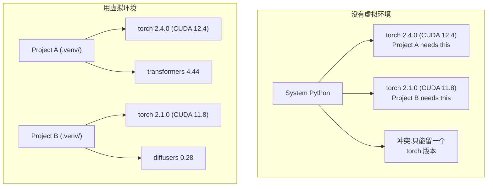

# Python 环境管理

> 依赖地狱是真实存在的。虚拟环境就是解药。

**Type:** Build
**Languages:** Shell
**Prerequisites:** Phase 0, Lesson 01
**Time:** ~30 minutes

## Learning Objectives

- 用 `uv`、`venv` 或 `conda` 创建隔离的虚拟环境
- 写一份带可选依赖组的 `pyproject.toml`,并生成 lockfile 保证可复现
- 诊断并修复常见坑:全局安装、pip/conda 混用、CUDA 版本不匹配
- 为"不同 phase 依赖互相冲突"的项目设计 per-phase 环境策略

## The Problem

你给一个微调项目装了 PyTorch 2.4。下周另一个项目要 PyTorch 2.1,因为它锁了某个 CUDA 版本。你一升级,第一个项目就崩;你一降级,第二个项目就崩。

这就是依赖地狱。在 AI/ML 圈它天天发生,原因有:

- PyTorch、JAX、TensorFlow 各自带自己的 CUDA 绑定
- 模型库会锁死特定框架版本
- 一次全局 `pip install` 会把原来装的直接覆盖
- CUDA 11.8 编译出来的版本跟 CUDA 12.x 驱动不兼容(反过来也不行)

解法:每个项目一个独立环境,装自己那份包。

## The Concept



## Build It

### Option 1: uv venv (Recommended)

`uv` 是最快的 Python 包管理器(比 pip 快 10–100 倍),一个工具搞定虚拟环境、Python 版本、依赖解析。

```bash
curl -LsSf https://astral.sh/uv/install.sh | sh

uv python install 3.12

cd your-project
uv venv
source .venv/bin/activate
```

装包:

```bash
uv pip install torch numpy
```

一步到位创建带 `pyproject.toml` 的项目:

```bash
uv init my-ai-project
cd my-ai-project
uv add torch numpy matplotlib
```

### Option 2: venv (Built-in)

装不了 `uv` 的话,Python 自带 `venv`:

```bash
python3 -m venv .venv
source .venv/bin/activate  # Linux/macOS
.venv\Scripts\activate     # Windows

pip install torch numpy
```

比 `uv` 慢,但凡是有 Python 的地方都能用。

### Option 3: conda (When You Need It)

conda 能管非 Python 依赖,比如 CUDA toolkit、cuDNN、C 库。什么时候用:

- 想用某个特定版本的 CUDA toolkit 又不想装到系统里
- 在共享集群上,不能装系统包
- 某个库的安装说明写着 "use conda"

```bash
# 装 miniconda(不要装完整 Anaconda)
curl -LsSf https://repo.anaconda.com/miniconda/Miniconda3-latest-Linux-x86_64.sh -o miniconda.sh
bash miniconda.sh -b

conda create -n myproject python=3.12
conda activate myproject

conda install pytorch torchvision torchaudio pytorch-cuda=12.4 -c pytorch -c nvidia
```

一条铁律:一个环境用 conda 管,就全程用 conda 管。混 `pip install` 进 conda 环境会引发难以调试的依赖冲突。

### For This Course: Per-Phase Strategy

理论上你可以一个环境走完全部课程。别这样。不同 phase 需要的依赖有时会打架。

策略:

```
ai-engineering-from-scratch/
├── .venv/                    <-- phases 0-3 共用的小环境
├── phases/
│   ├── 04-neural-networks/
│   │   └── .venv/            <-- PyTorch 环境
│   ├── 05-cnns/
│   │   └── .venv/            <-- 同一个 PyTorch 环境(软链或共享)
│   ├── 08-transformers/
│   │   └── .venv/            <-- 可能要不同 transformer 版本
│   └── 11-llm-apis/
│       └── .venv/            <-- API SDK,不需要 torch
```

`code/env_setup.sh` 这个脚本会建好本课程的基础环境。

## pyproject.toml Basics

每个 Python 项目都应该有 `pyproject.toml`。它把 `setup.py`、`setup.cfg`、`requirements.txt` 合并到一个文件里。

```toml
[project]
name = "ai-engineering-from-scratch"
version = "0.1.0"
requires-python = ">=3.11"
dependencies = [
    "numpy>=1.26",
    "matplotlib>=3.8",
    "jupyter>=1.0",
    "scikit-learn>=1.4",
]

[project.optional-dependencies]
torch = ["torch>=2.3", "torchvision>=0.18"]
llm = ["anthropic>=0.39", "openai>=1.50"]
```

然后这样装:

```bash
uv pip install -e ".[torch]"    # 基础 + PyTorch
uv pip install -e ".[llm]"     # 基础 + LLM SDK
uv pip install -e ".[torch,llm]" # 全要
```

## Lockfiles

lockfile 把每一个依赖(包括间接依赖)都钉死到精确版本。这能保证可复现:从同一份 lockfile 装出来,大家拿到的包完全一样。

```bash
# uv 在用 uv add 时会自动生成 uv.lock
uv add numpy

# pip-tools 路线
uv pip compile pyproject.toml -o requirements.lock
uv pip install -r requirements.lock
```

把 lockfile 提交到 git。别人 clone 下来,从 lockfile 装,拿到的版本跟你一模一样。

## Common Mistakes

### 1. Installing globally

```bash
pip install torch  # 坏:装到系统 Python

source .venv/bin/activate
pip install torch  # 好:装到虚拟环境
```

看一眼包都装到哪了:

```bash
which python       # 应该是 .venv/bin/python,而不是 /usr/bin/python
which pip           # 应该是 .venv/bin/pip
```

### 2. Mixing pip and conda

```bash
conda create -n myenv python=3.12
conda activate myenv
conda install pytorch -c pytorch
pip install some-other-package   # 坏:会搅乱 conda 的依赖跟踪
conda install some-other-package # 好:让 conda 全管
```

非要在 conda 里用 pip(有些包只有 pip 有)的话,先把所有 conda 包装齐,最后再装 pip 的包。

### 3. Forgetting to activate

```bash
python train.py           # 走系统 Python,包找不到
source .venv/bin/activate
python train.py           # 走项目 Python,包齐了
```

激活后 shell 提示符里应该会显示环境名:

```
(.venv) $ python train.py
```

### 4. Committing .venv to git

```bash
echo ".venv/" >> .gitignore
```

虚拟环境动辄 200MB 到 2GB,装在本地,跨机器不通用。提交 `pyproject.toml` 和 lockfile 就够了。

### 5. CUDA version mismatch

```bash
nvidia-smi                # 显示驱动支持的 CUDA 版本(比如 12.4)
python -c "import torch; print(torch.version.cuda)"  # 显示 PyTorch 编译用的 CUDA 版本

# 这俩必须兼容。
# PyTorch 的 CUDA 版本必须 <= 驱动支持的 CUDA 版本。
```

## Use It

跑一下本课程的环境初始化脚本:

```bash
bash phases/00-setup-and-tooling/06-python-environments/code/env_setup.sh
```

这个脚本会在仓库根目录建一个 `.venv`,装好核心依赖并跑一遍验证。

## Exercises

1. 跑 `env_setup.sh`,确保所有检查项都通过
2. 创第二个虚拟环境,装一个不同版本的 numpy,验证两个环境互不影响
3. 为一个同时需要 PyTorch 和 Anthropic SDK 的项目写一份 `pyproject.toml`
4. 故意在没激活 venv 的情况下装一个包,看看它装到哪去了,再卸掉

## Key Terms

| Term | What people say | What it actually means |
|------|----------------|----------------------|
| Virtual environment | "venv" | 一个隔离目录,里面有一套独立的 Python 解释器和包,跟系统 Python 分开 |
| Lockfile | "锁死的依赖" | 一个文件,列出所有包及其精确版本,保证不同机器装出来的环境完全一样 |
| pyproject.toml | "新 setup.py" | Python 项目的标准配置文件,统一替代 setup.py / setup.cfg / requirements.txt |
| Transitive dependency | "依赖的依赖" | B 依赖 C,你装 A(依赖 B),C 就是 A 的间接依赖 |
| CUDA mismatch | "我的 GPU 跑不起来" | PyTorch 编译用的 CUDA 版本跟 GPU 驱动支持的 CUDA 版本对不上 |
