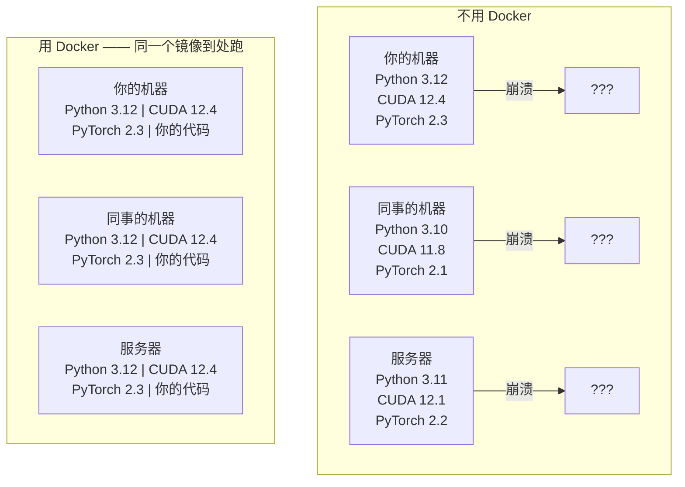

# AI 工程的 Docker

> 容器让 "在我机器上能跑" 成为历史。

**Type:** Build
**Languages:** Docker
**Prerequisites:** Phase 0, Lessons 01 and 03
**Time:** ~60 minutes

## Learning Objectives

- 从 Dockerfile 构建一个带 CUDA、PyTorch、AI 库的支持 GPU 的镜像
- 把宿主目录挂载成 volume,让模型、数据集、代码在容器重建时不丢
- 配置 NVIDIA Container Toolkit,让容器能看见 GPU
- 用 Docker Compose 编排多服务 AI 应用(推理服务 + 向量数据库)

## The Problem

你用 PyTorch 2.3 + CUDA 12.4 + Python 3.12 在笔记本上把模型训完了。同事那边是 PyTorch 2.1 + CUDA 11.8 + Python 3.10。模型一过去就崩。但同样的 Dockerfile 在两边都能跑通。

AI 项目的依赖就是噩梦。一个典型栈包括 Python、PyTorch、CUDA 驱动、cuDNN、系统级 C 库,还有 flash-attn 这种需要特定编译器版本的专业包。Docker 把这些东西打包成一个镜像,到哪里都跑出一样的结果。

## The Concept

Docker 把你的代码、运行时、库、系统工具一起塞进一个叫"容器"的隔离单元里。可以把它当一台轻量虚拟机,只是它共用宿主操作系统的内核,所以几秒就能起来,而不是几分钟。



### 为什么 AI 项目比一般项目更需要 Docker

1. **GPU 驱动很脆。** CUDA 12.4 编的代码在 CUDA 11.8 上跑不起来。Docker 把 CUDA toolkit 隔离在容器里,同时通过 NVIDIA Container Toolkit 共享宿主的 GPU 驱动。

2. **模型权重很大。** 一个 7B 参数的模型 fp16 存下来要 14 GB。你不会想每次重建容器都重新下一遍。Docker volume 让你把宿主上的模型目录挂进来。

3. **AI 应用天然多服务。** 一个真正的 AI 应用不是一个 Python 脚本就完事,而是推理服务 + RAG 向量数据库 + 可能还有一个 Web 前端。Docker Compose 一条命令就能把这些一起拉起来。

### 关键术语

| Term | What it means |
|------|---------------|
| Image | 只读模板。你的菜谱。由 Dockerfile 构建出来。 |
| Container | 镜像的一个运行实例。你的厨房。 |
| Dockerfile | 构建镜像的指令。一层一层堆起来。 |
| Volume | 持久化存储,容器重启后数据不丢。 |
| docker-compose | 用 YAML 定义多容器应用的工具。 |

### AI 圈的常见容器模式

```
Dev Container(开发容器)
  工具齐全。编辑器支持、Jupyter、调试工具都在。
  用于开发和实验阶段。

Training Container(训练容器)
  极简。只装训练脚本和依赖。
  跑在 GPU 集群上。不要编辑器,不要 Jupyter。

Inference Container(推理容器)
  为服务化优化。镜像小,冷启动快。
  在生产环境里跑在负载均衡后面。
```

## Build It

### Step 1: Install Docker

```bash
# macOS
brew install --cask docker
open /Applications/Docker.app

# Ubuntu
curl -fsSL https://get.docker.com | sh
sudo usermod -aG docker $USER
# 注销再重新登录,组权限才会生效
```

验证:

```bash
docker --version
docker run hello-world
```

### Step 2: Install NVIDIA Container Toolkit (Linux with NVIDIA GPU)

装这个才能让 Docker 容器用上你的 GPU。macOS 和 Windows(WSL2)可以跳过这一步,这两个平台 Docker Desktop 的 GPU 透传方式不一样。

```bash
distribution=$(. /etc/os-release;echo $ID$VERSION_ID)
curl -fsSL https://nvidia.github.io/libnvidia-container/gpgkey | sudo gpg --dearmor -o /usr/share/keyrings/nvidia-container-toolkit-keyring.gpg
curl -s -L https://nvidia.github.io/libnvidia-container/$distribution/libnvidia-container.list | \
    sed 's#deb https://#deb [signed-by=/usr/share/keyrings/nvidia-container-toolkit-keyring.gpg] https://#g' | \
    sudo tee /etc/apt/sources.list.d/nvidia-container-toolkit.list

sudo apt-get update
sudo apt-get install -y nvidia-container-toolkit
sudo nvidia-ctk runtime configure --runtime=docker
sudo systemctl restart docker
```

在容器里测一下 GPU 访问:

```bash
docker run --rm --gpus all nvidia/cuda:12.4.1-base-ubuntu22.04 nvidia-smi
```

看到 GPU 信息说明 toolkit 装好了。

### Step 3: Understand base images

选对基础镜像能帮你省下几小时的调试时间。

```
nvidia/cuda:12.4.1-devel-ubuntu22.04
  完整 CUDA toolkit。带编译器。
  适用: 需要 nvcc 编译的包(flash-attn、bitsandbytes)
  大小: ~4 GB

nvidia/cuda:12.4.1-runtime-ubuntu22.04
  只有 CUDA 运行时。不带编译器。
  适用: 跑已经编译好的代码
  大小: ~1.5 GB

pytorch/pytorch:2.3.1-cuda12.4-cudnn9-runtime
  CUDA 之上预装好 PyTorch。
  适用: 想跳过 PyTorch 安装步骤
  大小: ~6 GB

python:3.12-slim
  没 CUDA。纯 CPU。
  适用: CPU 推理、轻量工具
  大小: ~150 MB
```

### Step 4: Write a Dockerfile for AI development

`code/Dockerfile` 里就是这份 Dockerfile,逐行看一下:

```dockerfile
FROM nvidia/cuda:12.4.1-devel-ubuntu22.04

ENV DEBIAN_FRONTEND=noninteractive
ENV PYTHONUNBUFFERED=1

RUN apt-get update && apt-get install -y --no-install-recommends \
    python3.12 \
    python3.12-venv \
    python3.12-dev \
    python3-pip \
    git \
    curl \
    build-essential \
    && rm -rf /var/lib/apt/lists/*

RUN update-alternatives --install /usr/bin/python python /usr/bin/python3.12 1

RUN python -m pip install --no-cache-dir --upgrade pip setuptools wheel

RUN python -m pip install --no-cache-dir \
    torch==2.3.1 \
    torchvision==0.18.1 \
    torchaudio==2.3.1 \
    --index-url https://download.pytorch.org/whl/cu124

RUN python -m pip install --no-cache-dir \
    numpy \
    pandas \
    scikit-learn \
    matplotlib \
    jupyter \
    transformers \
    datasets \
    accelerate \
    safetensors

WORKDIR /workspace

VOLUME ["/workspace", "/models"]

EXPOSE 8888

CMD ["python"]
```

构建:

```bash
docker build -t ai-dev -f phases/00-setup-and-tooling/07-docker-for-ai/code/Dockerfile .
```

第一次构建要花点时间(下载 CUDA 基础镜像 + PyTorch)。后面的构建会复用缓存层。

运行:

```bash
docker run --rm -it --gpus all \
    -v $(pwd):/workspace \
    -v ~/models:/models \
    ai-dev python -c "import torch; print(f'PyTorch {torch.__version__}, CUDA: {torch.cuda.is_available()}')"
```

在容器里跑 Jupyter:

```bash
docker run --rm -it --gpus all \
    -v $(pwd):/workspace \
    -v ~/models:/models \
    -p 8888:8888 \
    ai-dev jupyter notebook --ip=0.0.0.0 --port=8888 --no-browser --allow-root
```

### Step 5: Volume mounts for data and models

挂载 volume 在 AI 工作里非常关键。不挂的话,你下的 14 GB 模型会随容器一起消失。

```bash
# 挂载你的代码
-v $(pwd):/workspace

# 挂载一个共享模型目录
-v ~/models:/models

# 挂载数据集
-v ~/datasets:/data
```

在你的训练脚本里,从挂载路径加载:

```python
from transformers import AutoModel

model = AutoModel.from_pretrained("/models/llama-7b")
```

模型就放在宿主文件系统上。你想重建多少次容器都行,模型不用重新下。

### Step 6: Docker Compose for multi-service AI apps

一个真正的 RAG 应用需要一个推理服务 + 一个向量数据库。Docker Compose 一条命令把它们一起拉起来。

`code/docker-compose.yml`:

```yaml
services:
  ai-dev:
    build:
      context: .
      dockerfile: Dockerfile
    deploy:
      resources:
        reservations:
          devices:
            - driver: nvidia
              count: all
              capabilities: [gpu]
    volumes:
      - ../../../:/workspace
      - ~/models:/models
      - ~/datasets:/data
    ports:
      - "8888:8888"
    stdin_open: true
    tty: true
    command: jupyter notebook --ip=0.0.0.0 --port=8888 --no-browser --allow-root

  qdrant:
    image: qdrant/qdrant:v1.12.5
    ports:
      - "6333:6333"
      - "6334:6334"
    volumes:
      - qdrant_data:/qdrant/storage

volumes:
  qdrant_data:
```

启动一切:

```bash
cd phases/00-setup-and-tooling/07-docker-for-ai/code
docker compose up -d
```

现在你的 AI 开发容器能通过服务名 `http://qdrant:6333` 访问向量数据库。Docker Compose 自动建了一个共享网络。

从 AI 容器里测一下连通性:

```python
from qdrant_client import QdrantClient

client = QdrantClient(host="qdrant", port=6333)
print(client.get_collections())
```

停掉一切:

```bash
docker compose down
```

加 `-v` 把 qdrant 的 volume 也一起删掉:

```bash
docker compose down -v
```

### Step 7: Useful Docker commands for AI work

```bash
# 列出运行中的容器
docker ps

# 列出所有镜像和大小
docker images

# 删掉没用的镜像(回收磁盘)
docker system prune -a

# 在运行中的容器里看 GPU 占用
docker exec -it <container_id> nvidia-smi

# 从容器里把文件拷到宿主机
docker cp <container_id>:/workspace/results.csv ./results.csv

# 看容器日志
docker logs -f <container_id>
```

## Use It

你现在有了一个可复现的 AI 开发环境。课程剩下的部分:

- 用 `docker compose up` 把开发环境和向量数据库一起拉起来
- 把代码、模型、数据用 volume 挂进去,重建容器也不丢东西
- 哪节课要新 Python 包,加进 Dockerfile 然后重建
- 把 Dockerfile 分享给队友,他们拿到一模一样的环境

### No GPU?

去掉 `--gpus all` 标志和 NVIDIA 那段 deploy 配置。容器照样能跑 CPU 章节。PyTorch 检测到没 CUDA 会自动回退到 CPU。

## Exercises

1. 构建这份 Dockerfile,在容器里跑 `python -c "import torch; print(torch.__version__)"`
2. 启动 docker-compose 栈,验证 AI 容器能通过 `http://qdrant:6333/collections` 访问 Qdrant
3. 在 Dockerfile 里加 `flask`,重建,跑一个简单 API 服务在 5000 端口,用 `-p 5000:5000` 映射出来
4. 用 `docker images` 看一下镜像大小。把基础镜像从 `devel` 换成 `runtime`,对比一下大小

## Key Terms

| Term | What people say | What it actually means |
|------|----------------|----------------------|
| Container | "轻量虚拟机" | 用宿主内核的隔离进程,有独立的文件系统和网络 |
| Image layer | "缓存步骤" | Dockerfile 每条指令生成一层。不变的层会被缓存,重建很快。 |
| NVIDIA Container Toolkit | "Docker 用 GPU" | 一个 runtime hook,通过 `--gpus` 把宿主 GPU 暴露给容器 |
| Volume mount | "共享文件夹" | 宿主上一个目录被映射进容器,容器停了改动也不会丢 |
| Base image | "起点" | Dockerfile 里 `FROM` 指定的那个镜像,决定预装了什么 |
