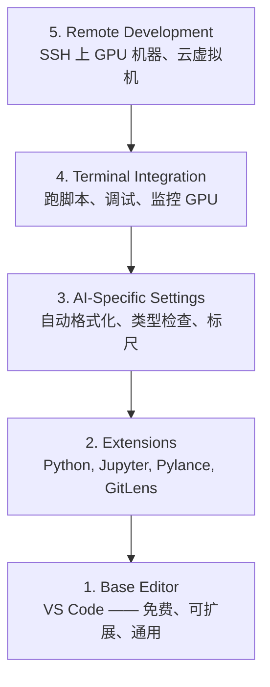

# 编辑器配置

> 编辑器是你的副驾。花一次时间把它配好,以后它就安安静静地给你干活。

**Type:** Build
**Languages:** --
**Prerequisites:** Phase 0, Lesson 01
**Time:** ~20 minutes

## Learning Objectives

- 装好 VS Code,以及 Python、Jupyter、lint、远程 SSH 这些必备扩展
- 配置 "保存即格式化"、类型检查、notebook 输出滚动等 AI 场景下用得到的设置
- 配 Remote SSH,像在本地一样编辑和调试远程 GPU 机器上的代码
- 评估其他编辑器选项(Cursor、Windsurf、Neovim),以及它们在 AI 工作里的取舍

## The Problem

你将来会在编辑器里泡几千个小时,写 Python、跑 notebook、调训练循环、SSH 上去看 GPU 机器。配置不对的编辑器,每次开干都让人难受:没自动补全、没类型提示、错误要等运行才知道、格式要手动调、终端又难用。

配置好只花 20 分钟。跳过的话,每天都要多花 20 分钟。

## The Concept

一个能打 AI 工程的编辑器,需要五样东西:



## Build It

### Step 1: Install VS Code

推荐用 VS Code。免费、跨平台、自带一等的 Jupyter notebook 支持,扩展生态覆盖 AI 工作的所有需求。

去 [code.visualstudio.com](https://code.visualstudio.com/) 下载。

终端验证一下:

```bash
code --version
```

macOS 上如果找不到 `code`,打开 VS Code,按 `Cmd+Shift+P`,输入 "Shell Command",选 "Install 'code' command in PATH"。

### Step 2: Install Essential Extensions

在 VS Code 里打开集成终端(`Ctrl+`` ` 或 `` Cmd+` ``),安装 AI 工作真正用得到的几个扩展:

```bash
code --install-extension ms-python.python
code --install-extension ms-python.vscode-pylance
code --install-extension ms-toolsai.jupyter
code --install-extension eamodio.gitlens
code --install-extension ms-vscode-remote.remote-ssh
code --install-extension ms-python.debugpy
code --install-extension ms-python.black-formatter
code --install-extension charliermarsh.ruff
```

每个扩展的用途:

| Extension | Why |
|-----------|-----|
| Python | 语言支持、虚拟环境识别、运行/调试 |
| Pylance | 快速类型检查、自动补全、import 解析 |
| Jupyter | 在 VS Code 里直接跑 notebook、变量浏览器 |
| GitLens | 看谁改了哪行、内嵌 git blame |
| Remote SSH | 把远程 GPU 机器的目录当本地一样打开 |
| Debugpy | Python 单步调试 |
| Black Formatter | 保存即自动格式化、风格统一 |
| Ruff | 快速 lint、捕捉常见错误 |

本节课的 `code/.vscode/extensions.json` 里是完整的推荐清单。你打开这个项目目录时,VS Code 会弹窗提示你一键安装。

### Step 3: Configure Settings

把这节课 `code/.vscode/settings.json` 里的设置复制过去,或者自己打开 `Settings > Open Settings (JSON)` 手动配。

关键的几条 AI 场景设置:

```jsonc
{
    "python.analysis.typeCheckingMode": "basic",
    "editor.formatOnSave": true,
    "editor.rulers": [88, 120],
    "notebook.output.scrolling": true,
    "files.autoSave": "afterDelay"
}
```

为啥这几条重要:

- **类型检查 basic**:运行前就抓住参数类型错误。少调半天 tensor shape 不匹配和 API 参数填错。
- **保存即格式化**:再也不用手碰格式了,Black 全包。
- **标尺 88 和 120**:Black 在 88 换行,120 提醒你 docstring 和注释别写太长。
- **Notebook 输出滚动**:训练循环一打印几千行,不开滚动输出面板会爆掉。
- **自动保存**:你一定会忘保存的,训练脚本跑的是旧代码就尴尬了。

### Step 4: Terminal Integration

VS Code 集成终端就是跑训练脚本、监控 GPU、管环境的地方。

配好它:

```jsonc
{
    "terminal.integrated.defaultProfile.osx": "zsh",
    "terminal.integrated.defaultProfile.linux": "bash",
    "terminal.integrated.fontSize": 13,
    "terminal.integrated.scrollback": 10000
}
```

常用快捷键:

| Action | macOS | Linux/Windows |
|--------|-------|---------------|
| 切换终端 | `` Ctrl+` `` | `` Ctrl+` `` |
| 新建终端 | `Ctrl+Shift+`` ` | `Ctrl+Shift+`` ` |
| 分屏终端 | `Cmd+\` | `Ctrl+\` |

分屏很有用:一个跑脚本,一个跑 `nvidia-smi -l 1` 或 `watch -n 1 nvidia-smi` 盯 GPU。

### Step 5: Remote Development (SSH into GPU Boxes)

这是 AI 工作里最重要的扩展。你会在远程机器(云 VM、实验室服务器、Lambda、Vast.ai)上跑训练。Remote SSH 让你打开远程文件系统、编辑文件、跑终端、调试,一切像在本地一样。

配置:

1. 装好 Remote SSH 扩展(Step 2 里做过了)。
2. 按 `Ctrl+Shift+P`(或 `Cmd+Shift+P`),输入 "Remote-SSH: Connect to Host"。
3. 填 `user@your-gpu-box-ip`。
4. VS Code 会自动在远程机器上装一个 server 组件。

想要免密登录,先把 SSH key 配好:

```bash
ssh-keygen -t ed25519 -C "your-email@example.com"
ssh-copy-id user@your-gpu-box-ip
```

把主机加进 `~/.ssh/config` 用着方便:

```
Host gpu-box
    HostName 203.0.113.50
    User ubuntu
    IdentityFile ~/.ssh/id_ed25519
    ForwardAgent yes
```

这样 `Remote-SSH: Connect to Host > gpu-box` 一点就连上。

## Alternatives

### Cursor

[cursor.com](https://cursor.com) 是 VS Code 的 fork,自带 AI 代码生成。用的是同一套扩展生态和设置格式。用 Cursor 的话,本节所有东西都适用,把同一份 `settings.json` 和 `extensions.json` 导进去就行。

### Windsurf

[windsurf.com](https://windsurf.com) 又是另一个 AI-first 的 VS Code fork。同样的故事:同样的扩展、同样的设置格式、同样的 Remote SSH 支持。

### Vim/Neovim

如果你已经在用 Vim 或 Neovim 而且很顺手,就继续用。AI Python 工作的最小配置:

- **pyright** 或 **pylsp** 做类型检查(用 Mason 或手动装)
- **nvim-lspconfig** 集成语言服务器
- **jupyter-vim** 或 **molten-nvim** 模拟 notebook 式执行
- **telescope.nvim** 文件/符号搜索
- **none-ls.nvim** 配 black 和 ruff 做格式化/lint

如果本来不用 Vim,**别现在学**。它的学习曲线会跟你学 AI 工程打架。用 VS Code。

## Use It

配完之后,你的日常工作流长这样:

1. 在 VS Code 里打开项目目录(或者用 Remote SSH 连上 GPU 机器)
2. 在编辑器里写 Python,有自动补全、类型提示、内嵌错误提示
3. 用 Jupyter 扩展直接内嵌跑 notebook
4. 用集成终端跑训练脚本、`uv pip install`、监控 GPU
5. 用 GitLens 看清楚再 commit

## Exercises

1. 装好 VS Code 和 Step 2 列出的所有扩展
2. 把这节课的 `settings.json` 复制到你的 VS Code 配置里
3. 打开一个 Python 文件,确认 Pylance 显示类型提示,Black 在保存时会自动格式化
4. 如果你有远程机器,配一下 Remote SSH 并打开一个远程目录

## Key Terms

| Term | What people say | What it actually means |
|------|----------------|----------------------|
| LSP | "自动补全引擎" | Language Server Protocol:一种标准,让编辑器从语言专属的服务端拿类型信息、补全、诊断 |
| Pylance | "那个 Python 插件" | 微软的 Python 语言服务器,底层用 Pyright 做类型检查和 IntelliSense |
| Remote SSH | "在服务器上干活" | VS Code 扩展,在远端机器上跑一个轻量 server,把 UI 流回本地编辑器 |
| Format on save | "自动美化" | 编辑器每次保存都跑一遍格式化器(Black、Ruff),代码风格永远统一 |
