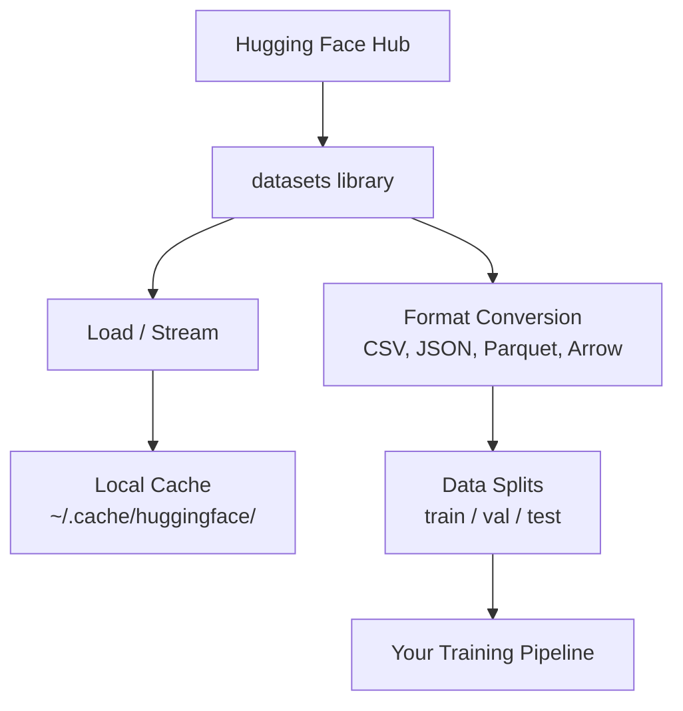

# 数据管理

> 数据是燃料。你怎么管它,决定你能跑多快。

**Type:** Build
**Language:** Python
**Prerequisites:** Phase 0, Lesson 01
**Time:** ~45 minutes

## Learning Objectives

- 用 Hugging Face `datasets` 库加载、流式读取、缓存数据集
- 在 CSV、JSON、Parquet、Arrow 之间互转,讲清楚各自的取舍
- 用固定随机种子做可复现的 train/val/test 划分
- 用 `.gitignore`、Git LFS 或 DVC 管理大体积模型和数据集文件

## The Problem

每个 AI 项目都从数据开始。你得找数据集、下下来、在格式之间转、切分训练/评估、还要做版本管理以保证实验可复现。每一次都手动干一遍,又慢又容易错。你需要一套可复用的流程。

## The Concept



Hugging Face 的 `datasets` 库是 AI 数据加载的事实标准。下载、缓存、格式转换、流式读取,它都帮你搞定。

## Build It

### Step 1: Install the datasets library

```bash
pip install datasets huggingface_hub
```

### Step 2: Load a dataset

```python
from datasets import load_dataset

dataset = load_dataset("imdb")
print(dataset)
print(dataset["train"][0])
```

这会把 IMDB 影评数据集下下来。首次下载后,后续会从 `~/.cache/huggingface/datasets/` 的缓存里直接读。

### Step 3: Stream large datasets

有些数据集太大,本地装不下。流式读取让你一行一行处理,不用下完整份。

```python
dataset = load_dataset("wikimedia/wikipedia", "20220301.en", split="train", streaming=True)

for i, example in enumerate(dataset):
    print(example["title"])
    if i >= 4:
        break
```

流式返回一个 `IterableDataset`,你按到达的顺序处理。内存占用恒定,跟数据集大小无关。

### Step 4: Dataset formats

`datasets` 库底层用 Apache Arrow。也可以按需转成其他格式。

```python
dataset = load_dataset("imdb", split="train")

dataset.to_csv("imdb_train.csv")
dataset.to_json("imdb_train.json")
dataset.to_parquet("imdb_train.parquet")
```

格式对比:

| Format | Size | Read Speed | Best For |
|--------|------|-----------|----------|
| CSV | 大 | 慢 | 人能读、表格软件友好 |
| JSON | 大 | 慢 | API、嵌套数据 |
| Parquet | 小 | 快 | 分析、列式查询 |
| Arrow | 小 | 最快 | 内存中处理(`datasets` 内部用的就是它) |

AI 工作里,Parquet 是最好的存储格式,内存里用 Arrow,CSV/JSON 留给"对外交换"。

### Step 5: Data splits

每个 ML 项目都需要三份划分:

- **Train**:模型学习的对象(通常 80%)
- **Validation**:训练过程中查进度的(通常 10%)
- **Test**:训完之后做最终评估的(通常 10%)

有些数据集自带划分。没带的自己切:

```python
dataset = load_dataset("imdb", split="train")

split = dataset.train_test_split(test_size=0.2, seed=42)
train_val = split["train"].train_test_split(test_size=0.125, seed=42)

train_ds = train_val["train"]
val_ds = train_val["test"]
test_ds = split["test"]

print(f"Train: {len(train_ds)}, Val: {len(val_ds)}, Test: {len(test_ds)}")
```

一定要设 seed,保证可复现。同一个 seed 切出来的结果永远一样。

### Step 6: Download and cache models

模型是大文件。`huggingface_hub` 这个库帮你处理下载和缓存。

```python
from huggingface_hub import hf_hub_download, snapshot_download

model_path = hf_hub_download(
    repo_id="sentence-transformers/all-MiniLM-L6-v2",
    filename="config.json"
)
print(f"Cached at: {model_path}")

model_dir = snapshot_download("sentence-transformers/all-MiniLM-L6-v2")
print(f"Full model at: {model_dir}")
```

模型缓存到 `~/.cache/huggingface/hub/`。下过一次之后,以后跑直接秒开。

### Step 7: Handle large files

模型权重和大数据集别直接进 git。三种方案:

**方案 A:.gitignore(最简单)**

```
*.bin
*.safetensors
*.pt
*.onnx
data/*.parquet
data/*.csv
models/
```

**方案 B:Git LFS(把大文件也交给 git 管)**

```bash
git lfs install
git lfs track "*.bin"
git lfs track "*.safetensors"
git add .gitattributes
```

Git LFS 在你的仓库里只存指针,真正的文件在另一台服务器上。GitHub 免费额度 1 GB。

**方案 C:DVC(数据版本控制)**

```bash
pip install dvc
dvc init
dvc add data/training_set.parquet
git add data/training_set.parquet.dvc data/.gitignore
git commit -m "Track training data with DVC"
```

DVC 会生成很小的 `.dvc` 文件指向你的数据,数据本身存在 S3、GCS 或其他远端存储。

| 方案 | 复杂度 | 适用场景 |
|----------|-----------|----------|
| .gitignore | 低 | 个人项目、能重新下载的数据 |
| Git LFS | 中 | 团队用 git 共享模型权重 |
| DVC | 高 | 需要跨机器复现实验、大数据集、团队 |

本课程用 `.gitignore` 就够了。需要跨机器复现实验的时候再上 DVC。

### Step 8: Storage patterns

**本地存储**适合 10 GB 以下的数据集。HF 缓存默认就走这条路。

**云存储**适合更大或者跨机器共享:

```python
import os

local_path = os.path.expanduser("~/.cache/huggingface/datasets/")

# s3_path = "s3://my-bucket/datasets/"
# gcs_path = "gs://my-bucket/datasets/"
```

DVC 直接接 S3 和 GCS:

```bash
dvc remote add -d myremote s3://my-bucket/dvc-store
dvc push
```

本课程本地存储足够。你在远程 GPU 实例上做微调时,才需要考虑云存储。

## Datasets Used in This Course

| Dataset | Lessons | Size | What It Teaches |
|---------|---------|------|----------------|
| IMDB | Tokenization, classification | 84 MB | 文本分类基础 |
| WikiText | Language modeling | 181 MB | 下一 token 预测 |
| SQuAD | QA systems | 35 MB | 问答、文本片段 |
| Common Crawl (subset) | Embeddings | Varies | 大规模文本处理 |
| MNIST | Vision basics | 21 MB | 图像分类基础 |
| COCO (subset) | Multimodal | Varies | 图文对 |

现在不用全下,哪节课要什么就下什么。

## Use It

跑一下工具脚本验证一下:

```bash
python code/data_utils.py
```

它会下一个小数据集、转个格式、切个划分、打个摘要。

## Ship It

本节产出:
- `code/data_utils.py` —— 可复用的数据加载和缓存工具
- `outputs/prompt-data-helper.md` —— 帮你挑合适数据集的 prompt

## Exercises

1. 用 `mrpc` 配置加载 `glue` 数据集,看前 5 条样本
2. 流式读取 `c4` 数据集,数一下 10 秒能处理多少条
3. 把一个数据集转成 Parquet,跟 CSV 比一下文件大小
4. 用固定 seed 做一个 70/15/15 的 train/val/test 划分,确认每份大小

## Key Terms

| Term | What people say | What it actually means |
|------|----------------|----------------------|
| Dataset split | "训练数据" | ML 生命周期不同阶段用的命名子集(train/val/test) |
| Streaming | "懒加载" | 从远端按行处理数据,不用把整份下到本地 |
| Parquet | "压过的 CSV" | 列式文件格式,适合分析查询和压缩存储 |
| Arrow | "快 dataframe" | 内存里的列式格式,`datasets` 库用它做零拷贝读取 |
| Git LFS | "给大文件用的 git" | 扩展,把大文件存到 git 仓库外面,版本控制里只留指针 |
| DVC | "给数据用的 git" | 给数据集和模型用的版本控制系统,接云存储 |
| Cache | "已经下过了" | 之前拉过数据的本地副本,默认在 ~/.cache/huggingface/ |
