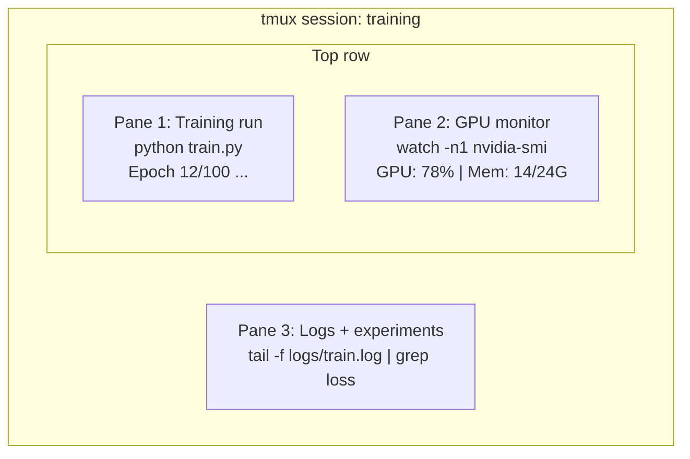

# 终端与 Shell

> 终端是 AI 工程师的家。在这里待舒服了,其他地方就都顺。

**Type:** Learn
**Languages:** --
**Prerequisites:** Phase 0, Lesson 01
**Time:** ~35 minutes

## Learning Objectives

- 用管道、重定向和 `grep` 从命令行里过滤和处理训练日志
- 建一个常驻的 tmux 会话,多窗格同时跑训练和监控 GPU
- 用 `htop`、`nvtop`、`nvidia-smi` 监控系统资源和 GPU
- 用 SSH、`scp`、`rsync` 在本地和远程机器之间传文件

## The Problem

你花在终端上的时间比任何编辑器都多。跑训练、盯 GPU、追日志、远程 SSH、管环境。AI 工作流哪一步都跟 shell 打交道。这里慢,哪儿都慢。

这节课只讲 AI 工作真正用得到的终端技能。不讲 Unix 历史,不讲 Bash 脚本深入。就讲你要的那些。

## The Concept



三件事同时跑,一个终端就行。你能 detach 出去,回家,SSH 回来再 attach,训练一直在跑。

## Build It

### Step 1: Know your shell

看看你用的是什么 shell:

```bash
echo $SHELL
```

大多数系统用 `bash` 或 `zsh`,都挺好。本课程的命令两种都能用。

几个关键的:

```bash
# 到处走
cd ~/projects/ai-engineering-from-scratch
pwd
ls -la

# 翻历史(你会学到的最有用的快捷键)
# Ctrl+R 然后输入之前命令的一部分
# 再按一次 Ctrl+R 继续往后翻

# 清屏
clear   # 或 Ctrl+L

# 打断正在跑的命令
# Ctrl+C

# 挂起正在跑的命令(用 fg 恢复)
# Ctrl+Z
```

### Step 2: Piping and redirects

管道把命令串起来。处理日志、过滤输出、链式调工具,全靠它。你会天天用。

```bash
# 数一下日志里 "loss" 出现了多少次
cat train.log | grep "loss" | wc -l

# 从训练输出里只抽 loss 的值
grep "loss:" train.log | awk '{print $NF}' > losses.txt

# 实时看日志更新,只显示 ERROR
tail -f train.log | grep --line-buffered "ERROR"

# 按最终准确率给实验排序
grep "final_accuracy" results/*.log | sort -t= -k2 -n -r

# stdout 和 stderr 分别重定向到不同文件
python train.py > output.log 2> errors.log

# 都重定向到同一个文件
python train.py > train_full.log 2>&1
```

要记住的三种重定向:

| Symbol | What it does |
|--------|-------------|
| `>` | 把 stdout 写入文件(覆盖) |
| `>>` | 把 stdout 追加到文件 |
| `2>` | 把 stderr 写入文件 |
| `2>&1` | 把 stderr 也送到 stdout 同一个地方 |
| `\|` | 把前一个命令的 stdout 当作后一个命令的 stdin |

### Step 3: Background processes

训练一跑就是几个小时。你不想一直开着终端。

```bash
# 后台跑(输出还显示在终端)
python train.py &

# 后台跑,且不受挂断信号影响(终端关了也不死)
nohup python train.py > train.log 2>&1 &

# 看后台跑着啥
jobs
ps aux | grep train.py

# 把后台任务拉回前台
fg %1

# 杀掉后台进程
kill %1
# 或者找到 PID 再杀
kill $(pgrep -f "train.py")
```

`&`、`nohup`、`screen`/`tmux` 的区别:

| Method | Survives terminal close? | Can reattach? |
|--------|-------------------------|---------------|
| `command &` | 不能 | 不能 |
| `nohup command &` | 能 | 不能(看 log 文件) |
| `screen` / `tmux` | 能 | 能 |

超过几分钟的任务,统一上 tmux。

### Step 4: tmux

tmux 让你建常驻终端会话,多窗格,管理训练任务时它就是第一神器。

```bash
# 装
# macOS
brew install tmux
# Ubuntu
sudo apt install tmux

# 建一个命名的会话
tmux new -s training

# 横向分屏
# Ctrl+B 然后 "

# 纵向分屏
# Ctrl+B 然后 %

# 窗格之间切
# Ctrl+B 然后方向键

# Detach(会话继续跑)
# Ctrl+B 然后 d

# Reattach
tmux attach -t training

# 列出会话
tmux ls

# 杀掉一个会话
tmux kill-session -t training
```

一个典型的 AI 工作流会话:

```bash
tmux new -s train

# 窗格 1:开训练
python train.py --epochs 100 --lr 1e-4

# Ctrl+B, " 切一下,跑 GPU 监控
watch -n1 nvidia-smi

# Ctrl+B, % 切一下,追日志
tail -f logs/experiment.log

# 现在 Ctrl+B, d 退出
# 出门 SSH 出去,买杯咖啡,回来
# tmux attach -t train
```

### Step 5: Monitoring with htop and nvtop

```bash
# 看系统进程(比 top 好用)
htop

# 看 GPU 进程(如果你有 NVIDIA GPU)
# 装: sudo apt install nvtop (Ubuntu) 或 brew install nvtop (macOS)
nvtop

# 没装 nvtop 也能查 GPU
nvidia-smi

# 每一秒刷新一下 GPU 状态
watch -n1 nvidia-smi

# 看哪些进程在用 GPU
nvidia-smi --query-compute-apps=pid,name,used_memory --format=csv
```

`htop` 几个常用键:
- `F6` 或 `>` 按列排序(按内存排,容易发现内存泄漏)
- `F5` 切树状视图(看父子进程)
- `F9` 杀进程
- `/` 按名字搜进程

### Step 6: SSH for remote GPU boxes

租云 GPU(Lambda、RunPod、Vast.ai)就是 SSH 连过去。

```bash
# 基本连接
ssh user@gpu-box-ip

# 指定 key
ssh -i ~/.ssh/my_gpu_key user@gpu-box-ip

# 拷文件到远端
scp model.pt user@gpu-box-ip:~/models/

# 从远端拷文件回来
scp user@gpu-box-ip:~/results/metrics.json ./

# 同步整个目录(多文件时更快)
rsync -avz ./data/ user@gpu-box-ip:~/data/

# 端口转发(本地访问远端的 Jupyter/TensorBoard)
ssh -L 8888:localhost:8888 user@gpu-box-ip
# 然后浏览器打开 localhost:8888

# SSH config 用着方便
# 加到 ~/.ssh/config:
# Host gpu
#     HostName 192.168.1.100
#     User ubuntu
#     IdentityFile ~/.ssh/gpu_key
#
# 然后只要:
# ssh gpu
```

### Step 7: Useful aliases for AI work

把这些加到 `~/.bashrc` 或 `~/.zshrc`:

```bash
source phases/00-setup-and-tooling/10-terminal-and-shell/code/shell_aliases.sh
```

或者只挑几个你想要的 copy 过去:

```bash
# 一眼 GPU 状态
alias gpu='nvidia-smi --query-gpu=index,name,utilization.gpu,memory.used,memory.total,temperature.gpu --format=csv,noheader'

# 杀掉所有 Python 训练进程
alias killtraining='pkill -f "python.*train"'

# 快速激活虚拟环境
alias ae='source .venv/bin/activate'

# 盯训练 loss
alias watchloss='tail -f logs/*.log | grep --line-buffered "loss"'
```

完整版在 `code/shell_aliases.sh`。

### Step 8: Common AI terminal patterns

这些是实际工作里反复出现的:

```bash
# 跑训练,记日志,跑完发邮件通知
python train.py 2>&1 | tee train.log; echo "DONE" | mail -s "Training complete" you@email.com

# 两个实验的日志并排 diff
diff <(grep "accuracy" exp1.log) <(grep "accuracy" exp2.log)

# 找最大的模型文件(清磁盘用)
find . -name "*.pt" -o -name "*.safetensors" | xargs du -h | sort -rh | head -20

# 从 Hugging Face 下模型
wget https://huggingface.co/model/resolve/main/model.safetensors

# 解压数据集
tar xzf dataset.tar.gz -C ./data/

# 数所有 Python 文件总行数(看项目规模)
find . -name "*.py" | xargs wc -l | tail -1

# 看磁盘(训练数据很容易塞满)
df -h
du -sh ./data/*

# 训之前检查环境变量
env | grep -i cuda
env | grep -i torch
```

## Use It

课程里这些工具会这么用:

| Tool | When you use it |
|------|----------------|
| tmux | 每次跑训练(Phase 3+) |
| `tail -f` + `grep` | 盯训练日志 |
| `nohup` / `&` | 临时后台任务 |
| `htop` / `nvtop` | 调训练慢、OOM 错误 |
| SSH + `rsync` | 云 GPU 上干活 |
| Piping + redirects | 处理实验结果 |
| Aliases | 偷懒用 |

## Exercises

1. 装 tmux,建一个三窗格的会话:一个跑 `htop`,一个跑 `watch -n1 date`,一个跑 Python 脚本。detach 再 attach 看看
2. 把 `code/shell_aliases.sh` 里的别名加到你的 shell 配置里,然后 `source ~/.zshrc`(或 `~/.bashrc`)重新加载
3. 造一个假的训练日志:`for i in $(seq 1 100); do echo "epoch $i loss: $(echo "scale=4; 1/$i" | bc)"; sleep 0.1; done > fake_train.log`,然后用 `grep`、`tail`、`awk` 把 loss 值抽出来
4. 给你能访问的服务器配一个 SSH config(没服务器就用 `localhost` 练语法)

## Key Terms

| Term | What people say | What it actually means |
|------|----------------|----------------------|
| Shell | "终端" | 解释你敲的命令的程序(bash、zsh、fish) |
| tmux | "终端复用器" | 一个程序,让你在一个窗口里跑多个终端会话,还能 detach/reattach |
| Pipe | "那个竖线" | `\|`,把一个命令的输出当下一个命令的输入 |
| PID | "进程 ID" | 每个运行中的进程唯一对应的数字,用来查或杀进程 |
| nohup | "防挂断" | 让命令免疫挂断信号,关了终端也不会被杀掉 |
| SSH | "连服务器" | Secure Shell,加密的远程执行命令的协议 |
