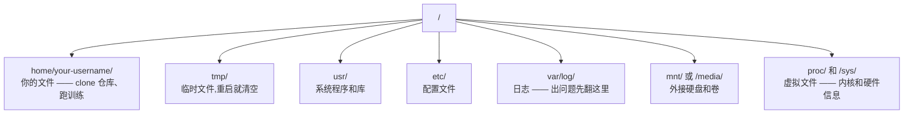

# AI 工程师的 Linux

> 大部分 AI 跑在 Linux 上。你得懂够多才不至于卡死。

**Type:** Learn
**Languages:** --
**Prerequisites:** Phase 0, Lesson 01
**Time:** ~30 minutes

## Learning Objectives

- 在 Linux 文件系统里导航,做基本的命令行文件操作
- 用 `chmod` 和 `chown` 管文件权限,搞定 "Permission denied" 报错
- 用 `apt` 装系统包,把一台全新的 GPU 机器配成 AI 工作站
- 找出 macOS 到 Linux 那些"一看就会踩"的差异

## The Problem

你在 macOS 或 Windows 上开发。但只要一 SSH 到云 GPU 机器,租个 Lambda 实例,或者开台 EC2,迎面就是 Ubuntu。终端是你唯一的接口,没有 Finder、没有 Explorer、没有 GUI。你不会从命令行导航、装包、管进程,就只能干付着 GPU 小时的费用,一边 Google "Linux 怎么解压"。

这是一份"保命指南",只讲你在远程 Linux 上做 AI 工作真正需要的那点东西。别的没有。

## File System Layout

Linux 把所有东西都挂在一个根目录 `/` 下。没有 `C:\`,也没有 `/Volumes`。你会碰到的目录其实就这几个:



你的家目录是 `~` 或 `/home/your-username`。你做的事基本都在这里。

## Essential Commands

下面这 15 条命令能覆盖你在远程 GPU 机器上 95% 的操作。

### 到处走

```bash
pwd                         # 我在哪?
ls                          # 这儿有啥?
ls -la                      # 这儿有啥(包含隐藏文件,带详情)
cd /path/to/dir             # 去那儿
cd ~                        # 回家
cd ..                       # 上一层
```

### 文件和目录

```bash
mkdir my-project            # 建一个目录
mkdir -p a/b/c              # 一口气建嵌套目录

cp file.txt backup.txt      # 拷文件
cp -r src/ src-backup/      # 拷目录(递归)

mv old.txt new.txt          # 改文件名
mv file.txt /tmp/           # 移文件

rm file.txt                 # 删文件(没有回收站,删了就没了)
rm -rf my-dir/              # 删目录和里面所有东西
```

`rm -rf` 是不可逆的,没有 undo。敲回车之前一定看好路径。

### 看文件

```bash
cat file.txt                # 整个文件打出来
head -20 file.txt           # 前 20 行
tail -20 file.txt           # 末 20 行
tail -f log.txt             # 实时追文件(Ctrl+C 停)
less file.txt               # 滚动翻看(q 退出)
```

### 搜索

```bash
grep "error" training.log           # 找含 "error" 的行
grep -r "learning_rate" .           # 在当前目录所有文件里搜
grep -i "cuda" config.yaml          # 不分大小写搜

find . -name "*.py"                 # 找所有 .py 文件
find . -name "*.ckpt" -size +1G     # 找大于 1GB 的 checkpoint
```

## Permissions

Linux 每个文件都有"所有者"和"权限位"。脚本跑不动、目录写不进去,基本都是这个。

```bash
ls -l train.py
# -rwxr-xr-- 1 user group 2048 Mar 19 10:00 train.py
#  ^^^             所有者权限:读、写、执行
#     ^^^          用户组权限:读、执行
#        ^^        其他人:只读
```

常见修法:

```bash
chmod +x train.sh           # 让脚本可执行
chmod 755 deploy.sh         # 所有者:全权;其他人:读+执行
chmod 644 config.yaml       # 所有者:读写;其他人:只读

chown user:group file.txt   # 改文件归属(要 sudo)
```

看到 "Permission denied",九成是权限问题。`chmod +x` 或者 `sudo` 一般就解决了。

## Package Management (apt)

Ubuntu 用 `apt`。这就是装系统级软件的办法。

```bash
sudo apt update             # 刷新包列表(永远先做这个)
sudo apt install -y htop    # 装包(-y 跳过确认)
sudo apt install -y build-essential  # C 编译器、make 之类,很多 Python 包都要
sudo apt install -y tmux    # 终端复用器(断线后保留会话)

apt list --installed        # 装了啥?
sudo apt remove htop        # 卸
```

在一台全新的 GPU 机器上,你通常要装这些:

```bash
sudo apt update && sudo apt install -y \
    build-essential \
    git \
    curl \
    wget \
    tmux \
    htop \
    unzip \
    python3-venv
```

## Users and sudo

你登录的一般是普通用户,有些操作需要 root(管理员)权限。

```bash
whoami                      # 我是谁?
sudo command                # 用 root 跑一条命令
sudo su                     # 切到 root(exit 切回来,慎用)
```

云 GPU 实例上,你通常是唯一的用户,默认就有 sudo。别啥都用 root,需要的时候再 sudo。

## Processes and systemd

训练卡住了,或者想看跑着啥:

```bash
htop                        # 交互式进程查看器(q 退出)
ps aux | grep python        # 找正在跑的 Python 进程
kill 12345                  # 优雅地停掉 PID 12345
kill -9 12345               # 强杀(优雅的不行再用)
nvidia-smi                  # GPU 进程和显存占用
```

systemd 管服务(后台守护进程)。跑推理服务时会用:

```bash
sudo systemctl start nginx          # 启
sudo systemctl stop nginx           # 停
sudo systemctl restart nginx        # 重启
sudo systemctl status nginx         # 看状态
sudo systemctl enable nginx         # 开机自启
```

## Disk Space

GPU 机器磁盘经常很紧。模型和数据集一下就塞满。

```bash
df -h                       # 所有挂载点的磁盘占用
df -h /home                 # /home 的磁盘占用

du -sh *                    # 当前目录下每一项的大小
du -sh ~/.cache             # 缓存大小(pip、HF 模型都堆这)
du -sh /data/checkpoints/   # 看你的 checkpoint 多大

# 找最大的几个吃盘鬼
du -h --max-depth=1 / 2>/dev/null | sort -hr | head -20
```

常见腾空间招数:

```bash
# 清 pip 缓存
pip cache purge

# 清 apt 缓存
sudo apt clean

# 删不要的旧 checkpoint
rm -rf checkpoints/epoch_01/ checkpoints/epoch_02/
```

## Networking

你得从命令行下模型、传文件、调 API。

```bash
# 下载文件
wget https://example.com/model.bin                   # 下文件
curl -O https://example.com/data.tar.gz              # curl 一样能干
curl -s https://api.example.com/health | python3 -m json.tool  # 调 API 并美化 JSON

# 机器之间传文件
scp model.bin user@remote:/data/                     # 拷到远端
scp user@remote:/data/results.csv .                  # 从远端拷回来
scp -r user@remote:/data/checkpoints/ ./local-dir/   # 拷目录

# 同步目录(比 scp 适合大文件,断了也能续)
rsync -avz --progress ./data/ user@remote:/data/
rsync -avz --progress user@remote:/results/ ./results/
```

大文件统一用 `rsync`,只传变化的部分,断了也能续。

## tmux: Keep Sessions Alive

你 SSH 上去的远程机器,合上笔记本训练就没了。tmux 解决这个问题。

```bash
tmux new -s train           # 开个叫 "train" 的会话
# ... 开始训练,然后:
# Ctrl+B,然后 D            # Detach(训练继续跑)

tmux ls                     # 列会话
tmux attach -t train        # 重新连回去

# 在 tmux 里:
# Ctrl+B,然后 %            # 纵向分屏
# Ctrl+B,然后 "            # 横向分屏
# Ctrl+B,然后方向键        # 切窗格
```

长训练任务一律跑在 tmux 里。这是铁律。

## WSL2 for Windows Users

Windows 用户用 WSL2 就能拿到一个真正的 Linux 环境,不用双系统。

```bash
# 在 PowerShell(管理员)
wsl --install -d Ubuntu-24.04

# 重启后,从开始菜单打开 Ubuntu
sudo apt update && sudo apt upgrade -y
```

WSL2 跑的是真 Linux 内核,本节所有东西都能直接用。Windows 里的文件在 WSL 里的 `/mnt/c/Users/YourName/`。

GPU 透传:Windows 那边装好 NVIDIA 驱动(不是 Linux 那个),CUDA 在 WSL2 里就能用。

## Gotchas: macOS to Linux

从 macOS 过来最容易踩的几个坑:

| macOS | Linux | Notes |
|-------|-------|-------|
| `brew install` | `sudo apt install` | 包名有时不一样。`brew install htop` 和 `sudo apt install htop` 一样,但 `brew install readline` 对应 `sudo apt install libreadline-dev` |
| `open file.txt` | `xdg-open file.txt` | 远程机器没 GUI,用 `cat` 或 `less` |
| `pbcopy` / `pbpaste` | 没有 | SSH 里没法走剪贴板 |
| `~/.zshrc` | `~/.bashrc` | macOS 默认 zsh,服务器大多 bash |
| `/opt/homebrew/` | `/usr/bin/`、`/usr/local/bin/` | 可执行文件位置不一样 |
| `sed -i '' 's/a/b/' file` | `sed -i 's/a/b/' file` | macOS sed 后面要带空字符串,Linux 不要 |
| 不区分大小写文件系统 | 区分大小写 | `Model.py` 和 `model.py` 在 Linux 是两个不同文件 |
| 行尾 `\n` | 行尾 `\n` | 一样。但 Windows 是 `\r\n`,bash 脚本会炸。`dos2unix` 修一下 |

## Quick Reference Card

```
Navigation:     pwd, ls, cd, find
Files:          cp, mv, rm, mkdir, cat, head, tail, less
Search:         grep, find
Permissions:    chmod, chown, sudo
Packages:       apt update, apt install
Processes:      htop, ps, kill, nvidia-smi
Services:       systemctl start/stop/restart/status
Disk:           df -h, du -sh
Network:        curl, wget, scp, rsync
Sessions:       tmux new/attach/detach
```

## Exercises

1. SSH 到任何一台 Linux 机器(或者开 WSL2),进到你的家目录,建一个项目文件夹,用 `touch` 建三个空文件,然后 `ls -la` 列出来
2. 用 apt 装 `htop`,跑起来,找出哪个进程最吃内存
3. 开一个 tmux 会话,在里面跑 `sleep 300`,detach 出去,列出会话,再 attach 回来
4. 用 `df -h` 看磁盘,再用 `du -sh ~/.cache/*` 看缓存里啥最占地方
5. 用 `scp` 从本地往远端传一个文件,再用 `rsync` 传一次同样的,对比体验
