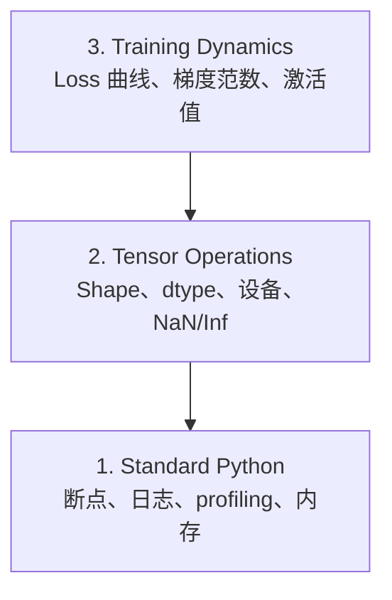

# 调试与性能分析

> 最可怕的 AI bug 不是崩溃,而是训练在垃圾数据上沉默地跑着,画出一条漂亮的 loss 曲线。

**Type:** Build
**Language:** Python
**Prerequisites:** Lesson 1 (Dev Environment), basic PyTorch familiarity
**Time:** ~60 minutes

## Learning Objectives

- 用条件 `breakpoint()` 和 `debug_print` 在训练中途检查 tensor 的 shape、dtype、NaN
- 用 `cProfile`、`line_profiler`、`tracemalloc` 跑 profiling,找训练循环的瓶颈
- 抓常见的 AI bug:shape 不匹配、NaN loss、数据泄漏、tensor 设备搞错
- 配 TensorBoard,可视化 loss 曲线、权重直方图、梯度分布

## The Problem

AI 代码的失败方式跟普通代码不一样。Web 应用崩了有堆栈。一个配错的训练循环能跑 8 小时、烧 200 美元 GPU 钱,最后训出来的模型对所有输入都预测平均值。代码没报错,bug 只是某个 tensor 跑到了错的设备、忘了 `.detach()`、或者 label 漏到了特征里。

你需要能抓到这些"沉默失败"的调试工具,在它们浪费时间算力之前。

## The Concept

AI 调试分三层:



多数人直接跳到第 3 层(盯着 TensorBoard)。但 80% 的 AI bug 死在第 1 和第 2 层。

## Build It

### Part 1: Print Debugging (Yes, It Works)

Print 调试常被瞧不起,但不该被瞧不起。写 tensor 代码的时候,一个对路的 print 胜过在调试器里一步步走 —— 因为你要同时看 shape、dtype、值域。

```python
def debug_print(name, tensor):
    print(f"{name}: shape={tensor.shape}, dtype={tensor.dtype}, "
          f"device={tensor.device}, "
          f"min={tensor.min().item():.4f}, max={tensor.max().item():.4f}, "
          f"mean={tensor.mean().item():.4f}, "
          f"has_nan={tensor.isnan().any().item()}")
```

每写完一段可疑操作,就把这个调一遍。找到 bug 之后,把 print 删掉。简单。

### Part 2: Python Debugger (pdb and breakpoint)

内置调试器在 AI 工作里被低估了。在训练循环里塞个 `breakpoint()`,就能交互式地看 tensor。

```python
def training_step(model, batch, criterion, optimizer):
    inputs, labels = batch
    outputs = model(inputs)
    loss = criterion(outputs, labels)

    if loss.item() > 100 or torch.isnan(loss):
        breakpoint()

    loss.backward()
    optimizer.step()
```

调试器停下来之后,几条常用命令:

- `p outputs.shape` 看 shape
- `p loss.item()` 看 loss 值
- `p torch.isnan(outputs).sum()` 数 NaN 个数
- `p model.fc1.weight.grad` 看梯度
- `c` 继续,`q` 退出

这是条件调试 —— 只有看着不对劲的时候才停。1 万步的训练里,这很重要。

### Part 3: Python Logging

调试从"随便看一眼"升级到"正式排查"的时候,把 print 换成 logging。

```python
import logging

logging.basicConfig(
    level=logging.INFO,
    format="%(asctime)s [%(levelname)s] %(message)s",
    handlers=[
        logging.FileHandler("training.log"),
        logging.StreamHandler()
    ]
)
logger = logging.getLogger(__name__)

logger.info("Starting training: lr=%.4f, batch_size=%d", lr, batch_size)
logger.warning("Loss spike detected: %.4f at step %d", loss.item(), step)
logger.error("NaN loss at step %d, stopping", step)
```

logging 自带时间戳、严重等级、写文件。凌晨 3 点训练挂了,你要的是一份 log 文件,不是已经被刷掉的终端输出。

### Part 4: Timing Code Sections

知道时间花在哪,是优化的第一步。

```python
import time

class Timer:
    def __init__(self, name=""):
        self.name = name

    def __enter__(self):
        self.start = time.perf_counter()
        return self

    def __exit__(self, *args):
        elapsed = time.perf_counter() - self.start
        print(f"[{self.name}] {elapsed:.4f}s")

with Timer("data loading"):
    batch = next(dataloader_iter)

with Timer("forward pass"):
    outputs = model(batch)

with Timer("backward pass"):
    loss.backward()
```

常见发现:数据加载吃掉了训练时间的 60%。解法是给 DataLoader 设 `num_workers > 0`,而不是换更贵的 GPU。

### Part 5: cProfile and line_profiler

手敲 Timer 不够用的时候:

```bash
python -m cProfile -s cumtime train.py
```

按累计耗时排序列出所有函数调用。要按行 profile:

```bash
pip install line_profiler
```

```python
@profile
def train_step(model, data, target):
    output = model(data)
    loss = F.cross_entropy(output, target)
    loss.backward()
    return loss

# 用这个跑: kernprof -l -v train.py
```

### Part 6: Memory Profiling

#### CPU 内存用 tracemalloc

```python
import tracemalloc

tracemalloc.start()

# 你的代码
model = build_model()
data = load_dataset()

snapshot = tracemalloc.take_snapshot()
top_stats = snapshot.statistics("lineno")
for stat in top_stats[:10]:
    print(stat)
```

#### CPU 内存用 memory_profiler

```bash
pip install memory_profiler
```

```python
from memory_profiler import profile

@profile
def load_data():
    raw = read_csv("data.csv")       # 看这里内存会跳
    processed = preprocess(raw)       # 还有这里
    return processed
```

跑 `python -m memory_profiler your_script.py` 看每行内存占用。

#### GPU 内存用 PyTorch

```python
import torch

if torch.cuda.is_available():
    print(torch.cuda.memory_summary())

    print(f"Allocated: {torch.cuda.memory_allocated() / 1e9:.2f} GB")
    print(f"Cached: {torch.cuda.memory_reserved() / 1e9:.2f} GB")
```

碰到 OOM(显存爆了):

1. 减 batch size(第一反应,永远先试)
2. 调 `torch.cuda.empty_cache()` 释放缓存
3. 大中间变量 `del tensor` 之后 `torch.cuda.empty_cache()`
4. 用混合精度(`torch.cuda.amp`),显存直接砍半
5. 非常深的模型用 gradient checkpointing

### Part 7: Common AI Bugs and How to Catch Them

#### Shape Mismatch

最常见的 bug。tensor 形状是 `[batch, features]`,但模型要的是 `[batch, channels, height, width]`。

```python
def check_shapes(model, sample_input):
    print(f"Input: {sample_input.shape}")
    hooks = []

    def make_hook(name):
        def hook(module, inp, out):
            in_shape = inp[0].shape if isinstance(inp, tuple) else inp.shape
            out_shape = out.shape if hasattr(out, "shape") else type(out)
            print(f"  {name}: {in_shape} -> {out_shape}")
        return hook

    for name, module in model.named_modules():
        hooks.append(module.register_forward_hook(make_hook(name)))

    with torch.no_grad():
        model(sample_input)

    for h in hooks:
        h.remove()
```

拿一批样本跑一次,模型里每一次 shape 变换就都打出来了。

#### NaN Loss

NaN loss 意味着哪里爆了。常见原因:

- 学习率太高
- 自定义 loss 里除以 0
- 对 0 或负数取 log
- RNN 里梯度爆炸

```python
def detect_nan(model, loss, step):
    if torch.isnan(loss):
        print(f"NaN loss at step {step}")
        for name, param in model.named_parameters():
            if param.grad is not None:
                if torch.isnan(param.grad).any():
                    print(f"  NaN gradient in {name}")
                if torch.isinf(param.grad).any():
                    print(f"  Inf gradient in {name}")
        return True
    return False
```

#### Data Leakage

模型在测试集上 99% 准确率。听起来很棒,其实是个 bug。

```python
def check_data_leakage(train_set, test_set, id_column="id"):
    train_ids = set(train_set[id_column].tolist())
    test_ids = set(test_set[id_column].tolist())
    overlap = train_ids & test_ids
    if overlap:
        print(f"DATA LEAKAGE: {len(overlap)} samples in both train and test")
        return True
    return False
```

还要注意时间泄漏:用未来数据预测过去。切分之前先按时间戳排好序。

#### Wrong Device

不同设备(CPU vs GPU)的 tensor 会运行时错误。但有时候一个 tensor 默默留在 CPU 上,其他都在 GPU,训练只是变慢,没崩。

```python
def check_devices(model, *tensors):
    model_device = next(model.parameters()).device
    print(f"Model device: {model_device}")
    for i, t in enumerate(tensors):
        if t.device != model_device:
            print(f"  WARNING: tensor {i} on {t.device}, model on {model_device}")
```

### Part 8: TensorBoard Basics

TensorBoard 让你看训练过程内部到底发生了什么。

```bash
pip install tensorboard
```

```python
from torch.utils.tensorboard import SummaryWriter

writer = SummaryWriter("runs/experiment_1")

for step in range(num_steps):
    loss = train_step(model, batch)

    writer.add_scalar("loss/train", loss.item(), step)
    writer.add_scalar("lr", optimizer.param_groups[0]["lr"], step)

    if step % 100 == 0:
        for name, param in model.named_parameters():
            writer.add_histogram(f"weights/{name}", param, step)
            if param.grad is not None:
                writer.add_histogram(f"grads/{name}", param.grad, step)

writer.close()
```

启动:

```bash
tensorboard --logdir=runs
```

看什么:

- **Loss 不下降**:学习率太低,或模型结构有问题
- **Loss 剧烈抖动**:学习率太高
- **Loss 变 NaN**:数值不稳(参考上面 NaN 那节)
- **训练 loss 降,验证 loss 升**:过拟合
- **权重直方图塌成 0**:梯度消失
- **梯度直方图炸开**:需要梯度裁剪

### Part 9: VS Code Debugger

要交互式调试,给 VS Code 配一个 `launch.json`:

```json
{
    "version": "0.2.0",
    "configurations": [
        {
            "name": "Debug Training",
            "type": "debugpy",
            "request": "launch",
            "program": "${file}",
            "console": "integratedTerminal",
            "justMyCode": false
        }
    ]
}
```

点行号左边打断点。在 Variables 面板里看 tensor 属性,Debug Console 里可以中途跑任意 Python 表达式。

适合需要看每一步的数据预处理流水线。

## Use It

这个调试流程能抓住绝大多数 AI bug:

1. **训练前**:拿一批样本跑 `check_shapes`,确认输入输出维度都对得上
2. **前 10 步**:用 `debug_print` 看 loss、输出、梯度,确认没 NaN、值都在合理范围
3. **训练中**:log loss、学习率、梯度范数,可视化用 TensorBoard
4. **出事时**:在失败点塞 `breakpoint()`,交互式看 tensor
5. **性能问题**:分阶段计时 data loading、forward、backward。靠近 OOM 就 profile 内存

## Ship It

跑一下调试工具脚本:

```bash
python phases/00-setup-and-tooling/12-debugging-and-profiling/code/debug_tools.py
```

`outputs/prompt-debug-ai-code.md` 里有一个 prompt,专门用来排查 AI 特有的 bug。

## Exercises

1. 跑 `debug_tools.py`,读一遍每一部分的输出。把 dummy model 改一下引入一个 NaN(提示:forward 里除以 0),看检测器能不能抓到
2. 用 `cProfile` profile 一个训练循环,找出最慢的那个函数
3. 用 `tracemalloc` 找出数据加载流水线里哪一行分配的内存最多
4. 配 TensorBoard 跑一个简单训练,判断模型有没有过拟合
5. 在训练循环里塞个 `breakpoint()`,练一下在调试器里查 tensor 的 shape、device、梯度
