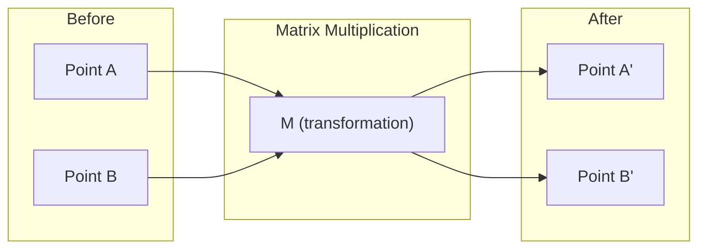
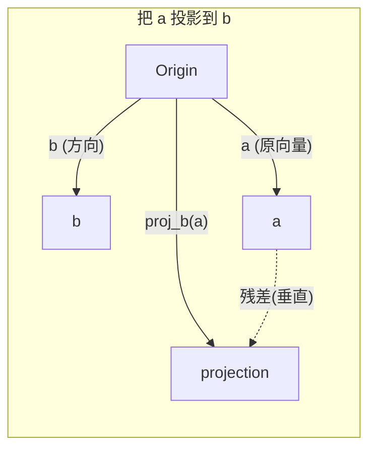

# 线性代数直觉

> 每个 AI 模型都只是套了一件漂亮外衣的矩阵运算。

**Type:** Learn
**Languages:** Python, Julia
**Prerequisites:** Phase 0
**Time:** ~60 minutes

## Learning Objectives

- 从零实现向量与矩阵运算(加法、点积、矩阵乘法)Python 版
- 从几何角度解释点积、投影、Gram-Schmidt 过程到底在做什么
- 用行简化判断一组向量的线性无关性、秩和基
- 把线性代数概念跟 AI 应用挂上钩:embeddings、注意力分数、LoRA

## The Problem

翻开任何一篇 ML 论文,第一页就会看到向量、矩阵、点积、变换。缺了线性代数的直觉,这些就是一堆符号。有了它,你能看出神经网络到底在做什么 —— 把空间里的点搬来搬去。

你不必当数学家。你要的是把每个运算的几何意义看清楚,然后自己写一遍。

## The Concept

### 向量是点(也是方向)

向量就是一组数字。但这组数字是有意义的 —— 它们是空间里的坐标。

**2D 向量 [3, 2]:**

| x | y | Point |
|---|---|-------|
| 3 | 2 | 这个向量从原点 (0,0) 指向平面上的 (3, 2) |

这个向量的模是 sqrt(3² + 2²) = sqrt(13),方向指向右上方。

在 AI 里,向量啥都能表示:
- 一个词 → 一个 768 维的向量(它在 embedding 空间里的"含义")
- 一张图 → 一个几百万像素值的向量
- 一个用户 → 一个偏好的向量

### 矩阵是变换

一个矩阵把一个向量变成另一个向量。它能旋转、缩放、拉伸、投影。



在 AI 里,矩阵就是模型本身:
- 神经网络的权重 → 把输入变成输出的矩阵
- 注意力分数 → 决定"看哪儿"的矩阵
- Embedding → 把词映成向量的矩阵

### 点积衡量相似度

两个向量的点积告诉你它们有多像。

```
a · b = a₁×b₁ + a₂×b₂ + ... + aₙ×bₙ

同向:           a · b > 0  (相似)
垂直:           a · b = 0  (无关)
反向:           a · b < 0  (不相似)
```

搜索引擎、推荐系统、RAG 干的就是这事 —— 找点积大的向量。

### 线性无关

一组向量如果其中任何一个都不能写成其他向量的组合,它们就是线性无关的。如果 v1、v2、v3 互相无关,它们张成 3D 空间;如果其中一个能由其他组合出来,它们只张成一个平面。

为什么对 AI 重要:你的特征矩阵各列应该线性无关。如果两个特征完全相关(线性相关),模型就分不清它们各自的作用 —— 这就是回归里的多重共线性,权重矩阵会变得不稳,输入稍微一动输出就乱跳。

**具体例子:**

```
v1 = [1, 0, 0]
v2 = [0, 1, 0]
v3 = [2, 1, 0]   # v3 = 2*v1 + v2
```

v1 和 v2 互相无关 —— 谁也不是谁的倍数或加和。但 v3 = 2*v1 + v2,所以 {v1, v2, v3} 是个相关组。三个向量都在 xy 平面上,你再怎么组合也到不了 [0, 0, 1]。三个向量,只有两个自由度。

放到数据集里:如果 feature_3 = 2*feature_1 + feature_2,加 feature_3 不会给模型任何新信息。更糟的是,会让正规方程奇异 —— 权重没有唯一解。

### 基与秩

基是一组最少的、线性无关的、又能张成整个空间的向量。基向量的个数就是空间的维数。

3D 空间的标准基是 {[1,0,0], [0,1,0], [0,0,1]}。但任何三个无关的 3D 向量都能当一组基。选基就是选坐标系。

矩阵的秩 = 线性无关的列数 = 线性无关的行数。如果秩 < min(rows, cols),矩阵是秩亏的。这意味着:
- 方程组有无穷多解(或无解)
- 变换过程中丢了信息
- 矩阵不可逆

| 情况 | 秩 | 对 ML 意味着什么 |
|-----------|------|---------------------|
| 满秩(rank = min(m, n)) | 达到上限 | 最小二乘有唯一解,模型良态 |
| 秩亏(rank < min(m, n)) | 低于上限 | 特征冗余,权重解不唯一,需要正则化 |
| 秩 1 | 1 | 每一列都是同一向量的缩放,所有数据落在一条直线上 |
| 接近秩亏(小奇异值) | 数值上很低 | 矩阵病态,输入微小噪声就会引起输出大变化,用 SVD 截断或岭回归 |

### 投影

把向量 **a** 投影到向量 **b** 上,得到的是 **a** 在 **b** 方向上的分量:

```
proj_b(a) = (a·b / b·b) * b
```

残差 (a - proj_b(a)) 跟 b 垂直。这个正交分解是很多最小二乘拟合的基石。

投影在 ML 里到处都是:
- 线性回归让观测到列空间的距离最小 —— 解本身就是一个投影
- PCA 把数据投到方差最大的方向上
- Transformer 的注意力算的是 query 在 key 上的投影



**例子:** a = [3, 4], b = [1, 0]

proj_b(a) = (3×1 + 4×0) / (1×1 + 0×0) × [1, 0] = 3 × [1, 0] = [3, 0]

投影把 y 分量干掉了。这就是降维最朴素的形式 —— 扔掉你不关心的方向。

### Gram-Schmidt 过程

把任意一组无关向量变成正交基。"正交"意思是每个向量长度为 1,任意两个互相垂直。

算法:
1. 取第一个向量,归一化
2. 取第二个向量,减去它在第一个上的投影,归一化
3. 取第三个向量,减去它在前面所有向量上的投影,归一化
4. 剩下的向量重复

```
输入:  v1, v2, v3, ... (线性无关)

u1 = v1 / |v1|

w2 = v2 - (v2·u1) * u1
u2 = w2 / |w2|

w3 = v3 - (v3·u1) * u1 - (v3·u2) * u2
u3 = w3 / |w3|

输出:  u1, u2, u3, ... (正交基)
```

QR 分解内部就是这回事。Q 就是正交基,R 是投影系数。QR 分解用在:
- 解线性方程组(比高斯消元更稳)
- 算特征值(QR 算法)
- 最小二乘回归(标准的数值方法)

## Build It

### Step 1: 从零实现向量(Python)

```python
class Vector:
    def __init__(self, components):
        self.components = list(components)
        self.dim = len(self.components)

    def __add__(self, other):
        return Vector([a + b for a, b in zip(self.components, other.components)])

    def __sub__(self, other):
        return Vector([a - b for a, b in zip(self.components, other.components)])

    def dot(self, other):
        return sum(a * b for a, b in zip(self.components, other.components))

    def magnitude(self):
        return sum(x**2 for x in self.components) ** 0.5

    def normalize(self):
        mag = self.magnitude()
        return Vector([x / mag for x in self.components])

    def cosine_similarity(self, other):
        return self.dot(other) / (self.magnitude() * other.magnitude())

    def __repr__(self):
        return f"Vector({self.components})"


a = Vector([1, 2, 3])
b = Vector([4, 5, 6])

print(f"a + b = {a + b}")
print(f"a · b = {a.dot(b)}")
print(f"|a| = {a.magnitude():.4f}")
print(f"cosine similarity = {a.cosine_similarity(b):.4f}")
```

### Step 2: 从零实现矩阵(Python)

```python
class Matrix:
    def __init__(self, rows):
        self.rows = [list(row) for row in rows]
        self.shape = (len(self.rows), len(self.rows[0]))

    def __matmul__(self, other):
        if isinstance(other, Vector):
            return Vector([
                sum(self.rows[i][j] * other.components[j] for j in range(self.shape[1]))
                for i in range(self.shape[0])
            ])
        rows = []
        for i in range(self.shape[0]):
            row = []
            for j in range(other.shape[1]):
                row.append(sum(
                    self.rows[i][k] * other.rows[k][j]
                    for k in range(self.shape[1])
                ))
            rows.append(row)
        return Matrix(rows)

    def transpose(self):
        return Matrix([
            [self.rows[j][i] for j in range(self.shape[0])]
            for i in range(self.shape[1])
        ])

    def __repr__(self):
        return f"Matrix({self.rows})"


rotation_90 = Matrix([[0, -1], [1, 0]])
point = Vector([3, 1])

rotated = rotation_90 @ point
print(f"Original: {point}")
print(f"Rotated 90°: {rotated}")
```

### Step 3: 这跟 AI 有什么关系

```python
import random

random.seed(42)
weights = Matrix([[random.gauss(0, 0.1) for _ in range(3)] for _ in range(2)])
input_vector = Vector([1.0, 0.5, -0.3])

output = weights @ input_vector
print(f"Input (3D): {input_vector}")
print(f"Output (2D): {output}")
print("这就是神经网络的一层在干的事 —— 矩阵乘法。")
```

### Step 4: Julia 版

```julia
a = [1.0, 2.0, 3.0]
b = [4.0, 5.0, 6.0]

println("a + b = ", a + b)
println("a · b = ", a ⋅ b)       # Julia 支持 unicode 运算符
println("|a| = ", √(a ⋅ a))
println("cosine = ", (a ⋅ b) / (√(a ⋅ a) * √(b ⋅ b)))

# 矩阵-向量乘法
W = [0.1 -0.2 0.3; 0.4 0.5 -0.1]
x = [1.0, 0.5, -0.3]
println("Wx = ", W * x)
println("这就是神经网络的一层。")
```

### Step 5: 从零实现线性无关和投影(Python)

```python
def is_linearly_independent(vectors):
    n = len(vectors)
    dim = len(vectors[0].components)
    mat = Matrix([v.components[:] for v in vectors])
    rows = [row[:] for row in mat.rows]
    rank = 0
    for col in range(dim):
        pivot = None
        for row in range(rank, len(rows)):
            if abs(rows[row][col]) > 1e-10:
                pivot = row
                break
        if pivot is None:
            continue
        rows[rank], rows[pivot] = rows[pivot], rows[rank]
        scale = rows[rank][col]
        rows[rank] = [x / scale for x in rows[rank]]
        for row in range(len(rows)):
            if row != rank and abs(rows[row][col]) > 1e-10:
                factor = rows[row][col]
                rows[row] = [rows[row][j] - factor * rows[rank][j] for j in range(dim)]
        rank += 1
    return rank == n


def project(a, b):
    scalar = a.dot(b) / b.dot(b)
    return Vector([scalar * x for x in b.components])


def gram_schmidt(vectors):
    orthonormal = []
    for v in vectors:
        w = v
        for u in orthonormal:
            proj = project(w, u)
            w = w - proj
        if w.magnitude() < 1e-10:
            continue
        orthonormal.append(w.normalize())
    return orthonormal


v1 = Vector([1, 0, 0])
v2 = Vector([1, 1, 0])
v3 = Vector([1, 1, 1])
basis = gram_schmidt([v1, v2, v3])
for i, u in enumerate(basis):
    print(f"u{i+1} = {u}")
    print(f"  |u{i+1}| = {u.magnitude():.6f}")

print(f"u1 · u2 = {basis[0].dot(basis[1]):.6f}")
print(f"u1 · u3 = {basis[0].dot(basis[2]):.6f}")
print(f"u2 · u3 = {basis[1].dot(basis[2]):.6f}")
```

## Use It

用 NumPy 做同一件事 —— 实际干活时你就会这么写:

```python
import numpy as np

a = np.array([1, 2, 3], dtype=float)
b = np.array([4, 5, 6], dtype=float)

print(f"a + b = {a + b}")
print(f"a · b = {np.dot(a, b)}")
print(f"|a| = {np.linalg.norm(a):.4f}")
print(f"cosine = {np.dot(a, b) / (np.linalg.norm(a) * np.linalg.norm(b)):.4f}")

W = np.random.randn(2, 3) * 0.1
x = np.array([1.0, 0.5, -0.3])
print(f"Wx = {W @ x}")
```

### 秩、投影和 QR 用 NumPy

```python
import numpy as np

A = np.array([[1, 2], [2, 4]])
print(f"Rank: {np.linalg.matrix_rank(A)}")

a = np.array([3, 4])
b = np.array([1, 0])
proj = (np.dot(a, b) / np.dot(b, b)) * b
print(f"Projection of {a} onto {b}: {proj}")

Q, R = np.linalg.qr(np.random.randn(3, 3))
print(f"Q is orthogonal: {np.allclose(Q @ Q.T, np.eye(3))}")
print(f"R is upper triangular: {np.allclose(R, np.triu(R))}")
```

### PyTorch —— 带自动求导的 tensor

```python
import torch

x = torch.randn(3, requires_grad=True)
y = torch.tensor([1.0, 0.0, 0.0])

similarity = torch.dot(x, y)
similarity.backward()

print(f"x = {x.data}")
print(f"y = {y.data}")
print(f"dot product = {similarity.item():.4f}")
print(f"d(dot)/dx = {x.grad}")
```

点积对 x 的梯度就是 y。PyTorch 自动算出了这个。神经网络里的每个运算都是这种运算堆出来的 —— 矩阵乘、点积、投影 —— 而自动求导能把这些运算的梯度都串起来。

你刚自己从零写的,NumPy 一行就做完了。底层在跑啥你现在知道了。

## Ship It

本节产出:
- `outputs/prompt-linear-algebra-tutor.md` —— 一个 prompt,让 AI 助手用几何直觉教线性代数

## Connections

本节每个概念都能挂到具体 AI 模块上:

| 概念 | 出处 |
|---------|------------------|
| 点积 | Transformer 注意力分数、RAG 的余弦相似度 |
| 矩阵乘 | 每个神经网络层、每个线性变换 |
| 线性无关 | 特征选择,避免多重共线性 |
| 秩 | 判断系统是否有解,LoRA(低秩适配) |
| 投影 | 线性回归(投到列空间)、PCA |
| Gram-Schmidt / QR | 数值求解、特征值计算 |
| 正交基 | 稳定数值计算、白化变换 |

LoRA 值得单独提一句。它把 LLM 微调时的权重更新拆成两个低秩矩阵。原来要更新 4096×4096 的权重矩阵(1600 万参数),LoRA 改成更新 4096×16 和 16×4096 两个矩阵(13.1 万参数)。秩 16 的约束意味着 LoRA 假设权重更新活在完整 4096 维空间里一个 16 维的子空间里。这就是线性代数在真干活。

## Exercises

1. 实现 `Vector.angle_between(other)`,返回两个向量的夹角(角度)
2. 写一个 2D 缩放矩阵,把 x 坐标翻倍、y 坐标翻三倍,然后作用到向量 [1, 1] 上
3. 给定 5 个"词样"的随机向量(维度 50),用余弦相似度找出最像的两个
4. 验证 Gram-Schmidt 输出真的正交:任意一对点积为 0,每个向量模为 1
5. 写一个 3×3 秩为 2 的矩阵,用 `rank()` 方法验证。然后解释这些列在几何上张成了什么
6. 把向量 [1, 2, 3] 投到 [1, 1, 1] 上。结果在几何上代表什么?

## Key Terms

| Term | What people say | What it actually means |
|------|----------------|----------------------|
| Vector | "一支箭头" | 一组数字,代表 n 维空间里的一个点或一个方向 |
| Matrix | "一张数字表" | 一个变换,把向量从一个空间映到另一个空间 |
| Dot product | "乘起来再求和" | 衡量两个向量"对齐程度" —— 相似度搜索的核心 |
| Embedding | "AI 的某种魔法" | 一个向量,代表某个东西(词、图、用户)的含义 |
| Linear independence | "它们不重叠" | 组里没有哪个向量能写成其他向量的组合 |
| Rank | "多少维" | 矩阵中线性无关的列(或行)的数量 |
| Projection | "影子" | 一个向量在另一个方向上的分量 |
| Basis | "坐标轴" | 一组最简的、能张成整个空间的无关向量 |
| Orthonormal | "互相垂直的单位向量" | 一组互相垂直、且每个长度都是 1 的向量 |
