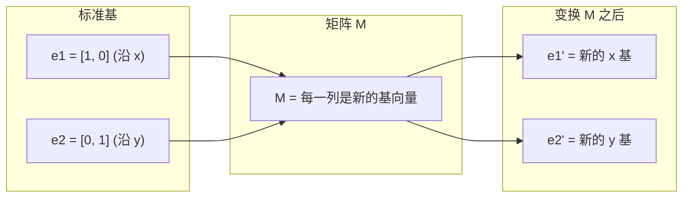
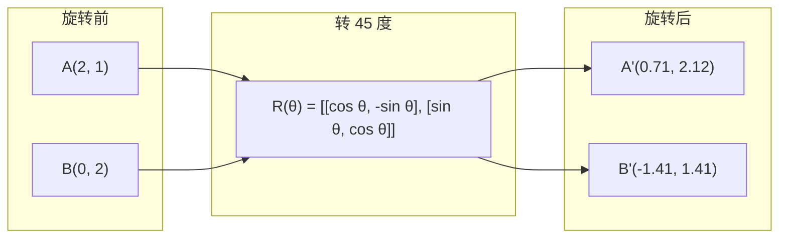
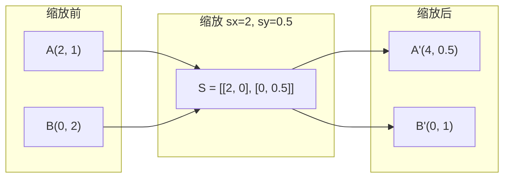
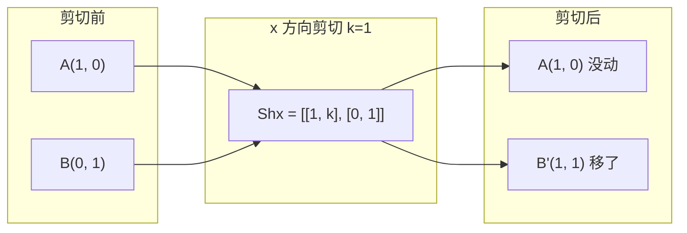
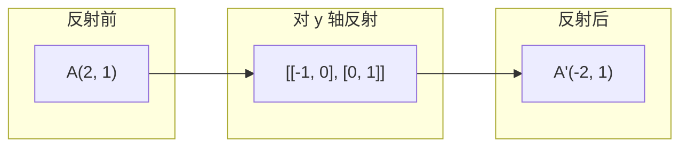
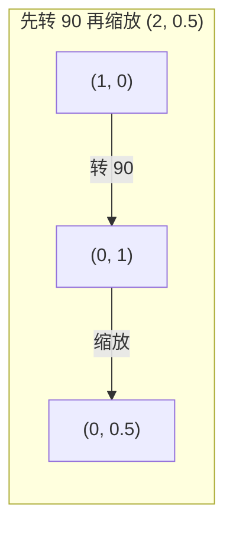
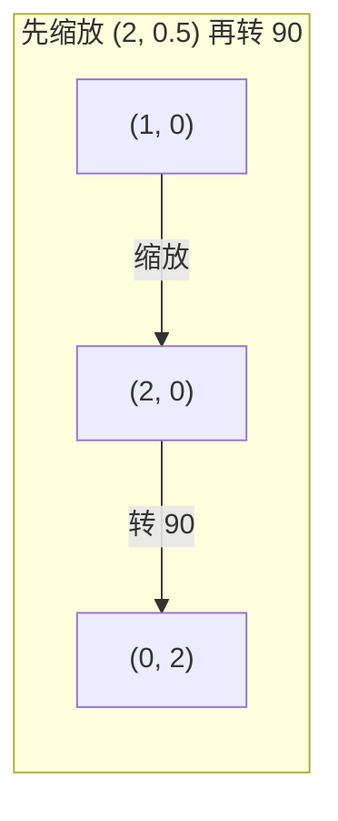

# 矩阵变换

> 矩阵是一台重塑空间的机器。搞清楚它对每个点干了什么,整个变换你就懂了。

**Type:** Build
**Languages:** Python, Julia
**Prerequisites:** Phase 1, Lessons 01-02 (Linear Algebra Intuition, Vectors & Matrices Operations)
**Time:** ~75 minutes

## Learning Objectives

- 构造旋转、缩放、剪切、反射矩阵,作用到 2D 和 3D 点
- 把多个变换用矩阵乘串起来,验证顺序很关键
- 用特征方程手算 2×2 矩阵的特征值和特征向量
- 解释为什么特征值决定 PCA 方向、RNN 稳定性、谱聚类行为

## The Problem

你读到 PCA,看见"求协方差矩阵的特征向量"。读到模型稳定性,看见"检查所有特征值是否幅值小于 1"。读到数据增强,看见"应用一个随机旋转"。这些在你弄懂矩阵在几何上对空间干了什么之前,都说不通。

矩阵不只是一张数字表,它是空间机器。旋转矩阵让点转,缩放矩阵把点拉,剪切矩阵把点斜。神经网络对数据做的每个变换都是这些操作中的一个,或它们的组合。这节课把这些操作落到地上。

## The Concept

### 变换就是矩阵

2D 里每个线性变换都能写成一个 2×2 矩阵。矩阵告诉你基向量 [1, 0] 和 [0, 1] 最后落在哪。剩下的事都是它的推论。



### 旋转

2D 上转角 θ 保持距离和角度不变,每个点都沿一段圆弧移动。



3D 里是绕某个轴转,每个轴有各自的旋转矩阵:

```
Rz(theta) = | cos  -sin  0 |     绕 z 轴转
            | sin   cos  0 |     (x-y 平面在转,z 不动)
            |  0     0   1 |

Rx(theta) = | 1   0     0    |   绕 x 轴转
            | 0  cos  -sin   |   (y-z 平面在转,x 不动)
            | 0  sin   cos   |

Ry(theta) = |  cos  0  sin |     绕 y 轴转
            |   0   1   0  |     (x-z 平面在转,y 不动)
            | -sin  0  cos |
```

### 缩放

缩放沿每个轴独立地拉长或压缩。



### 剪切

剪切固定一个轴,让另一个轴倾斜,把矩形变成平行四边形。



剪切矩阵:
- `Shx = [[1, k], [0, 1]]` 让 x 偏移 k * y
- `Shy = [[1, 0], [k, 1]]` 让 y 偏移 k * x

### 反射

反射把点沿某条轴或线镜像。



反射矩阵:
- 对 y 轴反射: `[[-1, 0], [0, 1]]`
- 对 x 轴反射: `[[1, 0], [0, -1]]`

### 复合:串起多个变换

先 A 再 B,等于把两个矩阵乘起来: `result = B @ A @ point`。顺序有影响。先转再缩放,跟先缩放再转,出来的结果不一样。



合成: `S @ R = [[0, -2], [0.5, 0]]`



合成: `R @ S = [[0, -0.5], [2, 0]]`

结果不一样。矩阵乘不可交换。

### 特征值与特征向量

大多数向量被一个矩阵作用后方向会变。特征向量是特殊的:矩阵只会缩放它,不会旋转。缩放因子就是特征值。

```
A @ v = lambda * v

v 是特征向量(那个幸存下来的方向)
lambda 是特征值(拉长多少倍)

例子: A = | 2  1 |
          | 1  2 |

特征向量 [1, 1],特征值 3:
  A @ [1,1] = [3, 3] = 3 * [1, 1]     (同方向,放大 3 倍)

特征向量 [1, -1],特征值 1:
  A @ [1,-1] = [1, -1] = 1 * [1, -1]  (同方向,不变)
```

这个矩阵把空间沿 [1, 1] 拉了 3 倍,沿 [1, -1] 保持不变。其他方向都是这两个方向的混合。

### 特征分解

如果一个矩阵有 n 个线性无关的特征向量,它能分解成:

```
A = V @ D @ V^(-1)

V = 列是特征向量的矩阵
D = 特征值组成的对角阵
V^(-1) = V 的逆

含义: 先转到特征向量坐标系,沿各轴缩放,再转回去
```

### 为什么特征值重要

**PCA。** 协方差矩阵的特征向量就是主成分。特征值告诉你每个主成分抓到多少方差。按特征值排序,取前 k 个,降维就完了。

**稳定性。** 循环网络和动力系统里,特征值幅值 > 1 输出爆炸,幅值 < 1 输出消失。这就是梯度消失/爆炸问题的一句话版本。

**谱方法。** GNN 用邻接矩阵的特征值。谱聚类用 Laplacian 矩阵的特征值。特征向量揭示图的结构。

### 行列式:体积缩放因子

变换矩阵的行列式告诉你它把面积(2D)或体积(3D)放大了多少。

```
det = 1:   面积守恒(旋转)
det = 2:   面积翻倍
det = 0:   空间被压扁到低维(奇异)
det = -1:  面积守恒但朝向翻转(反射)

| det(旋转) | = 1          (永远)
| det(缩放 sx, sy) | = sx * sy
| det(剪切) | = 1           (面积守恒)
| det(反射) | = -1          (朝向翻转)
```

## Build It

### Step 1: 从零构造变换矩阵(Python)

```python
import math

def rotation_2d(theta):
    c, s = math.cos(theta), math.sin(theta)
    return [[c, -s], [s, c]]

def scaling_2d(sx, sy):
    return [[sx, 0], [0, sy]]

def shearing_2d(kx, ky):
    return [[1, kx], [ky, 1]]

def reflection_x():
    return [[1, 0], [0, -1]]

def reflection_y():
    return [[-1, 0], [0, 1]]

def mat_vec_mul(matrix, vector):
    return [
        sum(matrix[i][j] * vector[j] for j in range(len(vector)))
        for i in range(len(matrix))
    ]

def mat_mul(a, b):
    rows_a, cols_b = len(a), len(b[0])
    cols_a = len(a[0])
    return [
        [sum(a[i][k] * b[k][j] for k in range(cols_a)) for j in range(cols_b)]
        for i in range(rows_a)
    ]

point = [1.0, 0.0]
angle = math.pi / 4

rotated = mat_vec_mul(rotation_2d(angle), point)
print(f"Rotate (1,0) by 45 deg: ({rotated[0]:.4f}, {rotated[1]:.4f})")

scaled = mat_vec_mul(scaling_2d(2, 3), [1.0, 1.0])
print(f"Scale (1,1) by (2,3): ({scaled[0]:.1f}, {scaled[1]:.1f})")

sheared = mat_vec_mul(shearing_2d(1, 0), [1.0, 1.0])
print(f"Shear (1,1) kx=1: ({sheared[0]:.1f}, {sheared[1]:.1f})")

reflected = mat_vec_mul(reflection_y(), [2.0, 1.0])
print(f"Reflect (2,1) across y: ({reflected[0]:.1f}, {reflected[1]:.1f})")
```

### Step 2: 变换的复合

```python
R = rotation_2d(math.pi / 2)
S = scaling_2d(2, 0.5)

rotate_then_scale = mat_mul(S, R)
scale_then_rotate = mat_mul(R, S)

point = [1.0, 0.0]
result1 = mat_vec_mul(rotate_then_scale, point)
result2 = mat_vec_mul(scale_then_rotate, point)

print(f"先转 90 再缩放: ({result1[0]:.2f}, {result1[1]:.2f})")
print(f"先缩放再转 90: ({result2[0]:.2f}, {result2[1]:.2f})")
print(f"一样吗? {result1 == result2}")
```

### Step 3: 从零算特征值(2×2)

2×2 矩阵 `[[a, b], [c, d]]` 的特征值解特征方程: `lambda² - (a+d)*lambda + (ad - bc) = 0`。

```python
def eigenvalues_2x2(matrix):
    a, b = matrix[0]
    c, d = matrix[1]
    trace = a + d
    det = a * d - b * c
    discriminant = trace ** 2 - 4 * det
    if discriminant < 0:
        real = trace / 2
        imag = (-discriminant) ** 0.5 / 2
        return (complex(real, imag), complex(real, -imag))
    sqrt_disc = discriminant ** 0.5
    return ((trace + sqrt_disc) / 2, (trace - sqrt_disc) / 2)

def eigenvector_2x2(matrix, eigenvalue):
    a, b = matrix[0]
    c, d = matrix[1]
    if abs(b) > 1e-10:
        v = [b, eigenvalue - a]
    elif abs(c) > 1e-10:
        v = [eigenvalue - d, c]
    else:
        if abs(a - eigenvalue) < 1e-10:
            v = [1, 0]
        else:
            v = [0, 1]
    mag = (v[0] ** 2 + v[1] ** 2) ** 0.5
    return [v[0] / mag, v[1] / mag]

A = [[2, 1], [1, 2]]
vals = eigenvalues_2x2(A)
print(f"Matrix: {A}")
print(f"Eigenvalues: {vals[0]:.4f}, {vals[1]:.4f}")

for val in vals:
    vec = eigenvector_2x2(A, val)
    result = mat_vec_mul(A, vec)
    scaled = [val * vec[0], val * vec[1]]
    print(f"  lambda={val:.1f}, v={[round(x,4) for x in vec]}")
    print(f"    A@v = {[round(x,4) for x in result]}")
    print(f"    l*v = {[round(x,4) for x in scaled]}")
```

### Step 4: 行列式:体积缩放因子

```python
def det_2x2(matrix):
    return matrix[0][0] * matrix[1][1] - matrix[0][1] * matrix[1][0]

print(f"det(rotation 45) = {det_2x2(rotation_2d(math.pi/4)):.4f}")
print(f"det(scale 2,3)   = {det_2x2(scaling_2d(2, 3)):.1f}")
print(f"det(shear kx=1)  = {det_2x2(shearing_2d(1, 0)):.1f}")
print(f"det(reflect y)   = {det_2x2(reflection_y()):.1f}")

singular = [[1, 2], [2, 4]]
print(f"det(singular)     = {det_2x2(singular):.1f}")
print("奇异: 列成比例,空间塌成一条线。")
```

## Use It

NumPy 用优化过的函数做这些事。

```python
import numpy as np

theta = np.pi / 4
R = np.array([[np.cos(theta), -np.sin(theta)],
              [np.sin(theta),  np.cos(theta)]])

point = np.array([1.0, 0.0])
print(f"Rotate (1,0) by 45 deg: {R @ point}")

S = np.diag([2.0, 3.0])
composed = S @ R
print(f"Scale(2,3) after Rotate(45): {composed @ point}")

A = np.array([[2, 1], [1, 2]], dtype=float)
eigenvalues, eigenvectors = np.linalg.eig(A)
print(f"\nEigenvalues: {eigenvalues}")
print(f"Eigenvectors (列):\n{eigenvectors}")

for i in range(len(eigenvalues)):
    v = eigenvectors[:, i]
    lam = eigenvalues[i]
    print(f"  A @ v{i} = {A @ v}, lambda * v{i} = {lam * v}")

print(f"\ndet(R) = {np.linalg.det(R):.4f}")
print(f"det(S) = {np.linalg.det(S):.1f}")

B = np.array([[3, 1], [0, 2]], dtype=float)
vals, vecs = np.linalg.eig(B)
D = np.diag(vals)
V = vecs
reconstructed = V @ D @ np.linalg.inv(V)
print(f"\n特征分解 A = V @ D @ V^-1:")
print(f"原矩阵:\n{B}")
print(f"重构后:\n{reconstructed}")
```

### 3D 旋转用 NumPy

```python
def rotation_3d_z(theta):
    c, s = np.cos(theta), np.sin(theta)
    return np.array([[c, -s, 0], [s, c, 0], [0, 0, 1]])

def rotation_3d_x(theta):
    c, s = np.cos(theta), np.sin(theta)
    return np.array([[1, 0, 0], [0, c, -s], [0, s, c]])

point_3d = np.array([1.0, 0.0, 0.0])
rotated_z = rotation_3d_z(np.pi / 2) @ point_3d
rotated_x = rotation_3d_x(np.pi / 2) @ point_3d

print(f"\n3D point: {point_3d}")
print(f"绕 z 转 90: {np.round(rotated_z, 4)}")
print(f"绕 x 转 90: {np.round(rotated_x, 4)}")
```

## Ship It

这节课为 PCA(Phase 2)和神经网络权重分析搭了几何底子。这里写的特征值/特征向量代码就是生产 ML 系统里降维、谱聚类、稳定性分析用的同一个算法。

## Exercises

1. 把旋转、缩放、剪切作用到单位正方形(角点 [0,0]、[1,0]、[1,1]、[0,1])。分别打出变换后的角点。验证旋转保持角点之间的距离。
2. 用特征方程手算矩阵 [[4, 2], [1, 3]] 的特征值。再用自己写的函数和 NumPy 验证。
3. 构造三个变换的复合(转 30 度、按 [1.5, 0.8] 缩放、kx=0.3 剪切),作用到 8 个排在圆上的点。打出变换前后的坐标。算复合矩阵的行列式,验证它等于各矩阵行列式之积。

## Key Terms

| Term | What people say | What it actually means |
|------|----------------|----------------------|
| Rotation matrix | "让东西转" | 一个正交矩阵,让点沿圆弧移动,保持距离和角度。行列式永远为 1。 |
| Scaling matrix | "让东西变大" | 一个对角矩阵,沿每个轴独立地拉长或压缩。行列式是缩放因子的乘积。 |
| Shearing matrix | "把东西斜过来" | 让一个坐标按另一个坐标成比例偏移,把矩形变平行四边形。行列式为 1。 |
| Reflection | "照镜子" | 把空间沿某条轴或某个面翻过来。行列式为 -1。 |
| Composition | "干两件事" | 矩阵乘起来串成一条链。顺序有讲究: B @ A 意味着先 A 再 B。 |
| Eigenvector | "特殊的方向" | 矩阵只能缩放、不能旋转的方向。变换的"指纹"。 |
| Eigenvalue | "拉长多少倍" | 矩阵缩放特征向量的标量倍数。可以是负的(翻转)或复数(旋转)。 |
| Eigendecomposition | "把矩阵拆开" | 把矩阵写成 V @ D @ V^(-1),把它的基本缩放方向和幅度分开。 |
| Determinant | "矩阵给的一个数" | 这个变换把面积(2D)或体积(3D)放大的倍数。0 意味着变换不可逆。 |
| Characteristic equation | "特征值从哪来" | det(A - lambda * I) = 0,根就是特征值的多项式。 |

## Further Reading

- [3Blue1Brown: Linear Transformations](https://www.3blue1brown.com/lessons/linear-transformations) —— 矩阵怎么重塑空间的可视化
- [3Blue1Brown: Eigenvectors and Eigenvalues](https://www.3blue1brown.com/lessons/eigenvalues) —— 特征向量几何意义的最佳可视化讲解
- [MIT 18.06 Lecture 21: Eigenvalues and Eigenvectors](https://ocw.mit.edu/courses/18-06-linear-algebra-spring-2010/) —— Gilbert Strang 的经典讲法
