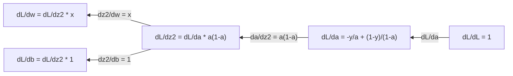
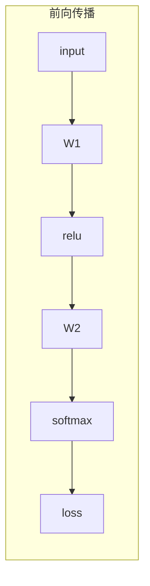

# 机器学习中的微积分

> 导数告诉你哪儿是下坡。神经网络学会东西,有这点就够了。

**Type:** Learn
**Language:** Python
**Prerequisites:** Phase 1, Lessons 01-03
**Time:** ~60 minutes

## Learning Objectives

- 对常见 ML 函数(x²、sigmoid、交叉熵)算数值导数和解析导数
- 从零实现梯度下降,在 1D 和 2D 上最小化一个 loss 函数
- 推导出线性回归模型的梯度,用手写权重更新来训练它
- 解释 Hessian 矩阵、Taylor 展开近似,以及它们跟优化方法的联系

## The Problem

你有个神经网络,几百万个权重。每个权重都是个旋钮。你得搞清楚每个旋钮该往哪转,才能让模型少错一点。微积分告诉你这个方向。

没有微积分,训神经网络就是瞎试乱调。有了导数,你精确地知道每个权重怎么影响误差。每个旋钮都往对的方向转,每次都转对。

## The Concept

### 导数是什么

导数衡量变化率。对函数 y = f(x),导数 f'(x) 告诉你:把 x 推一点点,y 会变多少?

几何上,导数就是某点切线的斜率。

**f(x) = x²:**

| x | f(x) | f'(x)(斜率) |
|---|------|---------------|
| 0 | 0    | 0(平的,在底部) |
| 1 | 1    | 2 |
| 2 | 4    | 4(这点的切线斜率) |
| 3 | 9    | 6 |

x=2 处斜率是 4。把 x 往右推一点点,y 大约增加 4 倍那个量。x=0 处斜率是 0,你站在碗底。

正式定义:

```
f'(x) = lim   f(x + h) - f(x)
        h->0  -----------------
                     h
```

写代码时跳过极限,直接用一个很小的 h。这就是数值导数。

### 偏导数:一次只看一个变量

真实函数有很多输入。神经网络 loss 依赖几千个权重。偏导数把其他变量全当成常数,只对其中一个求导。

```
f(x, y) = x² + 3xy + y²

df/dx = 2x + 3y     (y 当常数)
df/dy = 3x + 2y     (x 当常数)
```

每个偏导数回答:只推这一个权重,loss 变多少?

### 梯度:所有偏导数组成的向量

梯度把每个偏导数装进一个向量。对 f(x, y, z),梯度是:

```
grad f = [ df/dx, df/dy, df/dz ]
```

梯度指向"最陡上升"的方向。要让函数变小,就走反方向。

**f(x, y) = x² + y² 的等高线:**

这个函数呈碗形,等高线是一圈一圈的同心圆。最小值在 (0, 0)。

| 点 | grad f | -grad f(下降方向) |
|-------|--------|----------------------------|
| (1, 1) | [2, 2](指上坡,远离最小值) | [-2, -2](指下坡,指向最小值) |
| (0, 0) | [0, 0](平的,在最小值) | [0, 0] |

这就是梯度下降的图示:算梯度,取反,走一步。

### 跟优化的联系

训练神经网络就是优化。你有个 loss 函数 L(w1, w2, ..., wn) 衡量模型错得有多离谱。你想把它最小化。

```
梯度下降更新规则:

  w_new = w_old - learning_rate * dL/dw

对每个权重:
  1. 算 loss 对这个权重的偏导
  2. 从权重里减去它的一个小倍数
  3. 重复
```

学习率控制步长。太大就冲过头,太小就挪不动。

**Loss landscape(1D 切片):**

loss 函数 L(w) 在权重 w 变化时形成一条带峰谷的曲线。

| 特征 | 描述 |
|---------|-------------|
| 全局最小值 | 整条曲线上最低的点 —— 最优解 |
| 局部最小值 | 比邻居低但不是全局最低的谷 |
| 斜率 | 梯度下降沿斜率从任意起点往下走 |

梯度下降沿斜率往下走。它可能卡在局部最小值,但在高维空间(几百万权重)这其实很少是实际问题。

### 数值导数 vs 解析导数

两种算法。

解析:手算微积分。f(x) = x²,导数 f'(x) = 2x。精确,快。

数值:用定义去近似。算 f(x+h) 和 f(x-h),用差值。

```
数值导数(中心差分):

f'(x) ~= f(x + h) - f(x - h)
          -----------------------
                  2h

h = 0.0001 实际很好用
```

数值导数慢但什么函数都行。解析导数快但要推导。神经网络框架走第三条路:自动微分,机械地算精确导数。Phase 3 会看到。

### 常见函数手算导数

这些是 ML 里反复遇到的。

```
函数            导数              用在
--------        ----------       -------
f(x) = x²     f'(x) = 2x      loss 函数 (MSE)
f(x) = wx + b  f'(w) = x        线性层(对权重的梯度)
               f'(b) = 1        线性层(对 bias 的梯度)
               f'(x) = w        线性层(对输入的梯度)
f(x) = e^x    f'(x) = e^x     Softmax,注意力
f(x) = ln(x)  f'(x) = 1/x     交叉熵 loss
f(x) = 1/(1+e^-x)  f'(x) = f(x)(1-f(x))   Sigmoid 激活
```

f(x) = x²:

```
f(x) = x²    f'(x) = 2x

  x    f(x)   f'(x)   含义
  -2    4      -4      斜率向左倾(下降)
  -1    1      -2      斜率向左倾(下降)
   0    0       0      平的(最小值!)
   1    1       2      斜率向右倾(上升)
   2    4       4      斜率向右倾(上升)
```

f(w) = wx + b,x=3, b=1:

```
f(w) = 3w + 1    f'(w) = 3

对 w 的导数就是 x。
x 越大,w 一点小变化,输出就变化越大。
```

### 链式法则

函数复合时,链式法则告诉你怎么求导。

```
若 y = f(g(x)),则 dy/dx = f'(g(x)) * g'(x)

例子: y = (3x + 1)²
  外层: f(u) = u²       f'(u) = 2u
  内层: g(x) = 3x + 1    g'(x) = 3
  dy/dx = 2(3x + 1) * 3 = 6(3x + 1)
```

神经网络就是函数的链:输入 -> 线性 -> 激活 -> 线性 -> 激活 -> loss。反向传播就是链式法则从输出到输入反复用。这就是整个算法。

### Hessian 矩阵

梯度告诉你斜率,Hessian 告诉你曲率。

Hessian 是二阶偏导组成的矩阵。对 f(x1, x2, ..., xn),Hessian 的 (i, j) 元素是:

```
H[i][j] = d²f / (dx_i * dx_j)
```

对 2 变量函数 f(x, y):

```
H = | d²f/dx²    d²f/dxdy |
    | d²f/dydx    d²f/dy² |
```

**Hessian 在临界点(梯度 = 0)告诉你的事:**

| Hessian 性质 | 含义 | 例曲面 |
|-----------------|---------|----------------|
| 正定(所有特征值 > 0) | 局部最小 | 向上开口的碗 |
| 负定(所有特征值 < 0) | 局部最大 | 向下开口的碗 |
| 不定(特征值有正有负) | 鞍点 | 马鞍形 |

**例子:** f(x, y) = x² - y²(一个鞍形)

```
df/dx = 2x       df/dy = -2y
d²f/dx² = 2    d²f/dy² = -2    d²f/dxdy = 0

H = | 2   0 |
    | 0  -2 |

特征值: 2 和 -2(一正一负)
--> (0, 0) 是鞍点
```

对比 f(x, y) = x² + y²(碗形):

```
H = | 2  0 |
    | 0  2 |

特征值: 2 和 2(都正)
--> (0, 0) 是局部最小
```

**为什么 Hessian 在 ML 里重要:**

牛顿法用 Hessian 走出比梯度下降更好的步子。它不只跟着斜率,还考虑曲率:

```
牛顿法:       w_new = w_old - H^(-1) * gradient
梯度下降:     w_new = w_old - lr * gradient
```

牛顿法收敛更快,因为 Hessian 重新"标定"了梯度 —— 陡的方向步子小,平的方向步子大。

坑:对一个 N 参数的神经网络,Hessian 是 N × N。100 万参数的模型要 1 万亿条目的矩阵。这就是为啥我们用近似。

| 方法 | 用什么 | 代价 | 收敛 |
|--------|-------------|------|-------------|
| 梯度下降 | 只用一阶导数 | 每步 O(N) | 慢(线性) |
| 牛顿法 | 完整 Hessian | 每步 O(N³) | 快(二次) |
| L-BFGS | 用梯度历史近似 Hessian | 每步 O(N) | 中(超线性) |
| Adam | 自适应逐参数学习率(对角 Hessian 近似) | 每步 O(N) | 中 |
| 自然梯度 | Fisher 信息矩阵(统计 Hessian) | 每步 O(N²) | 快 |

实际中,Adam 是深度学习的默认优化器。它通过追踪每个参数梯度的移动均值和方差,廉价地近似二阶信息。

### Taylor 展开近似

任何光滑函数都能在局部用一个多项式逼近:

```
f(x + h) = f(x) + f'(x)*h + (1/2)*f''(x)*h² + (1/6)*f'''(x)*h³ + ...
```

加的项越多,逼近越准 —— 但只在 x 附近。

**为什么 Taylor 展开对 ML 重要:**

- **一阶 Taylor = 梯度下降。** 用 f(x + h) ~ f(x) + f'(x)*h 的时候,你做的是线性近似。梯度下降最小化这个线性模型,得到 h = -lr * f'(x)。

- **二阶 Taylor = 牛顿法。** 用 f(x + h) ~ f(x) + f'(x)*h + (1/2)*f''(x)*h²,你得到一个二次模型。最小化它得到 h = -f'(x)/f''(x) —— 牛顿步。

- **Loss 函数设计。** MSE 和交叉熵是光滑的,它们的 Taylor 展开表现良好。这不是巧合。光滑的 loss 让优化更可预测。

```
近似阶数        抓到什么         优化方法
------------    --------------    ---------------
0 阶(常数)     只有值          随机搜索
1 阶(线性)     斜率            梯度下降
2 阶(二次)     曲率            牛顿法
更高阶         更细结构        ML 里很少用
```

核心洞见:所有基于梯度的优化本质上都是在局部逼近 loss 函数,再走一步到那个逼近的最小值。

### 积分在 ML 里

导数告诉你变化率,积分算累加 —— 曲线下面积。

ML 里很少手算积分,但概念到处都是:

**概率。** 对连续随机变量的密度 p(x):
```
P(a < X < b) = 从 a 到 b 积分 p(x) dx
```
概率密度曲线下从 a 到 b 的面积,就是 X 落在这个范围的概率。

**期望值。** 按概率加权的平均结果:
```
E[f(X)] = 积分 f(x) * p(x) dx
```
数据分布上的期望 loss 是一个积分。训练最小化的是它的经验近似。

**KL 散度。** 衡量两个分布有多不同:
```
KL(p || q) = 积分 p(x) * log(p(x) / q(x)) dx
```
用在 VAE、知识蒸馏、贝叶斯推断。

**归一化常数。** 贝叶斯推断里:
```
p(w | data) = p(data | w) * p(w) / 积分 p(data | w) * p(w) dw
```
分母是对所有可能参数值的积分。它经常 intractable,所以我们用 MCMC、变分推断之类的近似。

| 积分概念 | 在 ML 哪里出现 |
|-----------------|----------------------|
| 曲线下面积 | 密度函数的概率 |
| 期望值 | loss 函数、风险最小化 |
| KL 散度 | VAE、策略优化、蒸馏 |
| 归一化 | 贝叶斯后验、softmax 分母 |
| 边缘似然 | 模型比较、证据下界(ELBO) |

### 计算图上的多元链式法则

链式法则不只对一行标量函数适用。在神经网络里,变量会分支、会汇合。下面是导数在一个简单前向传播里怎么流:


反向传播从右到左算梯度:



每条箭头乘上局部导数。任何参数的梯度,就是从 loss 到那个参数路径上所有局部导数的乘积。当路径分支、汇合时,贡献要加起来(多元链式法则)。

反向传播就是这回事:链式法则系统地穿过一个计算图,从输出到输入。

### Jacobian 矩阵

当一个函数把向量映成向量(像神经网络的一层),它的导数是一个矩阵。Jacobian 装着每个输出对每个输入的所有偏导。

对 f: R^n -> R^m,Jacobian J 是个 m × n 矩阵:

| | x1 | x2 | ... | xn |
|---|---|---|---|---|
| f1 | df1/dx1 | df1/dx2 | ... | df1/dxn |
| f2 | df2/dx1 | df2/dx2 | ... | df2/dxn |
| ... | ... | ... | ... | ... |
| fm | dfm/dx1 | dfm/dx2 | ... | dfm/dxn |

你不会手算神经网络的 Jacobian。PyTorch 处理。但知道它存在能帮你理解反向传播里的 shape:一层把 R^n 映到 R^m,它的 Jacobian 是 m × n。梯度经过这个矩阵的转置往回流。

### 为什么这对神经网络重要

神经网络的每个权重都有一个梯度。梯度告诉你这个权重该往哪儿调,才能减小 loss。



```mermaid
    subgraph Backward["反向传播"]
        dL["dL/dloss"] --> dW2["dL/dW2"] --> d2["..."] --> dW1["dL/dW1"]
    end
```

每个权重更新:
- `W1 = W1 - lr * dL/dW1`
- `W2 = W2 - lr * dL/dW2`

前向传播算预测和 loss,反向传播算 loss 对每个权重的梯度。然后每个权重沿下坡走一小步。重复几百万次。这就是深度学习。

## Build It

### Step 1: 从零算数值导数

```python
def numerical_derivative(f, x, h=1e-7):
    return (f(x + h) - f(x - h)) / (2 * h)

def f(x):
    return x ** 2

for x in [-2, -1, 0, 1, 2]:
    numerical = numerical_derivative(f, x)
    analytical = 2 * x
    print(f"x={x:2d}  f'(x) 数值={numerical:.6f}  解析={analytical:.1f}")
```

数值导数跟解析导数在小数点后很多位都对得上。

### Step 2: 偏导数和梯度

```python
def numerical_gradient(f, point, h=1e-7):
    gradient = []
    for i in range(len(point)):
        point_plus = list(point)
        point_minus = list(point)
        point_plus[i] += h
        point_minus[i] -= h
        partial = (f(point_plus) - f(point_minus)) / (2 * h)
        gradient.append(partial)
    return gradient

def f_multi(point):
    x, y = point
    return x**2 + 3*x*y + y**2

grad = numerical_gradient(f_multi, [1.0, 2.0])
print(f"(1,2) 处数值梯度: {[f'{g:.4f}' for g in grad]}")
print(f"(1,2) 处解析梯度: [2*1+3*2, 3*1+2*2] = [{2*1+3*2}, {3*1+2*2}]")
```

### Step 3: 梯度下降求 f(x) = x² 的最小值

```python
x = 5.0
lr = 0.1
for step in range(20):
    grad = 2 * x
    x = x - lr * grad
    print(f"step {step:2d}  x={x:8.4f}  f(x)={x**2:10.6f}")
```

从 x=5 出发,每步靠近 x=0(最小值)。

### Step 4: 2D 函数上跑梯度下降

```python
def f_2d(point):
    x, y = point
    return x**2 + y**2

point = [4.0, 3.0]
lr = 0.1
for step in range(30):
    grad = numerical_gradient(f_2d, point)
    point = [p - lr * g for p, g in zip(point, grad)]
    loss = f_2d(point)
    if step % 5 == 0 or step == 29:
        print(f"step {step:2d}  point=({point[0]:7.4f}, {point[1]:7.4f})  f={loss:.6f}")
```

### Step 5: 对比数值和解析导数

```python
import math

test_functions = [
    ("x^2",      lambda x: x**2,          lambda x: 2*x),
    ("x^3",      lambda x: x**3,          lambda x: 3*x**2),
    ("sin(x)",   lambda x: math.sin(x),   lambda x: math.cos(x)),
    ("e^x",      lambda x: math.exp(x),   lambda x: math.exp(x)),
    ("1/x",      lambda x: 1/x,           lambda x: -1/x**2),
]

x = 2.0
print(f"{'Function':<12} {'Numerical':>12} {'Analytical':>12} {'Error':>12}")
print("-" * 50)
for name, f, df in test_functions:
    num = numerical_derivative(f, x)
    ana = df(x)
    err = abs(num - ana)
    print(f"{name:<12} {num:12.6f} {ana:12.6f} {err:12.2e}")
```

### Step 6: 数值算 Hessian

```python
def hessian_2d(f, x, y, h=1e-5):
    fxx = (f(x + h, y) - 2 * f(x, y) + f(x - h, y)) / (h ** 2)
    fyy = (f(x, y + h) - 2 * f(x, y) + f(x, y - h)) / (h ** 2)
    fxy = (f(x + h, y + h) - f(x + h, y - h) - f(x - h, y + h) + f(x - h, y - h)) / (4 * h ** 2)
    return [[fxx, fxy], [fxy, fyy]]

def saddle(x, y):
    return x ** 2 - y ** 2

def bowl(x, y):
    return x ** 2 + y ** 2

H_saddle = hessian_2d(saddle, 0.0, 0.0)
H_bowl = hessian_2d(bowl, 0.0, 0.0)
print(f"鞍点 Hessian: {H_saddle}")  # [[2, 0], [0, -2]] -- 符号相反
print(f"碗形 Hessian:   {H_bowl}")    # [[2, 0], [0, 2]]  -- 都正
```

鞍函数的 Hessian 特征值是 2 和 -2(符号相反,确认是鞍点)。碗的 Hessian 特征值是 2 和 2(都正,确认是最小值)。

### Step 7: Taylor 近似实际跑一下

```python
import math

def taylor_approx(f, f_prime, f_double_prime, x0, h, order=2):
    result = f(x0)
    if order >= 1:
        result += f_prime(x0) * h
    if order >= 2:
        result += 0.5 * f_double_prime(x0) * h ** 2
    return result

x0 = 0.0
for h in [0.1, 0.5, 1.0, 2.0]:
    true_val = math.sin(h)
    t1 = taylor_approx(math.sin, math.cos, lambda x: -math.sin(x), x0, h, order=1)
    t2 = taylor_approx(math.sin, math.cos, lambda x: -math.sin(x), x0, h, order=2)
    print(f"h={h:.1f}  sin(h)={true_val:.4f}  1 阶={t1:.4f}  2 阶={t2:.4f}")
```

x0=0 附近,sin(x) ≈ x(一阶 Taylor)。h 小的时候近似极好,h 大了就不行了。这就是为啥梯度下降学习率要小 —— 每步都假设线性近似是准的。

### Step 8: 这跟神经网络有什么关系

```python
import random

random.seed(42)

w = random.gauss(0, 1)
b = random.gauss(0, 1)
lr = 0.01

xs = [1.0, 2.0, 3.0, 4.0, 5.0]
ys = [3.0, 5.0, 7.0, 9.0, 11.0]

for epoch in range(200):
    total_loss = 0
    dw = 0
    db = 0
    for x, y in zip(xs, ys):
        pred = w * x + b
        error = pred - y
        total_loss += error ** 2
        dw += 2 * error * x
        db += 2 * error
    dw /= len(xs)
    db /= len(xs)
    total_loss /= len(xs)
    w -= lr * dw
    b -= lr * db
    if epoch % 40 == 0 or epoch == 199:
        print(f"epoch {epoch:3d}  w={w:.4f}  b={b:.4f}  loss={total_loss:.6f}")

print(f"\n学到: y = {w:.2f}x + {b:.2f}")
print(f"实际:  y = 2x + 1")
```

每个基于梯度的训练循环都长这样:预测、算 loss、算梯度、更新权重。

## Use It

用 NumPy 同样的事更快更短:

```python
import numpy as np

x = np.array([1, 2, 3, 4, 5], dtype=float)
y = np.array([3, 5, 7, 9, 11], dtype=float)

w, b = np.random.randn(), np.random.randn()
lr = 0.01

for epoch in range(200):
    pred = w * x + b
    error = pred - y
    loss = np.mean(error ** 2)
    dw = np.mean(2 * error * x)
    db = np.mean(2 * error)
    w -= lr * dw
    b -= lr * db

print(f"学到: y = {w:.2f}x + {b:.2f}")
```

你刚自己从零写了梯度下降。PyTorch 自动算梯度,但更新循环是一样的。

## Exercises

1. 实现 `numerical_second_derivative(f, x)`,内部调两次 `numerical_derivative`。验证 x³ 在 x=2 处的二阶导是 12。
2. 用梯度下降求 f(x, y) = (x - 3)² + (y + 1)² 的最小值。从 (0, 0) 出发,应收敛到 (3, -1)。
3. 给梯度下降循环加上动量:维护一个累积过去梯度的速度向量。在 f(x) = x⁴ - 3x² 上对比加和不加动量的收敛速度。

## Key Terms

| Term | What people say | What it actually means |
|------|----------------|----------------------|
| Derivative | "斜率" | 函数在某点的变化率。告诉你输入动一单位,输出变多少。 |
| Partial derivative | "对一个变量求导" | 其他变量当常数,只对一个变量求导。 |
| Gradient | "最陡上升的方向" | 所有偏导数组成的向量。指向函数增长最快的方向。 |
| Gradient descent | "往下走" | 从参数里减去梯度(乘学习率)来减小 loss。神经网络训练的核心。 |
| Learning rate | "步长" | 标量,控制每步梯度下降走多远。太大:发散。太小:收敛慢。 |
| Chain rule | "把导数乘起来" | 复合函数求导法则: df/dx = df/dg * dg/dx。反向传播的数学基础。 |
| Jacobian | "导数矩阵" | 当函数把向量映到向量时,装着所有输出对输入的偏导。 |
| Numerical derivative | "有限差分" | 用相邻两点的函数值估导数。 |
| Backpropagation | "反向自动微分" | 用链式法则从输出到输入逐层算梯度。神经网络的学习方式。 |
| Hessian | "二阶导数矩阵" | 所有二阶偏导组成的矩阵。描述函数曲率。临界点 Hessian 正定意味着局部最小。 |
| Taylor series | "多项式近似" | 用导数在某个点附近逼近函数: f(x+h) ~ f(x) + f'(x)h + (1/2)f''(x)h² + ...。梯度下降和牛顿法为什么有效的根基。 |
| Integral | "曲线下面积" | 在一个范围上的累加。ML 里,积分定义概率、期望、KL 散度。 |

## Further Reading

- [3Blue1Brown: Essence of Calculus](https://www.3blue1brown.com/topics/calculus) —— 导数、积分、链式法则的可视化
- [Stanford CS231n: Backpropagation](https://cs231n.github.io/optimization-2/) —— 梯度怎么在神经网络层里流
