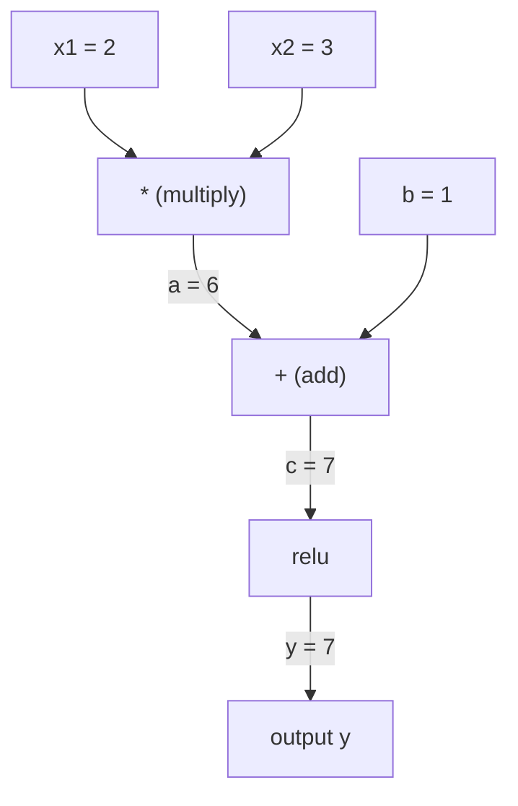
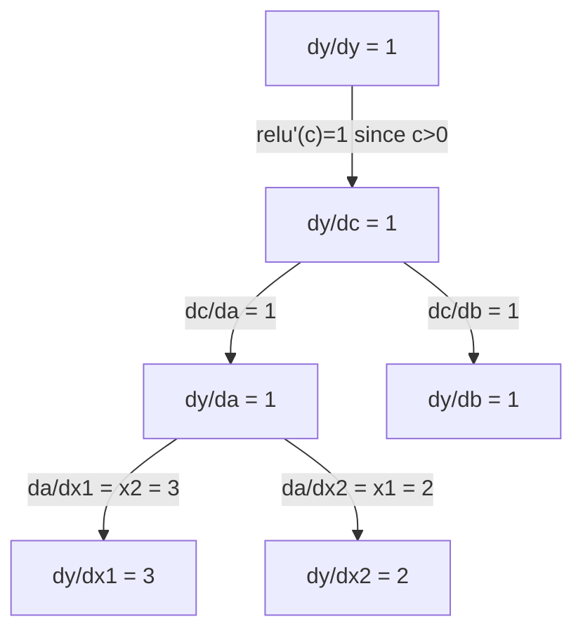

# 链式法则与自动微分

> 链式法则是每个会学习的神经网络背后的引擎。

**Type:** Build
**Language:** Python
**Prerequisites:** Phase 1, Lesson 04 (Derivatives & Gradients)
**Time:** ~90 minutes

## Learning Objectives

- 实现一个最小可用的 autograd 引擎(Value 类),记录运算、用反向模式自动微分算梯度
- 通过拓扑排序实现计算图上的前向和反向传播
- 不用任何 ML 库,只用这个 autograd 引擎建一个多层感知机,在 XOR 上训练
- 用有限差分的数值梯度做 gradient check,验证自动微分的正确性

## The Problem

你能算简单函数的导数。但神经网络不是简单函数。它是几百个函数串在一起:矩阵乘、加 bias、激活、再矩阵乘、softmax、交叉熵 loss。输出是函数的函数的函数。

要训练网络,你需要 loss 对每个权重的梯度。几百万参数手算不可能。数值法(有限差分)又太慢。

链式法则给你数学,自动微分给你算法。两者一起,让你能在一次前向传播的时间里,穿过任意复合的函数算出精确的梯度。

PyTorch、TensorFlow、JAX 都是这么干的。你要从零写一个迷你版。

## The Concept

### 链式法则

如果 `y = f(g(x))`,y 对 x 的导数是:

```
dy/dx = dy/dg * dg/dx = f'(g(x)) * g'(x)
```

沿链把导数乘起来,每一环贡献它的局部导数。

例子: `y = sin(x²)`

```
g(x) = x²        g'(x) = 2x
f(g) = sin(g)    f'(g) = cos(g)

dy/dx = cos(x²) * 2x
```

更深的复合,链就更长:

```
y = f(g(h(x)))

dy/dx = f'(g(h(x))) * g'(h(x)) * h'(x)
```

神经网络的每一层就是这条链上的一环。

### 计算图

计算图把链式法则画出来。每个运算变成一个节点。数据沿图往前流,梯度往后流。

**前向传播(算值):**



**反向传播(算梯度):**



反向传播在每个节点上施加链式法则,把梯度从输出传播到输入。

### 前向模式 vs 反向模式

两种方法用链式法则穿过一张图。

**前向模式** 从输入开始,把导数往前推。它算 `dx/dx = 1`,然后穿过每个运算传播。适合输入少、输出多的情况。

```
前向模式: 种子 dx/dx = 1,向前传

  x = 2       (dx/dx = 1)
  a = x²      (da/dx = 2x = 4)
  y = sin(a)  (dy/dx = cos(a) * da/dx = cos(4) * 4 = -2.615)
```

**反向模式** 从输出开始,把梯度往回拉。它算 `dy/dy = 1`,然后反向穿过每个运算。适合输入多、输出少的情况。

```
反向模式: 种子 dy/dy = 1,往回传

  y = sin(a)  (dy/dy = 1)
  a = x²      (dy/da = cos(a) = cos(4) = -0.654)
  x = 2       (dy/dx = dy/da * da/dx = -0.654 * 4 = -2.615)
```

神经网络有几百万个输入(权重)和一个输出(loss)。反向模式一次反向传播就算出所有梯度。这就是反向传播用反向模式的原因。

| 模式 | 种子 | 方向 | 适合 |
|------|------|-----------|-----------|
| Forward | `dx_i/dx_i = 1` | 输入到输出 | 输入少,输出多 |
| Reverse | `dy/dy = 1` | 输出到输入 | 输入多,输出少(神经网络) |

### 对偶数与前向模式

前向模式可以很漂亮地用对偶数实现。一个对偶数形如 `a + b*epsilon`,其中 `epsilon² = 0`。

```
对偶数: (值, 导数)

(2, 1) 含义: 值是 2,对 x 的导数是 1

算术规则:
  (a, a') + (b, b') = (a+b, a'+b')
  (a, a') * (b, b') = (a*b, a'*b + a*b')
  sin(a, a')         = (sin(a), cos(a)*a')
```

把输入变量种子成导数 1,导数就自动穿过每个运算传播。

### 搭一个 Autograd 引擎

一个 autograd 引擎需要三样东西:

1. **值包装。** 把每个数包成对象,存值和梯度。
2. **图记录。** 每个运算记录它的输入和局部梯度函数。
3. **反向传播。** 拓扑排序图,然后反向走,在每个节点施加链式法则。

这正是 PyTorch 的 `autograd` 干的。`torch.Tensor` 类包装值,`requires_grad=True` 时记录运算,调 `.backward()` 时算梯度。

### PyTorch Autograd 底层怎么工作

你写 PyTorch 代码时:

```python
x = torch.tensor(2.0, requires_grad=True)
y = x ** 2 + 3 * x + 1
y.backward()
print(x.grad)  # 7.0 = 2*x + 3 = 2*2 + 3
```

PyTorch 内部:

1. 为 `x` 建一个 `requires_grad=True` 的 `Tensor` 节点
2. 每个运算(`**`、`*`、`+`)建一个新节点,记录 backward 函数
3. `y.backward()` 触发反向模式自动微分穿过记录的图
4. 每个节点的 `grad_fn` 算局部梯度,传给父节点
5. 梯度通过加法(不是替换)累积到 `.grad` 属性

图是动态的(边跑边建)。每次前向传播都建一张新图。这就是 PyTorch 支持模型里用控制流(if/else、循环)的原因。

## Build It

### Step 1: Value 类

```python
class Value:
    def __init__(self, data, children=(), op=''):
        self.data = data
        self.grad = 0.0
        self._backward = lambda: None
        self._prev = set(children)
        self._op = op

    def __repr__(self):
        return f"Value(data={self.data:.4f}, grad={self.grad:.4f})"
```

每个 `Value` 存它的数值、梯度(初始 0)、一个 backward 函数,以及指向生成它的子节点的指针。

### Step 2: 算术运算 + 梯度追踪

```python
    def __add__(self, other):
        other = other if isinstance(other, Value) else Value(other)
        out = Value(self.data + other.data, (self, other), '+')
        def _backward():
            self.grad += out.grad
            other.grad += out.grad
        out._backward = _backward
        return out

    def __mul__(self, other):
        other = other if isinstance(other, Value) else Value(other)
        out = Value(self.data * other.data, (self, other), '*')
        def _backward():
            self.grad += other.data * out.grad
            other.grad += self.data * out.grad
        out._backward = _backward
        return out

    def relu(self):
        out = Value(max(0, self.data), (self,), 'relu')
        def _backward():
            self.grad += (1.0 if out.data > 0 else 0.0) * out.grad
        out._backward = _backward
        return out
```

每个运算创建一个闭包,它知道怎么算局部导数、乘以上游梯度(`out.grad`)。`+=` 处理"一个值被多个运算用到"的情况。

### Step 3: 反向传播

```python
    def backward(self):
        topo = []
        visited = set()
        def build_topo(v):
            if v not in visited:
                visited.add(v)
                for child in v._prev:
                    build_topo(child)
                topo.append(v)
        build_topo(self)

        self.grad = 1.0
        for v in reversed(topo):
            v._backward()
```

拓扑排序保证每个节点的梯度在传播到子节点前已算完。种子梯度是 1.0(dy/dy = 1)。

### Step 4: 凑齐神经网络需要的更多运算

基础的 Value 类只支持加、乘、relu。真正的 autograd 引擎需要更多。下面是建神经网络需要的所有运算:

```python
    def __neg__(self):
        return self * -1

    def __sub__(self, other):
        return self + (-other)

    def __radd__(self, other):
        return self + other

    def __rmul__(self, other):
        return self * other

    def __rsub__(self, other):
        return other + (-self)

    def __pow__(self, n):
        out = Value(self.data ** n, (self,), f'**{n}')
        def _backward():
            self.grad += n * (self.data ** (n - 1)) * out.grad
        out._backward = _backward
        return out

    def __truediv__(self, other):
        return self * (other ** -1) if isinstance(other, Value) else self * (Value(other) ** -1)

    def exp(self):
        import math
        e = math.exp(self.data)
        out = Value(e, (self,), 'exp')
        def _backward():
            self.grad += e * out.grad
        out._backward = _backward
        return out

    def log(self):
        import math
        out = Value(math.log(self.data), (self,), 'log')
        def _backward():
            self.grad += (1.0 / self.data) * out.grad
        out._backward = _backward
        return out

    def tanh(self):
        import math
        t = math.tanh(self.data)
        out = Value(t, (self,), 'tanh')
        def _backward():
            self.grad += (1 - t ** 2) * out.grad
        out._backward = _backward
        return out
```

**每个运算有什么用:**

| 运算 | 反向规则 | 用途 |
|-----------|--------------|---------|
| `__sub__` | 复用 add + neg | 算 loss(pred - target) |
| `__pow__` | n * x^(n-1) | 多项式激活、MSE(error²) |
| `__truediv__` | 复用 mul + pow(-1) | 归一化、学习率缩放 |
| `exp` | exp(x) * upstream | Softmax、对数似然 |
| `log` | (1/x) * upstream | 交叉熵 loss、对数概率 |
| `tanh` | (1 - tanh²) * upstream | 经典激活函数 |

巧妙的地方:`__sub__` 和 `__truediv__` 是用现有运算定义的。它们的梯度天生就对,因为链式法则穿过底层的 add / mul / pow 自动复合。

### Step 5: 从零搭迷你 MLP

Value 类齐了,就能建神经网络了。不用 PyTorch,不用 NumPy。只有 Value 和链式法则。

```python
import random

class Neuron:
    def __init__(self, n_inputs):
        self.w = [Value(random.uniform(-1, 1)) for _ in range(n_inputs)]
        self.b = Value(0.0)

    def __call__(self, x):
        act = sum((wi * xi for wi, xi in zip(self.w, x)), self.b)
        return act.tanh()

    def parameters(self):
        return self.w + [self.b]

class Layer:
    def __init__(self, n_inputs, n_outputs):
        self.neurons = [Neuron(n_inputs) for _ in range(n_outputs)]

    def __call__(self, x):
        return [n(x) for n in self.neurons]

    def parameters(self):
        return [p for n in self.neurons for p in n.parameters()]

class MLP:
    def __init__(self, sizes):
        self.layers = [Layer(sizes[i], sizes[i+1]) for i in range(len(sizes)-1)]

    def __call__(self, x):
        for layer in self.layers:
            x = layer(x)
        return x[0] if len(x) == 1 else x

    def parameters(self):
        return [p for layer in self.layers for p in layer.parameters()]
```

`Neuron` 算的是 `tanh(w1*x1 + w2*x2 + ... + b)`。`Layer` 是一组神经元。`MLP` 把层叠起来。每个权重都是 `Value`,调 `loss.backward()` 就能把梯度传到每个参数。

**在 XOR 上训练:**

```python
random.seed(42)
model = MLP([2, 4, 1])  # 2 输入,4 个隐藏神经元,1 个输出

xs = [[0, 0], [0, 1], [1, 0], [1, 1]]
ys = [-1, 1, 1, -1]  # XOR 模式(用 -1/1 配 tanh)

for step in range(100):
    preds = [model(x) for x in xs]
    loss = sum((p - y) ** 2 for p, y in zip(preds, ys))

    for p in model.parameters():
        p.grad = 0.0
    loss.backward()

    lr = 0.05
    for p in model.parameters():
        p.data -= lr * p.grad

    if step % 20 == 0:
        print(f"step {step:3d}  loss = {loss.data:.4f}")

print("\n训练后预测:")
for x, y in zip(xs, ys):
    print(f"  input={x}  target={y:2d}  pred={model(x).data:6.3f}")
```

这就是 micrograd。一个完整的神经网络训练循环,纯 Python,带自动微分。每个商业深度学习框架本质上都是这玩意儿的超大规模版。

### Step 6: Gradient check

你怎么知道自动微分算对了?跟数值导数比。这就是 gradient check。

```python
def gradient_check(build_expr, x_val, h=1e-7):
    x = Value(x_val)
    y = build_expr(x)
    y.backward()
    autodiff_grad = x.grad

    y_plus = build_expr(Value(x_val + h)).data
    y_minus = build_expr(Value(x_val - h)).data
    numerical_grad = (y_plus - y_minus) / (2 * h)

    diff = abs(autodiff_grad - numerical_grad)
    return autodiff_grad, numerical_grad, diff
```

跑个复杂表达式试一下:

```python
def expr(x):
    return (x ** 3 + x * 2 + 1).tanh()

ad, num, diff = gradient_check(expr, 0.5)
print(f"Autodiff:  {ad:.8f}")
print(f"Numerical: {num:.8f}")
print(f"差: {diff:.2e}")
# 差应该 < 1e-5
```

加新运算时 gradient check 必不可少。backward 有 bug,数值检查会抓到。每个严肃的深度学习实现开发时都会跑 gradient check。

**什么时候用 gradient check:**

| 场景 | 跑不跑 gradient check? |
|-----------|-------------------|
| 给 autograd 加新运算 | 一定跑 |
| 调一个不收敛的训练循环 | 跑,先查梯度 |
| 生产训练 | 不跑,太慢(每参数 2 倍前向) |
| autograd 单元测试 | 跑,自动化 |

### Step 7: 跟手算对一下

```python
x1 = Value(2.0)
x2 = Value(3.0)
a = x1 * x2          # a = 6.0
b = a + Value(1.0)    # b = 7.0
y = b.relu()          # y = 7.0

y.backward()

print(f"y = {y.data}")          # 7.0
print(f"dy/dx1 = {x1.grad}")   # 3.0 (= x2)
print(f"dy/dx2 = {x2.grad}")   # 2.0 (= x1)
```

手算: `y = relu(x1*x2 + 1)`。因为 `x1*x2 + 1 = 7 > 0`,relu 就是恒等。
`dy/dx1 = x2 = 3`,`dy/dx2 = x1 = 2`。引擎算的一样。

## Use It

### 跟 PyTorch 对一下

```python
import torch

x1 = torch.tensor(2.0, requires_grad=True)
x2 = torch.tensor(3.0, requires_grad=True)
a = x1 * x2
b = a + 1.0
y = torch.relu(b)
y.backward()

print(f"PyTorch dy/dx1 = {x1.grad.item()}")  # 3.0
print(f"PyTorch dy/dx2 = {x2.grad.item()}")  # 2.0
```

梯度一样。你这个引擎算的跟 PyTorch 一致,因为数学一样:链式法则 + 反向模式自动微分。

### 更复杂的表达式

```python
a = Value(2.0)
b = Value(-3.0)
c = Value(10.0)
f = (a * b + c).relu()  # relu(2*(-3) + 10) = relu(4) = 4

f.backward()
print(f"df/da = {a.grad}")  # -3.0 (= b)
print(f"df/db = {b.grad}")  #  2.0 (= a)
print(f"df/dc = {c.grad}")  #  1.0
```

## Ship It

本节产出:
- `outputs/skill-autodiff.md` —— 搭、调 autograd 系统的 skill
- `code/autodiff.py` —— 一个能扩展的最小 autograd 引擎

这里写的 Value 类是 Phase 3 神经网络训练循环的底子。

## Exercises

1. 给 Value 类加 `__pow__`,能算 `x ** n`。验证 `d/dx(x³)` 在 `x=2` 处等于 `12.0`。
2. 把 `tanh` 加上当激活函数。验证 `tanh'(0) = 1`,`tanh'(2) = 0.0707`(约)。
3. 给单个神经元搭一张计算图: `y = relu(w1*x1 + w2*x2 + b)`。算全部五个梯度,跟 PyTorch 对一下。
4. 用对偶数实现前向模式自动微分。建一个 `Dual` 类,验证它跟你反向模式引擎给出的导数一致。

## Key Terms

| Term | What people say | What it actually means |
|------|----------------|----------------------|
| Chain rule | "把导数乘起来" | 复合函数的导数等于每个函数局部导数的乘积,在正确的点求值 |
| Computational graph | "网络图" | 有向无环图,节点是运算,边载值(正向)或梯度(反向) |
| Forward mode | "把导数往前推" | 自动微分从输入把导数推到输出。每个输入变量要跑一次 |
| Reverse mode | "反向传播" | 自动微分从输出把梯度拉回输入。每个输出变量要跑一次 |
| Autograd | "自动算梯度" | 记录值上的运算、建图、用链式法则算精确梯度的系统 |
| Dual numbers | "值加导数" | 形如 a + b*epsilon 的数(epsilon² = 0),带着导数信息穿算术运算 |
| Topological sort | "依赖顺序" | 把图节点排成"每个节点都排在它所有依赖之后"的顺序。正确传播梯度必须 |
| Gradient accumulation | "加,别替换" | 当一个值喂给多个运算,它的梯度是所有上游贡献之和 |
| Dynamic graph | "边跑边建" | 每次前向传播重建一张计算图,允许模型里用 Python 控制流(PyTorch 风格) |
| Gradient checking | "数值验证" | 把自动微分梯度跟有限差分数值梯度比,验证正确性。调 bug 必用 |
| MLP | "多层感知机" | 带一层或多层隐藏神经元的前馈网络。每个神经元算加权和加 bias,再过激活函数 |
| Neuron | "加权和 + 激活" | 基础单元:output = activation(w1*x1 + w2*x2 + ... + b)。权重和 bias 是可学习参数 |

## Further Reading

- [3Blue1Brown: Backpropagation calculus](https://www.youtube.com/watch?v=tIeHLnjs5U8) —— 神经网络里链式法则的可视化讲解
- [PyTorch Autograd mechanics](https://pytorch.org/docs/stable/notes/autograd.html) —— 真实系统怎么工作
- [Baydin et al., Automatic Differentiation in Machine Learning: a Survey](https://arxiv.org/abs/1502.05767) —— 全面的参考
