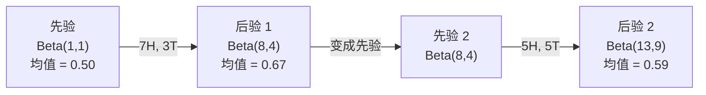

# Bayes 定理

> 概率讲的是你预期什么。Bayes 定理讲的是你学到了什么。

**Type:** Build
**Language:** Python
**Prerequisites:** Phase 1, Lesson 06 (Probability Fundamentals)
**Time:** ~75 minutes

## Learning Objectives

- 用 Bayes 定理从先验、似然、证据算出后验概率
- 从零搭一个朴素贝叶斯文本分类器,带 Laplace smoothing 和 log 空间计算
- 对比 MLE 和 MAP 估计,讲清楚 MAP 怎么对应 L2 正则化
- 用 Beta-Binomial 共轭先验实现 A/B 测试的序贯贝叶斯更新

## The Problem

一个医疗测试 99% 准。你测出来阳性。你真有病的概率多大?

多数人答 99%。真实答案取决于这病有多罕见。如果 1 万人里才有 1 个,阳性的结果里你只有大约 1% 概率是真有病。剩下 99% 阳性都是健康人误报。

这不是脑筋急转弯,就是 Bayes 定理。每个垃圾邮件过滤、每个医疗诊断、每个量化不确定性的 ML 模型都在用这套推理。你先有个信念,看到证据,更新。

做 ML 系统不懂这个,你会误读模型输出、定错阈值、上线一堆过度自信的预测。

## The Concept

### 从联合概率到 Bayes

Lesson 06 你已经学过条件概率:

```
P(A|B) = P(A 且 B) / P(B)
```

对称地:

```
P(B|A) = P(A 且 B) / P(A)
```

两个式子共享同一个分子 P(A 且 B)。让它俩相等再整理一下:

```
P(A 且 B) = P(A|B) * P(B) = P(B|A) * P(A)

因此:

P(A|B) = P(B|A) * P(A) / P(B)
```

这就是 Bayes 定理。四个量,一个等式。

### 四个部分

| 部分 | 名字 | 含义 |
|------|------|------|
| P(A\|B) | 后验 | 看到证据 B 后你对 A 的更新信念 |
| P(B\|A) | 似然 | 如果 A 为真,证据 B 有多大概率 |
| P(A) | 先验 | 看到任何证据前你对 A 的信念 |
| P(B) | 证据 | 在所有可能下,看到 B 的总概率 |

证据项 P(B) 起归一化作用。用全概率公式展开:

```
P(B) = P(B|A) * P(A) + P(B|not A) * P(not A)
```

### 医疗测试例子

一种病影响 1/10000 的人。测试 99% 准(抓 99% 真病人,1% 假阳性)。

```
P(病)              = 0.0001     (先验: 病很罕见)
P(阳性|病)         = 0.99       (似然: 测试能抓住)
P(阳性|健康)       = 0.01       (假阳性率)

P(阳性) = P(阳性|病) * P(病) + P(阳性|健康) * P(健康)
         = 0.99 * 0.0001 + 0.01 * 0.9999
         = 0.000099 + 0.009999
         = 0.010098

P(病|阳性) = P(阳性|病) * P(病) / P(阳性)
            = 0.99 * 0.0001 / 0.010098
            = 0.0098
            = 0.98%
```

不到 1%。先验压过了一切。病情罕见时,再准的测试出来的阳性也大多是假阳性。这就是为啥医生要开复查。

### 垃圾邮件例子

你收到一封含 "lottery" 的邮件。是垃圾邮件吗?

```
P(垃圾)                  = 0.3      (30% 邮件是垃圾)
P("lottery"|垃圾)        = 0.05     (5% 垃圾邮件含 "lottery")
P("lottery"|非垃圾)      = 0.001    (0.1% 正常邮件含 "lottery")

P("lottery") = 0.05 * 0.3 + 0.001 * 0.7
             = 0.015 + 0.0007
             = 0.0157

P(垃圾|"lottery") = 0.05 * 0.3 / 0.0157
                  = 0.955
                  = 95.5%
```

一个词把概率从 30% 拉到 95.5%。真垃圾过滤器同时跨几百个词跑 Bayes。

### 朴素贝叶斯:独立性假设

朴素贝叶斯把它扩展到多特征,假设"给定类别时,所有特征条件独立":

```
P(类别 | 特征_1, 特征_2, ..., 特征_n)
  = P(类别) * P(特征_1|类别) * P(特征_2|类别) * ... * P(特征_n|类别)
    / P(特征_1, 特征_2, ..., 特征_n)
```

"朴素"的部分就是这个独立性假设。文本里词的出现不真独立("New" 和 "York" 相关)。但这个假设实际用着效果不错,因为分类器只需要给类别排序,不需要给校准过的概率。

因为分母对所有类别都一样,你可以直接跳过它,只比分子:

```
score(类别) = P(类别) * 连乘 P(特征_i | 类别)
```

选 score 最高的类别。

### 最大似然估计(MLE)

怎么从训练数据得到 P(特征|类别)?数。

```
P("free"|垃圾) = (含 "free" 的垃圾邮件数) / (垃圾邮件总数)
```

这就是 MLE: 选让观测数据"最可能"的参数值。你在最大化似然函数,对离散计数来说就是相对频率。

问题: 如果训练时某个词在垃圾邮件里从没出现,MLE 给它概率 0。一个没见过的词就杀掉整条连乘。用 Laplace smoothing 修:

```
P(词|类别) = (count(词, 类别) + 1) / (类别总词数 + 词表大小)
```

每个 count 加 1,确保没概率会是 0。

### 最大后验估计(MAP)

MLE 在问:什么参数让 P(数据|参数) 最大?
MAP 在问:什么参数让 P(参数|数据) 最大?

按 Bayes 定理:

```
P(参数|数据) 正比于 P(数据|参数) * P(参数)
```

MAP 给参数本身加了个先验。如果你觉得参数应该小,就编码一个惩罚大值的先验。这跟 ML 的 L2 正则化是一回事。岭回归里的"岭"惩罚字面上就是权重的高斯先验。

| 估计 | 优化 | ML 对应 |
|------------|-----------|---------------|
| MLE | P(数据\|参数) | 无正则训练 |
| MAP | P(数据\|参数) * P(参数) | L2 / L1 正则化 |

### 贝叶斯 vs 频率派:实际差异

频率派把参数当成固定的未知数。他们问:"如果我重做这个实验很多次,会怎样?"

贝叶斯派把参数当成分布。他们问:"看到我观测到的之后,我对参数怎么想?"

做 ML 系统,实际差异是:

| 维度 | 频率派 | 贝叶斯 |
|--------|-------------|----------|
| 输出 | 点估计 | 值的分布 |
| 不确定性 | 置信区间(关于流程) | 可信区间(关于参数) |
| 小数据 | 会过拟合 | 先验起正则化作用 |
| 计算 | 通常更快 | 经常要采样(MCMC) |

大部分生产 ML 是频率派的(SGD、点估计)。贝叶斯方法在需要校准过的不确定性(医疗决策、安全关键系统)或数据稀缺(少样本学习、冷启动)时才发光。

### 贝叶斯思维对 ML 为啥重要

联系比类比深得多:

**先验就是正则化。** 权重的高斯先验就是 L2 正则化。Laplace 先验就是 L1。每次你加正则项,都是在做一个关于"你预期参数值"的贝叶斯声明。

**后验就是不确定性。** 单个预测概率完全不能告诉你模型对这个估计有多自信。贝叶斯方法给你一个分布:"我觉得 P(垃圾) 在 0.8 到 0.95 之间。"

**Bayes 更新是在线学习。** 今日的后验变成明日的先验。模型看到新数据时,逐步更新信念,而不是从头重训。

**模型比较是贝叶斯的。** BIC、边缘似然、Bayes factor,这些都用贝叶斯推理做模型选择,还不容易过拟合。

## Build It

### Step 1: Bayes 定理函数

```python
def bayes(prior, likelihood, false_positive_rate):
    evidence = likelihood * prior + false_positive_rate * (1 - prior)
    posterior = likelihood * prior / evidence
    return posterior

result = bayes(prior=0.0001, likelihood=0.99, false_positive_rate=0.01)
print(f"P(病|阳性) = {result:.4f}")
```

### Step 2: 朴素贝叶斯分类器

```python
import math
from collections import defaultdict

class NaiveBayes:
    def __init__(self, smoothing=1.0):
        self.smoothing = smoothing
        self.class_counts = defaultdict(int)
        self.word_counts = defaultdict(lambda: defaultdict(int))
        self.class_word_totals = defaultdict(int)
        self.vocab = set()

    def train(self, documents, labels):
        for doc, label in zip(documents, labels):
            self.class_counts[label] += 1
            words = doc.lower().split()
            for word in words:
                self.word_counts[label][word] += 1
                self.class_word_totals[label] += 1
                self.vocab.add(word)

    def predict(self, document):
        words = document.lower().split()
        total_docs = sum(self.class_counts.values())
        vocab_size = len(self.vocab)
        best_class = None
        best_score = float("-inf")
        for cls in self.class_counts:
            score = math.log(self.class_counts[cls] / total_docs)
            for word in words:
                count = self.word_counts[cls].get(word, 0)
                total = self.class_word_totals[cls]
                score += math.log((count + self.smoothing) / (total + self.smoothing * vocab_size))
            if score > best_score:
                best_score = score
                best_class = cls
        return best_class
```

对数概率防止下溢。很多小概率乘起来太小,浮点数表示不了。把对数概率加起来既数值稳定又数学等价。

### Step 3: 在垃圾邮件数据上训练

```python
train_docs = [
    "win free money now",
    "free lottery ticket winner",
    "claim your prize today free",
    "urgent offer free cash",
    "congratulations you won free",
    "meeting tomorrow at noon",
    "project update attached",
    "can we schedule a call",
    "quarterly report review",
    "lunch on thursday sounds good",
    "team standup notes attached",
    "please review the pull request",
]

train_labels = [
    "spam", "spam", "spam", "spam", "spam",
    "ham", "ham", "ham", "ham", "ham", "ham", "ham",
]

classifier = NaiveBayes()
classifier.train(train_docs, train_labels)

test_messages = [
    "free money waiting for you",
    "meeting rescheduled to friday",
    "you won a free prize",
    "please review the attached report",
]

for msg in test_messages:
    print(f"  '{msg}' -> {classifier.predict(msg)}")
```

### Step 4: 看看学到的概率

```python
def show_top_words(classifier, cls, n=5):
    vocab_size = len(classifier.vocab)
    total = classifier.class_word_totals[cls]
    probs = {}
    for word in classifier.vocab:
        count = classifier.word_counts[cls].get(word, 0)
        probs[word] = (count + classifier.smoothing) / (total + self.smoothing * vocab_size)
    sorted_words = sorted(probs.items(), key=lambda x: x[1], reverse=True)
    for word, prob in sorted_words[:n]:
        print(f"    {word}: {prob:.4f}")

print("\nTop spam words:")
show_top_words(classifier, "spam")
print("\nTop ham words:")
show_top_words(classifier, "ham")
```

## Use It

Scikit-learn 自带生产可用的朴素贝叶斯实现:

```python
from sklearn.feature_extraction.text import CountVectorizer
from sklearn.naive_bayes import MultinomialNB
from sklearn.metrics import classification_report

vectorizer = CountVectorizer()
X_train = vectorizer.fit_transform(train_docs)
clf = MultinomialNB()
clf.fit(X_train, train_labels)

X_test = vectorizer.transform(test_messages)
predictions = clf.predict(X_test)
for msg, pred in zip(test_messages, predictions):
    print(f"  '{msg}' -> {pred}")
```

同一个算法。CountVectorizer 负责分词和建词表。MultinomialNB 内部处理 smoothing 和对数概率。你从零写的版本 40 行干了同样的事。

## Ship It

这个 NaiveBayes 类展示了完整流水线: 分词、带 Laplace smoothing 的概率估计、log 空间预测。`code/bayes.py` 里的代码端到端可跑,除了 Python 标准库啥都不用。

### 共轭先验

当先验和后验属于同一族分布,这个先验就叫"共轭"。这让贝叶斯更新在代数上很干净 —— 你直接得到闭式后验,不用数值积分。

| 似然 | 共轭先验 | 后验 | 例子 |
|-----------|----------------|-----------|---------|
| Bernoulli | Beta(a, b) | Beta(a + 成功, b + 失败) | 硬币正面概率估计 |
| Normal(已知方差) | Normal(μ₀, σ₀) | Normal(加权均值,更小方差) | 传感器校准 |
| Poisson | Gamma(a, b) | Gamma(a + 计数总和, b + n) | 建模到达率 |
| Multinomial | Dirichlet(α) | Dirichlet(α + 计数) | 主题模型、语言模型 |

为啥要紧: 没共轭先验,你得用蒙特卡洛采样或变分推断来近似后验。有了共轭先验,你只要更新两个数。

Beta 分布是实际最常用的共轭先验。Beta(a, b) 代表你对一个概率参数的信念。均值是 a/(a+b)。a+b 越大,分布越集中(越自信)。

Beta 先验的特殊情况:
- Beta(1, 1) = 均匀分布。你对参数没意见。
- Beta(10, 10) = 峰在 0.5。你强烈相信参数接近 0.5。
- Beta(1, 10) = 偏向 0。你相信参数小。

更新规则简单到死:

```
先验:     Beta(a, b)
数据:      s 成功, f 失败
后验:     Beta(a + s, b + f)
```

没有积分,没有采样,只做加法。

### 序贯贝叶斯更新

贝叶斯推断天然是序贯的。今天的后验变成明天的先验。真实系统就这么增量学习,不用重处理全部历史数据。

具体例子: 估计硬币是否公平。

**第 1 天: 没数据。**
从 Beta(1, 1) 起步 —— 均匀先验,你没意见。
- 先验均值: 0.5
- 先验在 [0, 1] 上是平的

**第 2 天: 看到 7 正 3 反。**
后验 = Beta(1 + 7, 1 + 3) = Beta(8, 4)
- 后验均值: 8/12 = 0.667
- 证据说明硬币偏向正面

**第 3 天: 又看到 5 正 5 反。**
用昨天的后验当今天的先验。
后验 = Beta(8 + 5, 4 + 5) = Beta(13, 9)
- 后验均值: 13/22 = 0.591
- 平衡的新数据把估计拉回 0.5



观测顺序无所谓。Beta(1,1) 一次性用全部 12 正 8 反更新得到 Beta(13,9) —— 结果一样。序贯更新和批量更新在数学上等价。但序贯更新让你每步都能做决策,不用存原始数据。

这是生产 ML 系统在线学习的基础。bandit 问题的 Thompson sampling、增量推荐系统、流式异常检测,都用的这个套路。

### 跟 A/B 测试的联系

A/B 测试就是披了外衣的贝叶斯推断。

设置: 你在测两个按钮颜色。变体 A(蓝)和 B(绿)。想知道哪个点击率高。

贝叶斯 A/B 测试:

1. **先验。** 两个变体都从 Beta(1, 1) 开始。没偏好。
2. **数据。** A: 1000 次曝光 50 次点击。B: 1000 次曝光 65 次点击。
3. **后验。**
   - A: Beta(1 + 50, 1 + 950) = Beta(51, 951)。均值 = 0.051
   - B: Beta(1 + 65, 1 + 935) = Beta(66, 936)。均值 = 0.066
4. **决策。** 算 P(B > A) —— B 的真实转化率比 A 高的概率。

解析算 P(B > A) 难。但蒙特卡洛让它变得简单:

```
1. 从 Beta(51, 951) 抽 100,000 个样本  -> samples_A
2. 从 Beta(66, 936) 抽 100,000 个样本  -> samples_B
3. P(B > A) = B > A 的样本比例
```

如果 P(B > A) > 0.95,上线 B。0.05 到 0.95 之间继续收数据。< 0.05,上线 A。

比频率派 A/B 测试好的地方:
- 直接给概率陈述:"B 更好有 97% 的概率"
- 不用纠结 p 值。不用"没拒绝原假设"这种含糊话
- 任何时候查结果都不会抬升假阳性率(没有"偷看"问题)
- 可以融入先验知识(比如之前测试说明转化率一般 3-8%)

| 维度 | 频率派 A/B | 贝叶斯 A/B |
|--------|----------------|--------------|
| 输出 | p 值 | P(B > A) |
| 解释 | "如果 A=B,数据有多意外?" | "B 比 A 好的概率多大?" |
| 早停 | 抬高假阳性 | 任何时候都安全(先验合理 + 模型正确) |
| 先验知识 | 不用 | 用 Beta 先验编码 |
| 决策规则 | p < 0.05 | P(B > A) > 阈值 |

## Exercises

1. **多次测试。** 一个病人在两个独立测试上都阳性(两个都 99% 准,患病率 1/10000)。两次测试后 P(病) 是多少?把第一次的后验当第二次的先验。
2. **Smoothing 影响。** 用 smoothing = 0.01、0.1、1.0、10.0 跑垃圾邮件分类器。top 词概率怎么变?smoothing = 0 时,一个只出现在 ham 里的词会怎样?
3. **加特征。** 扩展 NaiveBayes 类,把消息长度(短/长)当特征和词频一起用。从训练数据估 P(短|垃圾) 和 P(短|ham),塞到预测 score 里。
4. **手算 MAP。** 给了 10 次掷硬币 7 次正面,用 Beta(2,2) 先验算 bias 的 MAP 估计。跟 MLE 估计 7/10 对比。

## Key Terms

| Term | What people say | What it actually means |
|------|----------------|----------------------|
| Prior | "我的初始猜测" | 看到证据前的 P(假设)。ML 里: 正则项。 |
| Likelihood | "数据有多贴" | P(证据\|假设)。观测数据在某个假设下有多大概率。 |
| Posterior | "我更新后的信念" | P(假设\|证据)。先验乘似然再归一化。 |
| Evidence | "归一化常数" | 跨所有假设的 P(数据)。保证后验加起来等于 1。 |
| Naive Bayes | "那个简单的文本分类器" | 假设"给定类别时特征独立"的分类器。假设是假的,但实际效果不错。 |
| Laplace smoothing | "加 1 smoothing" | 给每个特征加一个小 count,防止未观测数据出现 0 概率。 |
| MLE | "就用频率" | 选让 P(数据\|参数) 最大的参数。没先验。小数据会过拟合。 |
| MAP | "带先验的 MLE" | 选让 P(数据\|参数) * P(参数) 最大的参数。等于带正则的 MLE。 |
| Log-probability | "在 log 空间算" | 用 log(P) 代替 P,避免很多小数相乘时下溢。 |
| False positive | "虚警" | 测试说阳性,但真实是阴性。基础率谬误的根源。 |

## Further Reading

- [3Blue1Brown: Bayes' theorem](https://www.youtube.com/watch?v=HZGCoVF3YvM) - 用医疗测试例子的可视化讲解
- [Stanford CS229: Generative Learning Algorithms](https://cs229.stanford.edu/notes2022fall/cs229-notes2.pdf) - 朴素贝叶斯和判别模型的联系
- [Think Bayes](https://greenteapress.com/wp/think-bayes/) - 免费书,Python 贝叶斯统计
- [scikit-learn Naive Bayes](https://scikit.org/stable/modules/naive_bayes.html) - 生产实现和每个变体什么时候用
