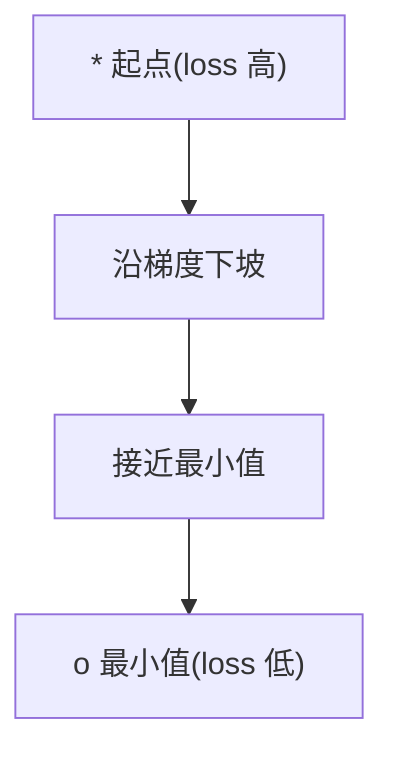
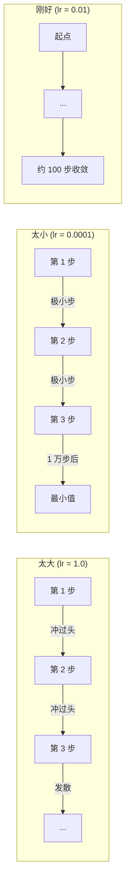
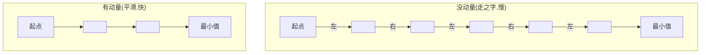
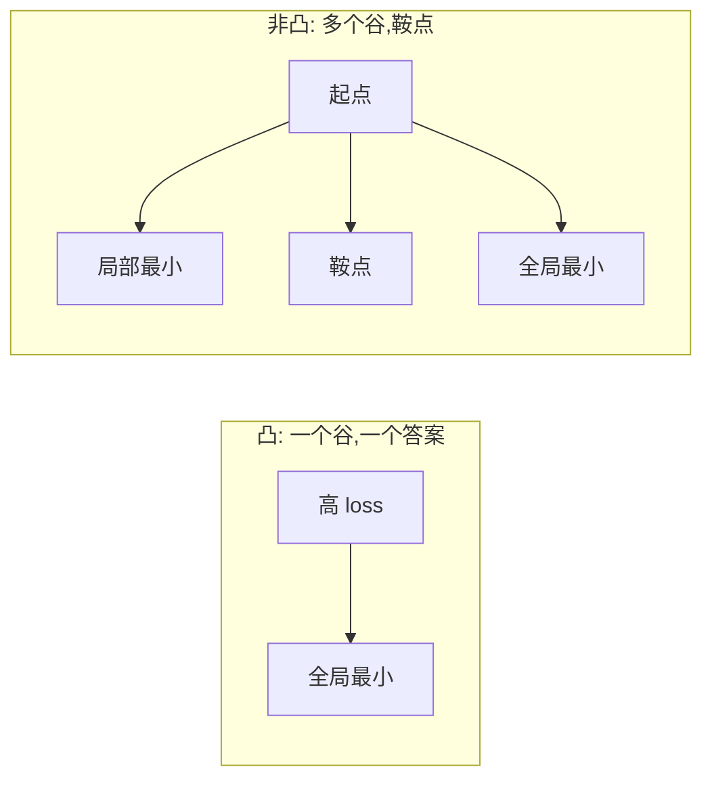
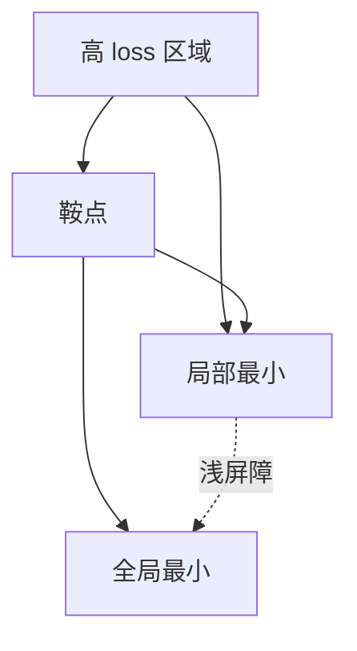

# 优化

> 训练神经网络,本质上就是找一个山谷的谷底。

**Type:** Build
**Language:** Python
**Prerequisites:** Phase 1, Lessons 04-05 (Derivatives, Gradients)
**Time:** ~75 minutes

## Learning Objectives

- 从零实现 vanilla 梯度下降、带动量的 SGD、Adam
- 在 Rosenbrock 函数上对比优化器收敛,讲清楚 Adam 为啥要给每个权重自适应学习率
- 区分凸和非凸 loss 地形,解释高维空间里鞍点的角色
- 配置学习率调度(阶跃衰减、余弦退火、warmup)让训练更稳

## The Problem

你有个 loss 函数。它告诉你模型错得有多离谱。你有梯度。它们告诉你"哪边会让 loss 更大"。现在你需要一个"下坡"的策略。

天真的做法很简单:沿梯度的反方向走。步长乘一个叫学习率的数。重复。这就是梯度下降,有用。但"有用"有点说法。学习率太大,你直接冲过谷底,两边来回弹;太小,你几千步才挪到答案。撞上鞍点,你就不动了,虽然还没找到最小值。

深度学习里每个优化器都在回答同一个问题:怎么又快又稳地走到谷底?

## The Concept

### 优化是什么意思

优化是找让函数最小(或最大)的输入值。ML 里,函数就是 loss,输入是模型的权重。训练就是优化。

```
最小化 L(w),其中:
  L = loss 函数
  w = 模型权重(可能几百万参数)
```

### 梯度下降(vanilla)

最简单的优化器。算 loss 对每个权重的梯度。把每个权重沿梯度反方向挪一步。步长乘学习率。

```
w = w - lr * gradient
```

整个算法一行完事。



### 学习率:最重要的超参数

学习率控制步长。它决定收敛的一切。



没有公式能算"正确的学习率"。靠实验找。常见起点:Adam 用 0.001,SGD + momentum 用 0.01。

### SGD vs Batch vs Mini-batch

Vanilla 梯度下降用整个数据集算一次梯度才走一步。这叫 batch 梯度下降。稳但慢。

随机梯度下降(SGD)用单条随机样本算梯度就立刻走一步。噪声大但快。

Mini-batch 梯度下降是中间路线。用一个小批次(32、64、128、256 个样本)算梯度,然后走一步。大家都这么干。

| 变体 | Batch size | 梯度质量 | 步速 | 噪声 |
|---------|-----------|-----------------|---------------|-------|
| Batch GD | 整个数据集 | 精确 | 慢 | 无 |
| SGD | 1 个样本 | 很吵 | 快 | 高 |
| Mini-batch | 32-256 | 好的估计 | 平衡 | 中 |

SGD 和 mini-batch 的噪声不是 bug。它帮你逃出浅的局部最小和鞍点。

### 动量:下坡的球

Vanilla 梯度下降只看当前梯度。如果梯度走之字形(窄谷里常见),前进就慢。动量把过去的梯度攒成一个速度项,修这个问题。

```
v = beta * v + gradient
w = w - lr * v
```

类比: 下坡的球。它不会每个小坑都停下重起步。它在一致的方向上加速,在震荡方向上抑制。



`beta`(通常 0.9)控制"保留多少历史"。beta 越大,动量越大,路径越平滑,但方向变化响应越慢。

### Adam:自适应学习率

不同权重需要不同学习率。很少收到大梯度的权重,终于收到时应该迈大步。总是收大梯度的权重应该迈小步。

Adam(Adaptive Moment Estimation)给每个权重跟踪两样东西:

1. 一阶矩 m:梯度的运行平均(像动量)
2. 二阶矩 v:梯度平方的运行平均(梯度幅度)

```
m = beta1 * m + (1 - beta1) * gradient
v = beta2 * v + (1 - beta2) * gradient²

m_hat = m / (1 - beta1^t)    偏差修正
v_hat = v / (1 - beta2^t)    偏差修正

w = w - lr * m_hat / (sqrt(v_hat) + epsilon)
```

除以 `sqrt(v_hat)` 是关键洞见。梯度大的权重被一个大数除(实际步长小)。梯度小的权重被一个小数除(实际步长大)。每个权重拿到自己的自适应学习率。

默认超参: `lr=0.001, beta1=0.9, beta2=0.999, epsilon=1e-8`。这些默认在大多数问题上表现都不错。

### 学习率调度

固定学习率是折中。训练初期你想大步快进,后期你想小步精修。

常见调度:

| 调度 | 公式 | 用途 |
|----------|---------|----------|
| 阶跃衰减 | 每 N 个 epoch lr = lr * factor | 简单,手工控制 |
| 指数衰减 | lr = lr_0 * decay^t | 平滑减小 |
| 余弦退火 | lr = lr_min + 0.5 * (lr_max - lr_min) * (1 + cos(πt/T)) | Transformer、现代训练 |
| Warmup + 衰减 | 线性升,再衰减 | 大模型,防早期不稳定 |

### 凸 vs 非凸

凸函数只有一个最小值。梯度下降一定找得到。`f(x) = x²` 这种二次函数就是凸的。

神经网络 loss 函数是非凸的。它们有很多局部最小、鞍点、平台。



实际中,高维神经网络的局部最小很少是问题。大部分局部最小的 loss 值都接近全局最小。鞍点(有些方向平、有些方向曲)才是真正的障碍。动量和 mini-batch 的噪声帮你逃出鞍点。

### Loss landscape 可视化

loss 是所有权重的函数。100 万权重的模型,loss landscape 活在 1000001 维空间里。我们可视化的时候挑两个随机方向,把 loss 沿那两个方向画出来,得到一张 2D 曲面。



尖锐的最小泛化差。平坦的最小泛化好。这是 SGD + 动量常常在最终测试准确率上击败 Adam 的原因之一:它的噪声让你不陷入尖锐的最小。

## Build It

### Step 1: 定义测试函数

Rosenbrock 函数是经典的优化基准。最小值在 (1, 1),藏在一个窄弯谷里,容易发现但难跟随。

```
f(x, y) = (1 - x)² + 100 * (y - x²)²
```

```python
def rosenbrock(params):
    x, y = params
    return (1 - x) ** 2 + 100 * (y - x ** 2) ** 2

def rosenbrock_gradient(params):
    x, y = params
    df_dx = -2 * (1 - x) + 200 * (y - x ** 2) * (-2 * x)
    df_dy = 200 * (y - x ** 2)
    return [df_dx, df_dy]
```

### Step 2: Vanilla 梯度下降

```python
class GradientDescent:
    def __init__(self, lr=0.001):
        self.lr = lr

    def step(self, params, grads):
        return [p - self.lr * g for p, g in zip(params, grads)]
```

### Step 3: SGD with momentum

```python
class SGDMomentum:
    def __init__(self, lr=0.001, momentum=0.9):
        self.lr = lr
        self.momentum = momentum
        self.velocity = None

    def step(self, params, grads):
        if self.velocity is None:
            self.velocity = [0.0] * len(params)
        self.velocity = [
            self.momentum * v + g
            for v, g in zip(self.velocity, grads)
        ]
        return [p - self.lr * v for p, v in zip(params, self.velocity)]
```

### Step 4: Adam

```python
class Adam:
    def __init__(self, lr=0.001, beta1=0.9, beta2=0.999, epsilon=1e-8):
        self.lr = lr
        self.beta1 = beta1
        self.beta2 = beta2
        self.epsilon = epsilon
        self.m = None
        self.v = None
        self.t = 0

    def step(self, params, grads):
        if self.m is None:
            self.m = [0.0] * len(params)
            self.v = [0.0] * len(params)

        self.t += 1

        self.m = [
            self.beta1 * m + (1 - self.beta1) * g
            for m, g in zip(self.m, grads)
        ]
        self.v = [
            self.beta2 * v + (1 - self.beta2) * g ** 2
            for v, g in zip(self.v, grads)
        ]

        m_hat = [m / (1 - self.beta1 ** self.t) for m in self.m]
        v_hat = [v / (1 - self.beta2 ** self.t) for v in self.v]

        return [
            p - self.lr * mh / (vh ** 0.5 + self.epsilon)
            for p, mh, vh in zip(params, m_hat, v_hat)
        ]
```

### Step 5: 跑起来对比

```python
def optimize(optimizer, func, grad_func, start, steps=5000):
    params = list(start)
    history = [params[:]]
    for _ in range(steps):
        grads = grad_func(params)
        params = optimizer.step(params, grads)
        history.append(params[:])
    return history

start = [-1.0, 1.0]

gd_history = optimize(GradientDescent(lr=0.0005), rosenbrock, rosenbrock_gradient, start)
sgd_history = optimize(SGDMomentum(lr=0.0001, momentum=0.9), rosenbrock, rosenbrock_gradient, start)
adam_history = optimize(Adam(lr=0.01), rosenbrock, rosenbrock_gradient, start)

for name, history in [("GD", gd_history), ("SGD+M", sgd_history), ("Adam", adam_history)]:
    final = history[-1]
    loss = rosenbrock(final)
    print(f"{name:6s} -> x={final[0]:.6f}, y={final[1]:.6f}, loss={loss:.8f}")
```

预期: Adam 收敛最快。SGD + 动量路径更平滑。Vanilla GD 在窄谷里慢慢磨。

## Use It

实际中,直接用 PyTorch 或 JAX 的优化器。它们处理参数组、weight decay、梯度裁剪、GPU 加速。

```python
import torch

model = torch.nn.Linear(784, 10)

sgd = torch.optim.SGD(model.parameters(), lr=0.01, momentum=0.9)
adam = torch.optim.Adam(model.parameters(), lr=0.001)
adamw = torch.optim.AdamW(model.parameters(), lr=0.001, weight_decay=0.01)

scheduler = torch.optim.lr_scheduler.CosineAnnealingLR(adam, T_max=100)
```

经验法则:

- 默认 Adam(lr=0.001)。大多数问题不用调就能用。
- 要最好的最终准确率、又能花时间调,切到 SGD + 动量(lr=0.01, momentum=0.9)。
- 训 transformer 用 AdamW(Adam 配解耦的 weight decay)。
- 训练超过几个 epoch 一定要用学习率调度。
- 训练不稳定就降学习率。训练太慢就升。

## Ship It

本节产出 `outputs/prompt-optimizer-guide.md`,选优化器的 prompt。

这里写的优化器类在 Phase 3 从零训练神经网络时会再出现。

## Exercises

1. **学习率扫描。** 用学习率 [0.0001, 0.0005, 0.001, 0.005, 0.01] 在 Rosenbrock 上跑 vanilla 梯度下降。把每组的最终 loss(5000 步后)打出来或画出来。找最大的"还能收敛"的学习率。
2. **动量对比。** 用动量 [0.0, 0.5, 0.9, 0.99] 在 Rosenbrock 上跑 SGD。记每步的 loss。哪个动量收敛最快?哪个冲过头?
3. **逃出鞍点。** 定义 `f(x, y) = x² - y²`(原点是鞍点)。从 (0.01, 0.01) 出发。对比 vanilla GD、SGD + 动量、Adam 的行为。哪个能逃出鞍点?
4. **实现学习率衰减。** 给 GradientDescent 加指数衰减: `lr = lr_0 * 0.999^step`。在 Rosenbrock 上对比有/无衰减的收敛。

## Key Terms

| Term | What people say | What it actually means |
|------|----------------|----------------------|
| Gradient descent | "下坡" | 用梯度乘学习率更新权重。最基本的优化器。 |
| Learning rate | "步长" | 标量,控制每步更新走多远。太大发散,太小浪费算力。 |
| Momentum | "持续滚" | 把过去梯度累成速度向量。抑制震荡,在一致方向上加速。 |
| SGD | "随机采样" | 随机梯度下降。用随机子集而不是全数据集算梯度。实际中几乎都是 mini-batch SGD。 |
| Mini-batch | "一块数据" | 一小批训练数据(32-256 个样本),用来估梯度。平衡速度和梯度精度。 |
| Adam | "默认优化器" | Adaptive Moment Estimation。跟踪每个权重的梯度及梯度平方的运行平均,给每个权重自己的学习率。 |
| Bias correction | "修冷启动" | Adam 的一阶、二阶矩初始化为 0。偏差修正除以 (1 - beta^t) 来补偿早期。 |
| Learning rate schedule | "随时间改 lr" | 训练期间调整学习率的函数。早期大步,后期小步。 |
| Convex function | "一个谷" | 任意局部最小都是全局最小的函数。梯度下降一定能找到。神经网络 loss 不凸。 |
| Saddle point | "平但不是最小" | 梯度为 0 的点,但某些方向最小、某些方向最大。高维常见。 |
| Loss landscape | "地形" | 权重空间上画的 loss 函数。沿两个随机方向切一片画出来。 |
| Convergence | "到地方了" | 优化器走到了 loss 不再明显下降的点。 |

## Further Reading

- [Sebastian Ruder: An overview of gradient descent optimization algorithms](https://ruder.io/optimizing-gradient-descent/) - 所有主流优化器的综合调研
- [Why Momentum Really Works (Distill)](https://distill.pub/2017/momentum/) - 动量动态的可交互可视化
- [Adam: A Method for Stochastic Optimization (Kingma & Ba, 2014)](https://arxiv.org/abs/1412.6980) - Adam 原论文,好读
- [Visualizing the Loss Landscape of Neural Nets (Li et al., 2018)](https://arxiv.org/abs/1712.09913) - 尖最小 vs 平最小那篇
