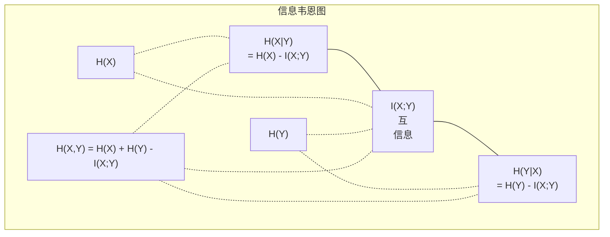

# 信息论

> 信息论衡量"意外"。Loss 函数就是它搭起来的。

**Type:** Learn
**Language:** Python
**Prerequisites:** Phase 1, Lesson 06 (Probability)
**Time:** ~60 minutes

## Learning Objectives

- 从零算熵、交叉熵、KL 散度,讲清楚它们的关系
- 推导为什么最小化交叉熵 loss 等价于最大化对数似然
- 算特征和目标之间的互信息,给特征重要性排个序
- 解释困惑度:语言模型"实际上在从多大词表里挑"的一个数

## The Problem

每个分类模型你都调 `CrossEntropyLoss()`。每篇语言模型论文都看到"困惑度"。VAE、蒸馏、RLHF 里都出现 KL 散度。这些不是互不相关的概念,都是同一个想法换不同帽子。

信息论给你一套语言,讲清楚不确定性、压缩、预测。Claude Shannon 1948 年为了解决通信问题发明了它。结果发现,训神经网络就是个通信问题: 模型在试着用一堆学到的权重(噪声信道)把正确标签传过去。

这节课从零写每个公式,让你看到它们从哪来、为啥有效。

## The Concept

### 信息量(意外)

越不可能的事,信息越多。硬币正面?不意外。中彩票?非常意外。

概率 p 的事件的信息量:

```
I(x) = -log(p(x))
```

以 2 为底得 bit。以 e 为底得 nat。同一个想法,不同单位。

```
事件              概率     意外(bit)
公平硬币出正面    0.5      1.0
掷出 6            0.167    2.58
千分之一事件      0.001    9.97
必然事件          1.0      0.0
```

必然事件带 0 信息。你已经知道它会发生。

### 熵(平均意外)

熵是分布所有可能结果的期望意外。

```
H(P) = -Σ p(x) * log(p(x)),对所有 x
```

公平硬币对一个二值变量有最大熵: 1 bit。偏置硬币(99% 正面)熵低: 0.08 bit。你已经知道会怎样,每次掷几乎不告诉你啥。

```
公平硬币:   H = -(0.5*log₂0.5 + 0.5*log₂0.5) = 1.0 bit
偏置硬币:   H = -(0.99*log₂0.99 + 0.01*log₂0.01) = 0.08 bit
```

熵衡量分布里"无法再压"的不确定性。没法压到比它更短。

### 交叉熵(你天天用的 loss)

交叉熵衡量"用分布 Q 编码实际来自 P 的事件"的平均意外。

```
H(P, Q) = -Σ p(x) * log(q(x)),对所有 x
```

P 是真实分布(标签),Q 是你的模型预测。如果 Q 完美匹配 P,交叉熵等于熵。任何不匹配都让它变大。

分类里 P 是 one-hot 向量(真类概率 1,其他 0)。这把交叉熵简化成:

```
H(P, Q) = -log(q(true_class))
```

这就是分类的整个交叉熵 loss 公式。最大化正确类的预测概率。

### KL 散度(分布之间的距离)

KL 散度衡量"用 Q 而不是 P,多浪费了多少意外"。

```
D_KL(P || Q) = Σ p(x) * log(p(x) / q(x)),对所有 x
             = H(P, Q) - H(P)
```

交叉熵 = 熵 + KL 散度。训练中真实分布的熵是常数,所以最小化交叉熵 = 最小化 KL 散度。你在把模型的分布推向真实分布。

KL 散度不对称: D_KL(P || Q) ≠ D_KL(Q || P)。不是真正的距离。

### 互信息

互信息衡量"知道一个变量能告诉你多少另一个"。

```
I(X; Y) = H(X) - H(X|Y)
        = H(X) + H(Y) - H(X, Y)
```

X、Y 独立时,互信息为 0。知道一个等于啥也不知道另一个。它们完全相关时,互信息等于任一变量的熵。

特征选择里,特征和目标的互信息高,说明这个特征有用。互信息低,说明它是噪声。

### 条件熵

H(Y|X) 衡量"看到 X 后,Y 还剩多少不确定性"。

```
H(Y|X) = H(X,Y) - H(X)
```

两种极端:
- X 完全决定 Y: H(Y|X) = 0。知道 X 就消除了对 Y 的所有不确定性。例子: X = 摄氏温度,Y = 华氏温度。
- X 对 Y 啥也不说: H(Y|X) = H(Y)。知道 X 完全不减少不确定性。例子: X = 掷硬币,Y = 明天天气。

条件熵永远非负,且不超过 H(Y):

```
0 <= H(Y|X) <= H(Y)
```

ML 里,条件熵出现在决策树里。每次分裂,算法选让 H(Y|X) 最小的特征 X —— 这个特征消除了最多关于标签 Y 的不确定性。

### 联合熵

H(X,Y) 是 X、Y 一起的联合分布的熵。

```
H(X,Y) = -ΣΣ p(x,y) * log(p(x,y)),对所有 x, y
```

关键性质:

```
H(X,Y) <= H(X) + H(Y)
```

X、Y 独立时取等。如果它们共享信息,联合熵小于各自熵之和。"缺失"的熵恰好就是互信息。



关系:
- H(X,Y) = H(X) + H(Y|X) = H(Y) + H(X|Y)
- I(X;Y) = H(X) - H(X|Y) = H(Y) - H(Y|X)
- H(X,Y) = H(X) + H(Y) - I(X;Y)

### 互信息(深入)

互信息 I(X;Y) 量化"知道一个变量能把对另一个的不确定性减少多少"。

```
I(X;Y) = H(X) - H(X|Y)
       = H(Y) - H(Y|X)
       = H(X) + H(Y) - H(X,Y)
       = ΣΣ p(x,y) * log(p(x,y) / (p(x) * p(y)))
```

性质:
- I(X;Y) >= 0 永远成立。观测永远不会让你丢信息。
- X、Y 独立当且仅当 I(X;Y) = 0。
- I(X;Y) = I(Y;X)。对称,跟 KL 散度不一样。
- I(X;X) = H(X)。一个变量跟自己共享所有信息。

**互信息用于特征选择。** ML 里你想要对目标有信息量的特征。互信息给你一个原则化的特征排序办法:

1. 对每个特征 X_i,算 I(X_i; Y),Y 是目标变量。
2. 按 MI 分数给特征排序。
3. 留前 k 个特征。

这对任何特征-目标关系都成立 —— 线性、非线性、单调、或者不单调。相关系数只能抓线性关系,MI 啥都能抓。

| 方法 | 抓什么 | 计算开销 | 能处理分类型特征? |
|--------|---------|-------------------|---------------------|
| Pearson 相关系数 | 线性关系 | O(n) | 不能 |
| Spearman 相关系数 | 单调关系 | O(n log n) | 不能 |
| 互信息 | 任何统计依赖 | O(n log n),分箱 | 能 |

### Label Smoothing 和交叉熵

标准分类用硬目标: [0, 0, 1, 0]。真类概率 1,其他 0。Label smoothing 把这些换成软目标:

```
soft_target = (1 - epsilon) * hard_target + epsilon / num_classes
```

ε=0.1、4 类时:
- 硬目标:  [0, 0, 1, 0]
- 软目标:  [0.025, 0.025, 0.925, 0.025]

从信息论角度看,label smoothing 增加了目标分布的熵。硬 one-hot 目标熵为 0 —— 没有不确定性。软目标有正熵。

为啥这有用:
- 防止模型把 logits 推到极端值(要完美匹配 one-hot,需要无穷大的 logits)
- 充当正则化: 模型不能 100% 确定
- 改善校准: 预测概率更好地反映真实不确定性
- 缩小训练和推理行为的差距

带 label smoothing 的交叉熵 loss 变成:

```
L = (1 - ε) * CE(hard_target, prediction) + ε * H_uniform(prediction)
```

第二项惩罚偏离均匀的预测 —— 直接对"置信度"做正则化。

### 为啥交叉熵就是分类的 loss

三个角度,同一个结论。

**信息论视角。** 交叉熵衡量"用你的模型分布而不是真实分布,浪费了多少 bit"。最小化它,让你的模型成为现实最高效的编码器。

**最大似然视角。** 对 N 个训练样本,真类 y_i:

```
似然           = Π q(y_i)
对数似然       = Σ log(q(y_i))
负对数似然     = -Σ log(q(y_i))
```

最后一行就是交叉熵 loss。最小化交叉熵 = 最大化训练数据在你模型下的似然。

**梯度视角。** 交叉熵对 logits 的梯度就是 (预测 - 真值)。干净、稳定、算得快。这就是它跟 softmax 是绝配的原因。

### Bit vs Nat

唯一区别是 log 的底。

```
以 2 为底  -> bit   (信息论传统)
以 e 为底  -> nat   (ML 惯例)
以 10 为底 -> hartley (很少用)
```

1 nat = 1/ln(2) bit = 1.4427 bit。PyTorch 和 TensorFlow 默认用自然对数(nat)。

### 困惑度

困惑度是交叉熵的指数。它告诉你模型"实际上在从多少个等可能选项里犹豫"。

```
困惑度 = 2^H(P,Q)   (bit 为单位)
困惑度 = e^H(P,Q)   (nat 为单位)
```

困惑度 50 的语言模型,平均来说,跟"必须从 50 个等可能 token 里选一个"一样迷茫。越低越好。

GPT-2 在常见基准上做到约 30 困惑度。现代模型在数据充分的领域能到个位数。

## Build It

### Step 1: 信息量和熵

```python
import math

def information_content(p, base=2):
    if p <= 0 or p > 1:
        return float('inf') if p <= 0 else 0.0
    return -math.log(p) / math.log(base)

def entropy(probs, base=2):
    return sum(
        p * information_content(p, base)
        for p in probs if p > 0
    )

fair_coin = [0.5, 0.5]
biased_coin = [0.99, 0.01]
fair_die = [1/6] * 6

print(f"公平硬币熵:   {entropy(fair_coin):.4f} bit")
print(f"偏置硬币熵: {entropy(biased_coin):.4f} bit")
print(f"公平骰子熵:    {entropy(fair_die):.4f} bit")
```

### Step 2: 交叉熵和 KL 散度

```python
def cross_entropy(p, q, base=2):
    total = 0.0
    for pi, qi in zip(p, q):
        if pi > 0:
            if qi <= 0:
                return float('inf')
            total += pi * (-math.log(qi) / math.log(base))
    return total

def kl_divergence(p, q, base=2):
    return cross_entropy(p, q, base) - entropy(p, base)

true_dist = [0.7, 0.2, 0.1]
good_model = [0.6, 0.25, 0.15]
bad_model = [0.1, 0.1, 0.8]

print(f"真实分布熵:     {entropy(true_dist):.4f} bit")
print(f"CE (好模型):    {cross_entropy(true_dist, good_model):.4f} bit")
print(f"CE (差模型):    {cross_entropy(true_dist, bad_model):.4f} bit")
print(f"KL 散度 (好):   {kl_divergence(true_dist, good_model):.4f} bit")
print(f"KL 散度 (差):   {kl_divergence(true_dist, bad_model):.4f} bit")
```

### Step 3: 交叉熵作为分类 loss

```python
def softmax(logits):
    max_logit = max(logits)
    exps = [math.exp(z - max_logit) for z in logits]
    total = sum(exps)
    return [e / total for e in exps]

def cross_entropy_loss(true_class, logits):
    probs = softmax(logits)
    return -math.log(probs[true_class])

logits = [2.0, 1.0, 0.1]
true_class = 0

probs = softmax(logits)
loss = cross_entropy_loss(true_class, logits)

print(f"Logits:      {logits}")
print(f"Softmax:     {[f'{p:.4f}' for p in probs]}")
print(f"True class:  {true_class}")
print(f"Loss:        {loss:.4f} nat")
print(f"困惑度:       {math.exp(loss):.2f}")
```

### Step 4: 交叉熵 = 负对数似然

```python
import random

random.seed(42)

n_samples = 1000
n_classes = 3
true_labels = [random.randint(0, n_classes - 1) for _ in range(n_samples)]
model_logits = [[random.gauss(0, 1) for _ in range(n_classes)] for _ in range(n_samples)]

ce_loss = sum(
    cross_entropy_loss(label, logits)
    for label, logits in zip(true_labels, model_logits)
) / n_samples

nll = -sum(
    math.log(softmax(logits)[label])
    for label, logits in zip(true_labels, model_logits)
) / n_samples

print(f"交叉熵 loss:      {ce_loss:.6f}")
print(f"负对数似然:        {nll:.6f}")
print(f"差:               {abs(ce_loss - nll):.2e}")
```

### Step 5: 互信息

```python
def mutual_information(joint_probs, base=2):
    rows = len(joint_probs)
    cols = len(joint_probs[0])

    margin_x = [sum(joint_probs[i][j] for j in range(cols)) for i in range(rows)]
    margin_y = [sum(joint_probs[i][j] for i in range(rows)) for j in range(cols)]

    mi = 0.0
    for i in range(rows):
        for j in range(cols):
            pxy = joint_probs[i][j]
            if pxy > 0:
                mi += pxy * math.log(pxy / (margin_x[i] * margin_y[j])) / math.log(base)
    return mi

independent = [[0.25, 0.25], [0.25, 0.25]]
dependent = [[0.45, 0.05], [0.05, 0.45]]

print(f"MI (独立): {mutual_information(independent):.4f} bit")
print(f"MI (相关):   {mutual_information(dependent):.4f} bit")
```

## Use It

用 NumPy 实现同样的概念,你实际中就这么用:

```python
import numpy as np

def np_entropy(p):
    p = np.asarray(p, dtype=float)
    mask = p > 0
    result = np.zeros_like(p)
    result[mask] = p[mask] * np.log(p[mask])
    return -result.sum()

def np_cross_entropy(p, q):
    p, q = np.asarray(p, dtype=float), np.asarray(q, dtype=float)
    mask = p > 0
    return -(p[mask] * np.log(q[mask])).sum()

def np_kl_divergence(p, q):
    return np_cross_entropy(p, q) - np_entropy(p)

true = np.array([0.7, 0.2, 0.1])
pred = np.array([0.6, 0.25, 0.15])
print(f"熵:     {np_entropy(true):.4f} nat")
print(f"交叉熵:   {np_cross_entropy(true, pred):.4f} nat")
print(f"KL 散度:  {np_kl_divergence(true, pred):.4f} nat")
```

你从零搭了 `torch.nn.CrossEntropyLoss()` 内部干的事。现在你知道训练中 loss 为啥下降: 你的模型预测分布跟真实分布越来越近,差多少用浪费的 nat 衡量。

## Exercises

1. 算英语字母表的熵(假设均匀分布,26 个字母)。再用实际字母频率估一下。哪个高?为啥?
2. 模型输出 logits [5.0, 2.0, 0.5],真类是 1。手算交叉熵 loss,再用 `cross_entropy_loss` 函数验证。什么 logits 能给 0 loss?
3. 证明 KL 散度不对称。选两个分布 P 和 Q,算 D_KL(P || Q) 和 D_KL(Q || P),解释它们为啥不一样。
4. 写一个函数,给一组 token 预测算困惑度。输入是 (真 token 索引, 预测 logits) 对的列表,返回整条序列的困惑度。

## Key Terms

| Term | What people say | What it actually means |
|------|----------------|----------------------|
| Information content | "意外" | 编码一个事件需要的 bit(或 nat)数: -log(p) |
| Entropy | "随机性" | 分布所有结果的平均意外。衡量不可约的不确定性。 |
| Cross-entropy | "那个 loss 函数" | 用模型分布 Q 编码来自真实分布 P 的事件,平均多少意外。 |
| KL divergence | "分布之间的距离" | 用 Q 而不是 P 多浪费的 bit。等于交叉熵减熵。不对称。 |
| Mutual information | "X、Y 有多相关" | 知道 Y 后对 X 的不确定性减少量。0 表示独立。 |
| Softmax | "把 logits 变概率" | 指数化再归一化。把任意实数向量映成合法概率分布。 |
| Perplexity | "模型有多迷茫" | 交叉熵的指数。模型在每步实际上从多大词表里挑。 |
| Bits | "Shannon 的单位" | 以 2 为底的信息。1 bit 解决一次公平硬币。 |
| Nats | "ML 的单位" | 以自然对数为单位。PyTorch、TF 默认用这个。 |
| Negative log-likelihood | "NLL loss" | 等于 one-hot 标签下的交叉熵 loss。最小化它 = 最大化正确预测的概率。 |

## Further Reading

- [Shannon 1948: A Mathematical Theory of Communication](https://people.math.harvard.edu/~ctm/home/text/others/shannon/entropy/entropy.pdf) - 原论文,现在读还顺
- [Visual Information Theory (Chris Olah)](https://colah.github.io/posts/2015-09-Visual-Information/) - 熵和 KL 散度的最佳可视化
- [PyTorch CrossEntropyLoss docs](https://pytorch.org/docs/stable/generated/torch.nn.CrossEntropyLoss.html) - 框架怎么实现你刚搭的东西
