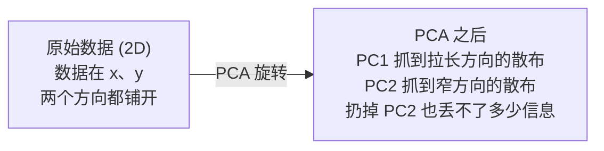

# 降维

> 高维数据是有结构的。找对角度就能看见。

**Type:** Build
**Language:** Python
**Prerequisites:** Phase 1, Lessons 01 (Linear Algebra Intuition), 02 (Vectors, Matrices & Operations), 03 (Eigenvalues & Eigenvectors), 06 (Probability & Distributions)
**Time:** ~90 minutes

## Learning Objectives

- 从零实现 PCA: 居中数据、算协方差矩阵、特征分解、投影
- 用解释方差比和 elbow 法选主成分数量
- 在 MNIST 上对比 PCA、t-SNE、UMAP 的 2D 可视化,讲清它们的取舍
- 用 RBF 核的核 PCA 处理标准 PCA 搞不定的非线性数据

## The Problem

你有个数据集,每个样本 784 个特征。可能是手写数字的像素,可能是基因表达水平,可能是用户行为信号。你没法可视化 784 维的东西。画不出来,想都想不出来。

但这 784 个特征里大部分是冗余的。真正有用的信息活在低得多的表面上。手写的 "7" 不需要 784 个独立的数来描述,几个就够: 笔画的角度、横杠的长度、倾斜多少。剩下的都是噪声。

降维就是找到那个小一点的表面。它把你的 784 维数据压到 2、10、50 维,还把真正重要的结构保住。

## The Concept

### 维数灾难

高维空间反直觉。维度一上来,三件事就坏了。

**距离没意义了。** 高维里,任意两个随机点之间的距离收敛到同一个值。如果每个点到其他点的距离都差不多,最近邻搜索就废了。

```
维度    随机点间平均距离比(max/min)
2       ~5.0
10      ~1.8
100     ~1.2
1000    ~1.02
```

**体积集中在角落。** d 维单位超立方体有 2^d 个角。100 维里,几乎所有体积都在角落,远离中心。数据点散到边缘,模型在内部"饿死"。

**你需要指数级更多的数据。** 要在空间里保持同样的样本密度,从 2D 升到 20D 要多 10^18 倍数据。你永远凑不齐。降维能把数据密度拉回到能用的程度。

### PCA:找重要的方向

主成分分析(PCA)找数据变化最大的轴。它旋转坐标系,让第一根轴抓到最多方差,第二根抓次多,依此类推。

算法:

```
1. 居中数据          (每个特征减均值)
2. 算协方差           (特征怎么一起动)
3. 特征分解           (找主方向)
4. 按特征值排序       (最大方差优先)
5. 投影              (留前 k 个特征向量,丢其他的)
```

为啥用特征分解?协方差矩阵对称且半正定。它的特征向量是特征空间里的正交方向。特征值告诉你每个方向抓了多少方差。最大特征值对应的特征向量指向"方差最大"的方向。



- **PCA 前:** 数据云沿对角线在 x、y 两个方向都散开
- **PCA 后:** 坐标系被旋转,PC1 跟方差最大方向(拉长的散布)对齐,PC2 跟方差最小方向(窄的散布)对齐
- **降维:** 扔掉 PC2 把数据投到 PC1,几乎不丢信息

### 解释方差比

每个主成分抓到总方差的一个比例。解释方差比告诉你多少。

```
成分       特征值     解释比      累计
PC1        4.73       0.473       0.473
PC2        2.51       0.251       0.724
PC3        1.12       0.112       0.836
PC4        0.89       0.089       0.925
...
```

累计解释方差到 0.95 时,这些成分抓到了 95% 的信息。后面的基本是噪声。

### 选主成分数

三种策略:

1. **阈值。** 留够解释 90-95% 方差的成分。
2. **Elbow 法。** 画每个成分的解释方差。找急剧下降的那个拐点。
3. **下游性能。** 把 PCA 当预处理。扫 k,量模型准确率。准确率持平的地方就是最佳 k。

### t-SNE:保持邻域关系

t-分布随机邻域嵌入(t-SNE)是为可视化设计的。它把高维数据映到 2D(或 3D),同时保住"哪些点挨着"。

直觉: 在原空间,基于距离算一对点上的概率分布。挨着的概率高,远的概率低。然后找一个 2D 排列,让同样的概率分布成立。784 维里挨着的点,到 2D 还挨着。

t-SNE 关键性质:
- 非线性。能展开 PCA 展不开的复杂流形。
- 随机性。不同次跑出来的布局不一样。
- perplexity 参数控制考虑多少邻居(典型 5-50)。
- 输出里簇之间的距离没意义。只有簇本身有意义。
- 大数据集上慢。默认 O(n²)。

### UMAP:更快、更好的全局结构

均匀流形近似与投影(UMAP)跟 t-SNE 思路类似,两个优势:
- 更快。用近似近邻图,不用算所有成对距离。
- 全局结构更好。输出里簇之间的相对位置比 t-SNE 更有意义。

UMAP 在高维空间建一个加权图("模糊拓扑表示"),然后找一个低维布局尽量保住这张图。

关键参数:
- `n_neighbors`: 多少邻居定义局部结构(类似 perplexity)。越大越保留全局。
- `min_dist`: 输出里点抱得多紧。越小簇越密。

### 啥时候用哪个

| 方法 | 用途 | 保住的 | 速度 |
|--------|----------|-----------|-------|
| PCA | 训练前预处理 | 全局方差 | 快(精确),能处理百万样本 |
| PCA | 快速探索性可视化 | 线性结构 | 快 |
| t-SNE | 发论文用的 2D 图 | 局部邻域 | 慢(理想 < 1 万) |
| UMAP | 大规模 2D 可视化 | 局部 + 部分全局 | 中(能处理百万) |
| PCA | 模型的特征降维 | 按方差排的特征 | 快 |
| t-SNE / UMAP | 理解簇结构 | 簇分离 | 中到慢 |

经验法则: 预处理和数据压缩用 PCA。要在 2D 里可视化结构,用 t-SNE 或 UMAP。

### 核 PCA

标准 PCA 找线性子空间。它旋转你的坐标系再扔轴。但如果数据躺在非线性流形上呢?2D 的圆没法用任何线分开。标准 PCA 帮不上忙。

核 PCA 在核函数诱导的高维特征空间里跑 PCA,不用显式算出那个空间里的坐标。这就是核技巧 —— SVM 后面同一个想法。

算法:
1. 算核矩阵 K,K_ij = k(x_i, x_j)
2. 在特征空间居中核矩阵
3. 特征分解居中后的核矩阵
4. 顶部特征向量(乘 1/sqrt(特征值))就是投影

常见核函数:

| 核 | 公式 | 适合 |
|--------|---------|----------|
| RBF(高斯) | exp(-γ * ‖x - y‖²) | 大部分非线性数据,光滑流形 |
| 多项式 | (x·y + c)^d | 多项式关系 |
| Sigmoid | tanh(α * x·y + c) | 类神经网络的映射 |

啥时候用核 PCA vs 标准 PCA:

| 维度 | 标准 PCA | 核 PCA |
|-----------|-------------|-------------|
| 数据结构 | 线性子空间 | 非线性流形 |
| 速度 | O(min(n²d, d²n)) | O(n²d + n³) |
| 可解释性 | 成分是特征的线性组合 | 成分没有直接的特征解释 |
| 可扩展性 | 能处理百万样本 | 核矩阵是 n × n,受内存限制 |
| 重建 | 直接反变换 | 需要 pre-image 近似 |

经典例子: 2D 同心圆。两环点,一内一外。标准 PCA 把两个都投到同一条线上 —— 分类用不了。带 RBF 核的核 PCA 把内圈外圈映到不同区域,让它们线性可分。

### 重建误差

你的降维效果怎么样?784 维压到 50 维,丢了啥?

量重建误差:
1. 把数据投到 k 维: X_reduced = X @ W_k
2. 重建: X_hat = X_reduced @ W_k^T
3. 算 MSE: mean((X - X_hat)²)

对 PCA,重建误差跟解释方差有个干净的关系:

```
重建误差        = 没用上的特征值之和
总方差          = 所有特征值之和
丢失的比例      = (被扔的特征值之和) / (所有特征值之和)
```

每个成分的解释方差比:

```
解释比_k = 特征值_k / 所有特征值之和
```

画"累计解释方差 vs 成分数"就是那条 elbow 曲线。选多少成分是对的:
- 曲线走平(收益递减)
- 累计方差跨过你的阈值(通常 0.90 或 0.95)
- 下游任务性能持平

重建误差不止用来选 k。还能做异常检测: 重建误差大的样本是不符合所学子空间的离群点。这是生产系统里基于 PCA 的异常检测的基础。

## Build It

### Step 1: 从零实现 PCA

```python
import numpy as np

class PCA:
    def __init__(self, n_components):
        self.n_components = n_components
        self.components = None
        self.mean = None
        self.eigenvalues = None
        self.explained_variance_ratio_ = None

    def fit(self, X):
        self.mean = np.mean(X, axis=0)
        X_centered = X - self.mean

        cov_matrix = np.cov(X_centered, rowvar=False)

        eigenvalues, eigenvectors = np.linalg.eigh(cov_matrix)

        sorted_idx = np.argsort(eigenvalues)[::-1]
        eigenvalues = eigenvalues[sorted_idx]
        eigenvectors = eigenvectors[:, sorted_idx]

        self.components = eigenvectors[:, :self.n_components].T
        self.eigenvalues = eigenvalues[:self.n_components]
        total_var = np.sum(eigenvalues)
        self.explained_variance_ratio_ = self.eigenvalues / total_var

        return self

    def transform(self, X):
        X_centered = X - self.mean
        return X_centered @ self.components.T

    def fit_transform(self, X):
        self.fit(X)
        return self.transform(X)
```

### Step 2: 在合成数据上测

```python
np.random.seed(42)
n_samples = 500

t = np.random.uniform(0, 2 * np.pi, n_samples)
x1 = 3 * np.cos(t) + np.random.normal(0, 0.2, n_samples)
x2 = 3 * np.sin(t) + np.random.normal(0, 0.2, n_samples)
x3 = 0.5 * x1 + 0.3 * x2 + np.random.normal(0, 0.1, n_samples)

X_synthetic = np.column_stack([x1, x2, x3])

pca = PCA(n_components=2)
X_reduced = pca.fit_transform(X_synthetic)

print(f"原始 shape: {X_synthetic.shape}")
print(f"降维后 shape: {X_reduced.shape}")
print(f"解释方差比: {pca.explained_variance_ratio_}")
print(f"抓到的总方差: {sum(pca.explained_variance_ratio_):.4f}")
```

### Step 3: MNIST 数字的 2D 可视化

```python
from sklearn.datasets import fetch_openml

mnist = fetch_openml("mnist_784", version=1, as_frame=False, parser="auto")
X_mnist = mnist.data[:5000].astype(float)
y_mnist = mnist.target[:5000].astype(int)

pca_mnist = PCA(n_components=50)
X_pca50 = pca_mnist.fit_transform(X_mnist)
print(f"50 个成分抓到 {sum(pca_mnist.explained_variance_ratio_):.2%} 方差")

pca_2d = PCA(n_components=2)
X_pca2d = pca_2d.fit_transform(X_mnist)
print(f"2 个成分抓到 {sum(pca_2d.explained_variance_ratio_):.2%} 方差")
```

### Step 4: 跟 sklearn 对比

```python
from sklearn.decomposition import PCA as SklearnPCA
from sklearn.manifold import TSNE

sklearn_pca = SklearnPCA(n_components=2)
X_sklearn_pca = sklearn_pca.fit_transform(X_mnist)

print(f"\n我们的 PCA 解释方差:     {pca_2d.explained_variance_ratio_}")
print(f"Sklearn PCA 解释方差: {sklearn_pca.explained_variance_ratio_}")

diff = np.abs(np.abs(X_pca2d) - np.abs(X_sklearn_pca))
print(f"最大绝对差: {diff.max():.10f}")

tsne = TSNE(n_components=2, perplexity=30, random_state=42)
X_tsne = tsne.fit_transform(X_mnist)
print(f"\nt-SNE 输出 shape: {X_tsne.shape}")
```

### Step 5: UMAP 对比

```python
try:
    from umap import UMAP

    reducer = UMAP(n_components=2, n_neighbors=15, min_dist=0.1, random_state=42)
    X_umap = reducer.fit_transform(X_mnist)
    print(f"UMAP 输出 shape: {X_umap.shape}")
except ImportError:
    print("装一下 umap-learn: pip install umap-learn")
```

## Use It

PCA 当分类器前的预处理:

```python
from sklearn.decomposition import PCA as SklearnPCA
from sklearn.linear_model import LogisticRegression
from sklearn.model_selection import train_test_split
from sklearn.metrics import accuracy_score

X_train, X_test, y_train, y_test = train_test_split(
    X_mnist, y_mnist, test_size=0.2, random_state=42
)

results = {}
for k in [10, 30, 50, 100, 200]:
    pca_k = SklearnPCA(n_components=k)
    X_tr = pca_k.fit_transform(X_train)
    X_te = pca_k.transform(X_test)

    clf = LogisticRegression(max_iter=1000, random_state=42)
    clf.fit(X_tr, y_train)
    acc = accuracy_score(y_test, clf.predict(X_te))
    var_captured = sum(pca_k.explained_variance_ratio_)
    results[k] = (acc, var_captured)
    print(f"k={k:>3d}  准确率={acc:.4f}  方差={var_captured:.4f}")
```

性能远远不到 784 维就持平了。那个持平点就是你的工作点。

## Ship It

本节产出:
- `outputs/skill-dimensionality-reduction.md` —— 选降维技术的 skill

## Exercises

1. 给 PCA 类加 `inverse_transform`。从 10、50、200 个成分重建 MNIST 数字,打印每种的重建误差(MSE)。
2. 用 perplexity 5、30、100 在同一份 MNIST 上跑 t-SNE。描述输出怎么变。perplexity 为啥影响簇的紧度?
3. 拿一个 50 特征但只有 5 个有信息量的数据集(`sklearn.datasets.make_classification` 生成),跑 PCA 看看解释方差曲线能不能正确识别出数据实际是 5 维。

## Key Terms

| Term | What people say | What it actually means |
|------|----------------|----------------------|
| Curse of dimensionality | "特征太多" | 维度一上来,距离、体积、数据密度都反直觉。模型要指数级更多的数据。 |
| PCA | "降维" | 旋转坐标系让轴对齐"方差最大"方向,然后扔掉低方差轴。 |
| Principal component | "重要方向" | 协方差矩阵的特征向量。数据变化最大的特征空间方向。 |
| Explained variance ratio | "这个成分有多少信息" | 一个主成分抓到的总方差比例。前 k 个加起来,看保留了百分之多少。 |
| Covariance matrix | "特征怎么相关" | 对称矩阵,(i,j) 元衡量特征 i 和 j 怎么一起动。对角线是各自方差。 |
| t-SNE | "那个簇图" | 非线性方法,通过保住"成对点成邻居"的概率把高维映到 2D。适合可视化,不适合预处理。 |
| UMAP | "更快的 t-SNE" | 基于拓扑数据分析的非线性方法。保住局部和部分全局。比 t-SNE 扩展性好。 |
| Perplexity | "t-SNE 旋钮" | 控制每个点考虑多少个有效邻居。低 perplexity 聚焦很局部,高 perplexity 抓更广的模式。 |
| Manifold | "数据躺的那个面" | 嵌在高维空间里的低维面。一张在 3D 揉皱的纸就是 2D 流形。 |

## Further Reading

- [A Tutorial on Principal Component Analysis](https://arxiv.org/abs/1404.1100) (Shlens) - 从零推 PCA
- [How to Use t-SNE Effectively](https://distill.pub/2016/misread-tsne/) (Wattenberg et al.) - t-SNE 坑和参数选择的可交互指南
- [UMAP documentation](https://umap-learn.readthedocs.io/) - UMAP 作者写的理论和实战
