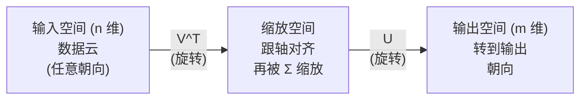
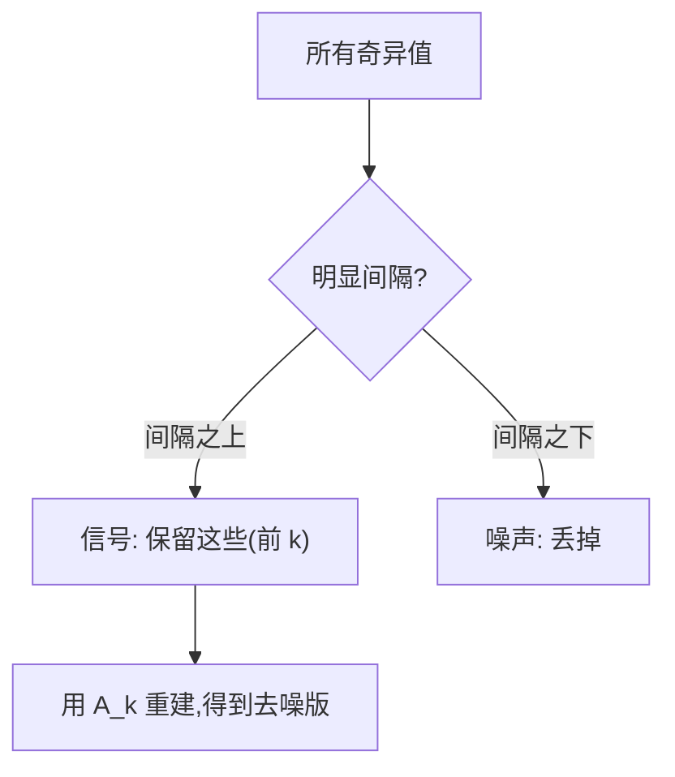

# 奇异值分解(SVD)

> SVD 是线性代数的瑞士军刀。每个矩阵都有一个,每个数据科学家都需要。

**Type:** Build
**Languages:** Python, Julia
**Prerequisites:** Phase 1, Lessons 01 (Linear Algebra Intuition), 02 (Vectors & Matrices Operations), 03 (Matrix Transformations)
**Time:** ~120 minutes

## Learning Objectives

- 通过幂迭代实现 SVD,解释 U、Σ、V^T 的几何意义
- 用截断 SVD 做图像压缩,衡量压缩比 vs 重建误差
- 用 SVD 算 Moore-Penrose 伪逆,解超定最小二乘系统
- 把 SVD 跟 PCA、推荐系统(潜因子)、NLP 里的 LSA 挂上钩

## The Problem

你有个 1000x2000 矩阵。可能是用户-电影评分,可能是文档-词频表,可能是图片的像素。你需要压缩、去噪、找隐藏结构、或者用它解个最小二乘。特征分解只能用在方阵上,还得是特征向量全的。

SVD 啥矩阵都行。啥形状都行。啥秩都行。没条件。它把矩阵拆成三个因子,揭示矩阵对空间做了什么。是线性代数里最普适、最有用的分解。

## The Concept

### SVD 在几何上干了啥

每个矩阵,不管啥形状,按顺序做了三件事: 旋转、缩放、旋转。SVD 把这个分解显式化。

```
A = U * Σ * V^T

      m x n     m x m    m x n    n x n
     (任意)   (旋转)   (缩放)   (旋转)
```

给定任意矩阵 A,SVD 把它拆成:
- V^T 在输入空间( n 维)旋转向量
- Σ 沿每根轴缩放(拉长或压缩)
- U 把结果旋转到输出空间( m 维)



这样想。你递给 SVD 一个矩阵。它告诉你: "这个矩阵先拿输入球按 V^T 转一下,再用 Σ 拉成一个椭球,再把椭球按 U 转一下。"奇异值就是椭球各轴的长度。

### 完整分解

对 m × n 矩阵 A:

```
A = U * Σ * V^T

其中:
  U     是 m x m,正交(U^T U = I)
  Σ     是 m x n,对角(奇异值在对角线上)
  V     是 n x n,正交(V^T V = I)

奇异值 σ_1 >= σ_2 >= ... >= σ_r > 0
其中 r = rank(A)
```

U 的列叫左奇异向量。V 的列叫右奇异向量。Σ 的对角元叫奇异值。它们永远非负,按惯例降序排。

### 左奇异向量、奇异值、右奇异向量

SVD 每个部分各有清楚的几何意义。

**右奇异向量(V 的列):** 组成输入空间( R^n)的正交基。它们是矩阵 A 把它"映到"输出空间正交方向的输入空间方向。可以把它们当域的天然坐标系。

**奇异值(Σ 的对角):** 缩放因子。第 i 个奇异值告诉你矩阵沿第 i 个右奇异向量拉伸了多少。奇异值为 0 意味着矩阵把那个方向压扁了。

**左奇异向量(U 的列):** 组成输出空间( R^m)的正交基。第 i 个左奇异向量是输出空间里"第 i 个右奇异向量(缩放后)落在的方向"。

它们的关系:

```
A * v_i = σ_i * u_i

矩阵 A 拿第 i 个右奇异向量 v_i,
按 σ_i 缩放,映到第 i 个左奇异向量 u_i。
```

这给你一个"按坐标"看任何矩阵都干了啥的图景。

### 外积形式

SVD 能写成一系列秩 1 矩阵的和:

```
A = σ_1 * u_1 * v_1^T + σ_2 * u_2 * v_2^T + ... + σ_r * u_r * v_r^T

每一项 σ_i * u_i * v_i^T 都是一个秩 1 矩阵(外积)。
完整矩阵是 r 个这样的矩阵的和,r 是秩。
```

这种形式是低秩逼近的基石。每一项加一层结构。第一项抓到单一最重要的模式。第二项抓次重要的。依此类推。截断这个和就给你"任何给定秩下的最优逼近"。

```
秩 1 逼近:    A_1 = σ_1 * u_1 * v_1^T
              (抓到主导模式)

秩 2 逼近:    A_2 = σ_1 * u_1 * v_1^T + σ_2 * u_2 * v_2^T
              (抓到两个最重要的模式)

秩 k 逼近:    A_k = 前 k 项之和
              (按 Eckart-Young 定理最优)
```

### 跟特征分解的关系

SVD 和特征分解联系很深。A 的奇异值和向量直接来自 A^T A 和 A A^T 的特征值和特征向量。

```
A^T A = V * Σ^T * U^T * U * Σ * V^T
      = V * Σ^T * Σ * V^T
      = V * D * V^T

其中 D = Σ^T * Σ 是对角矩阵,σ_i² 在对角上。

所以:
- 右奇异向量 (V) 是 A^T A 的特征向量
- 奇异值平方 (σ_i²) 是 A^T A 的特征值

同样:
A A^T = U * Σ * V^T * V * Σ^T * U^T
      = U * Σ * Σ^T * U^T

所以:
- 左奇异向量 (U) 是 A A^T 的特征向量
- A A^T 的特征值也是 σ_i²
```

这个联系告诉你三件事:
1. 奇异值永远实数且非负(它们是半正定矩阵特征值的平方根)。
2. 可以通过 A^T A 的特征分解算 SVD,但这会把条件数平方,丢数值精度。专门的 SVD 算法避免了这个问题。
3. A 是方阵且对称半正定时,SVD 和特征分解是同一回事。

### 截断 SVD:低秩逼近

Eckart-Young-Mirsky 定理说,A 的最佳秩 k 逼近(在 Frobenius 范数和谱范数下)由只保留前 k 个奇异值及对应向量得到:

```
A_k = U_k * Σ_k * V_k^T

其中:
  U_k     是 m x k  (U 的前 k 列)
  Σ_k     是 k x k  (Σ 的左上 k x k 块)
  V_k     是 n x k  (V 的前 k 列)

逼近误差 = σ_{k+1}                (谱范数下)
         = sqrt(σ_{k+1}² + ... + σ_r²)  (Frobenius 范数下)
```

这不只是"一个好"的逼近。它是有证明的"最佳可能的秩 k 逼近"。没有别的秩 k 矩阵离 A 更近。

| 成分 | 相对大小 | 在秩 3 逼近里保留? |
|-----------|-------------------|------------------------|
| σ_1 | 最大 | 是 |
| σ_2 | 大 | 是 |
| σ_3 | 中-大 | 是 |
| σ_4 | 中 | 否(误差) |
| σ_5 | 中-小 | 否(误差) |
| σ_6 | 小 | 否(误差) |
| σ_7 | 很小 | 否(误差) |
| σ_8 | 微小 | 否(误差) |

保留前 3: A_3 抓到 3 个最大奇异值。误差 = 剩下的值(σ_4 到 σ_8)。

奇异值衰减快的话,小 k 就能抓到大部分矩阵。衰减慢的话,矩阵没有低秩结构。

### 用 SVD 做图像压缩

灰度图是像素强度的矩阵。800x600 的图有 480,000 个值。SVD 让你用少得多的值逼近它。

```
原图: 800 x 600 = 480,000 个值

SVD 秩 k:
  U_k:      800 x k 个值
  Σ_k:      k 个值
  V_k:      600 x k 个值
  总:       k * (800 + 600 + 1) = k * 1401 个值

  k=10:   14,010 个值   (原图 2.9%)
  k=50:   70,050 个值   (原图 14.6%)
  k=100:  140,100 个值  (原图 29.2%)

  k 越小压缩比越好,
  但视觉质量也越差。
```

关键洞见: 自然图像的奇异值衰减快。前几个抓到大致结构(形状、渐变),后面的抓到细节和噪声。截断到秩 50 通常能产出"看起来跟原图几乎一样"的图,还省 85% 存储。

### SVD 用于推荐系统

Netflix Prize 让这个出了名。你有个用户-电影评分矩阵,大部分格子是空的。

```
              Movie1  Movie2  Movie3  Movie4  Movie5
  User1      [  5      ?       3       ?       1  ]
  User2      [  ?      4       ?       2       ?  ]
  User3      [  3      ?       5       ?       ?  ]
  User4      [  ?      ?       ?       4       3  ]

  ? = 未知评分
```

想法: 这个评分矩阵是低秩的。用户口味不独立。有一小撮潜因子(动作 vs 剧情、老 vs 新、烧脑 vs 直观)解释了大部分偏好。

把(填好的)评分矩阵做 SVD 分解成:
- U: 潜因子空间里的用户画像
- Σ: 每个潜因子的重要性
- V^T: 潜因子空间里的电影画像

用户对电影的预测评分 = 用户画像和电影画像的点积(用奇异值加权)。低秩逼近填上空格子。

实际中用 Simon Funk 的增量 SVD 或 ALS(交替最小二乘)这类变种直接处理缺失数据。但核心思想一样: 通过 SVD 做潜因子分解。

### NLP 里的 SVD:潜在语义分析

潜在语义分析(LSA),也叫潜在语义索引(LSI),把 SVD 用在词-文档矩阵上。

```
              Doc1   Doc2   Doc3   Doc4
  "cat"      [  3      0      1      0  ]
  "dog"      [  2      0      0      1  ]
  "fish"     [  0      4      1      0  ]
  "pet"      [  1      1      1      1  ]
  "ocean"    [  0      3      0      0  ]

SVD 秩 k=2 之后:

  每个文档变成 2D "概念空间"里的一个点。
  每个词变成同一 2D 空间里的一个点。
  主题相似的文档聚在一起。
  意思相近的词聚在一起。

  "cat" 和 "dog" 落在附近(陆生宠物)。
  "fish" 和 "ocean" 落在附近(水相关概念)。
  Doc1 和 Doc3 如果共享主题就聚在一块。
```

LSA 是最早从原始文本里抓语义相似度的成功方法。它有效是因为同义词倾向出现在相似文档里,SVD 把它们聚到同一潜维度。Word2Vec、GloVe 这些现代词嵌入可以看作这个思想的子嗣。

### SVD 用于降噪

噪声数据的信号集中在顶部奇异值,噪声散在所有奇异值里。截断就移除了噪声底。

**干净信号的奇异值:**

| 成分 | 大小 | 类型 |
|-----------|-----------|------|
| σ_1 | 非常大 | 信号 |
| σ_2 | 大 | 信号 |
| σ_3 | 中 | 信号 |
| σ_4 | 接近 0 | 可忽略 |
| σ_5 | 接近 0 | 可忽略 |

**带噪声信号的奇异值(噪声加到所有上):**

| 成分 | 大小 | 类型 |
|-----------|-----------|------|
| σ_1 | 非常大 | 信号 |
| σ_2 | 大 | 信号 |
| σ_3 | 中 | 信号 |
| σ_4 | 小 | 噪声 |
| σ_5 | 小 | 噪声 |
| σ_6 | 小 | 噪声 |
| σ_7 | 小 | 噪声 |



这用在信号处理、科学测量、数据清洗。任何时候你有个被加性噪声污染的矩阵,截断 SVD 都是一个把信号和噪声分开的原则化方法。

### 用 SVD 算伪逆

Moore-Penrose 伪逆 A+ 把矩阵求逆推广到了非方阵和奇异阵。SVD 让算它变得简单。

```
如果 A = U * Σ * V^T,那么:

A+ = V * Σ+ * U^T

其中 Σ+ 由以下方式得到:
  1. 转置 Σ (行变列、列变行)
  2. 把每个非零对角元 σ_i 换成 1/σ_i
  3. 0 留作 0

对 A (m x n):      A+ 是 (n x m)
对 Σ (m x n):      Σ+ 是 (n x m)
```

伪逆解最小二乘问题。如果 Ax = b 没精确解(超定系统),x = A+ b 就是最小二乘解(最小化 ||Ax - b||)。

```
超定系统(方程比未知数多):

  [1  1]         [3]
  [2  1] x   =   [5]       没有精确解。
  [3  1]         [6]

  x_ls = A+ b = V * Σ+ * U^T * b

  这给出最小化"残差平方和"的 x。
  跟正规方程 (A^T A)^(-1) A^T b 一样的结果,
  但数值上更稳。
```

### 数值稳定性优势

算 A^T A 的特征分解会把奇异值平方(A^T A 的特征值是 σ_i²)。这平方了条件数,放大了数值误差。

```
例子:
  A 的奇异值 [1000, 1, 0.001]
  A 的条件数: 1000 / 0.001 = 10^6

  A^T A 的特征值 [10^6, 1, 10^{-6}]
  A^T A 的条件数: 10^6 / 10^{-6} = 10^{12}

  直接算 SVD: 拿条件数 10^6 干
  通过 A^T A 算:  拿条件数 10^{12} 干
                  (多丢了 6 位精度)
```

现代 SVD 算法(Golub-Kahan 双对角化)直接对 A 干,从来不构造 A^T A。所以你永远应该用 `np.linalg.svd(A)` 而不是 `np.linalg.eig(A.T @ A)`。

### 跟 PCA 的联系

PCA 就是对居中数据做 SVD。这不是类比,这就是同一个计算。

```
给定数据矩阵 X (n_samples x n_features),居中后(减均值):

协方差矩阵: C = (1/(n-1)) * X^T X

PCA 找 C 的特征向量。但是:

  X = U * Σ * V^T    (X 的 SVD)

  X^T X = V * Σ² * V^T

  C = (1/(n-1)) * V * Σ² * V^T

所以主成分就是右奇异向量 V。
每个成分的解释方差是 σ_i² / (n-1)。

sklearn 里,PCA 是用 SVD 实现的,不是特征分解。
更快,数值上更稳。
```

这意味着 Lesson 10 学的一切降维,底层都是 SVD。PCA 是 SVD 在 ML 里最常见的应用。

## Build It

### Step 1: 用幂迭代从零写 SVD

想法: 找最大奇异值和它的向量,通过对 A^T A(或 A A^T)做幂迭代。然后降阶矩阵,重复找下一个奇异值。

```python
import numpy as np

def power_iteration(M, num_iters=100):
    n = M.shape[1]
    v = np.random.randn(n)
    v = v / np.linalg.norm(v)

    for _ in range(num_iters):
        Mv = M @ v
        v = Mv / np.linalg.norm(Mv)

    eigenvalue = v @ M @ v
    return eigenvalue, v

def svd_from_scratch(A, k=None):
    m, n = A.shape
    if k is None:
        k = min(m, n)

    sigmas = []
    us = []
    vs = []

    A_residual = A.copy().astype(float)

    for _ in range(k):
        AtA = A_residual.T @ A_residual
        eigenvalue, v = power_iteration(AtA, num_iters=200)

        if eigenvalue < 1e-10:
            break

        sigma = np.sqrt(eigenvalue)
        u = A_residual @ v / sigma

        sigmas.append(sigma)
        us.append(u)
        vs.append(v)

        A_residual = A_residual - sigma * np.outer(u, v)

    U = np.column_stack(us) if us else np.empty((m, 0))
    S = np.array(sigmas)
    V = np.column_stack(vs) if vs else np.empty((n, 0))

    return U, S, V
```

### Step 2: 测试并跟 NumPy 对比

```python
np.random.seed(42)
A = np.random.randn(5, 4)

U_ours, S_ours, V_ours = svd_from_scratch(A)
U_np, S_np, Vt_np = np.linalg.svd(A, full_matrices=False)

print("我们的奇异值:", np.round(S_ours, 4))
print("NumPy 奇异值:", np.round(S_np, 4))

A_reconstructed = U_ours @ np.diag(S_ours) @ V_ours.T
print(f"重建误差: {np.linalg.norm(A - A_reconstructed):.8f}")
```

### Step 3: 图像压缩 demo

```python
def compress_image_svd(image_matrix, k):
    U, S, Vt = np.linalg.svd(image_matrix, full_matrices=False)
    compressed = U[:, :k] @ np.diag(S[:k]) @ Vt[:k, :]
    return compressed

np.random.seed(42)
rows, cols = 200, 300
image = np.random.randn(rows, cols)

for k in [1, 5, 10, 20, 50]:
    compressed = compress_image_svd(image, k)
    error = np.linalg.norm(image - compressed) / np.linalg.norm(image)
    original_size = rows * cols
    compressed_size = k * (rows + cols + 1)
    ratio = compressed_size / original_size
    print(f"k={k:>3d}  误差={error:.4f}  存储={ratio:.1%}")
```

### Step 4: 降噪

```python
np.random.seed(42)
clean = np.outer(np.sin(np.linspace(0, 4*np.pi, 100)),
                 np.cos(np.linspace(0, 2*np.pi, 80)))
noise = 0.3 * np.random.randn(100, 80)
noisy = clean + noise

U, S, Vt = np.linalg.svd(noisy, full_matrices=False)
denoised = U[:, :5] @ np.diag(S[:5]) @ Vt[:5, :]

print(f"带噪误差:    {np.linalg.norm(noisy - clean):.4f}")
print(f"去噪误差:    {np.linalg.norm(denoised - clean):.4f}")
print(f"改进:        {(1 - np.linalg.norm(denoised - clean) / np.linalg.norm(noisy - clean)):.1%}")
```

### Step 5: 伪逆

```python
A = np.array([[1, 1], [2, 1], [3, 1]], dtype=float)
b = np.array([3, 5, 6], dtype=float)

U, S, Vt = np.linalg.svd(A, full_matrices=False)
S_inv = np.diag(1.0 / S)
A_pinv = Vt.T @ S_inv @ U.T

x_svd = A_pinv @ b
x_lstsq = np.linalg.lstsq(A, b, rcond=None)[0]
x_pinv = np.linalg.pinv(A) @ b

print(f"SVD 伪逆解:  {x_svd}")
print(f"np.linalg.lstsq 解:   {x_lstsq}")
print(f"np.linalg.pinv 解:    {x_pinv}")
```

## Use It

完整能跑的 demo 在 `code/svd.py`。跑一下看 SVD 用在图像压缩、推荐系统、潜在语义分析、降噪。

```bash
python svd.py
```

`code/svd.jl` 里的 Julia 版用 Julia 自带的 `svd()` 函数和 `LinearAlgebra` 包做同样的事。

```bash
julia svd.jl
```

## Ship It

本节产出:
- `outputs/skill-svd.md` —— 啥时候、怎么在真实项目里用 SVD 的 skill

## Exercises

1. 从零实现完整 SVD,不用幂迭代。改成算 A^T A 的特征分解拿 V 和奇异值,再算 U = A V Σ⁻¹。对比幂迭代版和 NumPy 版的数值精度。
2. 拿一张真实灰度图(或转一张成灰度),用秩 1、5、10、25、50、100 压缩。每种算压缩比和相对误差,找到视觉可接受的最小秩。
3. 搭一个迷你推荐系统。造一个 10x8 用户-电影评分矩阵,留一些已知项。用行均值填缺失项。算 SVD,重建一个秩 3 逼近。用重建矩阵预测缺失评分,验证预测是否合理。
4. 造一个 100x50 的文档-词矩阵,带 3 个合成主题。每个主题有 5 个相关词。加噪声。做 SVD,验证前 3 个奇异值远大于剩下的。把文档投到 3D 潜空间,检查同一主题的文档是否聚在一起。
5. 造一个干净的低秩矩阵(秩 3,大小 50x40),加不同级别的高斯噪声(σ = 0.1, 0.5, 1.0, 2.0)。每种噪声下,从 1 到 40 扫 k 找最优截断秩(对干净矩阵量重建误差)。画最优 k 怎么随噪声级别变。

## Key Terms

| Term | What people say | What it actually means |
|------|----------------|----------------------|
| SVD | "分解任何矩阵" | 分解 A 成 U Σ V^T,U、V 正交,Σ 对角且元素非负。啥矩阵都行。 |
| Singular value | "这个成分多重要" | Σ 的第 i 个对角元。衡量矩阵沿第 i 个主方向拉伸了多少。永远非负,降序排。 |
| Left singular vector | "输出方向" | U 的一列。第 i 个右奇异向量(按 σ_i 缩放后)映到的输出方向。 |
| Right singular vector | "输入方向" | V 的一列。矩阵把它映到第 i 个左奇异向量(按 σ_i 缩放后)的输入方向。 |
| Truncated SVD | "低秩逼近" | 只留前 k 个奇异值和它们的向量。产出"有证明的最佳秩 k 逼近"(Eckart-Young 定理)。 |
| Rank | "真实维度" | 非零奇异值的个数。告诉你矩阵实际用多少个独立方向。 |
| Pseudoinverse | "广义逆" | V Σ+ U^T。对非零奇异值取倒数,0 留 0。解非方阵或奇异阵的最小二乘。 |
| Condition number | "对误差多敏感" | σ_max / σ_min。条件数大 = 输入小动,输出大变。SVD 直接揭示这个。 |
| Latent factor | "隐藏变量" | SVD 发现低秩空间里的一维。在推荐里,潜因子可能对应"类型偏好"。在 NLP 里,可能对应"主题"。 |
| Frobenius norm | "矩阵总大小" | 所有元素平方和的平方根 = 奇异值平方和的平方根。用来量逼近误差。 |
| Eckart-Young theorem | "SVD 给最佳压缩" | 对任何目标秩 k,截断 SVD 在所有可能的秩 k 矩阵里最小化逼近误差。 |
| Power iteration | "找最大特征向量" | 反复用矩阵乘随机向量再归一化。收敛到最大特征值的特征向量。很多 SVD 算法的积木。 |

## Further Reading

- [Gilbert Strang: Linear Algebra and Its Applications, Chapter 7](https://math.mit.edu/~gs/linearalgebra/) - SVD 加应用的透彻讲法
- [3Blue1Brown: But what is the SVD?](https://www.youtube.com/watch?v=vSczTbgc8Rc) - SVD 几何直觉
- [We Recommend a Singular Value Decomposition](https://www.ams.org/publicoutreach/feature-column/fcarc-svd) - 美国数学会的科普综述
- [Netflix Prize and Matrix Factorization](https://sifter.org/~simon/journal/20061211.html) - Simon Funk 把 SVD 用在推荐上的原博客
- [Latent Semantic Analysis](https://en.wikipedia.org/wiki/Latent_semantic_analysis) - SVD 在 NLP 上的最初应用
- [Numerical Linear Algebra by Trefethen and Bau](https://people.maths.ox.ac.uk/trefethen/text.html) - 理解 SVD 算法和数值性质的金标准
