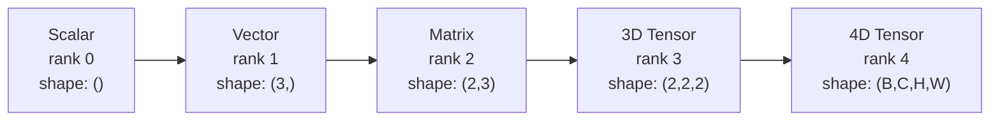
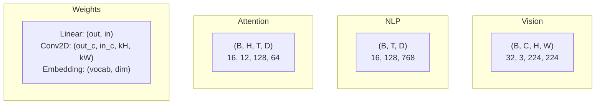
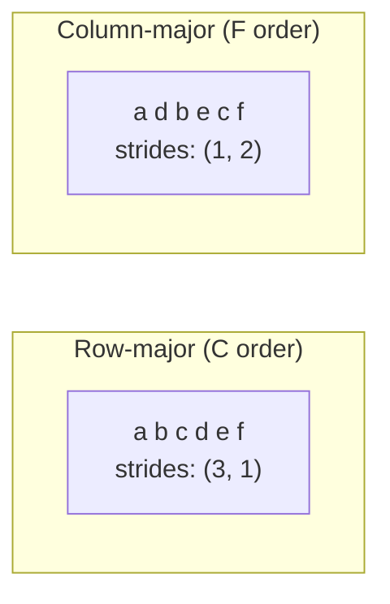
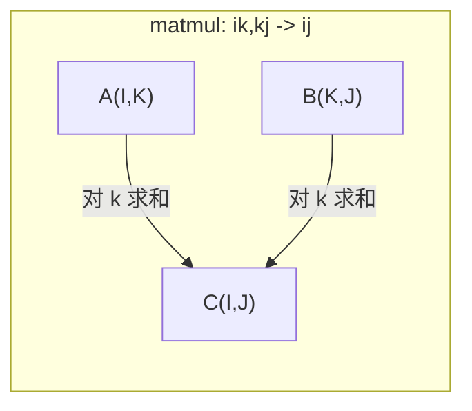

# 张量运算

> 张量是数据和深度学习之间的通用语言。每张图、每句话、每个梯度都流过它们。

**Type:** Build
**Language:** Python
**Prerequisites:** Phase 1, Lessons 01 (Linear Algebra Intuition), 02 (Vectors, Matrices & Operations)
**Time:** ~90 minutes

## Learning Objectives

- 从零实现一个张量类,带 shape、stride、reshape、transpose、逐元素运算
- 把 broadcasting 规则用在不同 shape 的张量上,不复制数据
- 用 einsum 表达式写点积、矩阵乘、外积、批量操作
- 把多头注意力每一步的张量 shape 都跟到底

## The Problem

你建了一个 transformer。forward pass 看着挺干净。跑起来报错: `RuntimeError: mat1 and mat2 shapes cannot be multiplied (32x768 and 512x768)`。你盯着 shape 看了半天。试了个 transpose,又报 `Expected 4D input (got 3D input)`。你加了个 unsqueeze,别的地方又炸了。

Shape 错误是深度学习代码里最常见的 bug。概念上不难 —— 每个操作有个 shape 契约 —— 但它们会以乘积速度堆起来。一个 transformer 里有几十个 reshape、transpose、broadcast 串在一起。轴搞错一个,错误级联。更糟的是,有些 shape 错误根本不抛异常 —— 默默沿着错维度 broadcast 一下,或者沿着错轴求和,产出垃圾。

矩阵处理两个集合之间的成对关系。真实数据塞不进两维。一批 32 张 224x224 的 RGB 图是 4D 张量: `(32, 3, 224, 224)`。12 头的自注意力也是 4D: `(batch, heads, seq_len, head_dim)`。你需要一个能推广到任意维数的数据结构,操作在所有维度上都干净地组合起来。这结构就是张量。把它的运算搞熟,shape 错误就变得好调。

## The Concept

### 张量是啥

张量是统一数据类型的多维数字数组。维数就是 **rank**(也叫 **order**)。每维是一根 **axis**。**shape** 是个元组,列出每根轴的大小。



总元素数 = 所有大小之积。shape `(2, 3, 4)` 装 `2 * 3 * 4 = 24` 个元素。

### 深度学习里的张量 shape

不同数据类型按惯例映到特定张量 shape。



PyTorch 用 NCHW(通道在前)。TensorFlow 默认 NHWC(通道在后)。布局不匹配会默默拖慢或报错。

### 内存布局怎么工作

2D 数组在内存里是一段 1D 字节序列。**stride** 告诉你"沿每根轴走一步要跳过多少个元素"。



transpose 不搬数据。它把 stride 交换,让张量变成 **非连续的** —— 一行的元素在内存里不再相邻。

### Broadcasting 规则

Broadcasting 让你在不同 shape 的张量上做操作,不复制数据。从右对齐 shape。两个维度"兼容"是它们相等或其中一个为 1。维数不够的左边补 1。

```
张量 A:     (8, 1, 6, 1)
张量 B:        (7, 1, 5)
B 补齐后:   (1, 7, 1, 5)
结果:       (8, 7, 6, 5)
```

### Einsum:通用张量运算

爱因斯坦求和给每根轴标个字母。输入里有但输出里没有的轴会被求和。输入和输出都有的轴保留。



关键模式: `i,i->`(点积)、`i,j->ij`(外积)、`ii->`(迹)、`ij->ji`(转置)、`bij,bjk->bik`(batch 矩阵乘)、`bhtd,bhsd->bhts`(注意力分数)。

## Build It

代码在 `code/tensors.py`。每一步引用里面的实现。

### Step 1: 张量存储和 stride

张量存一个平的数字列表加 shape 元数据。stride 告诉索引逻辑怎么把多维索引映到平的位置。

```python
class Tensor:
    def __init__(self, data, shape=None):
        if isinstance(data, (list, tuple)):
            self._data, self._shape = self._flatten_nested(data)
        elif isinstance(data, np.ndarray):
            self._data = data.flatten().tolist()
            self._shape = tuple(data.shape)
        else:
            self._data = [data]
            self._shape = ()

        if shape is not None:
            total = reduce(lambda a, b: a * b, shape, 1)
            if total != len(self._data):
                raise ValueError(
                    f"Cannot reshape {len(self._data)} elements into shape {shape}"
                )
            self._shape = tuple(shape)

        self._strides = self._compute_strides(self._shape)

    @staticmethod
    def _compute_strides(shape):
        if len(shape) == 0:
            return ()
        strides = [1] * len(shape)
        for i in range(len(shape) - 2, -1, -1):
            strides[i] = strides[i + 1] * shape[i + 1]
        return tuple(strides)
```

shape `(3, 4)` 的 stride 是 `(4, 1)` —— 走一行跳 4 个元素,走一列跳 1 个元素。

### Step 2: Reshape、squeeze、unsqueeze

Reshape 改 shape 不动元素顺序。总元素数必须不变。一维可以用 `-1` 让它自己算。

```python
t = Tensor(list(range(12)), shape=(2, 6))
r = t.reshape((3, 4))
r = t.reshape((-1, 3))
```

Squeeze 删掉大小为 1 的轴。Unsqueeze 加一根。Unsqueeze 对 broadcasting 很关键 —— 一个 bias 向量 `(D,)` 加到一批 `(B, T, D)` 上要先 unsqueeze 成 `(1, 1, D)`。

```python
t = Tensor(list(range(6)), shape=(1, 3, 1, 2))
s = t.squeeze()
v = Tensor([1, 2, 3])
u = v.unsqueeze(0)
```

### Step 3: Transpose 和 permute

Transpose 交换两根轴。Permute 重排所有轴。这是 NCHW 和 NHWC 之间转换的方法。

```python
mat = Tensor(list(range(6)), shape=(2, 3))
tr = mat.transpose(0, 1)

t4d = Tensor(list(range(24)), shape=(1, 2, 3, 4))
perm = t4d.permute((0, 2, 3, 1))
```

transpose 或 permute 之后,张量在内存里是非连续的。PyTorch 里 `view` 在非连续张量上会失败 —— 用 `reshape` 或者先调 `.contiguous()`。

### Step 4: 逐元素运算和归约

逐元素操作(加、乘、减)对每个元素独立做,保持 shape。归约(sum、mean、max)压平一根或多根轴。

```python
a = Tensor([[1, 2], [3, 4]])
b = Tensor([[10, 20], [30, 40]])
c = a + b
d = a * 2
s = a.sum(axis=0)
```

CNN 里的全局平均池化: `(B, C, H, W).mean(axis=[2, 3])` 产出 `(B, C)`。NLP 里的序列均值池化: `(B, T, D).mean(axis=1)` 产出 `(B, D)`。

### Step 5: 用 NumPy 做 broadcasting

`demo_broadcasting_numpy()` 函数展示了核心模式。

```python
activations = np.random.randn(4, 3)
bias = np.array([0.1, 0.2, 0.3])
result = activations + bias

images = np.random.randn(2, 3, 4, 4)
scale = np.array([0.5, 1.0, 1.5]).reshape(1, 3, 1, 1)
result = images * scale

a = np.array([1, 2, 3]).reshape(-1, 1)
b = np.array([10, 20, 30, 40]).reshape(1, -1)
outer = a * b
```

用 broadcasting 算成对距离: 把 `(M, 2)` reshape 成 `(M, 1, 2)`,`(N, 2)` reshape 成 `(1, N, 2)`,减、平方、沿最后一轴求和、开方。结果: `(M, N)`。

### Step 6: Einsum 运算

`demo_einsum()` 和 `demo_einsum_gallery()` 函数走遍每种常见模式。

```python
a = np.array([1.0, 2.0, 3.0])
b = np.array([4.0, 5.0, 6.0])
dot = np.einsum("i,i->", a, b)

A = np.array([[1, 2], [3, 4], [5, 6]], dtype=float)
B = np.array([[7, 8, 9], [10, 11, 12]], dtype=float)
matmul = np.einsum("ik,kj->ij", A, B)

batch_A = np.random.randn(4, 3, 5)
batch_B = np.random.randn(4, 5, 2)
batch_mm = np.einsum("bij,bjk->bik", batch_A, batch_B)
```

收缩的计算代价是所有索引大小(保留 + 求和)的乘积。`bij,bjk->bik` 在 B=32, I=128, J=64, K=128 时: `32 * 128 * 64 * 128 = 33,554,432` 次乘加。

### Step 7: 用 einsum 实现注意力机制

`demo_attention_einsum()` 函数端到端实现了多头注意力。

```python
B, H, T, D = 2, 4, 8, 16
E = H * D

X = np.random.randn(B, T, E)
W_q = np.random.randn(E, E) * 0.02

Q = np.einsum("bte,ek->btk", X, W_q)
Q = Q.reshape(B, T, H, D).transpose(0, 2, 1, 3)

scores = np.einsum("bhtd,bhsd->bhts", Q, K) / np.sqrt(D)
weights = softmax(scores, axis=-1)
attn_output = np.einsum("bhts,bhsd->bhtd", weights, V)

concat = attn_output.transpose(0, 2, 1, 3).reshape(B, T, E)
output = np.einsum("bte,ek->btk", concat, W_o)
```

每一步都是张量操作: 投影(矩阵乘用 einsum)、分头(reshape + transpose)、注意力分数(batch 矩阵乘用 einsum)、加权和(batch 矩阵乘用 einsum)、合头(transpose + reshape)、输出投影(矩阵乘用 einsum)。

## Use It

### 从零 vs NumPy

| 操作 | 从零(Tensor 类) | NumPy |
|---|---|---|
| Create | `Tensor([[1,2],[3,4]])` | `np.array([[1,2],[3,4]])` |
| Reshape | `t.reshape((3,4))` | `a.reshape(3,4)` |
| Transpose | `t.transpose(0,1)` | `a.T` 或 `a.transpose(0,1)` |
| Squeeze | `t.squeeze(0)` | `np.squeeze(a, 0)` |
| Sum | `t.sum(axis=0)` | `a.sum(axis=0)` |
| Einsum | N/A | `np.einsum("ij,jk->ik", a, b)` |

### 从零 vs PyTorch

```python
import torch

t = torch.tensor([[1, 2, 3], [4, 5, 6]], dtype=torch.float32)
t.shape
t.stride()
t.is_contiguous()

t.reshape(3, 2)
t.unsqueeze(0)
t.transpose(0, 1)
t.transpose(0, 1).contiguous()

torch.einsum("ik,kj->ij", A, B)
```

PyTorch 加了 autograd、GPU 支持、优化的 BLAS 内核。shape 语义完全一样。搞懂从零版,PyTorch 的 shape 错误就变可读了。

### 每个神经网络层都是张量操作

| 操作 | 张量形式 | Einsum |
|---|---|---|
| 线性层 | `Y = X @ W.T + b` | `"bd,od->bo"` + bias |
| 注意力 QKV | `Q = X @ W_q` | `"btd,dh->bth"` |
| 注意力分数 | `Q @ K.T / sqrt(d)` | `"bhtd,bhsd->bhts"` |
| 注意力输出 | `softmax(scores) @ V` | `"bhts,bhsd->bhtd"` |
| BatchNorm | `(X - mu) / sigma * gamma` | 逐元素 + broadcast |
| Softmax | `exp(x) / sum(exp(x))` | 逐元素 + 归约 |

## Ship It

本节产出两个可复用 prompt:

1. **`outputs/prompt-tensor-shapes.md`** —— 系统化调试张量 shape 不匹配的 prompt。带每个常见操作(matmul、broadcast、cat、Linear、Conv2d、BatchNorm、softmax)的决策表和修复查表。

2. **`outputs/prompt-tensor-debugger.md`** —— 你贴到任何 AI 助手里的逐步调试 prompt。把错误信息和张量 shape 给它,拿回具体修复方案。

## Exercises

1. **简单 —— Reshape 来回。** 拿 shape `(2, 3, 4)` 的张量。reshape 成 `(6, 4)`,再成 `(24,)`,再回到 `(2, 3, 4)`。每步打印 flat data 验证元素顺序没变。
2. **中等 —— 实现 broadcasting。** 给 `Tensor` 类加一个 `broadcast_to(shape)` 方法,把大小为 1 的维扩到目标 shape。然后改 `_elementwise_op` 在操作前自动 broadcast。用 shape `(3, 1)` 和 `(1, 4)` 产 `(3, 4)` 测试。
3. **难 —— 从零写 einsum。** 实现一个基础 `einsum(subscripts, *tensors)`,至少处理: 点积(`i,i->`)、矩阵乘(`ij,jk->ik`)、外积(`i,j->ij`)、转置(`ij->ji`)。解析下标串,找出收缩索引,枚举所有组合。跟 `np.einsum` 对比结果。
4. **难 —— 注意力 shape 跟踪器。** 写个函数,输入 `batch_size`、`seq_len`、`embed_dim`、`num_heads`,打出多头注意力每一步的精确 shape: 输入、Q/K/V 投影、分头、注意力分数、softmax 权重、加权和、合头、输出投影。跟 `demo_attention_einsum()` 输出对一下。

## Key Terms

| Term | What people say | What it actually means |
|---|---|---|
| Tensor | "矩阵但更多维" | 多维数组,统一类型,有 shape、stride、运算 |
| Rank | "维数" | 轴的根数。矩阵 rank 是 2,不是矩阵的秩那个 rank |
| Shape | "张量的大小" | 元组,列出每根轴的大小。`(2, 3)` 表示 2 行 3 列 |
| Stride | "内存怎么排的" | 沿每根轴走一步要跳过多少个元素 |
| Broadcasting | "shape 不一样也能跑" | 严格的规则: 从右对齐,维度相等或其中一个为 1 |
| Contiguous | "张量是正常的" | 元素在内存里按逻辑布局顺序连续存放,没空隙、没重排 |
| Einsum | "matmul 的花式写法" | 通用记号,一行表达任何张量收缩、外积、迹、转置 |
| View | "跟 reshape 一样" | 共享同一块内存、但 shape/stride 元数据不同的张量。非连续数据上会失败 |
| Contraction | "对索引求和" | 通用操作,两个张量共享的索引相乘后求和,产出低秩结果 |
| NCHW / NHWC | "PyTorch vs TensorFlow 格式" | 图像张量的内存布局惯例。NCHW 把通道放空间维前,NHWC 反过来 |

## Further Reading

- [NumPy Broadcasting](https://numpy.org/doc/stable/user/basics.broadcasting.html) -- 规则的标准文档,带可视化例子
- [PyTorch Tensor Views](https://pytorch.org/docs/stable/tensor_view.html) -- view 啥时候能直接用、啥时候要拷贝
- [einops](https://github.com/arogozhnikov/einops) -- 让张量 reshape 可读又安全的库
- [The Illustrated Transformer](https://jalammar.github.io/illustrated-transformer/) -- 把注意力的张量 shape 画出来
- [Einstein Summation in NumPy](https://numpy.org/doc/stable/reference/generated/numpy.einsum.html) -- einsum 完整文档带例子
