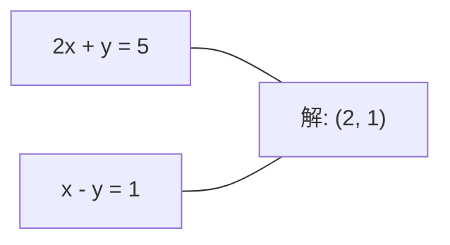
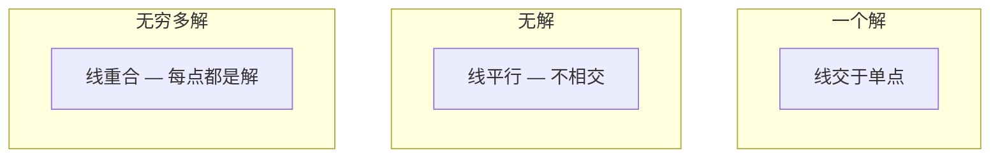

# 线性系统

> 解 Ax = b 是数学里最古老的问题,但它今天还在跑你的神经网络。

**Type:** Build
**Language:** Python
**Prerequisites:** Phase 1, Lessons 01 (Linear Algebra Intuition), 02 (Vectors & Matrices), 03 (Matrix Transformations)
**Time:** ~120 minutes

## Learning Objectives

- 用带部分主元的高斯消元和回代解 Ax = b
- 用 LU、QR、Cholesky 分解矩阵,讲清楚各自适合啥场景
- 推最小二乘的正规方程,把它们跟线性和岭回归挂上钩
- 用条件数诊断病态系统,加正则让它们稳定

## The Problem

每当你训线性回归,你在解一个线性系统。每当你算最小二乘拟合,你在解一个线性系统。每当神经网络层算 `y = Wx + b`,它就在跑一个线性系统的一面。加正则,你就在改这个系统。用高斯过程,你在分解一个矩阵。给马氏距离求协方差逆,你在解一个线性系统。

Ax = b 到处都出现。A 是已知系数矩阵,b 是已知输出向量,x 是你想求的未知向量。在线性回归里,A 是你的数据矩阵,b 是你的目标向量,x 是权重向量。整个模型化简成: 找 x 使 Ax 尽可能接近 b。

这节课从零搭每种主流解法。你会懂为啥有的方法快、有的稳,为啥有的只能解方阵、有的能处理超定系统,为啥矩阵的条件数决定你的解到底有没有意义。

## The Concept

### Ax = b 几何上是啥

线性方程组有几何解释。每个方程定义一个超平面。解是所有超平面相交的点(或点集)。

```
2x + y = 5          2D 里两条线。
x - y  = 1          交在 x=2, y=1。
```



三种情况:



矩阵形式下,"一个解"意味着 A 可逆。"无解"意味着系统矛盾。"无穷多解"意味着 A 有零空间。大多数 ML 问题属于"无精确解"类,因为你方程(数据点)比未知数(参数)多。这就是最小二乘上场的地方。

### 列视图 vs 行视图

读 Ax = b 有两种方式。

**行视图。** A 的每行定义一个方程。每个方程是一个超平面。解是它们都交的点。

**列视图。** A 的每列是一个向量。问题变成: A 的列的什么线性组合产出 b?

```
A = | 2  1 |    b = | 5 |
    | 1 -1 |        | 1 |

行视图: 同时解 2x + y = 5 和 x - y = 1。

列视图: 找 x1、x2 使:
  x1 * [2, 1] + x2 * [1, -1] = [5, 1]
  2 * [2, 1] + 1 * [1, -1] = [4+1, 2-1] = [5, 1]   验。
```

列视图更根本。如果 b 在 A 的列空间里,系统有解。如果不在,你找列空间里最近的点。那个最近点就是最小二乘解。

### 高斯消元

高斯消元把 Ax = b 变成上三角系统 Ux = c,然后回代。最直接的方法。

算法:

```
1. 对每列 k(主元列):
   a. 找 k 列在 k 行及以下最大的元(部分主元)
   b. 那一行跟 k 行交换
   c. 对 k 之下每行 i:
      - 算乘子 m = A[i][k] / A[k][k]
      - 减 m 倍 k 行从 i 行
2. 回代: 从最后一个方程往上解
```

例子:

```
原:
| 2  1  1 | 8 |       R2 = R2 - (2)R1     | 2  1   1 |  8 |
| 4  3  3 |20 |  -->  R3 = R3 - (1)R1 --> | 0  1   1 |  4 |
| 2  3  1 |12 |                            | 0  2   0 |  4 |

                       R3 = R3 - (2)R2     | 2  1   1 |  8 |
                                       --> | 0  1   1 |  4 |
                                           | 0  0  -2 | -4 |

回代:
  -2 * x3 = -4    -->  x3 = 2
  x2 + 2  = 4     -->  x2 = 2
  2*x1 + 2 + 2 = 8 --> x1 = 2
```

高斯消元要 O(n³) 操作。1000×1000 系统约 10 亿次浮点操作。快,但如果你要用同一个 A 解很多系统,有更好的办法。

### 部分主元:为啥重要

不主元的话,高斯消元会失败或出垃圾。如果主元是 0,你除以 0。如果主元很小,你放大了舍入误差。

```
坏主元:                       带部分主元:
| 0.001  1 | 1.001 |            先交换行:
| 1      1 | 2     |            | 1      1 | 2     |
                                  | 0.001  1 | 1.001 |
m = 1/0.001 = 1000              m = 0.001/1 = 0.001
R2 = R2 - 1000*R1               R2 = R2 - 0.001*R1
| 0.001  1     | 1.001   |      | 1      1     | 2     |
| 0     -999   | -999.0  |      | 0      0.999 | 0.999 |

x2 = 1.000 (对)                x2 = 1.000 (对)
x1 = (1.001 - 1)/0.001          x1 = (2 - 1)/1 = 1.000 (对)
   = 0.001/0.001 = 1.000        稳定,因为乘子小。
```

在有限精度的浮点算术下,不主元的版本会丢有效位。部分主元总是选最大的可主元来最小化误差放大。

### LU 分解

LU 分解把 A 拆成下三角矩阵 L 和上三角矩阵 U: A = LU。L 存高斯消元里的乘子,U 是消元结果。

```
A = L @ U

| 2  1  1 |   | 1  0  0 |   | 2  1   1 |
| 4  3  3 | = | 2  1  0 | @ | 0  1   1 |
| 2  3  1 |   | 1  2  1 |   | 0  0  -2 |
```

为啥要分解而不光消元? 因为一旦有了 L 和 U,对任何新 b 解 Ax = b 只要 O(n²):

```
Ax = b
LUx = b
令 y = Ux:
  Ly = b    (前向代,O(n²))
  Ux = y    (回代,O(n²))
```

O(n³) 代价分解时付一次。后续每次解都 O(n²)。如果你用同一个 A 但不同的 b 解 1000 次,LU 省 1000/3 的总工作量。

带部分主元,你得到 PA = LU,其中 P 是记录行交换的置换矩阵。

### QR 分解

QR 分解把 A 拆成正交矩阵 Q 和上三角矩阵 R: A = QR。

正交矩阵有 Q^T Q = I 的性质。它的列是标准正交向量。乘 Q 保持长度和角度。

```
A = Q @ R

Q 的列正交: Q^T Q = I
R 上三角

解 Ax = b:
  QRx = b
  Rx = Q^T b    (只要乘 Q^T,不用求逆)
  回代得 x。
```

QR 解最小二乘数值上比 LU 稳。Gram-Schmidt 过程逐列建 Q:

```
给定 A 的列 a1、a2、...:

q1 = a1 / ||a1||

q2 = a2 - (a2·q1) * q1        (减去在 q1 上的投影)
q2 = q2 / ||q2||                (归一)

q3 = a3 - (a3·q1) * q1 - (a3·q2) * q2
q3 = q3 / ||q3||

R[i][j] = qi·aj    对 i <= j
```

每步都去掉沿之前所有 q 向量的分量,只剩新的正交方向。

### Cholesky 分解

A 对称(A = A^T)且正定(所有特征值正)时,你能拆 A = L L^T,L 是下三角。这就是 Cholesky 分解。

```
A = L @ L^T

| 4  2 |   | 2  0 |   | 2  1 |
| 2  5 | = | 1  2 | @ | 0  2 |

L[i][i] = sqrt(A[i][i] - Σ L[i][k]² 对 k < i)
L[i][j] = (A[i][j] - Σ L[i][k]*L[j][k] 对 k < j) / L[j][j]    对 i > j
```

Cholesky 是 LU 的两倍快,只要一半存储。它只能用在对称正定矩阵上,但这些矩阵到处出现:
- 协方差矩阵对称半正定(加了正则就正定)。
- 高斯过程的核矩阵对称正定。
- 凸函数最小值处的 Hessian 对称正定。
- A^T A 永远对称半正定。

高斯过程里,你用 Cholesky 分解核矩阵 K,然后解 K α = y 得预测均值。Cholesky 因子也给你对数行列式算边缘似然: log det(K) = 2 * Σ log(diag(L))。

### 最小二乘:Ax = b 没精确解时

A 是 m × n 且 m > n(方程多于未知数)时,系统超定。没有精确解。你转而最小化平方误差:

```
最小化 ||Ax - b||²

这是残差平方和:
  Σ (A[i,:] @ x - b[i])² 对 i in range(m)
```

极小化满足正规方程:

```
A^T A x = A^T b
```

推导: 展开 ||Ax - b||² = (Ax - b)^T (Ax - b) = x^T A^T A x - 2x^T A^T b + b^T b。对 x 求梯度,设为零: 2 A^T A x - 2 A^T b = 0。

```
原系统(超定,4 方程,2 未知数):
| 1  1 |         | 3 |
| 1  2 | x     = | 5 |       没精确 x 同时满足 4 个方程。
| 1  3 |         | 6 |
| 1  4 |         | 8 |

正规方程:
A^T A = | 4  10 |    A^T b = | 22 |
        | 10 30 |            | 63 |

解: x = [1.5, 1.7]

这就是线性回归。x[0] 是截距,x[1] 是斜率。
```

### 正规方程 = 线性回归

联系是精确的。线性回归里,数据矩阵 X 每行一个样本每列一个特征。目标向量 y 每样本一项。权重向量 w 满足:

```
X^T X w = X^T y
w = (X^T X)^(-1) X^T y
```

这是线性回归的闭式解。每次调 `sklearn.linear_model.LinearRegression.fit()` 都在算这个(或用 QR、SVD 等价做法)。

加正则项 λ * I,你得岭回归:

```
(X^T X + λ * I) w = X^T y
w = (X^T X + λ * I)^(-1) X^T y
```

正则让矩阵条件更好(更易精确求逆),还把权重往 0 缩防过拟合。X^T X + λ * I 在 λ > 0 时永远对称正定,所以能用 Cholesky 解。

### 伪逆(Moore-Penrose)

伪逆 A+ 把矩阵求逆推广到非方阵和奇异阵。对任何矩阵 A:

```
x = A+ b

其中 A+ = V Σ+ U^T    (经 SVD 算)
```

Σ+ 的构造: 把每个非零奇异值取倒数再转置。如果 A = U Σ V^T,那 A+ = V Σ+ U^T。

```
A = U Σ V^T        (SVD)

Σ = | 5  0 |       Σ+ = | 1/5  0  0 |
    | 0  2 |             | 0  1/2  0 |
    | 0  0 |

A+ = V Σ+ U^T
```

伪逆给最小范数最小二乘解。如果系统有:
- 一个解: A+ b 给你它。
- 无解: A+ b 给你最小二乘解。
- 无穷多解: A+ b 给你范数最小的那一个。

NumPy 的 `np.linalg.lstsq` 和 `np.linalg.pinv` 内部都走 SVD。

### 条件数

条件数衡量解对输入小变化有多敏感。对矩阵 A:

```
κ(A) = ||A|| * ||A^(-1)|| = σ_max / σ_min
```

σ_max、σ_min 是最大最小奇异值。

```
良态 (κ ~ 1):                    病态 (κ ~ 10^15):
b 小变 -->                      b 小变 -->
x 小变                           x 巨变

| 2  0 |   κ = 2/1 = 2          | 1   1          |   κ ~ 10^15
| 0  1 |   解安全              | 1   1+10^(-15) |   解是垃圾
```

经验法则:
- κ < 100: 安全,解精确
- κ ~ 10^k: 浮点算术会丢约 k 位精度
- κ ~ 10^16(float64): 解没意义,矩阵实际奇异

ML 里,特征几乎共线时出现病态。正则(加 λ * I)把条件数从 σ_max / σ_min 改成 (σ_max + λ) / (σ_min + λ)。

### 迭代方法:共轭梯度

大稀疏系统(几百万未知数)上,LU、Cholesky 这种直接法太贵。迭代法通过"反复改进猜测"逼近解。

共轭梯度(CG)解对称正定 Ax = b。精确算术下最多 n 步找到精确解,但如果 A 的特征值聚集,通常快得多。

```
算法草图:
  x0 = 初始猜测(常取 0)
  r0 = b - A x0           (残差)
  p0 = r0                 (搜索方向)

  对 k = 0, 1, 2, ...:
    α = (rk·rk) / (pk·A pk)
    x_{k+1} = xk + α * pk
    r_{k+1} = rk - α * A pk
    β = (r_{k+1}·r_{k+1}) / (rk·rk)
    p_{k+1} = r_{k+1} + β * pk
    如果 ||r_{k+1}|| < tolerance: 停
```

CG 用在:
- 大规模优化(Newton-CG 法)
- 解 PDE 离散化
- 核矩阵太大的核方法
- 其他迭代求解器的前置条件

收敛率取决于条件数。系统越良态收敛越快,这是正则有用的另一个理由。

### 全景:啥时候用啥

| 方法 | 要求 | 代价 | 场景 |
|--------|-------------|------|----------|
| 高斯消元 | 方阵,非奇异 A | O(n³) | 一次性解方阵系统 |
| LU 分解 | 方阵,非奇异 A | O(n³) 分解 + O(n²) 解 | 用同一 A 解多次 |
| QR 分解 | 任何 A (m >= n) | O(mn²) | 最小二乘,数值上稳 |
| Cholesky | 对称正定 A | O(n³/3) | 协方差矩阵、高斯过程、岭回归 |
| 正规方程 | 超定 (m > n) | O(mn² + n³) | 线性回归(n 小) |
| SVD / 伪逆 | 任何 A | O(mn²) | 秩亏系统、最小范数解 |
| 共轭梯度 | 对称正定,稀疏 A | O(n * k * nnz) | 大稀疏系统,k = 迭代次数 |

### 跟 ML 的联系

这节课的每种方法都出现在生产 ML 里:

**线性回归。** 闭式解法解正规方程 X^T X w = X^T y。走 Cholesky(n 小)、QR(要稳)、SVD(可能秩亏)之一。

**岭回归。** 给 X^T X 加 λ * I。正则系统 (X^T X + λ * I) w = X^T y 永远能用 Cholesky 解,因为 X^T X + λ * I 在 λ > 0 时对称正定。

**高斯过程。** 预测均值要解 K α = y,K 是核矩阵。K 的 Cholesky 分解是标准做法。对数边缘似然用 log det(K) = 2 Σ log(diag(L))。

**神经网络初始化。** 正交初始化用 QR 分解建"列正交"的权重矩阵。这防深层网络里信号塌缩。

**前置条件。** 大规模优化器用不完全 Cholesky 或不完全 LU 当共轭梯度求解器的前置条件。

**特征工程。** X^T X 的条件数告诉你特征是否共线。κ 大就丢特征或加正则。

## Build It

### Step 1: 带部分主元的高斯消元

```python
import numpy as np

def gaussian_elimination(A, b):
    n = len(b)
    Ab = np.hstack([A.astype(float), b.reshape(-1, 1).astype(float)])

    for k in range(n):
        max_row = k + np.argmax(np.abs(Ab[k:, k]))
        Ab[[k, max_row]] = Ab[[max_row, k]]

        if abs(Ab[k, k]) < 1e-12:
            raise ValueError(f"Matrix is singular or nearly singular at pivot {k}")

        for i in range(k + 1, n):
            m = Ab[i, k] / Ab[k, k]
            Ab[i, k:] -= m * Ab[k, k:]

    x = np.zeros(n)
    for i in range(n - 1, -1, -1):
        x[i] = (Ab[i, -1] - Ab[i, i+1:n] @ x[i+1:n]) / Ab[i, i]

    return x
```

### Step 2: LU 分解

```python
def lu_decompose(A):
    n = A.shape[0]
    L = np.eye(n)
    U = A.astype(float).copy()
    P = np.eye(n)

    for k in range(n):
        max_row = k + np.argmax(np.abs(U[k:, k]))
        if max_row != k:
            U[[k, max_row]] = U[[max_row, k]]
            P[[k, max_row]] = P[[max_row, k]]
            if k > 0:
                L[[k, max_row], :k] = L[[max_row, k], :k]

        for i in range(k + 1, n):
            L[i, k] = U[i, k] / U[k, k]
            U[i, k:] -= L[i, k] * U[k, k:]

    return P, L, U

def lu_solve(P, L, U, b):
    n = len(b)
    Pb = P @ b.astype(float)

    y = np.zeros(n)
    for i in range(n):
        y[i] = Pb[i] - L[i, :i] @ y[:i]

    x = np.zeros(n)
    for i in range(n - 1, -1, -1):
        x[i] = (y[i] - U[i, i+1:] @ x[i+1:]) / U[i, i]

    return x
```

### Step 3: Cholesky 分解

```python
def cholesky(A):
    n = A.shape[0]
    L = np.zeros_like(A, dtype=float)

    for i in range(n):
        for j in range(i + 1):
            s = A[i, j] - L[i, :j] @ L[j, :j]
            if i == j:
                if s <= 0:
                    raise ValueError("Matrix is not positive definite")
                L[i, j] = np.sqrt(s)
            else:
                L[i, j] = s / L[j, j]

    return L
```

### Step 4: 通过正规方程做最小二乘

```python
def least_squares_normal(A, b):
    AtA = A.T @ A
    Atb = A.T @ b
    return gaussian_elimination(AtA, Atb)

def ridge_regression(A, b, lam):
    n = A.shape[1]
    AtA = A.T @ A + lam * np.eye(n)
    Atb = A.T @ b
    L = cholesky(AtA)
    y = np.zeros(n)
    for i in range(n):
        y[i] = (Atb[i] - L[i, :i] @ y[:i]) / L[i, i]
    x = np.zeros(n)
    for i in range(n - 1, -1, -1):
        x[i] = (y[i] - L.T[i, i+1:] @ x[i+1:]) / L.T[i, i]
    return x
```

### Step 5: 条件数

```python
def condition_number(A):
    U, S, Vt = np.linalg.svd(A)
    return S[0] / S[-1]
```

## Use It

把零件拼起来,在真数据上做线性回归和岭回归:

```python
np.random.seed(42)
X_raw = np.random.randn(100, 3)
w_true = np.array([2.0, -1.0, 0.5])
y = X_raw @ w_true + np.random.randn(100) * 0.1

X = np.column_stack([np.ones(100), X_raw])

w_ols = least_squares_normal(X, y)
print(f"OLS 权重(我们的):    {w_ols}")

w_np = np.linalg.lstsq(X, y, rcond=None)[0]
print(f"OLS 权重(numpy):   {w_np}")
print(f"最大差: {np.max(np.abs(w_ols - w_np)):.2e}")

w_ridge = ridge_regression(X, y, lam=1.0)
print(f"Ridge 权重(我们的):  {w_ridge}")

from sklearn.linear_model import Ridge
ridge_sk = Ridge(alpha=1.0, fit_intercept=False)
ridge_sk.fit(X, y)
print(f"Ridge 权重(sklearn): {ridge_sk.coef_}")
```

## Ship It

本节产出:
- `code/linear_systems.py`,带高斯消元、LU 分解、Cholesky 分解、最小二乘、岭回归的从零实现
- 一个能跑的 demo,证明正规方程和 sklearn 的 LinearRegression 出一样的权重

## Exercises

1. 解系统 `[[1,2,3],[4,5,6],[7,8,10]] x = [6, 15, 27]`,用你的高斯消元、你的 LU 求解器、`np.linalg.solve`。验证三个在浮点容差内给出同样的答案。
2. 造 50×5 随机矩阵 X 和目标 y = X @ w_true + noise。用正规方程、QR(经 `np.linalg.qr`)、SVD(经 `np.linalg.svd`)、`np.linalg.lstsq` 解 w。对比 4 个解。量 X^T X 的条件数,讲清它怎么影响你信哪个方法。
3. 造一个几乎奇异的矩阵(两列几乎一样,比如第 2 列 = 第 1 列 + 1e-10 * noise)。算它的条件数。带和不带正则(加 0.01 * I)解 Ax = b。比对解和残差。解释为啥正则有用。
4. 给 100×100 随机对称正定矩阵实现共轭梯度。算收敛到容差 1e-8 要多少迭代。跟理论上限 n 比。
5. 计时你的 Cholesky、LU 求解器、`np.linalg.solve` 在 10、50、200、500 大小对称正定矩阵上的表现。画图。验证 Cholesky 约比 LU 快 2 倍。

## Key Terms

| Term | What people say | What it actually means |
|------|----------------|----------------------|
| Linear system | "解 x" | 一组线性方程 Ax = b。找 x 就是找"在变换 A 下产出 b"的输入。 |
| Gaussian elimination | "行简化" | 系统地把对角线下方的元变 0,用行操作,产出可回代的上三角系统。O(n³)。 |
| Partial pivoting | "为稳定交换行" | 在 k 列消元前,把 k 列在 k 行及以下最大绝对值的行换到主元位置。防除小数。 |
| LU decomposition | "拆成三角形" | 写 A = LU,L 下三角(存乘子)、U 上三角(消元结果)。把 O(n³) 代价分摊到多次解。 |
| QR decomposition | "正交分解" | 写 A = QR,Q 列正交、R 上三角。最小二乘上比 LU 稳。 |
| Cholesky decomposition | "矩阵的平方根" | 对称正定 A 写 A = LL^T。LU 一半代价。协方差、核矩阵、岭回归用。 |
| Least squares | "精确不可能时的最佳拟合" | 超定系统(方程多于未知数)时最小化 ||Ax - b||² 残差平方和。 |
| Normal equations | "微积分捷径" | A^T A x = A^T b。把 ||Ax - b||² 梯度设零。线性回归闭式解就是这个。 |
| Pseudoinverse | "非方阵的逆" | A+ = V Σ+ U^T 通过 SVD。任何矩阵(方或非方,奇异或非奇异)的最小范数最小二乘解。 |
| Condition number | "这个解能不能信" | κ = σ_max / σ_min。衡量对输入扰动的敏感度。丢约 log10(κ) 位精度。 |
| Ridge regression | "正则化最小二乘" | 解 (X^T X + λI) w = X^T y。加 λI 改善条件,把权重往 0 缩,防过拟合。 |
| Conjugate gradient | "大矩阵的迭代 Ax=b" | 对称正定系统的迭代求解器。最多 n 步收敛。适合大稀疏系统。 |
| Overdetermined system | "数据多于参数" | m > n 的 m×n 系统。无精确解。最小二乘找最佳逼近。所有回归问题都这样。 |
| Back substitution | "从底往上解" | 拿到上三角系统,先解最后方程,再往上代。O(n²)。 |
| Forward substitution | "从上往下解" | 拿到下三角系统,先解第一方程,再往下代。O(n²)。LU 解的 L 步用。 |

## Further Reading

- [MIT 18.06: Linear Algebra](https://ocw.mit.edu/courses/18-06-linear-algebra-spring-2010/) (Gilbert Strang) —— 线性系统和矩阵分解的权威课
- [Numerical Linear Algebra](https://people.maths.ox.ac.uk/trefethen/text.html) (Trefethen & Bau) —— 数值稳定性、条件性、算法失败原因的标准参考
- [Matrix Computations](https://www.cs.cornell.edu/cv/GolubVanLoan4/golubandvanloan.htm) (Golub & Van Loan) —— 每种矩阵算法的百科全书式参考
- [3Blue1Brown: Inverse Matrices](https://www.3blue1brown.com/lessons/inverse-matrices) —— 解 Ax = b 几何含义的可视化
