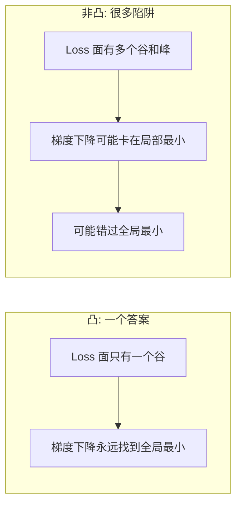
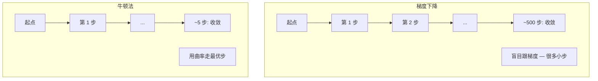
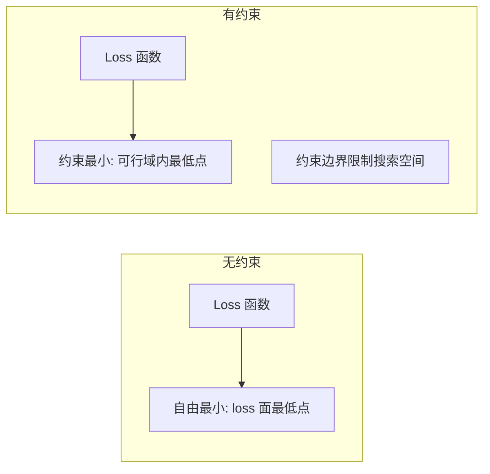
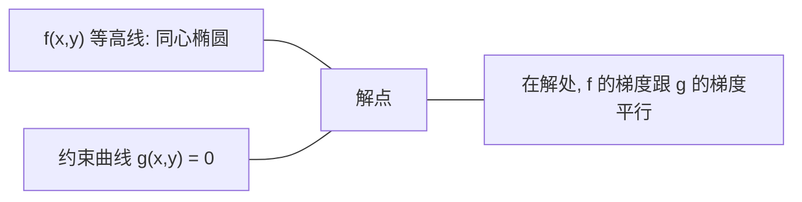

# 凸优化

> 凸问题只有一个谷。神经网络有几百万个。分清这俩的差别很重要。

**Type:** Build
**Language:** Python
**Prerequisites:** Phase 1, Lessons 04 (Calculus for ML), 08 (Optimization)
**Time:** ~90 minutes

## Learning Objectives

- 用定义、二阶导数、Hessian 准则测一个函数是不是凸的
- 实现牛顿法,把它跟梯度下降比二次收敛
- 用拉格朗日乘子解约束优化问题,解释 KKT 条件
- 讲清为啥神经网络 loss 地形非凸,SGD 还是能找到好解

## The Problem

Lesson 08 教你梯度下降、动量、Adam。这些优化器在任何地形上都往下走。但它们没保证。梯度下降在非凸地形上可能掉进一个烂的局部最小、卡在鞍点、或者永远震荡。你还是用了,因为神经网络非凸,没别的办法。

但 ML 里很多问题是凸的。线性回归、逻辑回归、SVM、LASSO、岭回归。对这些,有更强的: 带数学保证的优化。凸问题只有一个谷。任何往下的算法都能到全局最小。不用重启。不用学习率调度。不用祈祷。

理解凸性能给你三件事。第一,它告诉你啥时候你的问题简单(凸)还是难(非凸)。第二,它给你更快的工具,像凸问题的牛顿法。第三,它解释 ML 里到处出现的概念: 正则当约束、SVM 里的对偶性、还有为啥深度学习能干成虽然它违反了凸性给的每个好性质。

## The Concept

### 凸集

集合 S 是凸的,当 S 里任意两点之间的线段也完全在 S 里。

| 凸集 | 非凸 |
|---|---|
| **矩形**: 内部任意两点能用一条线段连起来且都在内部 | **星形/月牙形**: 内部两点之间的线会跑出集合 |
| **三角形**: 同样性质对所有内部点 | **甜甜圈/环**: 有洞,有些线段会跑出去 |
| 任意两点之间的线段待在集合里 | 某些点对的线段跑出集合 |

形式化测试: 对 S 里任意点 x、y 和任意 t ∈ [0, 1],点 tx + (1-t)y 也在 S 里。

凸集例子:
- 一条线、一个平面、整个 R^n
- 球(圆、球、超球)
- 半空间: {x : a^T x ≤ b}
- 任意多个凸集的交

非凸集例子:
- 甜甜圈(环)
- 两个不相交圆的并
- 任何有"凹"或"洞"的集合

### 凸函数

函数 f 是凸的,如果它的定义域是凸集,且对定义域里任意 x、y 和任意 t ∈ [0, 1]:

```
f(tx + (1-t)y) ≤ t*f(x) + (1-t)*f(y)
```

几何上: 图上任意两点之间的线段待在图上或上方。

| 性质 | 凸函数 | 非凸函数 |
|---|---|---|
| **线段测试** | 图上任意两点之间的线在曲线上方或**贴着**曲线 | 某些点之间的线**插到**曲线下面 |
| **形状** | 单个向上开口的碗/谷 | 多个峰谷,曲率混杂 |
| **局部最小** | 每个局部最小都是全局最小 | 多个局部最小,高度不一样 |

常见凸函数:
- f(x) = x² (抛物线)
- f(x) = |x| (绝对值)
- f(x) = e^x (指数)
- f(x) = max(0, x) (ReLU,虽然分段线性)
- f(x) = -log(x) 对 x > 0 (负对数)
- 任何线性函数 f(x) = a^T x + b (既凸又凹)

### 测凸性

三种实用测试,从最易到最严。

**测试 1:二阶导数测试(1D)。** f''(x) ≥ 0 对所有 x,则 f 凸。
- f(x) = x²: f''(x) = 2 ≥ 0。凸。
- f(x) = x³: f''(x) = 6x。x < 0 时负。不凸。
- f(x) = e^x: f''(x) = e^x > 0。凸。

**测试 2:Hessian 测试(多维)。** Hessian 矩阵 H(x) 对所有 x 半正定,则 f 凸。Hessian 是二阶偏导矩阵。

**测试 3:定义测试。** 直接查不等式 f(tx + (1-t)y) ≤ t*f(x) + (1-t)*f(y)。导数难算时有用。

### 为啥凸性重要

凸优化的中心定理:

**凸函数的每个局部最小都是全局最小。**

这意味着梯度下降不会卡。任何下坡路都到同一个答案。算法保证收敛到最优解。



后果:
- 不用随机重启
- 不用花哨的学习率调度
- 收敛证明是可能的(速率取决于函数性质)
- 解唯一(到平区为止)

### ML 里凸 vs 非凸

| 问题 | 凸吗 | 为啥 |
|---------|---------|-----|
| 线性回归 (MSE) | 是 | loss 对权重是二次的 |
| 逻辑回归 | 是 | 对数 loss 对权重凸 |
| SVM (hinge loss) | 是 | 线性函数的最大值 |
| LASSO (L1 回归) | 是 | 凸函数之和还是凸 |
| 岭回归 (L2) | 是 | 二次 + 二次 = 凸 |
| 神经网络(任何 loss) | 否 | 非线性激活造出非凸地形 |
| k-means 聚类 | 否 | 离散分配步骤 |
| 矩阵分解 | 否 | 未知数相乘 |

带凸 loss 的线性模型是凸的。一加带非线性激活的隐藏层,凸性就破。

### Hessian 矩阵

f: R^n → R 的 Hessian H 是 n × n 的二阶偏导矩阵。

```
H[i][j] = d²f / (dx_i dx_j)
```

对 f(x, y) = x² + 3xy + y²:

```
df/dx = 2x + 3y       d²f/dx² = 2      d²f/dxdy = 3
df/dy = 3x + 2y       d²f/dydx = 3      d²f/dy² = 2

H = [ 2  3 ]
    [ 3  2 ]
```

Hessian 告诉你曲率:
- 特征值全正: 函数在每方向上向上曲(这点凸)
- 特征值全负: 每方向向下曲(凹,局部最大)
- 符号混: 鞍点(某些方向上,某些下)
- 零特征值: 该方向平(退化)

凸性要求 Hessian 半正定(所有特征值 ≥ 0)处处成立,不只是某一点。

### 牛顿法

梯度下降用一阶信息(梯度)。牛顿法用二阶信息(Hessian)。它在当前点拟合一个二次近似,直接跳到那个二次的最小。

```
更新规则:
  x_new = x - H⁻¹ * gradient

对比梯度下降:
  x_new = x - lr * gradient
```

牛顿法用逆 Hessian 替换标量学习率。这根据局部曲率自动调整步长和方向。



优点:
- 最小值附近二次收敛(误差每步平方)
- 不用调学习率
- 尺度不变(跟怎么参数化无关)

缺点:
- 算 Hessian 要 O(n²) 内存、O(n³) 求逆
- 100 万参数的神经网络是 10¹² 项和 10¹⁸ 操作
- 深度学习不实用

### 约束优化

无约束优化: 在所有 x 上最小化 f(x)。
约束优化: 最小化 f(x) 但要满足约束。

真实问题有约束。你想最小化成本但预算有限。你想最小化误差但模型复杂度有界。



### 拉格朗日乘子

拉格朗日乘子法把约束问题转成无约束的。

问题: 最小化 f(x) 满足 g(x) = 0。

解: 引入新变量(拉格朗日乘子 λ)解无约束问题:

```
L(x, λ) = f(x) + λ * g(x)
```

在解处 L 的梯度为零:

```
dL/dx = df/dx + λ * dg/dx = 0
dL/dλ = g(x) = 0
```

几何直觉: 在约束最小处,f 的梯度必须跟 g 的梯度平行。如果不平行,你就能沿约束面走,把 f 进一步减小。



例子: 最小化 f(x,y) = x² + y² 满足 x + y = 1。

```
L = x² + y² + λ(x + y - 1)

dL/dx = 2x + λ = 0  =>  x = -λ/2
dL/dy = 2y + λ = 0  =>  y = -λ/2
dL/dλ = x + y - 1 = 0

从前两式: x = y
代入: 2x = 1,所以 x = y = 0.5, λ = -1
```

直线 x + y = 1 上离原点最近的点是 (0.5, 0.5)。

### KKT 条件

Karush-Kuhn-Tucker 条件把拉格朗日乘子推广到不等式约束。

问题: 最小化 f(x) 满足 g_i(x) ≤ 0 对 i = 1, ..., m。

KKT 条件(最优的必要条件):

```
1. 平稳性:         df/dx + Σ (λ_i * dg_i/dx) = 0
2. 原可行性:       g_i(x) ≤ 0  对所有 i
3. 对偶可行性:     λ_i ≥ 0  对所有 i
4. 互补松弛:       λ_i * g_i(x) = 0  对所有 i
```

互补松弛是关键洞见: 要么约束活跃(g_i = 0,解在边界上),要么乘子为零(约束没影响)。不影响解的约束 λ = 0。

KKT 条件是 SVM 的核心。支持向量就是"约束活跃"(λ > 0)的数据点。所有其他数据点 λ = 0,不影响决策边界。

### 正则当约束优化

L1 和 L2 正则不是随便想的 trick。它们是约束优化问题的伪装。

**L2 正则(岭):**

```
最小化  Loss(w)  满足  ||w||² ≤ t

等价无约束形式:
最小化  Loss(w) + λ * ||w||²
```

约束 ||w||² ≤ t 定义一个球(2D 是圆,3D 是球)。解在 loss 等高线首次碰到这个球的地方。

**L1 正则(LASSO):**

```
最小化  Loss(w)  满足  ||w||_1 ≤ t

等价无约束形式:
最小化  Loss(w) + λ * ||w||_1
```

约束 ||w||_1 ≤ t 定义一个菱形(2D 是斜放的方)。

| 性质 | L2 约束(圆) | L1 约束(菱形) |
|---|---|---|
| **约束形状** | 圆(高维是球) | 菱形(2D 是斜方) |
| **loss 等高线碰哪** | 平滑边界 — 圆上任何点 | 角 — 对齐轴 |
| **解的行为** | 权重小但非零 | 有些权重恰好为零(稀疏) |
| **结果** | 权重收缩 | 特征选择 |

这就解释了为啥 L1 产生稀疏模型(特征选择)而 L2 只收缩权重。菱形有角跟轴对齐。loss 等高线更可能碰一个角,把一个或多个权重正好设到 0。

### 对偶性

每个约束优化问题(原问题)都有一个伴生问题(对偶)。对凸问题,原和对偶有相同的最优值。这就是强对偶。

拉格朗日对偶函数:

```
原问题: 最小化 f(x) 满足 g(x) ≤ 0
拉格朗日: L(x, λ) = f(x) + λ * g(x)
对偶函数: d(λ) = min_x L(x, λ)
对偶问题: 最大化 d(λ) 满足 λ ≥ 0
```

为啥对偶重要:
- 对偶问题有时比原问题好解
- SVM 在对偶形式下解,问题只依赖数据点之间的点积(这才让核技巧能用)
- 对偶给出原最优值的下界,用来检查解的质量

对 SVM 具体:

```
原问题: 找 w、b 最大间隔 2/||w|| 满足
        y_i(w^T x_i + b) ≥ 1 对所有 i

对偶:   最大化 Σ(α_i) - 0.5 * Σ_ij(α_i * α_j * y_i * y_j * x_i^T x_j)
        满足 α_i ≥ 0 和 Σ(α_i * y_i) = 0

对偶只涉及点积 x_i^T x_j。
把 x_i^T x_j 换成 K(x_i, x_j) 就得到核技巧。
```

### 为啥深度学习能行,虽然非凸

神经网络 loss 严重非凸。按每个经典标准,优化它们应该失败。但 SGD 稳定地找到好解。几个因素解释这个。

**大部分局部最小都够好。** 高维空间里,随机临界点(梯度为零处)压倒性是鞍点,不是局部最小。少数真实存在的局部最小,loss 值都接近全局最小。参数空间有几百万维时,掉进一个烂的局部最小概率极低。

**鞍点,不是局部最小,才是真障碍。** 有 n 个参数的函数,鞍点有正负曲率方向混。随机高维临界点的"所有 n 个特征值都正"(局部最小)概率约 2^(-n)。几乎所有临界点都是鞍点。SGD 的噪声帮逃。

**过参数化把地形变光滑。** 参数量比训练样本多的网络有更光滑、更连通的 loss 面。更宽的网络坏局部最小更少。这反直觉但经验一致。

**Loss 地形结构:**

| 性质 | 低维空间 | 高维空间 |
|---|---|---|
| **地形** | 多个孤立的峰谷 | 光滑连通的谷 |
| **最小** | 多个孤立局部最小 | 几乎没坏局部最小;大多接近最优 |
| **导航** | 难找全局最小 | 很多路都到好解 |
| **临界点** | 局部最小和鞍点混 | 压倒性是鞍点,不是局部最小 |

**随机噪声是隐式正则。** Mini-batch SGD 加噪声,防卡在尖锐最小。尖锐最小过拟合;平坦最小泛化好。噪声把优化偏向 loss 地形里的平坦区。

### 二阶方法实际中

纯牛顿法对大模型不实际。几种近似让二阶信息可用。

**L-BFGS(限内存 BFGS):** 用最近 m 个梯度差近似逆 Hessian。要 O(mn) 内存,不是 O(n²)。对 ~10000 参数以下的问题工作良好。用在经典 ML(逻辑回归、CRF),不用在深度学习。

**自然梯度:** 用 Fisher 信息矩阵(对数似然的期望 Hessian)代替标准 Hessian。这考虑概率分布的几何。K-FAC(Kronecker 分解近似曲率)把 Fisher 矩阵近似成 Kronecker 积,让神经网络能实用。

**无 Hessian 优化:** 用共轭梯度解 Hx = g,从不显式构造 H。只要求 Hessian-向量积,可以通过自动微分用 O(n) 时间算。

**对角近似:** Adam 的二阶矩就是 Hessian 对角的近似。AdaHessian 扩展这个,用 Hutchinson 估计器取实际 Hessian 对角元。

| 方法 | 内存 | 每步代价 | 啥时候用 |
|--------|--------|--------------|-------------|
| 梯度下降 | O(n) | O(n) | 基线、大模型 |
| 牛顿法 | O(n²) | O(n³) | 小凸问题 |
| L-BFGS | O(mn) | O(mn) | 中等凸问题 |
| Adam | O(n) | O(n) | 深度学习默认 |
| K-FAC | O(n) | 每层 O(n) | 研究、大 batch 训练 |

## Build It

### Step 1: 凸性检查器

搭一个通过采样点查定义的函数来测凸性。

```python
import random
import math

def check_convexity(f, dim, bounds=(-5, 5), samples=1000):
    violations = 0
    for _ in range(samples):
        x = [random.uniform(*bounds) for _ in range(dim)]
        y = [random.uniform(*bounds) for _ in range(dim)]
        t = random.uniform(0, 1)
        mid = [t * xi + (1 - t) * yi for xi, yi in zip(x, y)]
        lhs = f(mid)
        rhs = t * f(x) + (1 - t) * f(y)
        if lhs > rhs + 1e-10:
            violations += 1
    return violations == 0, violations
```

### Step 2: 2D 牛顿法

用显式 Hessian 实现牛顿法。跟梯度下降比收敛速度。

```python
def newtons_method(f, grad_f, hessian_f, x0, steps=50, tol=1e-12):
    x = list(x0)
    history = [x[:]]
    for _ in range(steps):
        g = grad_f(x)
        H = hessian_f(x)
        det = H[0][0] * H[1][1] - H[0][1] * H[1][0]
        if abs(det) < 1e-15:
            break
        H_inv = [
            [H[1][1] / det, -H[0][1] / det],
            [-H[1][0] / det, H[0][0] / det],
        ]
        dx = [
            H_inv[0][0] * g[0] + H_inv[0][1] * g[1],
            H_inv[1][0] * g[0] + H_inv[1][1] * g[1],
        ]
        x = [x[0] - dx[0], x[1] - dx[1]]
        history.append(x[:])
        if sum(gi ** 2 for gi in g) < tol:
            break
    return history
```

### Step 3: 拉格朗日乘子求解器

用拉格朗日上跑梯度下降解约束优化。

```python
def lagrange_solve(f_grad, g_val, g_grad, x0, lr=0.01,
                   lr_lambda=0.01, steps=5000):
    x = list(x0)
    lam = 0.0
    history = []
    for _ in range(steps):
        fg = f_grad(x)
        gv = g_val(x)
        gg = g_grad(x)
        x = [
            xi - lr * (fgi + lam * ggi)
            for xi, fgi, ggi in zip(x, fg, gg)
        ]
        lam = lam + lr_lambda * gv
        history.append((x[:], lam, gv))
    return history
```

### Step 4: 一阶 vs 二阶对比

在同一个二次函数上跑梯度下降和牛顿法。数收敛步数。

```python
def quadratic(x):
    return 5 * x[0] ** 2 + x[1] ** 2

def quadratic_grad(x):
    return [10 * x[0], 2 * x[1]]

def quadratic_hessian(x):
    return [[10, 0], [0, 2]]
```

牛顿法会 1 步收敛(对二次是精确的)。梯度下降要几百步,因为 Hessian 特征值差 5 倍,造成拉长的谷。

## Use It

凸性分析直接用在选 ML 模型和求解器上。

凸问题(逻辑回归、SVM、LASSO):
- 用专门的求解器(liblinear、CVXPY、scipy.optimize.minimize 的 method='L-BFGS-B')
- 期望一个唯一的全局解
- 二阶方法实用且快

非凸问题(神经网络):
- 用一阶方法(SGD、Adam)
- 接受解依赖初始化和随机性
- 用过参数化、噪声、学习率调度当隐式正则
- 别浪费时间找全局最小。一个好的局部最小就够。

```python
from scipy.optimize import minimize

result = minimize(
    fun=lambda w: sum((y - X @ w) ** 2) + 0.1 * sum(w ** 2),
    x0=np.zeros(d),
    method='L-BFGS-B',
    jac=lambda w: -2 * X.T @ (y - X @ w) + 0.2 * w,
)
```

SVM 用对偶公式用核技巧:

```python
from sklearn.svm import SVC

svm = SVC(kernel='rbf', C=1.0)
svm.fit(X_train, y_train)
print(f"支持向量: {svm.n_support_}")
```

## Exercises

1. **凸性画廊。** 用检查器测这些函数的凸性: f(x) = x⁴, f(x) = sin(x), f(x,y) = x² + y², f(x,y) = x*y, f(x) = max(x, 0)。解释每个结果为啥说得通。
2. **牛顿 vs 梯度下降赛跑。** 在 f(x,y) = 50*x² + y² 上从 (10, 10) 跑两种方法。每种要多少步到 loss < 1e-10?条件数(Hessian 最大最小特征值比)增加时梯度下降会怎样?
3. **拉格朗日乘子几何。** 最小化 f(x,y) = (x-3)² + (y-3)² 满足 x + 2y = 4。验证解处 f 的梯度跟 g 的梯度平行。
4. **正则约束。** 实现 L1 约束优化: 最小化 (x-3)² + (y-2)² 满足 |x| + |y| ≤ 1。展示解有一个坐标等于 0(菱形约束带来的稀疏)。
5. **Hessian 特征值分析。** 算 Rosenbrock 函数在 (1,1) 和 (-1,1) 的 Hessian。算两点的特征值。特征值告诉你最小值附近 vs 远离最小值的曲率是啥?

## Key Terms

| Term | What it means |
|------|---------------|
| Convex set | 集合里任意两点之间的线段都还在集合里 |
| Convex function | 图上任意两点之间的线都在图上或上方。等价:Hessian 处处半正定 |
| Local minimum | 比所有邻近点都低的点。凸函数上,每个局部最小都是全局最小 |
| Global minimum | 函数在整个定义域上的最低点 |
| Hessian matrix | 所有二阶偏导组成的矩阵。编码曲率信息 |
| Positive semidefinite | 矩阵所有特征值非负。"二阶导 ≥ 0"的多维类比 |
| Condition number | Hessian 最大最小特征值比。高条件数 = 拉长的谷 = 慢梯度下降 |
| Newton's method | 用逆 Hessian 决定步方向和大小的二阶优化器。最小值附近二次收敛 |
| Lagrange multiplier | 为把约束优化问题转成无约束而引入的变量 |
| KKT conditions | 不等式约束下最优性的必要条件。推广拉格朗日乘子 |
| Complementary slackness | 在解处,要么约束活跃,要么乘子为零。不会两个都非零 |
| Duality | 每个约束问题有个伴生对偶问题。凸问题两者最优值相同 |
| Strong duality | 原和对偶最优值相等。对满足 Slater 条件的凸问题成立 |
| L-BFGS | 用最近 m 个梯度差近似逆 Hessian 的近似二阶方法 |
| Saddle point | 梯度为零的点,但某些方向最小、某些方向最大 |
| Overparameterization | 用比训练样本更多的参数。把 loss 面变光滑,减少坏局部最小 |

## Further Reading

- [Boyd & Vandenberghe: Convex Optimization](https://web.stanford.edu/~boyd/cvxbook/) - 标准教材,免费在线
- [Bottou, Curtis, Nocedal: Optimization Methods for Large-Scale Machine Learning (2018)](https://arxiv.org/abs/1606.04838) - 把凸优化理论和深度学习实战连起来
- [Choromanska et al.: The Loss Surfaces of Multilayer Networks (2015)](https://arxiv.org/abs/1412.0233) - 为啥非凸神经网络地形没那么糟
- [Nocedal & Wright: Numerical Optimization](https://link.springer.com/book/10.1007/978-0-387-40065-5) - 牛顿法、L-BFGS、约束优化的综合参考
