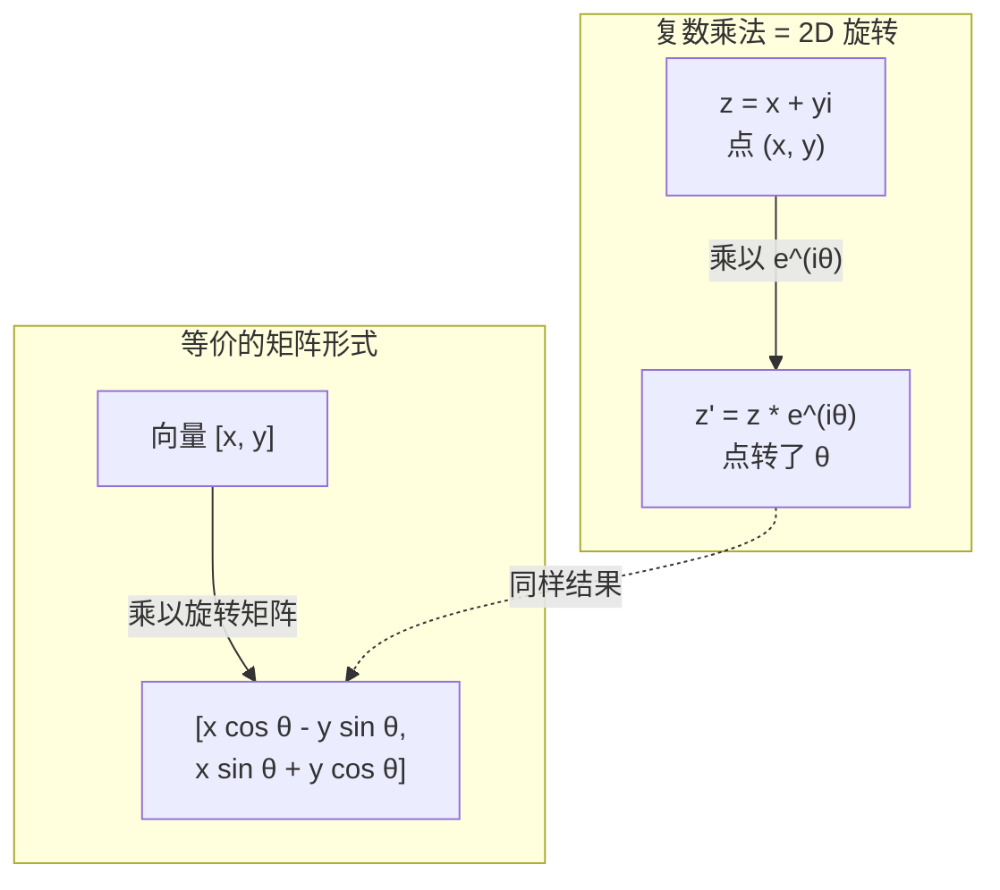
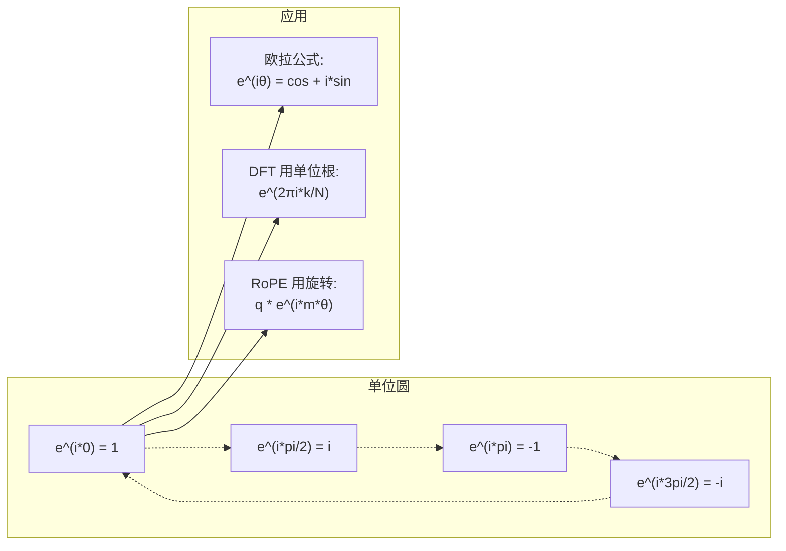

# AI 里的复数

> -1 的平方根不是"虚"的。它是旋转、频率、半个信号处理的关键。

**Type:** Learn
**Language:** Python
**Prerequisites:** Phase 1, Lessons 01-04 (linear algebra, calculus)
**Time:** ~60 minutes

## Learning Objectives

- 在直角坐标和极坐标形式下做复数算术(加、乘、除、共轭)
- 用欧拉公式在复指数和三角函数之间转换
- 用复数单位根实现离散傅里叶变换
- 解释复旋转怎么成为 RoPE 和 transformer 中正弦位置编码的基础

## The Problem

你打开一篇傅里叶变换的论文,满篇 `i`。你看 transformer 的位置编码,看到不同频率的 `sin` 和 `cos` —— 那是复指数的实部和虚部。你看量子计算的东西,所有都用复向量空间表示。

复数看着抽象。基于 -1 平方根的数体系感觉像数学 trick。但它不是 trick。它是旋转和振荡的自然语言。每次东西旋转、振动、振荡,复数就是对的工具。

不懂复数,你搞不懂离散傅里叶变换。搞不懂 FFT。搞不懂 RoPE(Rotary Position Embedding)怎么在现代语言模型里工作。搞不懂原版 Transformer 论文里正弦位置编码为啥用那些频率。

这节课从零搭复数算术,把它跟几何连起来,告诉你复数具体在机器学习的哪里出现。

## The Concept

### 复数是啥

复数有两部分: 实部和虚部。

```
z = a + bi

其中:
  a 是实部
  b 是虚部
  i 是虚数单位,定义为 i² = -1
```

就这样。你把数线扩展到平面。实数坐一根轴上,虚数坐另一根上。每个复数都是这个平面里的一个点。

### 复数算术

**加法。** 实部相加,虚部相加。

```
(a + bi) + (c + di) = (a + c) + (b + d)i

例子: (3 + 2i) + (1 + 4i) = 4 + 6i
```

**乘法。** 用分配律,记住 i² = -1。

```
(a + bi)(c + di) = ac + adi + bci + bdi²
                 = ac + adi + bci - bd
                 = (ac - bd) + (ad + bc)i

例子: (3 + 2i)(1 + 4i) = 3 + 12i + 2i + 8i²
                            = 3 + 14i - 8
                            = -5 + 14i
```

**共轭。** 翻虚部的符号。

```
共轭 (a + bi) = a - bi
```

复数和它的共轭乘积永远是实数:

```
(a + bi)(a - bi) = a² + b²
```

**除法。** 分子分母都乘分母的共轭。

```
(a + bi) / (c + di) = (a + bi)(c - di) / (c² + d²)
```

这消掉分母的虚部,给你一个干净的复数。

### 复平面

复平面把每个复数映到 2D 点。横轴是实轴,纵轴是虚轴。

```
z = 3 + 2i  对应点 (3, 2)
z = -1 + 0i 对应实轴上的点 (-1, 0)
z = 0 + 4i  对应虚轴上的点 (0, 4)
```

复数同时是一个点和从原点出发的向量。这种双重解释就是复数对几何有用的原因。

### 极坐标形式

平面任何点都能用"离原点多远"和"跟正实轴成多少角"描述。

```
z = r * (cos(θ) + i*sin(θ))

其中:
  r = |z| = sqrt(a² + b²)     (模)
  θ = atan2(b, a)             (辐角)
```

直角形式 (a + bi) 适合加法。极坐标形式 (r, θ) 适合乘法。

**极坐标下乘法。** 模相乘,角相加。

```
z1 = r1 * e^(iθ1)
z2 = r2 * e^(iθ2)

z1 * z2 = (r1 * r2) * e^(i(θ1 + θ2))
```

这就是为啥复数是描述旋转的完美工具。乘以模为 1 的复数就是纯旋转。

### 欧拉公式

复指数和三角函数之间的桥:

```
e^(iθ) = cos(θ) + i*sin(θ)
```

这是这节课最重要的公式。当 θ = π:

```
e^(iπ) = cos(π) + i*sin(π) = -1 + 0i = -1

所以: e^(iπ) + 1 = 0
```

五个基本常数(e、i、π、1、0)在一个等式里连起来。

### 欧拉公式对 ML 为啥重要

欧拉公式说 `e^(iθ)` 随 θ 变化描出单位圆。θ = 0 时在 (1, 0)。θ = π/2 时在 (0, 1)。θ = π 时在 (-1, 0)。θ = 3π/2 时在 (0, -1)。一整圈转是 θ = 2π。

这意味着复指数就是旋转。旋转在信号处理和 ML 里到处都是。

### 跟 2D 旋转的联系

把复数 (x + yi) 乘以 e^(iθ) 把点 (x, y) 绕原点转 θ 角。

```
复数乘法旋转:
  (x + yi) * (cos(θ) + i*sin(θ))
  = (x*cos(θ) - y*sin(θ)) + (x*sin(θ) + y*cos(θ))i

矩阵乘法旋转:
  [cos(θ)  -sin(θ)] [x]   [x*cos(θ) - y*sin(θ)]
  [sin(θ)   cos(θ)] [y] = [x*sin(θ) + y*cos(θ)]
```

它们产出一样的结果。复数乘法就是 2D 旋转。旋转矩阵只是复数乘法的矩阵写法。



### 相量和旋转信号

复指数 e^(iωt) 是绕单位圆以角频率 ω 旋转的点。t 增大时,点描出圆。

旋转点的实部是 cos(ωt),虚部是 sin(ωt)。正弦信号就是旋转复数的"影子"。

```
e^(iωt) = cos(ωt) + i*sin(ωt)

实部:     cos(ωt)    -- 余弦波
虚部:     sin(ωt)    -- 正弦波
```

这就是相量表示。不用跟一个抖的正弦波较劲,跟一支平稳转的箭头。相移就是角偏移,幅度变化就是大小变化,信号相加就是向量相加。

### 单位根

N 次单位根是单位圆上 N 个等距点:

```
w_k = e^(2πi*k/N)    对 k = 0, 1, 2, ..., N-1
```

N = 4 时,根是: 1, i, -1, -i(四个罗盘点)。
N = 8 时,得到四个罗盘点加四个对角线点。

单位根是离散傅里叶变换的根基。DFT 把信号拆成这 N 个等距频率上的分量。

### 跟 DFT 的联系

信号 x[0], x[1], ..., x[N-1] 的离散傅里叶变换是:

```
X[k] = Σ_{n=0}^{N-1} x[n] * e^(-2πi*k*n/N)
```

每个 X[k] 衡量信号跟第 k 个单位根 —— 一个频率为 k 的复正弦 —— 的相关度。DFT 把信号拆成 N 个转的相量,告诉你每个的幅度和相位。

### 为啥 i 不是"虚"的

"虚"这个词是历史上的意外。笛卡尔轻蔑地用了它。但 i 不比当年被拒绝的负数更"虚"。负数回答"3 减 5 等于啥",虚数单位回答"啥东西平方等于 -1"。

更有用的是: i 是个 90 度旋转算子。一个实数乘 i 一次,转到虚轴 90 度。再乘 i(i²),再转 90 度 —— 现在指负实方向。这就是为啥 i² = -1。它不神秘。它是两次 90 度构成的半转。

这就是为啥复数在工程里到处出现。任何旋转的 —— 电磁波、量子态、信号振荡、位置编码 —— 天然用复数描述。

### 复指数 vs 三角函数

在欧拉公式之前,工程师把信号写成 A*cos(ωt + φ) —— 幅度 A,频率 ω,相位 φ。这样能写,但算术很难。加两个不同相位的余弦要三角恒等式。

用复指数,同样的信号是 A*e^(i(ωt + φ))。两个信号相加就是两个复数相加。相乘(调制)就是模乘加角加。相移就是角加。频移就是乘相量。

整个信号处理领域切到复指数记法,数学更干净。"实信号"永远就是复表示的实部。虚部当记账,所有代数都自然了。

### 跟 Transformer 的联系

**正弦位置编码**(原版 Transformer 论文):

```
PE(pos, 2i)   = sin(pos / 10000^(2i/d))
PE(pos, 2i+1) = cos(pos / 10000^(2i/d))
```

sin/cos 对是不同频率复指数的实部和虚部。每个频率给编码位置一个不同的"分辨率"。低频变化慢(粗位置),高频变化快(细位置)。合起来给每个位置一个唯一的频率指纹。

**RoPE(Rotary Position Embedding)** 更进一步。它显式把 query 和 key 向量乘以复旋转矩阵。两个 token 之间的相对位置变成一个旋转角。注意力用这些转过的向量算,让模型通过复乘法对相对位置敏感。

| 运算 | 代数形式 | 几何含义 |
|-----------|---------------|-------------------|
| 加法 | (a+c) + (b+d)i | 平面里的向量加 |
| 乘法 | (ac-bd) + (ad+bc)i | 旋转加缩放 |
| 共轭 | a - bi | 对实轴反射 |
| 模 | sqrt(a² + b²) | 离原点的距离 |
| 相位 | atan2(b, a) | 跟正实轴的角 |
| 除法 | 乘共轭 | 反向旋转再缩放 |
| 幂 | r^n * e^(i*nθ) | 转 n 次,缩 r^n 倍 |



## Build It

### Step 1: Complex 类

建一个 Complex 类支持算术、模、相位、直角极坐标互转。

```python
import math

class Complex:
    def __init__(self, real, imag=0.0):
        self.real = real
        self.imag = imag

    def __add__(self, other):
        return Complex(self.real + other.real, self.imag + other.imag)

    def __mul__(self, other):
        r = self.real * other.real - self.imag * other.imag
        i = self.real * other.imag + self.imag * other.real
        return Complex(r, i)

    def __truediv__(self, other):
        denom = other.real ** 2 + other.imag ** 2
        r = (self.real * other.real + self.imag * other.imag) / denom
        i = (self.imag * other.real - self.real * other.imag) / denom
        return Complex(r, i)

    def magnitude(self):
        return math.sqrt(self.real ** 2 + self.imag ** 2)

    def phase(self):
        return math.atan2(self.imag, self.real)

    def conjugate(self):
        return Complex(self.real, -self.imag)
```

### Step 2: 极坐标转换和欧拉公式

```python
def to_polar(z):
    return z.magnitude(), z.phase()

def from_polar(r, theta):
    return Complex(r * math.cos(theta), r * math.sin(theta))

def euler(theta):
    return Complex(math.cos(theta), math.sin(theta))
```

验: `euler(theta).magnitude()` 应该永远 1.0。`euler(0)` 应该给 (1, 0)。`euler(pi)` 应该给 (-1, 0)。

### Step 3: 旋转

旋转点 (x, y) θ 角就是一次复数乘法:

```python
point = Complex(3, 4)
rotated = point * euler(math.pi / 4)
```

模不变,只有角变。

### Step 4: 从复数算术出发的 DFT

```python
def dft(signal):
    N = len(signal)
    result = []
    for k in range(N):
        total = Complex(0, 0)
        for n in range(N):
            angle = -2 * math.pi * k * n / N
            total = total + Complex(signal[n], 0) * euler(angle)
        result.append(total)
    return result
```

这是 O(N²) 的 DFT。每个输出 X[k] 是信号样本乘单位根的和。

### Step 5: 逆 DFT

逆 DFT 从频谱重建原信号。相对正向 DFT 唯一的变化: 翻转指数符号,除以 N。

```python
def idft(spectrum):
    N = len(spectrum)
    result = []
    for n in range(N):
        total = Complex(0, 0)
        for k in range(N):
            angle = 2 * math.pi * k * n / N
            total = total + spectrum[k] * euler(angle)
        result.append(Complex(total.real / N, total.imag / N))
    return result
```

完美重建。跑 DFT 再跑 IDFT,你拿回原信号到机器精度。信息不丢。

### Step 6: 单位根

```python
def roots_of_unity(N):
    return [euler(2 * math.pi * k / N) for k in range(N)]
```

验两个性质:
- 每个根的模恰好 1。
- 所有 N 个根之和为 0(对称抵消)。

这两个性质让 DFT 可逆。单位根组成了频域的正交基。

## Use It

Python 自带复数支持。字面量 `j` 代表虚数单位。

```python
z = 3 + 2j
w = 1 + 4j

print(z + w)
print(z * w)
print(abs(z))

import cmath
print(cmath.phase(z))
print(cmath.exp(1j * cmath.pi))
```

数组上,numpy 原生处理复数:

```python
import numpy as np

z = np.array([1+2j, 3+4j, 5+6j])
print(np.abs(z))
print(np.angle(z))
print(np.conj(z))
print(np.real(z))
print(np.imag(z))

signal = np.sin(2 * np.pi * 5 * np.linspace(0, 1, 128))
spectrum = np.fft.fft(signal)
freqs = np.fft.fftfreq(128, d=1/128)
```

## Ship It

跑 `code/complex_numbers.py` 生成 `outputs/skill-complex-arithmetic.md`。

## Exercises

1. **手算复数算术。** 算 (2 + 3i) * (4 - i) 并用代码验证。再算 (5 + 2i) / (1 - 3i)。把两个结果画在复平面上,检查乘法确实旋转缩放了第一个数。
2. **旋转序列。** 从点 (1, 0) 出发,连续乘以 e^(iπ/6) 12 次。验证 12 次乘完你回到 (1, 0)。打印每步坐标,确认它们描出正 12 边形。
3. **已知信号的 DFT。** 造一个信号 = sin(2π*3*t) + 0.5*sin(2π*7*t),采 32 个点。跑你的 DFT。验幅度谱在频率 3 和 7 处有峰,7 处的峰高是 3 处的一半。
4. **单位根可视化。** 算 8 次单位根。验它们加起来为 0。验乘以原始根 e^(2πi/8) 得下一个根。
5. **旋转矩阵等价。** 对 10 个随机角和 10 个随机点,验证复数乘法跟 2x2 旋转矩阵的矩阵-向量乘法结果一样。打印最大数值差。

## Key Terms

| Term | What it means |
|------|---------------|
| Complex number | 数 a + bi,a 实部、b 虚部、i² = -1 |
| Imaginary unit | 数 i,定义为 i² = -1。哲学上不"虚" —— 它是旋转算子 |
| Complex plane | 2D 平面,x 轴实、y 轴虚。也叫 Argand 平面 |
| Magnitude (modulus) | 离原点的距离: sqrt(a² + b²)。记作 \|z\| |
| Phase (argument) | 跟正实轴的角: atan2(b, a)。记作 arg(z) |
| Conjugate | 对实轴的镜像: a + bi 的共轭是 a - bi |
| Polar form | 把 z 写成 r * e^(iθ) 而不是 a + bi。乘法变易 |
| Euler's formula | e^(iθ) = cos(θ) + i*sin(θ)。把指数和三角连起来 |
| Phasor | 旋转复数 e^(iωt),代表正弦信号 |
| Roots of unity | N 个复数 e^(2πi*k/N),k = 0 到 N-1。单位圆上 N 个等距点 |
| DFT | 离散傅里叶变换。用单位根把信号拆成复正弦分量 |
| RoPE | Rotary Position Embedding。用复数乘法在 transformer 注意力里编码相对位置 |

## Further Reading

- [Visual Introduction to Euler's Formula](https://betterexplained.com/articles/intuitive-understanding-of-eulers-formula/) - 不靠重符号建立几何直觉
- [Su et al.: RoFormer (2021)](https://arxiv.org/abs/2104.09864) - 用复旋转引入 Rotary Position Embedding 的论文
- [Vaswani et al.: Attention Is All You Need (2017)](https://arxiv.org/abs/1706.03762) - 带正弦位置编码的原版 Transformer
- [3Blue1Brown: Euler's formula with introductory group theory](https://www.youtube.com/watch?v=mvmuCPvRoWQ) - 为什么 e^(iπ) = -1 的可视化
- [Needham: Visual Complex Analysis](https://global.oup.com/academic/product/visual-complex-analysis-9780198534464) - 复数最佳的可视化讲解,几何洞见满满
- [Strang: Introduction to Linear Algebra, Ch. 10](https://math.mit.edu/~gs/linearalgebra/) - 线性代数和特征值背景下的复数
