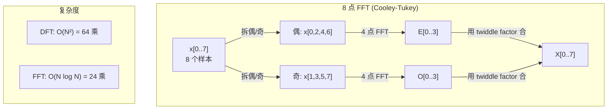
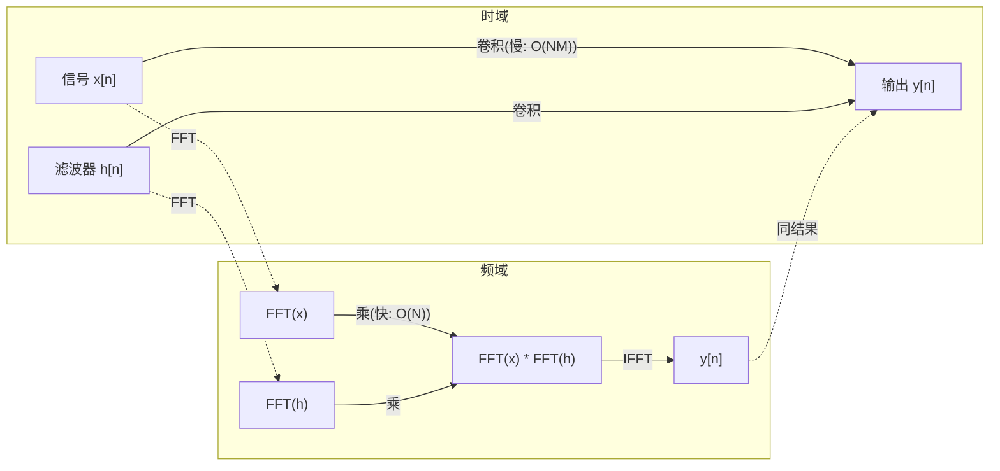

# 傅里叶变换

> 每个信号都是正弦波之和。傅里叶变换告诉你哪几个。

**Type:** Build
**Language:** Python
**Prerequisites:** Phase 1, Lessons 01-04, 19 (complex numbers)
**Time:** ~90 minutes

## Learning Objectives

- 从零实现 DFT,跟 O(N log N) 的 Cooley-Tukey FFT 验证
- 解读频率系数: 从信号里抽幅度、相位、功率谱
- 用卷积定理通过 FFT 乘法做卷积
- 把傅里叶频率分解跟 transformer 位置编码和 CNN 卷积层挂上钩

## The Problem

一段录音是压力随时间的序列。股价是数值随天数的序列。图是像素强度随空间的网格。这些都是时域(或空域)数据。你看到值在某个索引上变。

但很多模式在时域里看不见。这段音频是纯音还是和弦?这只股有周循环吗?这张图有重复纹理吗?这些问题是关于频率内容的,时域把它藏起来。

傅里叶变换把数据从时域转频域。它把信号拆成不同频率的正弦波。每个正弦波有幅度(强度)和相位(起点)。傅里叶变换两个都告诉你。

这跟 ML 有关,因为频域思维到处出现。卷积神经网络做卷积,也就是频域里的乘法。Transformer 位置编码用频率分解来表示位置。音频模型(语音识别、音乐生成)操作的是频谱图 —— 声音的频率表示。时间序列模型找周期模式。搞懂傅里叶变换给你跟这些打交道的词汇。

## The Concept

### DFT 定义

给定 N 个样本 x[0], x[1], ..., x[N-1],离散傅里叶变换产出 N 个频率系数 X[0], X[1], ..., X[N-1]:

```
X[k] = Σ_{n=0}^{N-1} x[n] * e^(-2πi*k*n/N)

对 k = 0, 1, ..., N-1
```

每个 X[k] 是复数。它的 |X[k]| 告诉你频率 k 的幅度。angle(X[k]) 告诉你那个频率的相位偏移。

关键洞见: `e^(-2πi*k*n/N)` 是频率 k 的旋转相量。DFT 算信号跟每个 N 个等距频率的相关度。如果信号在频率 k 含能量,相关度大。如果没有,接近零。

### 每个系数的含义

**X[0]: 直流分量。** 是所有样本之和 —— 跟均值成正比。它代表信号的常数(零频率)偏移。

```
X[0] = Σ_{n=0}^{N-1} x[n] * e^0 = 所有样本之和
```

**X[k] 对 1 <= k <= N/2: 正频率。** X[k] 代表频率 k 周期每 N 样本。k 越大,频率越高(振荡越快)。

**X[N/2]: 奈奎斯特频率。** N 样本能代表的最高频率。再往上就 aliasing —— 高频伪装成低频。

**X[k] 对 N/2 < k < N: 负频率。** 对实信号,X[N-k] = conj(X[k])。负频率是正频率的镜像。这就是为啥有用信息在前 N/2 + 1 个系数里。

### 逆 DFT

逆 DFT 从频率系数重建原信号:

```
x[n] = (1/N) * Σ_{k=0}^{N-1} X[k] * e^(2πi*k*n/N)

对 n = 0, 1, ..., N-1
```

相对正向 DFT 唯一不同: 指数符号为正(不是负),有 1/N 归一化因子。

逆 DFT 是完美重建。信息不丢。你能从时域到频域再回来,零误差。DFT 是换基 —— 用不同的坐标系表达同样的信息。

### FFT:让它快

上面定义的 DFT 是 O(N²): 对 N 个输出系数中每个,你对 N 个输入样本求和。N = 100 万就是 10¹² 操作。

快速傅里叶变换(FFT)用 O(N log N) 算同样的结果。N = 100 万时,约 2000 万操作而不是 1 万亿。这就是频域分析实用的原因。

Cooley-Tukey 算法(最常见的 FFT)走分治:

1. 把信号拆成偶数索引和奇数索引样本
2. 递归算每半边的 DFT
3. 用"twiddle factor" e^(-2πi*k/N) 把两个半尺寸 DFT 合并起来

```
X[k] = E[k] + e^(-2πi*k/N) * O[k]          对 k = 0, ..., N/2 - 1
X[k + N/2] = E[k] - e^(-2πi*k/N) * O[k]    对 k = 0, ..., N/2 - 1

其中 E = 偶数索引样本的 DFT
      O = 奇数索引样本的 DFT
```

对称性意味着每层递归做 O(N) 工作,有 log2(N) 层。总: O(N log N)。



FFT 要求信号长度是 2 的幂。实际中,信号补零到下一个 2 的幂。

### 谱分析

**功率谱**是 |X[k]|² —— 每个频率系数的平方模。展示每个频率有多少能量。

**相位谱**是 angle(X[k]) —— 每个频率的相位偏移。大多数分析任务关心功率谱,忽略相位。

```
频率 k 处功率:  P[k] = |X[k]|² = X[k].real² + X[k].imag²
频率 k 处相位:  φ[k] = atan2(X[k].imag, X[k].real)
```

### 频率分辨率

DFT 的频率分辨率取决于样本数 N 和采样率 fs。

```
第 k 个 bin 的频率:     f_k = k * fs / N
频率分辨率:            Δf = fs / N
最大频率:             f_max = fs / 2  (奈奎斯特)
```

要分辨两个挨得近的频率,你需要更多样本。要抓住高频,你需要更高采样率。

### 卷积定理

这是信号处理里最重要的结果之一,跟 CNN 直接相关。

**时域的卷积等于频域的逐点乘法。**

```
x * h = IFFT(FFT(x) . FFT(h))

其中 * 是卷积,. 是逐点乘
```

为啥重要:
- 直接卷积两个长度 N 和 M 的信号要 O(N*M) 操作。
- FFT 卷积要 O(N log N): 变换两者、相乘、变换回来。
- 对大核,FFT 卷积快得多。
- 这就是大感受野卷积层实际发生的事。

注: DFT 算的是循环卷积(信号绕回)。对线性卷积(不绕回),先都补零到 N + M - 1 长度。



### 加窗

DFT 假设信号是周期的 —— 它把 N 个样本当无限重复信号的一个周期。如果信号不首尾同值,边界就出间断,变成虚假的高频内容。这就是频谱泄漏。

加窗通过在算 DFT 前把信号两端渐变到 0,降低泄漏。

常见窗:

| 窗 | 形状 | 主瓣宽 | 旁瓣水平 | 场景 |
|--------|-------|----------------|-----------------|----------|
| 矩形 | 平(无窗) | 最窄 | 最高 (-13 dB) | 信号在 N 样本里正好周期 |
| Hann | 升余弦 | 中 | 低 (-31 dB) | 通用频谱分析 |
| Hamming | 改余弦 | 中 | 较低 (-42 dB) | 音频处理、语音分析 |
| Blackman | 三重余弦 | 宽 | 很低 (-58 dB) | 旁瓣抑制关键时 |

```
Hann 窗:    w[n] = 0.5 * (1 - cos(2π*n / (N-1)))
Hamming 窗: w[n] = 0.54 - 0.46 * cos(2π*n / (N-1))
```

算 DFT 前逐元素把窗乘上信号: `X = DFT(x * w)`。

### DFT 性质

| 性质 | 时域 | 频域 |
|----------|-------------|-----------------|
| 线性 | a*x + b*y | a*X + b*Y |
| 时移 | x[n - k] | X[f] * e^(-2πi*f*k/N) |
| 频移 | x[n] * e^(2πi*f0*n/N) | X[f - f0] |
| 卷积 | x * h | X * H(逐点) |
| 乘法 | x * h(逐点) | X * H(循环卷积,缩 1/N) |
| Parseval 定理 | Σ \|x[n]\|² | (1/N) * Σ \|X[k]\|² |
| 共轭对称(实输入) | x[n] 实 | X[k] = conj(X[N-k]) |

Parseval 定理说总能量在两个域里相同。能量在变换中守恒。

### 跟位置编码的联系

原版 Transformer 用正弦位置编码:

```
PE(pos, 2i)   = sin(pos / 10000^(2i/d_model))
PE(pos, 2i+1) = cos(pos / 10000^(2i/d_model))
```

每对维度 (2i, 2i+1) 以不同频率振荡。频率几何地从高(维度 0,1)排到低(最后维度)。这给每个位置在所有频带上一个唯一模式 —— 跟傅里叶系数唯一识别一个信号类似。

这给的关键性质:
- **唯一性:** 没有两个位置的编码一样
- **有界值:** sin 和 cos 永远在 [-1, 1]
- **相对位置:** 位置 p+k 的编码可表达为位置 p 编码的线性函数。模型能学关注相对位置

### 跟 CNN 的联系

卷积层通过在信号或图上滑一个学到的滤波器(核)来工作。数学上这就是卷积运算。

按卷积定理,这等价于:
1. FFT 输入
2. FFT 核
3. 频域里乘
4. IFFT 结果

标准 CNN 实现用直接卷积(对 3×3 小核更快)。但对大核或全局卷积,FFT 方法快很多。一些架构(像 FNet)用 FFT 完全换掉注意力,用 O(N log N) 取代 O(N²) 复杂度,达到差不多的准确率。

### 频谱图和短时傅里叶变换

一次 FFT 给你整个信号的频率内容,但不告诉你那些频率什么时候出现。一个 chirp(频率随时间增加的信号)和一个 chord(同时所有频率)能有同样的幅度谱。

短时傅里叶变换(STFT)通过对信号的滑动重叠窗算 FFT 解决这问题。结果是频谱图: 一种 2D 表示,一根轴时间,另一根轴频率。每点的强度展示那时间那频率有多少能量。

```
STFT 过程:
1. 选窗大小(比如 1024 样本)
2. 选 hop 大小(比如 256 样本 -- 75% 重叠)
3. 对每个窗位置:
   a. 抽加窗的段
   b. 加 Hann/Hamming 窗
   c. 算 FFT
   d. 把幅度谱存成频谱图的一列
```

频谱图是音频 ML 模型的标准输入表示。语音识别模型(Whisper、DeepSpeech)操作的是 mel 频谱图 —— 频谱图频率映射到 mel 尺度,更贴近人耳对音高的感知。

### 混叠

如果信号含 fs/2 以上的频率(奈奎斯特频率),用 fs 采样会造出 alias 副本。90 Hz 信号用 100 Hz 采样看起来跟 10 Hz 信号一模一样。没法从样本里区分。

```
例子:
  真信号: 90 Hz 正弦波
  采样率: 100 Hz
  表现频率: 100 - 90 = 10 Hz

  90 Hz 信号用 100 Hz 采的样本
  跟 10 Hz 信号的样本完全一样。
  没有任何数学能恢复原来的 90 Hz。
```

这就是为啥模数转换器包含抗混叠滤波器,在采样前移掉奈奎斯特以上的频率。ML 里,不在适当低通滤波下做特征图下采样时会出现混叠 —— 一些架构用抗混叠池化层处理。

### 补零不增加分辨率

常见误解: 在 FFT 前给信号补零会提高频率分辨率。不会。补零在现有频率 bin 之间插值,给你看着更平滑的谱。但它揭示不了原样本里没有的频率细节。

真实频率分辨率只取决于观测时间 T = N / fs。要分辨相隔 Δf 的两个频率,你需要至少 T = 1 / Δf 秒的数据。补零改不了这个基本极限。

## Build It

### Step 1: 从零写 DFT

O(N²) DFT 直接从定义来。

```python
import math

class Complex:
    ...

def dft(x):
    N = len(x)
    result = []
    for k in range(N):
        total = Complex(0, 0)
        for n in range(N):
            angle = -2 * math.pi * k * n / N
            w = Complex(math.cos(angle), math.sin(angle))
            xn = x[n] if isinstance(x[n], Complex) else Complex(x[n])
            total = total + xn * w
        result.append(total)
    return result
```

### Step 2: 逆 DFT

同样结构,正指数,除以 N。

```python
def idft(X):
    N = len(X)
    result = []
    for n in range(N):
        total = Complex(0, 0)
        for k in range(N):
            angle = 2 * math.pi * k * n / N
            w = Complex(math.cos(angle), math.sin(angle))
            total = total + X[k] * w
        result.append(Complex(total.real / N, total.imag / N))
    return result
```

### Step 3: FFT (Cooley-Tukey)

递归 FFT 要 2 的幂长度。拆成偶/奇,递归,用 twiddle factor 合并。

```python
def fft(x):
    N = len(x)
    if N <= 1:
        return [x[0] if isinstance(x[0], Complex) else Complex(x[0])]
    if N % 2 != 0:
        return dft(x)

    even = fft([x[i] for i in range(0, N, 2)])
    odd = fft([x[i] for i in range(1, N, 2)])

    result = [Complex(0)] * N
    for k in range(N // 2):
        angle = -2 * math.pi * k / N
        twiddle = Complex(math.cos(angle), math.sin(angle))
        t = twiddle * odd[k]
        result[k] = even[k] + t
        result[k + N // 2] = even[k] - t
    return result
```

### Step 4: 谱分析帮手

```python
def power_spectrum(X):
    return [xk.real ** 2 + xk.imag ** 2 for xk in X]

def convolve_fft(x, h):
    N = len(x) + len(h) - 1
    padded_N = 1
    while padded_N < N:
        padded_N *= 2

    x_padded = x + [0.0] * (padded_N - len(x))
    h_padded = h + [0.0] * (padded_N - len(h))

    X = fft(x_padded)
    H = fft(h_padded)

    Y = [xk * hk for xk, hk in zip(X, H)]

    y = idft(Y)
    return [y[n].real for n in range(N)]
```

## Use It

真干活用 numpy 的 FFT,底层是高度优化的 C 库。

```python
import numpy as np

signal = np.sin(2 * np.pi * 5 * np.arange(256) / 256)
spectrum = np.fft.fft(signal)
freqs = np.fft.fftfreq(256, d=1/256)

power = np.abs(spectrum) ** 2

positive_freqs = freqs[:len(freqs)//2]
positive_power = power[:len(power)//2]
```

加窗和更高级谱分析:

```python
from scipy.signal import windows, stft

window = windows.hann(256)
windowed = signal * window
spectrum = np.fft.fft(windowed)
```

卷积:

```python
from scipy.signal import fftconvolve

result = fftconvolve(signal, kernel, mode='full')
```

频谱图:

```python
from scipy.signal import stft

frequencies, times, Zxx = stft(signal, fs=sample_rate, nperseg=256)
spectrogram = np.abs(Zxx) ** 2
```

频谱图矩阵 shape (n_frequencies, n_time_frames)。每列是那时间窗的功率谱。这就是音频 ML 模型吃的输入。

## Ship It

跑 `code/fourier.py` 生成 `outputs/prompt-spectral-analyzer.md`。

## Exercises

1. **纯音识别。** 造一个未知频率(1-50 Hz)的单正弦波信号,128 Hz 采 1 秒。用你的 DFT 识别频率。验证答案对。加上标准差 0.5 的高斯噪声再来一次。噪声怎么影响谱?
2. **FFT vs DFT 验证。** 造 64 长度随机信号。算 DFT(O(N²)) 和 FFT。验证所有系数在 1e-10 内匹配。在 256、512、1024、2048 长度上对两个函数计时。画 DFT 时间比 FFT 时间的比。
3. **用例子证卷积定理。** 造信号 x = [1, 2, 3, 4, 0, 0, 0, 0] 和滤波器 h = [1, 1, 1, 0, 0, 0, 0, 0]。直接算它们的循环卷积(嵌套循环)。再通过 FFT 算(变换、乘、逆变换)。验证结果匹配。现在通过适当补零做线性卷积。
4. **加窗效果。** 造两个挨得近的正弦波(10 Hz 和 12 Hz)之和的信号。128 Hz 采 1 秒。算不用窗、Hann 窗、Hamming 窗的功率谱。哪个窗让两个峰最容易分?为啥?
5. **位置编码分析。** 给 d_model = 128 和 max_pos = 512 生成正弦位置编码。对每对位置 (p1, p2),算它们编码的点积。展示点积只依赖 |p1 - p2|,不依赖绝对位置。距离增加时点积怎么变?

## Key Terms

| Term | What it means |
|------|---------------|
| DFT (Discrete Fourier Transform) | 把 N 个时域样本转 N 个频域系数。每个系数是跟那频率复正弦的相关度 |
| FFT (Fast Fourier Transform) | 算 DFT 的 O(N log N) 算法。Cooley-Tukey 递归拆偶/奇索引 |
| Inverse DFT | 从频率系数重建时域信号。同公式,指数符号翻转,1/N 缩放 |
| Frequency bin | DFT 输出每个索引 k 代表频率 k*fs/N Hz。"bin" 是离散频率槽 |
| DC component | X[0],零频率系数。跟信号均值成正比 |
| Nyquist frequency | fs/2,采样率 fs 能代表的最高频率。再上就混叠 |
| Power spectrum | \|X[k]\|²,每个频率系数的平方模。展示频率间能量分布 |
| Phase spectrum | angle(X[k]),每个频率分量的相位偏移。分析中常忽略 |
| Spectral leakage | 把非周期信号当周期处理造成的虚假频率内容。加窗降低 |
| Window function | DFT 前把信号两端渐变到 0 的锥形函数(Hann、Hamming、Blackman),降低频谱泄漏 |
| Twiddle factor | 复指数 e^(-2πi*k/N),FFT 蝶形运算里用来合子 DFT |
| Convolution theorem | 时域卷积等于频域逐点乘。信号处理和 CNN 的基础 |
| Circular convolution | 信号绕回的卷积。这是 DFT 天然算的 |
| Linear convolution | 不绕回的标准卷积。通过 DFT 前补零达到 |
| Parseval's theorem | 总能量在傅里叶变换中守恒。Σ \|x[n]\|² = (1/N) Σ \|X[k]\|² |
| Aliasing | 奈奎斯特以上频率因采样率不足而呈现为低频 |

## Further Reading

- [Cooley & Tukey: An Algorithm for the Machine Calculation of Complex Fourier Series (1965)](https://www.ams.org/journals/mcom/1965-19-090/S0025-5718-1965-0178586-1/) - 改变计算的 FFT 原论文
- [3Blue1Brown: But what is the Fourier Transform?](https://www.youtube.com/watch?v=spUNpyF58BY) - 傅里叶变换最好的可视化介绍
- [Lee-Thorp et al.: FNet: Mixing Tokens with Fourier Transforms (2021)](https://arxiv.org/abs/2105.03824) - 在 transformer 里用 FFT 换掉自注意力
- [Smith: The Scientist and Engineer's Guide to Digital Signal Processing](http://www.dspguide.com/) - 免费在线教材,深入讲 FFT、加窗、谱分析
- [Vaswani et al.: Attention Is All You Need (2017)](https://arxiv.org/abs/1706.03762) - 从傅里叶频率分解推导的正弦位置编码
- [Radford et al.: Whisper (2022)](https://arxiv.org/abs/2212.04356) - 用 mel 频谱图当输入表示的语音识别
