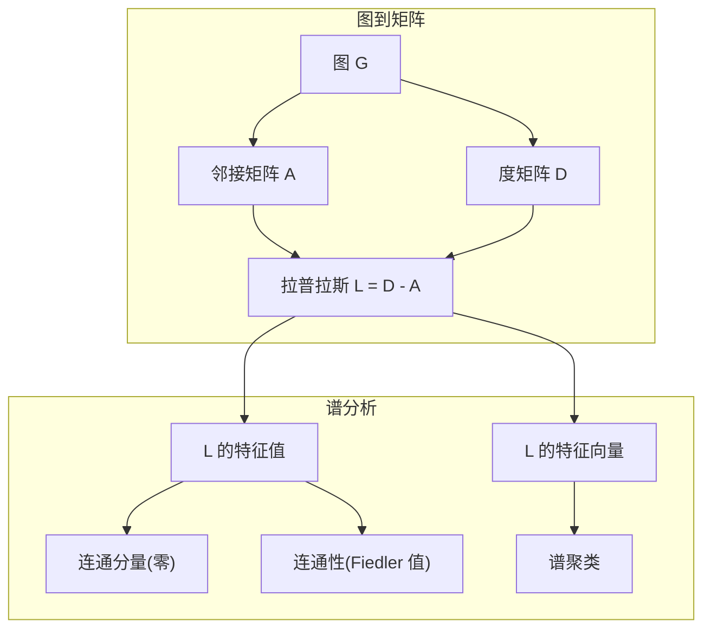
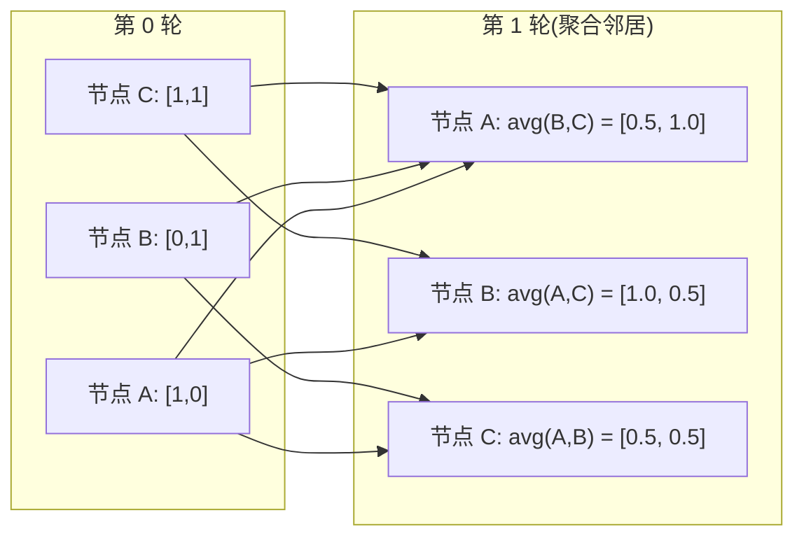

# 机器学习的图论

> 图是关系的数据结构。你的数据有连接,你就要图论。

**Type:** Build
**Language:** Python
**Prerequisites:** Phase 1, Lessons 01-03 (linear algebra, matrices)
**Time:** ~90 minutes

## Learning Objectives

- 搭一个图类,带邻接矩阵/邻接表表示,实现 BFS 和 DFS 遍历
- 算图的拉普拉斯,用它的特征值检测连通分量和聚类节点
- 用归一化邻接矩阵乘法实现一轮 GNN 风格的消息传递
- 用 Fiedler 向量把谱聚类应用到图划分

## The Problem

社交网络、分子、知识库、引用网络、地图 —— 都是图。传统 ML 把数据当平面表。每行独立。每列一个特征。但当"连接的结构"重要时,表就不行了。

考虑一个社交网络。你想预测用户会买什么产品。购买历史重要。但朋友的购买历史更重要。连接带着信号。

或者考虑一个分子。你想预测它是否跟蛋白结合。原子重要,但真正重要的是原子怎么连在一起。结构就是数据。

图神经网络(GNN)是深度学习里增长最快的领域。它们驱动药物发现、社交推荐、欺诈检测、知识图谱推理。每个 GNN 都建立在同一个基础上: 基础图论。

你需要四样东西:
1. 一种把图表示成矩阵的方式(这样能乘它们)
2. 遍历算法探索图结构
3. 拉普拉斯 —— 谱图论里最重要的矩阵
4. 消息传递 —— 让 GNN 工作的操作

## The Concept

### 图:节点和边

图 G = (V, E) 由顶点(节点)V 和边 E 组成。每条边连两个节点。

**有向 vs 无向。** 无向图里,边 (u, v) 意味着 u 连 v 而且 v 连 u。有向图(有向图)里,边 (u, v) 意味着 u 指向 v,反过来不一定。

**加权 vs 无权。** 无权图里,边要么有要么没有。加权图里,每条边有个数值权重 —— 距离、成本、强度。

| 图类型 | 例子 |
|-----------|---------|
| 无向,无权 | Facebook 好友网络 |
| 有向,无权 | Twitter 关注网络 |
| 无向,加权 | 地图(距离) |
| 有向,加权 | 网页链接(PageRank 分数) |

### 邻接矩阵

邻接矩阵 A 是核心表示。对 n 个节点的图:

```
A[i][j] = 1    如果从节点 i 到节点 j 有边
A[i][j] = 0    否则
```

对无向图,A 对称: A[i][j] = A[j][i]。对加权图,A[i][j] = 边 (i, j) 的权重。

**例子 —— 一个三角形:**

```
节点: 0, 1, 2
边: (0,1), (1,2), (0,2)

A = [[0, 1, 1],
     [1, 0, 1],
     [1, 1, 0]]
```

邻接矩阵是每个 GNN 的输入。在 A 上的矩阵运算对应图上的运算。

### 度

节点的度是连它的边数。对有向图,有入度(进来的边)和出度(出去的边)。

度矩阵 D 是对角的:

```
D[i][i] = 节点 i 的度
D[i][j] = 0    对 i != j
```

三角形例子里: D = diag(2, 2, 2),因为每个节点连两个其他节点。

度告诉你节点的重要性。高度 = 枢纽节点。网络的度分布揭示它的结构。社交网络服从幂律(少数枢纽,多叶子节点)。随机图度按泊松分布。

### BFS 和 DFS

两个基本图遍历算法。两个都要会。

**广度优先搜索(BFS):** 先探索所有邻居,再邻居的邻居。用队列(FIFO)。

```
从节点 0 BFS:
  访问 0
  队列: [1, 2]        (0 的邻居)
  访问 1
  队列: [2, 3]        (加 1 的邻居)
  访问 2
  队列: [3]           (2 的邻居已访问)
  访问 3
  队列: []            (完)
```

BFS 找无权图的最短路径。从起点到任一节点的距离等于 BFS 第一次发现该节点的层。这就是为啥社交网络跳数距离用 BFS。

**深度优先搜索(DFS):** 一路走到底再回溯。用栈(LIFO)或递归。

```
从节点 0 DFS:
  访问 0
  栈: [1, 2]          (0 的邻居)
  访问 2               (从栈 pop)
  栈: [1, 3]           (加 2 的邻居)
  访问 3               (从栈 pop)
  栈: [1]
  访问 1               (从栈 pop)
  栈: []               (完)
```

DFS 用于:
- 找连通分量(从未访问节点跑 DFS)
- 环检测(DFS 树里的回边)
- 拓扑排序(DFS 完成顺序倒过来)

| 算法 | 数据结构 | 找 | 场景 |
|-----------|---------------|-------|----------|
| BFS | 队列 | 最短路径 | 社交网络距离、知识图谱遍历 |
| DFS | 栈 | 连通分量、环 | 连通性、拓扑排序 |

### 图的拉普拉斯

L = D - A。谱图论里最重要的矩阵。

对三角形:

```
D = [[2, 0, 0],    A = [[0, 1, 1],    L = [[2, -1, -1],
     [0, 2, 0],         [1, 0, 1],         [-1, 2, -1],
     [0, 0, 2]]         [1, 1, 0]]         [-1, -1,  2]]
```

拉普拉斯有显著性质:

1. **L 半正定。** 所有特征值 ≥ 0。

2. **零特征值的个数等于连通分量数。** 连通图恰好有一个零特征值。3 个不连通分量的图有三个零特征值。

3. **最小非零特征值(Fiedler 值)衡量连通性。** 大的 Fiedler 值意味着图连通得好。小的 Fiedler 值意味着图有个弱点 —— 瓶颈。

4. **Fiedler 值的特征向量(Fiedler 向量)揭示最佳切分。** 正值节点一组,负值节点另一组。这就是谱聚类。



### 谱性质

邻接矩阵和拉普拉斯的特征值揭示结构性质,不用任何遍历。

**谱聚类**这么干:
1. 算拉普拉斯 L
2. 找 L 的 k 个最小特征向量(跳过第一个,对连通图它是全 1)
3. 用这些特征向量当每个节点的新坐标
4. 在这些坐标上跑 k-means

为啥能成? L 的特征向量编码图上"最平滑"的函数。连得好的节点特征向量值类似。被瓶颈隔开的节点值不同。特征向量天然分出聚类。

**随机游走联系。** 归一化拉普拉斯跟图上随机游走相关。随机游走的平稳分布正比于节点度。混合时间(游走多快收敛)取决于谱隙。

### 消息传递

图神经网络的核心操作。每个节点从邻居收消息,聚合它们,更新自己的状态。

```
h_v^(k+1) = UPDATE(h_v^(k), AGGREGATE({h_u^(k) : u in 邻居(v)}))
```

最简形式下,AGGREGATE = mean,UPDATE = 线性变换 + 激活:

```
h_v^(k+1) = sigma(W * mean({h_u^(k) : u in 邻居(v)}))
```

这是矩阵乘法的伪装。如果 H 是所有节点特征的矩阵,A 是邻接矩阵:

```
H^(k+1) = sigma(A_norm * H^(k) * W)
```

其中 A_norm 是归一化邻接矩阵(每行加和为 1)。

一轮消息传递让每个节点"看见"它的直接邻居。两轮让节点看见邻居的邻居。K 轮给每个节点从 K 跳邻域来的信息。



### 概念和 ML 应用

| 概念 | ML 应用 |
|---------|---------------|
| 邻接矩阵 | GNN 输入表示 |
| 图拉普拉斯 | 谱聚类、社区检测 |
| BFS/DFS | 知识图谱遍历、路径查找 |
| 度分布 | 节点重要性、特征工程 |
| 消息传递 | GNN 层(GCN、GAT、GraphSAGE) |
| L 的特征值 | 社区检测、图划分 |
| 谱聚类 | 无监督节点分组 |
| PageRank | 节点重要性、网页搜索 |

## Build It

### Step 1: 从零写 Graph 类

```python
class Graph:
    def __init__(self, n_nodes, directed=False):
        self.n = n_nodes
        self.directed = directed
        self.adj = {i: {} for i in range(n_nodes)}

    def add_edge(self, u, v, weight=1.0):
        self.adj[u][v] = weight
        if not self.directed:
            self.adj[v][u] = weight

    def neighbors(self, node):
        return list(self.adj[node].keys())

    def degree(self, node):
        return len(self.adj[node])

    def adjacency_matrix(self):
        import numpy as np
        A = np.zeros((self.n, self.n))
        for u in range(self.n):
            for v, w in self.adj[u].items():
                A[u][v] = w
        return A

    def degree_matrix(self):
        import numpy as np
        D = np.zeros((self.n, self.n))
        for i in range(self.n):
            D[i][i] = self.degree(i)
        return D

    def laplacian(self):
        return self.degree_matrix() - self.adjacency_matrix()
```

邻接表(`self.adj`)高效地存邻居。邻接矩阵转换用 numpy 因为所有谱操作都需要它。

### Step 2: BFS 和 DFS

```python
from collections import deque

def bfs(graph, start):
    visited = set()
    order = []
    distances = {}
    queue = deque([(start, 0)])
    visited.add(start)
    while queue:
        node, dist = queue.popleft()
        order.append(node)
        distances[node] = dist
        for neighbor in graph.neighbors(node):
            if neighbor not in visited:
                visited.add(neighbor)
                queue.append((neighbor, dist + 1))
    return order, distances


def dfs(graph, start):
    visited = set()
    order = []
    stack = [start]
    while stack:
        node = stack.pop()
        if node in visited:
            continue
        visited.add(node)
        order.append(node)
        for neighbor in reversed(graph.neighbors(node)):
            if neighbor not in visited:
                stack.append(neighbor)
    return order
```

BFS 用 deque(双端队列)拿 O(1) popleft。DFS 用列表当栈。两者都只访问每节点一次 —— O(V + E) 时间。

### Step 3: 连通分量和拉普拉斯特征值

```python
def connected_components(graph):
    visited = set()
    components = []
    for node in range(graph.n):
        if node not in visited:
            order, _ = bfs(graph, node)
            visited.update(order)
            components.append(order)
    return components


def laplacian_eigenvalues(graph):
    import numpy as np
    L = graph.laplacian()
    eigenvalues = np.linalg.eigvalsh(L)
    return eigenvalues
```

`eigvalsh` 是给对称矩阵的 —— 无向图的拉普拉斯永远对称。它按升序返回特征值。数 0 的个数找连通分量数。

### Step 4: 谱聚类

```python
def spectral_clustering(graph, k=2):
    import numpy as np
    L = graph.laplacian()
    eigenvalues, eigenvectors = np.linalg.eigh(L)
    features = eigenvectors[:, 1:k+1]

    labels = np.zeros(graph.n, dtype=int)
    for i in range(graph.n):
        if features[i, 0] >= 0:
            labels[i] = 0
        else:
            labels[i] = 1
    return labels
```

k=2 时,Fiedler 向量的符号把图分成两簇。k>2 时,要在前 k 个特征向量(去掉平凡的全 1 向量)上跑 k-means。

### Step 5: 消息传递

```python
def message_passing(graph, features, weight_matrix):
    import numpy as np
    A = graph.adjacency_matrix()
    row_sums = A.sum(axis=1, keepdims=True)
    row_sums[row_sums == 0] = 1
    A_norm = A / row_sums
    aggregated = A_norm @ features
    output = aggregated @ weight_matrix
    return output
```

这是一轮 GNN 消息传递。每个节点的新特征是邻居特征的加权平均,再被权重矩阵变换。叠多轮把信息传得更远。

## Use It

用 networkx 和 numpy,同样的操作是一行:

```python
import networkx as nx
import numpy as np

G = nx.karate_club_graph()

A = nx.adjacency_matrix(G).toarray()
L = nx.laplacian_matrix(G).toarray()

eigenvalues = np.linalg.eigvalsh(L.astype(float))
print(f"最小特征值: {eigenvalues[:5]}")
print(f"连通分量: {nx.number_connected_components(G)}")

communities = nx.community.greedy_modularity_communities(G)
print(f"找到的社区: {len(communities)}")

pr = nx.pagerank(G)
top_nodes = sorted(pr.items(), key=lambda x: x[1], reverse=True)[:5]
print(f"PageRank 前 5 节点: {top_nodes}")
```

networkx 用优化的 C 后端处理任何大小的图。生产用它。从零实现用它来理解它在跑啥。

### numpy 谱分析

```python
import numpy as np

A = np.array([
    [0, 1, 1, 0, 0],
    [1, 0, 1, 0, 0],
    [1, 1, 0, 1, 0],
    [0, 0, 1, 0, 1],
    [0, 0, 0, 1, 0]
])

D = np.diag(A.sum(axis=1))
L = D - A

eigenvalues, eigenvectors = np.linalg.eigh(L)
print(f"特征值: {np.round(eigenvalues, 4)}")
print(f"Fiedler 值: {eigenvalues[1]:.4f}")
print(f"Fiedler 向量: {np.round(eigenvectors[:, 1], 4)}")

fiedler = eigenvectors[:, 1]
group_a = np.where(fiedler >= 0)[0]
group_b = np.where(fiedler < 0)[0]
print(f"簇 A: {group_a}")
print(f"簇 B: {group_b}")
```

Fiedler 向量干重活。正的一项一个簇,负的一项另一个簇。不用迭代优化 —— 一次特征分解就够。

## Ship It

本节产出:
- `outputs/skill-graph-analysis.md` —— 分析图结构数据的 skill 参考

## Connections

| 概念 | 出现在哪 |
|---------|------------------|
| 邻接矩阵 | GCN、GAT、GraphSAGE 输入 |
| 拉普拉斯 | 谱聚类、ChebNet 滤波器 |
| BFS | 知识图谱遍历、最短路径查询 |
| 消息传递 | 每个 GNN 层、神经消息传递 |
| 谱隙 | 图连通性、随机游走混合时间 |
| 度分布 | 幂律网络、节点特征工程 |
| 连通分量 | 预处理、处理不连通图 |
| PageRank | 节点重要性排名、注意力初始化 |

GNN 值得特别说。GCN(Kipf & Welling, 2017)里的图卷积操作用加自环的邻接矩阵, A_hat = A + I:

```
H^(l+1) = sigma(D_hat^(-1/2) * A_hat * D_hat^(-1/2) * H^(l) * W^(l))
```

A_hat = A + I(邻接加自环),D_hat 是 A_hat 的度矩阵。自环保证每个节点聚合时带上自己的特征。这就是带对称归一化的消息传递。D_hat^(-1/2) * A_hat * D_hat^(-1/2) 是归一化邻接矩阵。拉普拉斯出现是因为这个归一化跟 L_sym = I - D^(-1/2) * A * D^(-1/2) 相关。懂拉普拉斯就懂 GCN 为啥能行。

## Exercises

1. **从零实现 PageRank。** 从均匀分数开始。每步: score(v) = (1-d)/n + d * Σ score(u)/out_degree(u),对所有指向 v 的 u。d=0.85。跑到收敛(变化 < 1e-6)。在小网页图上测。
2. **用谱聚类找社区。** 创建一个两个明显分开簇的图(比如两个团用一个单边连起来)。跑谱聚类验证它找到对的切分。加更多跨簇边会怎样?
3. **实现 Dijkstra 算法** 解加权图最短路径。跟同样图上 BFS 的结果比一比。
4. **搭一个 2 层消息传递网络。** 用不同权重矩阵跑消息传递两轮。展示 2 轮后每个节点有从 2 跳邻域来的信息。
5. **分析真实世界的图。** 用 Karate Club 图(34 节点、78 边)。算度分布、拉普拉斯特征值、谱聚类。把谱聚类结果跟已知的真值分裂比一比。

## Key Terms

| Term | What people say | What it actually means |
|------|----------------|----------------------|
| Graph | "节点和边" | 编码成对关系的数学结构 G=(V,E) |
| Adjacency matrix | "连接表" | n × n 矩阵,A[i][j] = 1 如果节点 i 和 j 连 |
| Degree | "节点多连" | 碰节点的边数 |
| Laplacian | "D 减 A" | L = D - A,特征值揭示图结构的矩阵 |
| Fiedler value | "代数连通性" | L 的最小非零特征值,衡量图连通得多好 |
| BFS | "一层层搜" | 先访问所有邻居再深入,找最短路径 |
| DFS | "先往深处走" | 走一条路到底再回溯 |
| Message passing | "节点跟邻居说话" | 每个节点聚合邻居信息,GNN 的核心 |
| Spectral clustering | "按特征向量分簇" | 用拉普拉斯特征向量分图 |
| Connected component | "独立的一块" | 每个节点能到其他每个的最大子图 |

## Further Reading

- **Kipf & Welling (2017)** —— "Semi-Supervised Classification with Graph Convolutional Networks." 开启现代 GNN 的论文。展示谱图卷积化简成消息传递。
- **Spielman (2012)** —— "Spectral Graph Theory" 讲义。拉普拉斯、谱隙、图划分的权威介绍。
- **Hamilton (2020)** —— "Graph Representation Learning." 从基础到应用覆盖 GNN 的书。
- **Bronstein et al. (2021)** —— "Geometric Deep Learning: Grids, Groups, Graphs, Geodesics, and Gauges." 统一框架的论文。
- **Veličković et al. (2018)** —— "Graph Attention Networks." 用注意力机制扩展消息传递。
