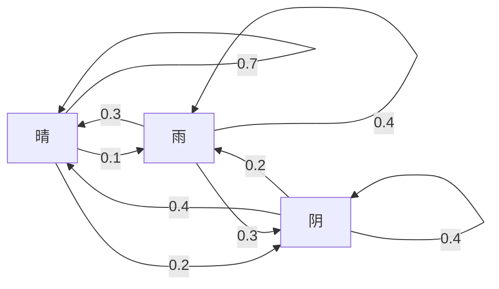
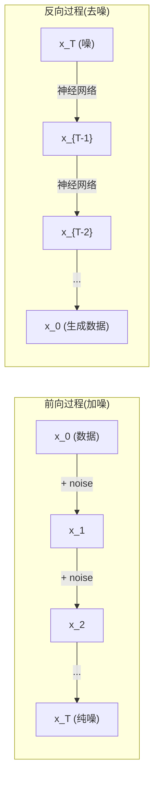

# 随机过程

> 有结构的随机性。随机游走、马尔可夫链、扩散模型背后的数学。

**Type:** Learn
**Language:** Python
**Prerequisites:** Phase 1, Lessons 06-07 (probability, Bayes)
**Time:** ~75 minutes

## Learning Objectives

- 模拟 1D 和 2D 随机游走,验证位移的 sqrt(n) 缩放
- 搭一个马尔可夫链模拟器,通过特征分解算它的平稳分布
- 实现 Metropolis-Hastings MCMC 和 Langevin 动力学来从目标分布采样
- 把前向扩散过程跟布朗运动挂上钩,解释反向过程怎么生成数据

## The Problem

很多 AI 系统涉及随时间演化的随机性。不是静态随机性 —— 而是结构化的、序列的随机性,每一步依赖之前发生什么。

语言模型一次生成一个 token。每个 token 依赖前一个上下文。模型输出概率分布,从中采样,继续。这就是随机过程。

扩散模型一步步给图加噪,直到变纯噪。然后它们把过程反过来,一步步去噪,直到新图出现。前向过程是马尔可夫链。反向过程是跑在反方向的学出来的马尔可夫链。

强化学习 agent 在环境里行动。每个行动以某个概率导出新状态。agent 跟随机世界跑随机策略。整套就是个马尔可夫决策过程。

MCMC 采样 —— 贝叶斯推断的支柱 —— 构造一条平稳分布是你要采的后验的马尔可夫链。

所有这些建立在四个基础想法上:
1. 随机游走 —— 最简单的随机过程
2. 马尔可夫链 —— 带转移矩阵的结构化随机性
3. Langevin 动力学 —— 带噪声的梯度下降
4. Metropolis-Hastings —— 从任何分布采样

## The Concept

### 随机游走

从位置 0 开始。每步掷公平硬币。正面: 向右 (+1)。反面: 向左 (-1)。

n 步后,你的位置是 n 个随机 +/-1 值的和。期望位置 0(游走无偏)。但"离原点的期望距离"按 sqrt(n) 增长。

这反直觉。游走是公平的 —— 任何方向都没漂移。但随时间它越走越远。n 步后的标准差是 sqrt(n)。

```
第 0 步:   位置 = 0
第 1 步:   位置 = +1 或 -1
第 2 步:   位置 = +2, 0, 或 -2
...
第 100 步:  离原点期望距离 ~ 10 (sqrt(100))
第 10000 步: 离原点期望距离 ~ 100 (sqrt(10000))
```

**2D 里**,游走上下左右等概率走。sqrt(n) 缩放同样适用于离原点的距离。路径描出类分形图案。

**为啥 sqrt(n)?** 每步 +1 或 -1 等概率。n 步后,位置 S_n = X_1 + X_2 + ... + X_n,每 X_i 是 +/-1。每步方差 1,步独立,所以 Var(S_n) = n。标准差 = sqrt(n)。由中心极限定理,S_n / sqrt(n) 收敛到标准正态。

这个 sqrt(n) 缩放在 ML 里到处出现。SGD 噪声按 1/sqrt(batch_size) 缩放。嵌入维度按 sqrt(d) 缩放。平方根是独立随机加法的特征。

**跟布朗运动的联系。** 拿步长 1/sqrt(n)、每单位时间 n 步的随机游走。n 趋向无穷时,游走收敛到布朗运动 B(t) —— 一个连续时间过程,B(t) 正态分布均值 0 方差 t。

布朗运动是扩散的数学基础。它建模粒子在流体里的随机抖动、股价波动、以及 —— 关键 —— 扩散模型里的噪声过程。

**赌徒破产。** 随机游走者从位置 k 起步,0 和 N 是吸收壁垒。到达 N 先于 0 的概率多少?公平游走: P(到 N) = k/N。这出奇地简单优雅。它跟鞅论连起来 —— 公平随机游走是鞅(期望未来值 = 当前值)。

### 马尔可夫链

马尔可夫链是一个系统,按固定概率在状态间转移。关键性质: 下一状态只依赖当前状态,不依赖历史。

```
P(X_{t+1} = j | X_t = i, X_{t-1} = ...) = P(X_{t+1} = j | X_t = i)
```

这是马尔可夫性质。意味着你用转移矩阵 P 就能描述整个动力学:

```
P[i][j] = 从状态 i 到状态 j 的概率
```

P 每行加和为 1(你得去某处)。

**例子 —— 天气:**

```
状态: 晴(0)、雨(1)、阴(2)

P = [[0.7, 0.1, 0.2],    (晴: 70% 晴, 10% 雨, 20% 阴)
     [0.3, 0.4, 0.3],    (雨: 30% 晴, 40% 雨, 30% 阴)
     [0.4, 0.2, 0.4]]    (阴: 40% 晴, 20% 雨, 40% 阴)
```

从任何状态起,经过很多转移,状态分布收敛到平稳分布 π,其中 π * P = π。这是 P 的左特征向量,特征值 1。

天气链的平稳分布可能是 [0.53, 0.18, 0.29] —— 长期看,无论从哪开始,都是 53% 晴。



**算平稳分布。** 两种方法:

1. **幂法**: 任何初始分布乘 P 重复。经过足够迭代,收敛。
2. **特征值法**: 找 P 的左特征向量(特征值 1)。这是 P^T 的特征值 1 的特征向量。

两种方法都要链满足收敛条件。

**收敛条件。** 马尔可夫链收敛到唯一平稳分布,如果:
- **不可约**: 每个状态可从其他每个状态到达
- **非周期**: 链不以固定周期循环

ML 里遇到的大多数链两个都满足。

**吸收状态。** 状态如果一旦进入就不离开(P[i][i] = 1),就是吸收的。吸收马尔可夫链建模有终态的过程 —— 一局结束的游戏、一个流失的客户、一个撞到 EOS token 的序列。

**混合时间。** 链要多少步才"接近"平稳分布?形式上,总变差距离从平稳性降到某阈值以下的步数。快混合 = 几步就够。P 的谱隙(1 减第二大特征值)控制混合时间。间隙大 = 混合快。

### 跟语言模型的联系

语言模型里的 token 生成近似一个马尔可夫过程。给定当前上下文,模型输出下一 token 的分布。温度控制锐度:

```
P(token_i) = exp(logit_i / temperature) / Σ exp(logit_j / temperature)
```

- 温度 = 1.0: 标准分布
- 温度 < 1.0: 更锐(更确定)
- 温度 > 1.0: 更平(更随机)
- 温度 -> 0: argmax(贪心)

Top-k 采样截到概率最高的 k 个 token。Top-p(核)采样截到累计概率超过 p 的最小 token 集。两者都改马尔可夫转移概率。

### 布朗运动

随机游走的连续时间极限。位置 B(t) 有三个性质:
1. B(0) = 0
2. B(t) - B(s) 正态分布均值 0 方差 t - s(t > s)
3. 不重叠区间的增量独立

布朗运动连续但处处不可微 —— 每个尺度上都在抖。路径在平面上是分形维数 2。

离散模拟里,你这样近似布朗运动:

```
B(t + dt) = B(t) + sqrt(dt) * z,    z ~ N(0, 1)
```

sqrt(dt) 缩放重要。它来自中心极限定理用在随机游走上。

### Langevin 动力学

梯度下降找函数最小值。Langevin 动力学找正比于 exp(-U(x)/T) 的概率分布,U 是能量函数,T 是温度。

```
x_{t+1} = x_t - dt * gradient(U(x_t)) + sqrt(2 * T * dt) * z_t
```

两个力作用在粒子上:
1. **梯度力** (-dt * gradient(U)): 推向低能(像梯度下降)
2. **随机力** (sqrt(2*T*dt) * z): 推向随机方向(探索)

温度 T = 0 时是纯梯度下降。高温时几乎就是随机游走。合适温度时粒子探索能量地形,在低能区花更多时间。

**跟扩散模型的联系。** 扩散模型的前向过程是:

```
x_t = sqrt(α_t) * x_{t-1} + sqrt(1 - α_t) * noise
```

这是马尔可夫链,逐渐把数据跟噪声混到一起。足够步后,x_T 是纯高斯噪声。

反向过程 —— 从噪声回到数据 —— 也是马尔可夫链,但它的转移概率由神经网络学出来。网络学预测每步加的噪声,然后减掉。



### MCMC: 马尔可夫链蒙特卡洛

有时你需要从 p(x) 采样 —— 你能算(到常数)但不能直接采。贝叶斯后验是经典例子 —— 你知道似然乘先验,但归一化常数 intractable。

**Metropolis-Hastings** 构造一条平稳分布是 p(x) 的马尔可夫链:

1. 从某位置 x 开始
2. 从提议分布 Q(x'|x) 提议新位置 x'
3. 算接受比: a = p(x') * Q(x|x') / (p(x) * Q(x'|x))
4. 以概率 min(1, a) 接受 x'。否则停在 x。
5. 重复。

Q 对称时(比如 Q(x'|x) = Q(x|x') = N(x, σ²)),比化简为 a = p(x') / p(x)。你只需要概率比 —— 归一化常数消掉。

链在温和条件下保证收敛到 p(x)。但如果提议太小(随机游走)或太大(高拒绝),收敛会慢。调提议是 MCMC 的艺术。

**为啥能。** 接受比保证细致平衡: 处于 x 移到 x' 的概率等于处于 x' 移到 x 的概率。细致平衡蕴含 p(x) 是链的平稳分布。所以足够步后样本来自 p(x)。

**实际考虑:**
- **Burn-in**: 扔前 N 个样本。链需要时间从起点到达平稳分布。
- **Thinning**: 每 k 个样本留一个,降自相关。
- **多链**: 从不同起点跑几条链。如果它们收敛到同一分布,就有收敛的证据。
- **接受率**: d 维高斯提议的最优接受率约 23%(Roberts & Rosenthal, 2001)。太高链几乎不动。太低全拒绝。

### AI 里的随机过程

| 过程 | AI 应用 |
|---------|---------------|
| 随机游走 | RL 探索、Node2Vec 嵌入 |
| 马尔可夫链 | 文本生成、MCMC 采样 |
| 布朗运动 | DDPM 里的前向扩散过程 |
| Langevin 动力学 | 基于分数的生成模型、SGLD |
| 马尔可夫决策过程 | 强化学习 |
| Metropolis-Hastings | 贝叶斯推断、后验采样 |

## Build It

### Step 1: 随机游走模拟器

```python
import numpy as np

def random_walk_1d(n_steps, seed=None):
    rng = np.random.RandomState(seed)
    steps = rng.choice([-1, 1], size=n_steps)
    positions = np.concatenate([[0], np.cumsum(steps)])
    return positions


def random_walk_2d(n_steps, seed=None):
    rng = np.random.RandomState(seed)
    directions = rng.choice(4, size=n_steps)
    dx = np.zeros(n_steps)
    dy = np.zeros(n_steps)
    dx[directions == 0] = 1   # right
    dx[directions == 1] = -1  # left
    dy[directions == 2] = 1   # up
    dy[directions == 3] = -1  # down
    x = np.concatenate([[0], np.cumsum(dx)])
    y = np.concatenate([[0], np.cumsum(dy)])
    return x, y
```

1D 游走存累积和。每步 +1 或 -1。n 步后位置是总和。方差随 n 线性增长,所以标准差按 sqrt(n) 增长。

### Step 2: 马尔可夫链

```python
class MarkovChain:
    def __init__(self, transition_matrix, state_names=None):
        self.P = np.array(transition_matrix, dtype=float)
        self.n_states = len(self.P)
        self.state_names = state_names or [str(i) for i in range(self.n_states)]

    def step(self, current_state, rng=None):
        if rng is None:
            rng = np.random.RandomState()
        probs = self.P[current_state]
        return rng.choice(self.n_states, p=probs)

    def simulate(self, start_state, n_steps, seed=None):
        rng = np.random.RandomState(seed)
        states = [start_state]
        current = start_state
        for _ in range(n_steps):
            current = self.step(current, rng)
            states.append(current)
        return states

    def stationary_distribution(self):
        eigenvalues, eigenvectors = np.linalg.eig(self.P.T)
        idx = np.argmin(np.abs(eigenvalues - 1.0))
        stationary = np.real(eigenvectors[:, idx])
        stationary = stationary / stationary.sum()
        return np.abs(stationary)
```

平稳分布是 P 的特征值 1 的左特征向量。我们算 P^T 的特征向量(转置把左特征向量变成右特征向量)。

### Step 3: Langevin 动力学

```python
def langevin_dynamics(grad_U, x0, dt, temperature, n_steps, seed=None):
    rng = np.random.RandomState(seed)
    x = np.array(x0, dtype=float)
    trajectory = [x.copy()]
    for _ in range(n_steps):
        noise = rng.randn(*x.shape)
        x = x - dt * grad_U(x) + np.sqrt(2 * temperature * dt) * noise
        trajectory.append(x.copy())
    return np.array(trajectory)
```

梯度推 x 往低能走。噪声防它卡住。平衡时样本分布正比于 exp(-U(x)/temperature)。

### Step 4: Metropolis-Hastings

```python
def metropolis_hastings(target_log_prob, proposal_std, x0, n_samples, seed=None):
    rng = np.random.RandomState(seed)
    x = np.array(x0, dtype=float)
    samples = [x.copy()]
    accepted = 0
    for _ in range(n_samples - 1):
        x_proposed = x + rng.randn(*x.shape) * proposal_std
        log_ratio = target_log_prob(x_proposed) - target_log_prob(x)
        if np.log(rng.rand()) < log_ratio:
            x = x_proposed
            accepted += 1
        samples.append(x.copy())
    acceptance_rate = accepted / (n_samples - 1)
    return np.array(samples), acceptance_rate
```

算法提议新点,检查是否概率更高(或以正比于比的概率接受),重复。好的混合需要接受率 23-50%。

## Use It

实际中,你用这些算法的现成库。但理解机制对调参和调 bug 重要。

```python
import numpy as np

rng = np.random.RandomState(42)
walk = np.cumsum(rng.choice([-1, 1], size=10000))
print(f"最终位置: {walk[-1]}")
print(f"期望距离: {np.sqrt(10000):.1f}")
print(f"实际距离: {abs(walk[-1])}")
```

### numpy 用于转移矩阵

```python
import numpy as np

P = np.array([[0.7, 0.1, 0.2],
              [0.3, 0.4, 0.3],
              [0.4, 0.2, 0.4]])

distribution = np.array([1.0, 0.0, 0.0])
for _ in range(100):
    distribution = distribution @ P

print(f"平稳分布: {np.round(distribution, 4)}")
```

初始分布乘 P 重复。足够迭代后,无论从哪开始都收敛到平稳分布。这就是找主左特征向量的幂法。

### 跟真实框架的联系

- **PyTorch 扩散:** HuggingFace `diffusers` 里的 `DDPMScheduler` 实现了前向和反向马尔可夫链
- **NumPyro / PyMC:** 用 MCMC(NUTS 采样器,改进了 Metropolis-Hastings)做贝叶斯推断
- **Gymnasium (RL):** 环境 step 函数定义一个马尔可夫决策过程

### 验证马尔可夫链收敛

```python
import numpy as np

P = np.array([[0.9, 0.1], [0.3, 0.7]])

eigenvalues = np.linalg.eigvals(P)
spectral_gap = 1 - sorted(np.abs(eigenvalues))[-2]
print(f"特征值: {eigenvalues}")
print(f"谱隙: {spectral_gap:.4f}")
print(f"近似混合时间: {1/spectral_gap:.1f} 步")
```

谱隙告诉你链多快忘记初始状态。隙 0.2 约 5 步混合。隙 0.01 约 100 步。跑长模拟前总是查这个 —— 慢慢混合的链浪费算力。

## Ship It

本节产出:
- `outputs/prompt-stochastic-process-advisor.md` —— 一个 prompt,帮识别哪个随机过程框架适合给定问题

## Connections

| 概念 | 出现在哪 |
|---------|------------------|
| 随机游走 | Node2Vec 图嵌入、RL 探索 |
| 马尔可夫链 | LLM token 生成、MCMC 采样 |
| 布朗运动 | DDPM 前向扩散过程、基于 SDE 的模型 |
| Langevin 动力学 | 基于分数的生成模型、随机梯度 Langevin 动力学 (SGLD) |
| 平稳分布 | MCMC 收敛目标、PageRank |
| Metropolis-Hastings | 贝叶斯后验采样、模拟退火 |
| 温度 | LLM 采样、RL 里的 Boltzmann 探索、模拟退火 |
| 混合时间 | MCMC 收敛速度、谱隙分析 |
| 吸收状态 | 序列末 token、RL 终态 |
| 细致平衡 | MCMC 采样器的正确性保证 |

扩散模型值得特别说。DDPM(Ho et al., 2020)定义一个前向马尔可夫链:

```
q(x_t | x_{t-1}) = N(x_t; sqrt(1-β_t) * x_{t-1}, β_t * I)
```

β_t 是噪声 schedule。T 步后,x_T 近似 N(0, I)。反向过程由神经网络参数化,预测噪声:

```
p_θ(x_{t-1} | x_t) = N(x_{t-1}; μ_θ(x_t, t), σ_t² * I)
```

每步生成就是学出来的马尔可夫链的一步。懂马尔可夫链就懂扩散模型怎么、为什么能生成数据。

SGLD(随机梯度 Langevin 动力学)把小批量梯度下降跟 Langevin 噪声合起来。不用算完整梯度,用随机估计再加校准过的噪声。学习率衰减时,SGLD 从优化过渡到采样 —— 免费拿到近似贝叶斯后验样本。这是从神经网络拿不确定性估计最简的办法。

跨所有这些联系的关键洞见: 随机过程不只是理论工具。它们是现代 AI 系统里的计算机制。调 LLM 温度时,你在调一个马尔可夫链。训扩散模型时,你在学反转一个类布朗运动过程。跑贝叶斯推断时,你在构造一条收敛到后验的链。

## Exercises

1. **模拟 1000 个 10000 步随机游走。** 画最终位置的分布。验证它近似正态均值 0 标准差 sqrt(10000) = 100。
2. **用马尔可夫链搭一个文本生成器。** 在小语料上训练: 对每个词,数到下一词的转移。建转移矩阵。通过从链上采样生成新句子。
3. **用 Metropolis-Hastings 实现模拟退火。** 从高温(几乎啥都接受)开始,慢慢降温(只接受改进)。用它找有很多局部最小的函数的最小值。
4. **比较不同温度的 Langevin 动力学。** 从双井势 U(x) = (x² - 1)² 采样。低温时样本簇在一个井里。高温时散到两个井。找链在井间混合的临界温度。
5. **实现前向扩散过程。** 从 1D 信号(比如正弦波)开始。用线性噪声 schedule 在 100 步里逐步加噪。展示信号怎么退化成纯噪。然后实现一个简单去噪器反转过程(哪怕是简单的"减估计的噪声")。

## Key Terms

| Term | What people say | What it actually means |
|------|----------------|----------------------|
| Random walk | "扔硬币移动" | 每步位置以随机增量变化的过程 |
| Markov property | "无记忆" | 未来只依赖当前状态,不依赖历史 |
| Transition matrix | "概率表" | P[i][j] = 从状态 i 移到状态 j 的概率 |
| Stationary distribution | "长期平均" | 分布 π 满足 π*P = π —— 链的平衡 |
| Brownian motion | "随机抖" | 随机游走的连续时间极限,B(t) ~ N(0, t) |
| Langevin dynamics | "带噪声的梯度下降" | 确定性梯度和随机扰动合起来的更新规则 |
| MCMC | "走向目标" | 构造平稳分布就是要的那个的马尔可夫链 |
| Metropolis-Hastings | "提议然后接受/拒绝" | 用接受比保收敛的 MCMC 算法 |
| Temperature | "随机性旋钮" | 控制探索和利用权衡的参数 |
| Diffusion process | "进噪出噪" | 前向: 逐步加噪。反向: 逐步去噪。生成数据。 |

## Further Reading

- **Ho, Jain, Abbeel (2020)** —— "Denoising Diffusion Probabilistic Models." 开启扩散模型革命的 DDPM 论文。前向和反向马尔可夫链的清晰推导。
- **Song & Ermon (2019)** —— "Generative Modeling by Estimating Gradients of the Data Distribution." 用 Langevin 动力学采样的基于分数的方法。
- **Roberts & Rosenthal (2004)** —— "General state space Markov chains and MCMC algorithms." MCMC 何时为啥能工作的理论。
- **Norris (1997)** —— "Markov Chains." 标准教材。覆盖收敛、平稳分布、击中时间。
- **Welling & Teh (2011)** —— "Bayesian Learning via Stochastic Gradient Langevin Dynamics." 把 SGD 跟 Langevin 动力学合起来做可扩展贝叶斯推断。
