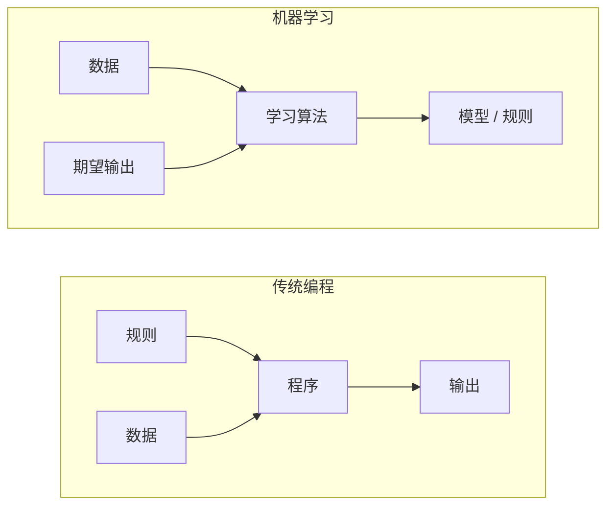
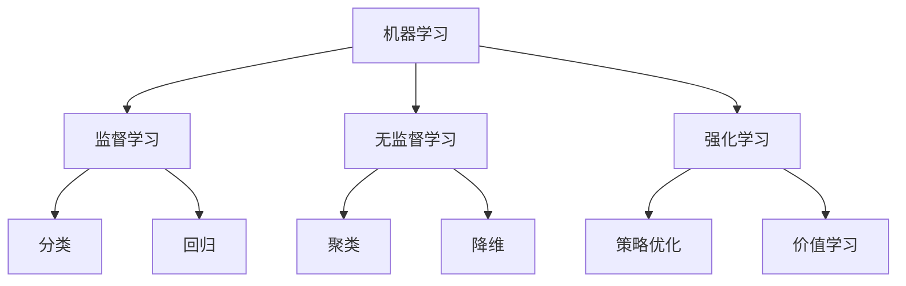
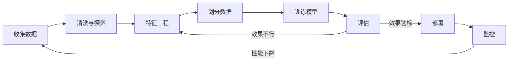
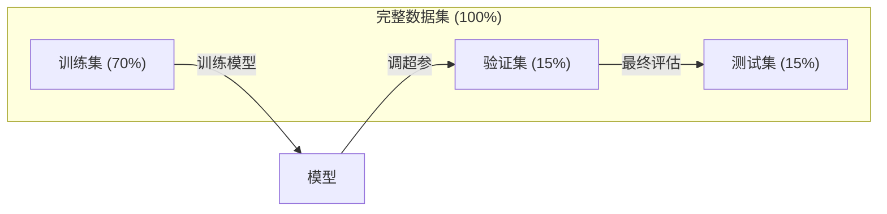
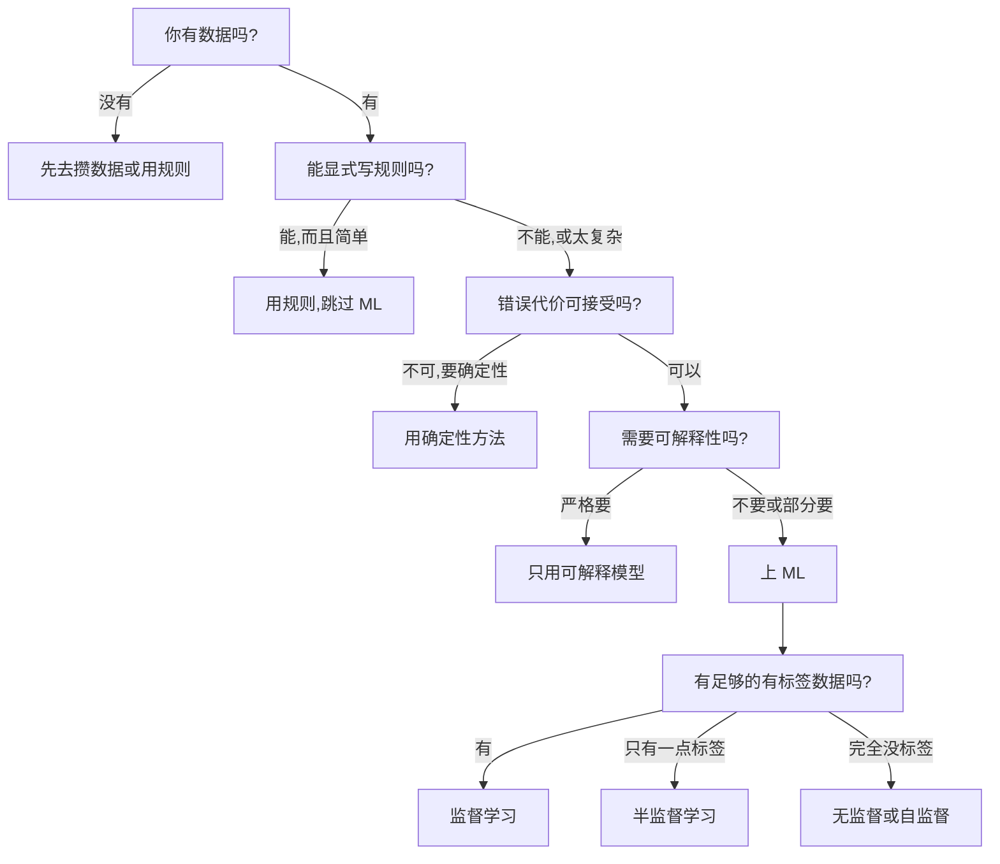

# 什么是机器学习

> 机器学习就是让计算机从数据里找规律,而不是手写规则。

**Type:** Learn
**Languages:** Python
**Prerequisites:** Phase 1 (数学基础)
**Time:** ~45 分钟

## 学习目标

- 讲清楚监督学习、无监督学习、强化学习的区别,并能判断一个具体问题属于哪一类
- 从零实现最近质心分类器,并和随机基线对比
- 区分分类任务和回归任务,并为每种任务选择合适的损失函数
- 判断一个具体的业务问题到底该用 ML 还是该用确定性规则解决

## 问题引入

你想做一个垃圾邮件过滤器。传统做法是坐下来写几百条规则——“邮件里出现 'FREE MONEY' 就标为垃圾邮件;感叹号超过 3 个也标为垃圾邮件”。你花几周写规则,然后垃圾邮件发送者换了个说法,你的规则就失效了,你只能再写新规则,这个循环永远停不下来。

机器学习的思路完全反过来。你不用写规则,而是给计算机成千上万封已经标好“垃圾邮件/正常邮件”的邮件,让它自己琢磨出规则。计算机能找到你想不到的规律;一旦垃圾邮件发送者换套路,你只要在新数据上重新训练,而不是改代码。

这种从“写规则编程”到“从数据中学习”的转换,是机器学习的核心。无论是推荐系统、语音助手、自动驾驶还是语言模型,工作的方式都一样。

## 核心概念

### 从数据中学习,而不是从规则中学习

传统编程和机器学习解决问题的方向是相反的。



传统编程:你写规则,程序把规则套在数据上,产出输出。

机器学习:你给数据和期望的输出,算法自己把规则挖出来。

训练得到的“模型”,其实就是那套规则,只不过用数字(权重、参数)编码了。模型从见过的样本里总结规律,然后用到它从没见过的数据上做预测。

### 机器学习的三种类型



**监督学习**:你手里是“输入-输出”配对,模型学习如何把输入映射到输出。
- “这里有 10,000 张标好猫/狗的照片,学会把它们区分开。”
- “这里有房屋特征和对应价格,学会预测房价。”

**无监督学习**:你手里只有输入,没有标签,模型自己去找数据结构。
- “这里有 10,000 条客户购买记录,找出自然的分组。”
- “这里有 1,000 维的数据点,在保留结构的前提下压到 2 维。”

**强化学习**:一个 agent 在环境里做动作,得到奖励或惩罚,学到一个最大化总奖励的策略(policy)。
- “玩这个游戏。赢 +1,输 -1,自己想出策略。”
- “控制这条机械臂。抓起物体 +1,每浪费 1 秒 -0.01。”

实际项目里大部分都是监督学习。无监督学习常用于预处理和探索。强化学习支撑着游戏 AI、机器人,以及语言模型里的 RLHF。

### 三分法之外

上面三类分得很干净,但真实世界里的 ML 经常是模糊地带。

**半监督学习**用一小撮有标签的数据 + 一大堆无标签的数据。比如你有 100 张标好的医学图像和 100,000 张没标的。常见方法包括:

- **标签传播**:建一张图把相似数据点连起来,标签沿着图从已标节点扩散到未标邻居。
- **伪标签**:先用有标签数据训一个模型,用它去给无标签数据打标签,然后合起来重训。模型自己 bootstrap 出训练集。
- **一致性正则**:模型对原输入和略微扰动后的输入应该给出相同的预测。这个性质在没有标签时也能用上。

**自监督学习**直接从数据本身造出监督信号。完全不需要人工标签。模型自己根据数据结构构造预测任务。

- **掩码语言模型(BERT)**:把一句话里 15% 的词盖住,让模型猜被盖的词。这些“标签”就是原文本身。
- **对比学习(SimCLR)**:取一张图,造两个增强版本,让模型认出它们来自同一张图,同时跟其他图的增强版本区分开。
- **下一词预测(GPT)**:给定前文所有词,预测下一个词。每一段文字天然就是一个训练样本。

这些并不是独立于前面三大类之外的新分类。它们是把监督和无监督思想混在一起的策略。自监督学习在形式上是监督的(模型在预测某个东西),但标签是自动生成的,不是人标的。

### 分类 vs 回归

这是监督学习里的两大主任务。

| 维度 | 分类 | 回归 |
|------|------|------|
| 输出 | 离散类别 | 连续数值 |
| 例子 | "这封邮件是不是垃圾邮件?" | "这套房子能卖多少钱?" |
| 输出空间 | {猫,狗,鸟} | 任意实数 |
| 损失函数 | 交叉熵、准确率 | 均方误差、MAE |
| 决策 | 类与类之间的边界 | 拟合数据的一条曲线 |

分类回答“属于哪一类”,回归回答“有多少/多大”。

有些问题两种方式都能套。预测股票涨跌是分类,预测具体价格就是回归。

### ML 工作流

不管用什么算法,每个机器学习项目都遵循同一条流水线。



**收集数据**:把原始数据攒起来。数据量越多越好,但质量比数量更重要。

**清洗与探索**:处理缺失值、去重、可视化分布、发现异常。这一步经常占整个项目时间的 60-80%。

**特征工程**:把原始数据转成模型能用的特征。把日期转成“星期几”、对数值列做归一化、把类别变量编码成数字。好特征比花哨算法更重要。

**划分数据**:切成训练集、验证集、测试集。模型在训练集上学,你在验证集上调超参,最后在测试集上报告最终性能。

**训练模型**:把训练数据喂给算法,算法调内部参数去最小化损失函数。

**评估**:在验证/测试集上量性能。性能不行就回头换特征、换算法、换超参。

**部署**:把模型扔到生产环境,让它在新数据上做预测。

**监控**:长期跟踪性能。数据分布会变(data drift),模型会退化。性能一下降,就重训。

### 训练集、验证集、测试集

这是初学者最容易搞错的概念。模型必须在它训练时从没见过的数据上评估,否则你量的是“记忆”,不是“学习”。



| 划分 | 用途 | 何时使用 | 典型比例 |
|------|------|---------|---------|
| 训练集 | 模型在这里学 | 训练过程中 | 60-80% |
| 验证集 | 调超参、对比模型 | 每次训练完之后 | 10-20% |
| 测试集 | 最终无偏性能估计 | 只用一次,放在最后 | 10-20% |

测试集是神圣的。你只看它一次。如果你反复根据测试性能调模型,你其实就是在测试集上训练了,最后报出来的数字毫无意义。

数据量小时,用 k 折交叉验证:把数据切成 k 份,k-1 份训练,剩 1 份验证,轮着来,取平均。

### 过拟合 vs 欠拟合


**欠拟合**:模型太简单,抓不住数据里的规律。用一条直线去拟合曲线关系。训练误差高,测试误差也高。

**过拟合**:模型太复杂,把训练数据连同它的噪声都背下来了。曲线扭来扭去穿过每个训练点,但在新数据上全错。训练误差低,测试误差高。

**拟合良好**:模型抓住了真正的规律,没把噪声背下来。训练误差和测试误差都合理地低。

过拟合的信号:
- 训练准确率远高于验证准确率
- 在训练数据上表现很好,在新数据上表现很差
- 加更多训练数据后性能提升(说明之前是在背,不是在学)

修过拟合的方法:
- 加训练数据
- 降低模型复杂度(更少参数、更简单的结构)
- 正则化(对大权重加惩罚)
- Dropout(训练时随机把神经元置零)
- 早停(验证误差开始上升时停止训练)

修欠拟合的方法:
- 用更复杂的模型
- 加更多特征
- 减小正则化强度
- 多训练几轮

### 偏差-方差权衡

这是过拟合和欠拟合背后的数学框架。

**偏差(Bias)**:模型假设错误带来的误差。真实关系是非线性的,用了线性模型就偏差大。偏差大导致欠拟合。

**方差(Variance)**:模型对训练数据里的小波动太敏感带来的误差。方差大的模型,用不同子集训练时预测差别很大。方差大导致过拟合。

| 模型复杂度 | 偏差 | 方差 | 结果 |
|-----------|------|------|------|
| 太低(曲线数据用线性模型) | 高 | 低 | 欠拟合 |
| 刚好 | 中 | 中 | 泛化良好 |
| 太高(10 个点用 20 次多项式) | 低 | 高 | 过拟合 |

总误差 = 偏差² + 方差 + 不可消除的噪声

不可消除的噪声你没法压(那是数据里自带的随机性)。你要做的是找到让偏差² + 方差最小的甜点。

### 没有免费午餐定理

没有任何一种算法能在所有问题上都最强。在一类问题上表现好的算法,在另一类上往往很差。所以数据科学家会试多种算法再比较。

实际选择时取决于:
- 你有多少数据
- 特征有多少
- 关系是线性还是非线性
- 你是否要可解释性
- 你能承受多少算力

### 什么时候**不要**用机器学习

ML 很强,但不是万能工具。伸手之前先问一句:这事儿真需要模型吗?

**以下情况别用 ML:**

- **规则又简单又明确。** 税率计算、排序算法、单位换算。能用几个 if 写完的逻辑,上模型只会徒增复杂度。
- **没有数据或者数据极少。** ML 需要样本来学。10 个点你啥也训不出来。先去攒数据。
- **出错代价是灾难性的,而且必须保证正确。** 医学剂量计算、核反应堆控制、密码学验证。ML 模型是概率性的,它一定会有错的时候。如果“偶尔出错”不可接受,就用确定性方法。
- **查表或启发式就能解。** 简单阈值或表格能覆盖 99% 的场景时,上 ML 只增加维护成本,没什么实质改进。
- **你需要解释决策,而且必须能解释。** 受监管行业(借贷、保险、刑事司法)有时要求每个决策都能完整解释。有些 ML 模型是可解释的(线性回归、小决策树),大部分不行。
- **问题变化比你重训还快。** 规则每天变,但重训要一周,那模型永远都是过时的。

用这张决策流程图:



## 从零实现

`code/ml_intro.py` 里实现了一个从零开始的最近质心分类器——最简单的 ML 算法。它体现了核心思想:从数据里学,然后在新数据上预测。

### Step 1:从零实现最近质心分类器

最近质心分类器会算出每个类别在训练数据里的中心(均值)。预测时,看新点离哪个中心最近,就归到那一类。

```python
class NearestCentroid:
    def fit(self, X, y):
        self.classes = np.unique(y)
        self.centroids = np.array([
            X[y == c].mean(axis=0) for c in self.classes
        ])

    def predict(self, X):
        distances = np.array([
            np.sqrt(((X - c) ** 2).sum(axis=1))
            for c in self.centroids
        ])
        return self.classes[distances.argmin(axis=0)]
```

整个算法就这么几行。Fit 算两个均值,Predict 算距离。没有梯度下降,没有迭代,没有超参。

### Step 2:在合成数据上训练

我们造一个 2 维分类数据集,两个类略微重叠。质心分类器会在两个类中心之间画一条线性决策边界。

```python
rng = np.random.RandomState(42)
X_class0 = rng.randn(100, 2) + np.array([1.0, 1.0])
X_class1 = rng.randn(100, 2) + np.array([-1.0, -1.0])
X = np.vstack([X_class0, X_class1])
y = np.array([0] * 100 + [1] * 100)
```

### Step 3:跟基线对比

每个 ML 模型都应该跟一个简单基线对比。这里的基线是随机猜类别。如果你的 ML 模型连随机猜都打不过,那就一定有问题。

```python
baseline_preds = rng.choice([0, 1], size=len(y_test))
baseline_acc = np.mean(baseline_preds == y_test)
```

在这个干净的数据集上,质心分类器应该能拿到 90%+ 准确率,随机基线在 50% 上下。

### 为什么这很重要

最近质心分类器简单到不行。没有超参,没有迭代,没有梯度下降。但它已经抓住了 ML 的核心模式:

1. **学**一个表示(质心)
2. **预测**新数据(看最近距离)
3. **评估**时跟基线比(随机猜)

从逻辑回归到 Transformer,所有 ML 算法都是这三步的变体。表示越来越复杂,但工作流不变。

### Step 4:质心分类器做不到的事

最近质心分类器假设每个类就是一个团。它只能画线性决策边界。它在以下场景会失效:

- 一个类有多个簇(比如数字 "1" 有好几种写法)
- 决策边界是非线性的(比如一类把另一类包起来)
- 特征量纲差很多(距离会被量纲最大的特征主导)

这些局限正是后面所有算法要解决的问题。K 近邻能处理多簇,决策树能处理非线性边界,特征缩放解决量纲问题。每一课都站在前一课的局限上往前迈一步。

## 拿来用

sklearn 提供 `NearestCentroid` 和合成数据生成器:

```python
from sklearn.neighbors import NearestCentroid
from sklearn.datasets import make_classification
from sklearn.model_selection import train_test_split

X, y = make_classification(
    n_samples=500, n_features=2, n_redundant=0,
    n_clusters_per_class=1, random_state=42
)
X_train, X_test, y_train, y_test = train_test_split(X, y, test_size=0.3)

clf = NearestCentroid()
clf.fit(X_train, y_train)
print(f"Accuracy: {clf.score(X_test, y_test):.3f}")
```

## 交付物

这节课产出 `outputs/prompt-ml-problem-framer.md`——一个把模糊的业务问题转化成具体 ML 任务的 prompt。把业务问题喂给它("我们想降低流失率"或"预测下季度需求"),它会识别学习类型、定义预测目标、列出候选特征、挑出成功指标、设定基线,并标出数据泄露或类别不平衡之类的坑。任何 ML 项目开工前先用它,避免方向跑偏。

## 关键术语

| 术语 | 大家常说的 | 实际含义 |
|------|-----------|---------|
| Model | "那个 AI" | 带可学习参数的数学函数,把输入映射到输出 |
| Training | "教 AI" | 跑优化算法调模型参数,让预测逼近已知输出 |
| Feature | "一个输入列" | 数据的某个可度量属性,模型用它做预测 |
| Label | "答案" | 训练样本的已知输出,用来算误差信号 |
| Hyperparameter | "一个要调的设置" | 训练前定好的参数,控制学习过程(学习率、层数) |
| Loss function | "模型错多少" | 衡量预测输出和真实输出差距的函数,训练要把它最小化 |
| Overfitting | "把测试集背下来了" | 模型学到了训练集特有的噪声,而不是通用规律,所以在新数据上失效 |
| Underfitting | "啥也没学到" | 模型太简单,抓不住真实规律 |
| Generalization | "在新数据上也好用" | 模型在没见过的数据上做出准确预测的能力 |
| Cross-validation | "在不同的块上测" | 把数据反复切成 train/test 折再取平均,得到更稳健的性能估计 |
| Regularization | "让权重别太大" | 在损失函数上加一个惩罚项,抑制过于复杂的模型 |
| Data drift | "世界变了" | 输入数据的统计分布随时间漂移,模型性能变差 |

## 练习

1. 任选一个数据集(如 Iris、Titanic)。按 70/15/15 切成 train/validation/test,解释为什么不应该在测试集上调超参。
2. 列出 3 个真实问题,对每个判断是分类、回归还是聚类,以及是监督还是无监督。
3. 一个模型在训练数据上 99% 准确率,但测试数据上只有 60%。诊断问题,列出 3 个修复方向。

## 延伸阅读

- [An Introduction to Statistical Learning](https://www.statlearning.com/) - 免费教材,覆盖所有经典 ML 方法,带实战例子
- [Google's Machine Learning Crash Course](https://developers.google.com/machine-learning/crash-course) - 简洁的 ML 概念可视化入门
- [Scikit-learn User Guide](https://scikit-learn.org/stable/user_guide.html) - Python 实现 ML 的实战参考