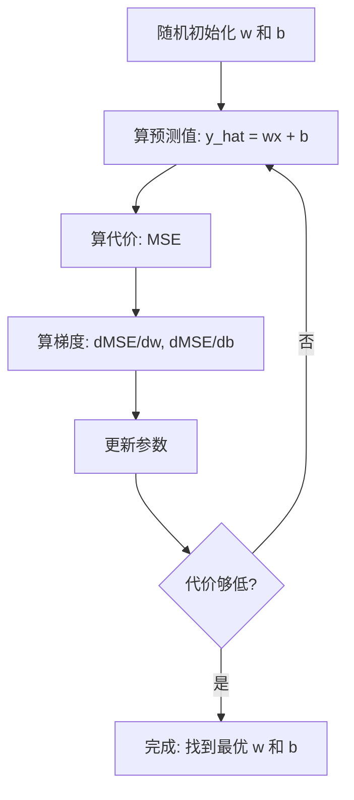

# 线性回归

> 线性回归就是在数据里画一条最合适直线。它是机器学习的 “hello world”。

**Type:** Build
**Languages:** Python
**Prerequisites:** Phase 1 (线性代数、微积分、优化)、Phase 2 Lesson 1
**Time:** ~90 分钟

## 学习目标

- 推导均方误差的梯度下降更新规则,并从零实现线性回归
- 在计算复杂度和适用场景两个维度上对比梯度下降和正规方程
- 构建带特征标准化的多元线性回归模型,并解读学到的权重
- 解释岭回归(L2 正则化)如何通过对大权重施加惩罚来防止过拟合

## 问题引入

你手上有数据:房屋面积和成交价。你想给一套新房根据面积预测价格。你可以凭直觉在散点图上估,但你需要一个公式。你需要一条拟合数据的直线,这样任意面积都能算出预测价。

线性回归给你这条线。更重要的是,它把整个 ML 训练循环都引出来了:定义模型,定义损失函数,优化参数。每个 ML 算法都是这个套路。先在最简单的情况上把它拿下,以后你到处都会认出它。

这玩意儿不是只能玩简单问题。线性回归在生产系统里被用来做需求预测、A/B 测试分析、金融建模,以及作为所有回归任务的基线。

## 核心概念

### 模型

线性回归假设输入 (x) 和输出 (y) 之间是线性关系:

```
y = wx + b
```

- `w`(权重/斜率):x 增加 1 时 y 变化多少
- `b`(偏置/截距):x = 0 时 y 的值

对多个输入(特征)来说,推广成:

```
y = w1*x1 + w2*x2 + ... + wn*xn + b
```

写成向量形式:`y = w^T * x + b`

目标:找到一组 w 和 b,让所有训练样本上的预测 y 尽可能接近真实 y。

### 代价函数(均方误差)

怎么衡量“尽可能接近”?你需要一个数把“错得有多厉害”装下。最常用的就是均方误差(MSE):

```
MSE = (1/n) * sum((y_predicted - y_actual)^2)
```

为什么用平方?两个原因。第一,它对大误差的惩罚比对小误差重得多(误差为 10 是误差为 1 的 100 倍,而不是 10 倍)。第二,平方函数处处平滑可微,优化起来很顺手。

代价函数构成一个曲面。对单个权重 w 和偏置 b,MSE 曲面像个碗(凸抛物面)。碗底就是 MSE 最小的地方。训练就是找这个碗底。

### 梯度下降

梯度下降就是沿着下坡方向找碗底。



梯度告诉你两件事:每个参数该往哪个方向动,动多少。

对 y_hat = wx + b 的 MSE:

```
dMSE/dw = (2/n) * sum((y_hat - y) * x)
dMSE/db = (2/n) * sum(y_hat - y)
```

更新规则:

```
w = w - learning_rate * dMSE/dw
b = b - learning_rate * dMSE/db
```

学习率控制步长。太大:越过最小点发散。太小:训练慢到天荒地老。常用起步值:0.01、0.001、0.0001。

### 正规方程(闭式解)

线性回归有一个直接公式能一步到位给出最优权重,不用迭代:

```
w = (X^T * X)^(-1) * X^T * y
```

这步要矩阵求逆,小数据集完美。数据量大时(上百万行或者上千特征),梯度下降更香,因为矩阵求逆的复杂度是 O(n³)(n 是特征数)。

### 多元线性回归

特征多了以后,模型变成:

```
y = w1*x1 + w2*x2 + ... + wn*xn + b
```

所有东西一样:MSE 还是损失函数,梯度下降同时更新所有权重。唯一区别是你在拟合一个超平面而不是一条直线。

特征缩放在这里很重要。一个特征范围 0 到 1,另一个范围 0 到 1,000,000,梯度下降会很难收敛,因为代价曲面被拉得很扁。训练前先把特征标准化(减均值,除以标准差)。

### 多项式回归

关系不是线性的怎么办?造多项式特征,你还是可以套线性回归:

```
y = w1*x + w2*x^2 + w3*x^3 + b
```

这还是“线性”回归,因为模型对权重 (w1, w2, w3) 是线性的。你只是用了 x 的非线性特征。

次数越高的多项式能拟合更复杂的曲线,但也更容易过拟合。10 次多项式能穿过 10 个点里的每一个,但在新数据上预测得一塌糊涂。

### R² 分数

MSE 能告诉你错多少,但这个数取决于 y 的量纲。R²(R 平方)给一个跟量纲无关的度量:

```
R² = 1 - (残差平方和) / (总平方和)
   = 1 - SS_res / SS_tot
```

- R² = 1.0:预测完美
- R² = 0.0:模型跟每次都猜均值一样差
- R² < 0.0:模型还不如猜均值

### 正则化预告(岭回归)

特征很多时,模型会靠赋大权重来过拟合。岭回归(L2 正则化)加一个惩罚项:

```
Cost = MSE + lambda * sum(w_i^2)
```

惩罚项抑制大权重。超参 lambda 控制权衡:lambda 越大,权重越小,正则化越强。这块在后面的课会详细讲。现在先知道有这玩意儿,以及它为什么有用。

```figure
linear-regression-fit
```

## 从零实现

### Step 1:生成样本数据

```python
import random
import math

random.seed(42)

TRUE_W = 3.0
TRUE_B = 7.0
N_SAMPLES = 100

X = [random.uniform(0, 10) for _ in range(N_SAMPLES)]
y = [TRUE_W * x + TRUE_B + random.gauss(0, 2.0) for x in X]

print(f"Generated {N_SAMPLES} samples")
print(f"True relationship: y = {TRUE_W}x + {TRUE_B} (+ noise)")
print(f"First 5 points: {[(round(X[i], 2), round(y[i], 2)) for i in range(5)]}")
```

### Step 2:从零用梯度下降实现线性回归

```python
class LinearRegression:
    def __init__(self, learning_rate=0.01):
        self.w = 0.0
        self.b = 0.0
        self.lr = learning_rate
        self.cost_history = []

    def predict(self, X):
        return [self.w * x + self.b for x in X]

    def compute_cost(self, X, y):
        predictions = self.predict(X)
        n = len(y)
        cost = sum((pred - actual) ** 2 for pred, actual in zip(predictions, y)) / n
        return cost

    def compute_gradients(self, X, y):
        predictions = self.predict(X)
        n = len(y)
        dw = (2 / n) * sum((pred - actual) * x for pred, actual, x in zip(predictions, y, X))
        db = (2 / n) * sum(pred - actual for pred, actual in zip(predictions, y))
        return dw, db

    def fit(self, X, y, epochs=1000, print_every=200):
        for epoch in range(epochs):
            dw, db = self.compute_gradients(X, y)
            self.w -= self.lr * dw
            self.b -= self.lr * db
            cost = self.compute_cost(X, y)
            self.cost_history.append(cost)
            if epoch % print_every == 0:
                print(f"  Epoch {epoch:4d} | Cost: {cost:.4f} | w: {self.w:.4f} | b: {self.b:.4f}")
        return self

    def r_squared(self, X, y):
        predictions = self.predict(X)
        y_mean = sum(y) / len(y)
        ss_res = sum((actual - pred) ** 2 for actual, pred in zip(y, predictions))
        ss_tot = sum((actual - y_mean) ** 2 for actual in y)
        return 1 - (ss_res / ss_tot)


print("=== Training Linear Regression (Gradient Descent) ===")
model = LinearRegression(learning_rate=0.005)
model.fit(X, y, epochs=1000, print_every=200)
print(f"\nLearned: y = {model.w:.4f}x + {model.b:.4f}")
print(f"True:    y = {TRUE_W}x + {TRUE_B}")
print(f"R-squared: {model.r_squared(X, y):.4f}")
```

### Step 3:正规方程(闭式解)

```python
class LinearRegressionNormal:
    def __init__(self):
        self.w = 0.0
        self.b = 0.0

    def fit(self, X, y):
        n = len(X)
        x_mean = sum(X) / n
        y_mean = sum(y) / n
        numerator = sum((X[i] - x_mean) * (y[i] - y_mean) for i in range(n))
        denominator = sum((X[i] - x_mean) ** 2 for i in range(n))
        self.w = numerator / denominator
        self.b = y_mean - self.w * x_mean
        return self

    def predict(self, X):
        return [self.w * x + self.b for x in X]

    def r_squared(self, X, y):
        predictions = self.predict(X)
        y_mean = sum(y) / len(y)
        ss_res = sum((actual - pred) ** 2 for actual, pred in zip(y, predictions))
        ss_tot = sum((actual - y_mean) ** 2 for actual in y)
        return 1 - (ss_res / ss_tot)


print("\n=== Normal Equation (Closed-Form) ===")
model_normal = LinearRegressionNormal()
model_normal.fit(X, y)
print(f"Learned: y = {model_normal.w:.4f}x + {model_normal.b:.4f}")
print(f"R-squared: {model_normal.r_squared(X, y):.4f}")
```

### Step 4:多元线性回归

```python
class MultipleLinearRegression:
    def __init__(self, n_features, learning_rate=0.01):
        self.weights = [0.0] * n_features
        self.bias = 0.0
        self.lr = learning_rate
        self.cost_history = []

    def predict_single(self, x):
        return sum(w * xi for w, xi in zip(self.weights, x)) + self.bias

    def predict(self, X):
        return [self.predict_single(x) for x in X]

    def compute_cost(self, X, y):
        predictions = self.predict(X)
        n = len(y)
        return sum((pred - actual) ** 2 for pred, actual in zip(predictions, y)) / n

    def fit(self, X, y, epochs=1000, print_every=200):
        n = len(y)
        n_features = len(X[0])
        for epoch in range(epochs):
            predictions = self.predict(X)
            errors = [pred - actual for pred, actual in zip(predictions, y)]
            for j in range(n_features):
                grad = (2 / n) * sum(errors[i] * X[i][j] for i in range(n))
                self.weights[j] -= self.lr * grad
            grad_b = (2 / n) * sum(errors)
            self.bias -= self.lr * grad_b
            cost = self.compute_cost(X, y)
            self.cost_history.append(cost)
            if epoch % print_every == 0:
                print(f"  Epoch {epoch:4d} | Cost: {cost:.4f}")
        return self

    def r_squared(self, X, y):
        predictions = self.predict(X)
        y_mean = sum(y) / len(y)
        ss_res = sum((actual - pred) ** 2 for actual, pred in zip(y, predictions))
        ss_tot = sum((actual - y_mean) ** 2 for actual in y)
        return 1 - (ss_res / ss_tot)


random.seed(42)
N = 100
X_multi = []
y_multi = []
for _ in range(N):
    size = random.uniform(500, 3000)
    bedrooms = random.randint(1, 5)
    age = random.uniform(0, 50)
    price = 50 * size + 10000 * bedrooms - 1000 * age + 50000 + random.gauss(0, 20000)
    X_multi.append([size, bedrooms, age])
    y_multi.append(price)


def standardize(X):
    n_features = len(X[0])
    means = [sum(X[i][j] for i in range(len(X))) / len(X) for j in range(n_features)]
    stds = []
    for j in range(n_features):
        variance = sum((X[i][j] - means[j]) ** 2 for i in range(len(X))) / len(X)
        stds.append(variance ** 0.5)
    X_scaled = []
    for i in range(len(X)):
        row = [(X[i][j] - means[j]) / stds[j] if stds[j] > 0 else 0 for j in range(n_features)]
        X_scaled.append(row)
    return X_scaled, means, stds


y_mean_val = sum(y_multi) / len(y_multi)
y_std_val = (sum((yi - y_mean_val) ** 2 for yi in y_multi) / len(y_multi)) ** 0.5
y_scaled = [(yi - y_mean_val) / y_std_val for yi in y_multi]

X_scaled, x_means, x_stds = standardize(X_multi)

print("\n=== Multiple Linear Regression (3 features) ===")
print("Features: house size, bedrooms, age")
multi_model = MultipleLinearRegression(n_features=3, learning_rate=0.01)
multi_model.fit(X_scaled, y_scaled, epochs=1000, print_every=200)

print(f"\nWeights (standardized): {[round(w, 4) for w in multi_model.weights]}")
print(f"Bias (standardized): {multi_model.bias:.4f}")
print(f"R-squared: {multi_model.r_squared(X_scaled, y_scaled):.4f}")
```

### Step 5:多项式回归

```python
class PolynomialRegression:
    def __init__(self, degree, learning_rate=0.01):
        self.degree = degree
        self.weights = [0.0] * degree
        self.bias = 0.0
        self.lr = learning_rate

    def make_features(self, X):
        return [[x ** (d + 1) for d in range(self.degree)] for x in X]

    def predict(self, X):
        features = self.make_features(X)
        return [sum(w * f for w, f in zip(self.weights, row)) + self.bias for row in features]

    def fit(self, X, y, epochs=1000, print_every=200):
        features = self.make_features(X)
        n = len(y)
        for epoch in range(epochs):
            predictions = [sum(w * f for w, f in zip(self.weights, row)) + self.bias for row in features]
            errors = [pred - actual for pred, actual in zip(predictions, y)]
            for j in range(self.degree):
                grad = (2 / n) * sum(errors[i] * features[i][j] for i in range(n))
                self.weights[j] -= self.lr * grad
            grad_b = (2 / n) * sum(errors)
            self.bias -= self.lr * grad_b
            if epoch % print_every == 0:
                cost = sum(e ** 2 for e in errors) / n
                print(f"  Epoch {epoch:4d} | Cost: {cost:.6f}")
        return self

    def r_squared(self, X, y):
        predictions = self.predict(X)
        y_mean = sum(y) / len(y)
        ss_res = sum((actual - pred) ** 2 for actual, pred in zip(y, predictions))
        ss_tot = sum((actual - y_mean) ** 2 for actual in y)
        return 1 - (ss_res / ss_tot)


random.seed(42)
X_poly = [x / 10.0 for x in range(0, 50)]
y_poly = [0.5 * x ** 2 - 2 * x + 3 + random.gauss(0, 1.0) for x in X_poly]

x_max = max(abs(x) for x in X_poly)
X_poly_norm = [x / x_max for x in X_poly]
y_poly_mean = sum(y_poly) / len(y_poly)
y_poly_std = (sum((yi - y_poly_mean) ** 2 for yi in y_poly) / len(y_poly)) ** 0.5
y_poly_norm = [(yi - y_poly_mean) / y_poly_std for yi in y_poly]

print("\n=== Polynomial Regression (degree 2 vs degree 5) ===")
print("True relationship: y = 0.5x^2 - 2x + 3")

print("\nDegree 2:")
poly2 = PolynomialRegression(degree=2, learning_rate=0.1)
poly2.fit(X_poly_norm, y_poly_norm, epochs=2000, print_every=500)
print(f"  R-squared: {poly2.r_squared(X_poly_norm, y_poly_norm):.4f}")

print("\nDegree 5:")
poly5 = PolynomialRegression(degree=5, learning_rate=0.1)
poly5.fit(X_poly_norm, y_poly_norm, epochs=2000, print_every=500)
print(f"  R-squared: {poly5.r_squared(X_poly_norm, y_poly_norm):.4f}")

print("\nDegree 2 fits the true curve well. Degree 5 fits training data slightly better")
print("but risks overfitting on new data.")
```

### Step 6:岭回归(L2 正则化)

```python
class RidgeRegression:
    def __init__(self, n_features, learning_rate=0.01, alpha=1.0):
        self.weights = [0.0] * n_features
        self.bias = 0.0
        self.lr = learning_rate
        self.alpha = alpha

    def predict_single(self, x):
        return sum(w * xi for w, xi in zip(self.weights, x)) + self.bias

    def predict(self, X):
        return [self.predict_single(x) for x in X]

    def fit(self, X, y, epochs=1000, print_every=200):
        n = len(y)
        n_features = len(X[0])
        for epoch in range(epochs):
            predictions = self.predict(X)
            errors = [pred - actual for pred, actual in zip(predictions, y)]
            mse = sum(e ** 2 for e in errors) / n
            reg_term = self.alpha * sum(w ** 2 for w in self.weights)
            cost = mse + reg_term
            for j in range(n_features):
                grad = (2 / n) * sum(errors[i] * X[i][j] for i in range(n))
                grad += 2 * self.alpha * self.weights[j]
                self.weights[j] -= self.lr * grad
            grad_b = (2 / n) * sum(errors)
            self.bias -= self.lr * grad_b
            if epoch % print_every == 0:
                print(f"  Epoch {epoch:4d} | Cost: {cost:.4f} | L2 penalty: {reg_term:.4f}")
        return self


print("\n=== Ridge Regression (L2 Regularization) ===")
print("Same data as multiple regression, with alpha=0.1")
ridge = RidgeRegression(n_features=3, learning_rate=0.01, alpha=0.1)
ridge.fit(X_scaled, y_scaled, epochs=1000, print_every=200)
print(f"\nRidge weights: {[round(w, 4) for w in ridge.weights]}")
print(f"Plain weights: {[round(w, 4) for w in multi_model.weights]}")
print("Ridge weights are smaller (shrunk toward zero) due to the L2 penalty.")
```

## 拿来用

下面用 scikit-learn 实现同样的事,这是你生产里真正会用的。

```python
from sklearn.linear_model import LinearRegression as SklearnLR
from sklearn.linear_model import Ridge
from sklearn.preprocessing import PolynomialFeatures, StandardScaler
from sklearn.model_selection import train_test_split
from sklearn.metrics import mean_squared_error, r2_score
import numpy as np

np.random.seed(42)
X_sk = np.random.uniform(0, 10, (100, 1))
y_sk = 3.0 * X_sk.squeeze() + 7.0 + np.random.normal(0, 2.0, 100)

X_train, X_test, y_train, y_test = train_test_split(X_sk, y_sk, test_size=0.2, random_state=42)

lr = SklearnLR()
lr.fit(X_train, y_train)
y_pred = lr.predict(X_test)

print("=== Scikit-learn Linear Regression ===")
print(f"Coefficient (w): {lr.coef_[0]:.4f}")
print(f"Intercept (b): {lr.intercept_:.4f}")
print(f"R-squared (test): {r2_score(y_test, y_pred):.4f}")
print(f"MSE (test): {mean_squared_error(y_test, y_pred):.4f}")

poly = PolynomialFeatures(degree=2, include_bias=False)
X_poly_sk = poly.fit_transform(X_train)
X_poly_test = poly.transform(X_test)

lr_poly = SklearnLR()
lr_poly.fit(X_poly_sk, y_train)
print(f"\nPolynomial degree 2 R-squared: {r2_score(y_test, lr_poly.predict(X_poly_test)):.4f}")

scaler = StandardScaler()
X_train_scaled = scaler.fit_transform(X_train)
X_test_scaled = scaler.transform(X_test)

ridge = Ridge(alpha=1.0)
ridge.fit(X_train_scaled, y_train)
print(f"Ridge R-squared: {r2_score(y_test, ridge.predict(X_test_scaled)):.4f}")
print(f"Ridge coefficient: {ridge.coef_[0]:.4f}")
```

你的从零实现跟 scikit-learn 出来的结果一致。区别在于:scikit-learn 处理了边界情况、数值稳定性、性能优化。生产里用库,理解原理时用从零版。

## 交付物

本课产出:
- `outputs/skill-regression.md` —— 一个根据问题选回归方法的 skill

## 练习

1. 实现批量梯度下降、随机梯度下降(SGD)、小批量梯度下降,在同一数据集上比较收敛速度。哪个最快?哪个代价曲线最平滑?
2. 从一个三次函数(y = ax³ + bx² + cx + d + noise)生成数据。分别拟合 1 次、3 次、10 次多项式,比较训练 R² 和测试 R²。在哪个次数上过拟合明显出现?
3. 实现 Lasso 回归(L1 正则化:penalty = alpha * sum(|w_i|)),在多特征房屋数据上训练。比较哪些权重被压到 0,跟 Ridge 有什么区别?为什么 L1 产生稀疏解而 L2 不行?

## 关键术语

| 术语 | 大家常说的 | 实际含义 |
|------|-----------|---------|
| Linear regression | "在数据里画条线" | 找权重 w 和偏置 b,让 wx+b 跟真实 y 的平方差之和最小 |
| Cost function | "模型有多糟" | 一个把模型参数映射到单一数字的函数,衡量预测误差,优化目标就是把它最小化 |
| Mean squared error | "平方误差的平均" | (1/n) * sum(预测 - 真实)²,对大误差惩罚更重 |
| Gradient descent | "往下坡走" | 沿代价函数下降方向反复调参数,用偏导决定方向和幅度 |
| Learning rate | "步长" | 一个标量,控制梯度下降每一步参数变化的幅度 |
| Normal equation | "直接解出来" | 闭式解 w = (X^T X)^(-1) X^T y,不用迭代直接得最优权重 |
| R-squared | "拟合有多好" | 模型解释的 y 方差比例,范围从负无穷到 1.0 |
| Feature scaling | "让特征可比" | 把特征变换到相近的区间(如零均值、单位方差),让梯度下降收敛更快 |
| Regularization | "惩罚复杂度" | 在损失函数上加一项缩小权重,防止过拟合 |
| Ridge regression | "L2 正则化" | 在 MSE 上加 lambda * sum(w_i²) 惩罚的线性回归 |
| Polynomial regression | "用线性数学拟合曲线" | 在多项式特征 (x, x², x³, ...) 上做线性回归,对权重仍是线性的 |
| Overfitting | "把训练数据背下来" | 模型太复杂,把训练集噪声也学了,在新数据上失效 |

## 延伸阅读

- [An Introduction to Statistical Learning (ISLR)](https://www.statlearning.com/) —— 免费 PDF,第 3 章和第 6 章讲线性回归和正则化,带 R 实战例子
- [The Elements of Statistical Learning (ESL)](https://hastie.su.domains/ElemStatLearn/) —— 免费 PDF,ISLR 的数学更硬版本,岭回归和 Lasso 讲得更深
- [Stanford CS229 Lecture Notes on Linear Regression](https://cs229.stanford.edu/main_notes.pdf) —— Andrew Ng 的笔记,从第一性原理推导正规方程和梯度下降
- [scikit-learn LinearRegression documentation](https://scikit-learn.org/stable/modules/linear_model.html) —— LinearRegression、Ridge、Lasso、ElasticNet 的实战参考,带代码示例