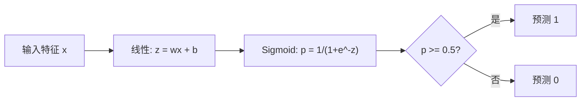
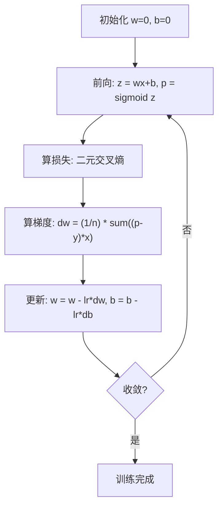

# 逻辑回归

> 逻辑回归把一条直线弯成 S 曲线,用概率回答“是/否”类问题。

**Type:** Build
**Languages:** Python
**Prerequisites:** Phase 2 Lesson 1-2 (什么是 ML、线性回归)
**Time:** ~90 分钟

## 学习目标

- 用 sigmoid 函数和二元交叉熵损失从零实现逻辑回归
- 计算并解读二元分类的准确率、精确率、召回率、F1 分数和混淆矩阵
- 解释为什么 MSE 不适合分类,以及为什么二元交叉熵能产生凸代价曲面
- 构建用于多分类的 softmax 回归模型,并评估阈值调优的权衡

## 问题引入

你想根据肿瘤大小预测它是恶性还是良性。试试线性回归。它会输出 0.3、1.7、-0.5 这种数。这些数是什么意思?1.7 是“很恶性”?-0.5 是“很良性”?线性回归输出无界的数。分类需要的是 0 到 1 之间的有界概率,以及一个清晰的决策:是或否。

逻辑回归解决这个问题。它把同样的线性组合(wx + b)喂给 sigmoid 函数,后者把任何数压到 (0, 1) 区间。输出是个概率。你设个阈值(一般是 0.5),做出决策。

这是实际中最常用的算法之一。虽然名字叫“回归”,逻辑回归是分类算法,不是回归算法。名字源于它用的 logistic(sigmoid)函数。

## 核心概念

### 为什么线性回归在分类上失效

想象根据学习时长预测通过/不通过(1/0)。线性回归在数据里拟合一条线:

```
hours:  1   2   3   4   5   6   7   8   9   10
actual: 0   0   0   0   1   1   1   1   1   1
```

线性拟合可能在 hour=1 时给出 -0.2,在 hour=10 时给出 1.3。这些值不是概率,会跑出 0 以下或 1 以上。更糟的是,一个离群点(学了 50 小时)会把整条线拖走,改变所有人的预测。

分类需要一个函数,它要满足:
- 输出 0 到 1 之间的值(概率)
- 产生一个尖锐的过渡(决策边界)
- 不被远离边界的离群点扭曲

### Sigmoid 函数

sigmoid 函数正好干这个:

```
sigmoid(z) = 1 / (1 + e^(-z))
```

性质:
- z 是大正数时,sigmoid(z) 趋近 1
- z 是大负数时,sigmoid(z) 趋近 0
- z = 0 时,sigmoid(z) = 0.5
- 输出永远在 0 到 1 之间
- 函数处处平滑可微

导数有个好用的形式:sigmoid'(z) = sigmoid(z) * (1 - sigmoid(z)),梯度计算因此很高效。

### 逻辑回归 = 线性模型 + Sigmoid

模型先算 z = wx + b(跟线性回归一样),再过 sigmoid:



输出 p 解释成 P(y=1 | x),即输入属于类别 1 的概率。决策边界就是 wx + b = 0 的位置,那里 sigmoid 输出刚好是 0.5。

### 二元交叉熵损失

逻辑回归不能用 MSE。sigmoid 上的 MSE 会产生非凸代价曲面,有很多局部最小。改用二元交叉熵(log loss):

```
Loss = -(1/n) * sum(y * log(p) + (1-y) * log(1-p))
```

为什么这个能行:
- y=1、p 接近 1 时:log(1) = 0,损失接近 0(正确,代价低)
- y=1、p 接近 0 时:log(0) 趋近负无穷,损失巨大(错得离谱,代价高)
- y=0、p 接近 0 时:log(1) = 0,损失接近 0(正确,代价低)
- y=0、p 接近 1 时:log(0) 趋近负无穷,损失巨大(错得离谱,代价高)

这个损失函数在逻辑回归上是凸的,保证只有一个全局最小。

### 逻辑回归的梯度下降

二元交叉熵 + sigmoid 的梯度有个清爽的形式:

```
dL/dw = (1/n) * sum((p - y) * x)
dL/db = (1/n) * sum(p - y)
```

这俩跟线性回归的梯度长得一模一样。区别在于 p = sigmoid(wx + b),而不是 p = wx + b。sigmoid 引入非线性,但梯度更新规则保持不变。



### 决策边界

对 2 维输入(两个特征),决策边界就是这条线:

```
w1*x1 + w2*x2 + b = 0
```

线一侧分到 1,另一侧分到 0。逻辑回归永远产生线性决策边界。想要曲线边界,要么加多项式特征,要么用非线性模型。

### 多分类与 Softmax

二元逻辑回归处理两类。k 个类,用 softmax 函数:

```
softmax(z_i) = e^(z_i) / sum(e^(z_j) for all j)
```

每个类有自己的权重向量。模型为每个类算一个分数 z_i,softmax 把分数转成和为 1 的概率。预测的类就是概率最高的那个。

损失函数变成类别交叉熵:

```
Loss = -(1/n) * sum(sum(y_k * log(p_k)))
```

y_k 对真实类是 1,其他类是 0(独热编码)。

### 评估指标

光看准确率不够。一个数据集 95% 负类、5% 正类,模型永远预测负类也能拿到 95% 准确率,但完全没用。

**混淆矩阵**:

| | 预测正类 | 预测负类 |
|---|---|---|
| 实际正类 | True Positive (TP) | False Negative (FN) |
| 实际负类 | False Positive (FP) | True Negative (TN) |

**精确率(Precision)**:所有预测为正的里面,真的是正的有多少?
```
Precision = TP / (TP + FP)
```

**召回率(Recall/Sensitivity)**:所有实际为正的里面,我们抓到了多少?
```
Recall = TP / (TP + FN)
```

**F1 分数**:精确率和召回率的调和平均,平衡两个指标。
```
F1 = 2 * (Precision * Recall) / (Precision + Recall)
```

什么时候偏重哪个:
- **精确率**:误报代价高的时候(垃圾邮件过滤器,你不想误拦正常邮件)
- **召回率**:漏报代价高的时候(癌症筛查,你不想漏掉肿瘤)
- **F1**:你需要单一平衡指标时

```figure
logistic-sigmoid
```

## 从零实现

### Step 1:Sigmoid 函数和数据生成

```python
import random
import math

def sigmoid(z):
    z = max(-500, min(500, z))
    return 1.0 / (1.0 + math.exp(-z))


random.seed(42)
N = 200
X = []
y = []

for _ in range(N // 2):
    X.append([random.gauss(2, 1), random.gauss(2, 1)])
    y.append(0)

for _ in range(N // 2):
    X.append([random.gauss(5, 1), random.gauss(5, 1)])
    y.append(1)

combined = list(zip(X, y))
random.shuffle(combined)
X, y = zip(*combined)
X = list(X)
y = list(y)

print(f"Generated {N} samples (2 classes, 2 features)")
print(f"Class 0 center: (2, 2), Class 1 center: (5, 5)")
print(f"First 5 samples:")
for i in range(5):
    print(f"  Features: [{X[i][0]:.2f}, {X[i][1]:.2f}], Label: {y[i]}")
```

### Step 2:从零实现逻辑回归

```python
class LogisticRegression:
    def __init__(self, n_features, learning_rate=0.01):
        self.weights = [0.0] * n_features
        self.bias = 0.0
        self.lr = learning_rate
        self.loss_history = []

    def predict_proba(self, x):
        z = sum(w * xi for w, xi in zip(self.weights, x)) + self.bias
        return sigmoid(z)

    def predict(self, x, threshold=0.5):
        return 1 if self.predict_proba(x) >= threshold else 0

    def compute_loss(self, X, y):
        n = len(y)
        total = 0.0
        for i in range(n):
            p = self.predict_proba(X[i])
            p = max(1e-15, min(1 - 1e-15, p))
            total += y[i] * math.log(p) + (1 - y[i]) * math.log(1 - p)
        return -total / n

    def fit(self, X, y, epochs=1000, print_every=200):
        n = len(y)
        n_features = len(X[0])
        for epoch in range(epochs):
            dw = [0.0] * n_features
            db = 0.0
            for i in range(n):
                p = self.predict_proba(X[i])
                error = p - y[i]
                for j in range(n_features):
                    dw[j] += error * X[i][j]
                db += error
            for j in range(n_features):
                self.weights[j] -= self.lr * (dw[j] / n)
            self.bias -= self.lr * (db / n)
            loss = self.compute_loss(X, y)
            self.loss_history.append(loss)
            if epoch % print_every == 0:
                print(f"  Epoch {epoch:4d} | Loss: {loss:.4f} | w: [{self.weights[0]:.3f}, {self.weights[1]:.3f}] | b: {self.bias:.3f}")
        return self

    def accuracy(self, X, y):
        correct = sum(1 for i in range(len(y)) if self.predict(X[i]) == y[i])
        return correct / len(y)


split = int(0.8 * N)
X_train, X_test = X[:split], X[split:]
y_train, y_test = y[:split], y[:split + 0]

y_train, y_test = y[:split], y[split:]

print("\n=== Training Logistic Regression ===")
model = LogisticRegression(n_features=2, learning_rate=0.1)
model.fit(X_train, y_train, epochs=1000, print_every=200)

print(f"\nTrain accuracy: {model.accuracy(X_train, y_train):.4f}")
print(f"Test accuracy:  {model.accuracy(X_test, y_test):.4f}")
print(f"Weights: [{model.weights[0]:.4f}, {model.weights[1]:.4f}]")
print(f"Bias: {model.bias:.4f}")
```

### Step 3:从零实现混淆矩阵和指标

```python
class ClassificationMetrics:
    def __init__(self, y_true, y_pred):
        self.tp = sum(1 for t, p in zip(y_true, y_pred) if t == 1 and p == 1)
        self.tn = sum(1 for t, p in zip(y_true, y_pred) if t == 0 and p == 0)
        self.fp = sum(1 for t, p in zip(y_true, y_pred) if t == 0 and p == 1)
        self.fn = sum(1 for t, p in zip(y_true, y_pred) if t == 1 and p == 0)

    def accuracy(self):
        total = self.tp + self.tn + self.fp + self.fn
        return (self.tp + self.tn) / total if total > 0 else 0

    def precision(self):
        denom = self.tp + self.fp
        return self.tp / denom if denom > 0 else 0

    def recall(self):
        denom = self.tp + self.fn
        return self.tp / denom if denom > 0 else 0

    def f1(self):
        p = self.precision()
        r = self.recall()
        return 2 * p * r / (p + r) if (p + r) > 0 else 0

    def print_confusion_matrix(self):
        print(f"\n  Confusion Matrix:")
        print(f"                  Predicted")
        print(f"                  Pos   Neg")
        print(f"  Actual Pos     {self.tp:4d}  {self.fn:4d}")
        print(f"  Actual Neg     {self.fp:4d}  {self.tn:4d}")

    def print_report(self):
        self.print_confusion_matrix()
        print(f"\n  Accuracy:  {self.accuracy():.4f}")
        print(f"  Precision: {self.precision():.4f}")
        print(f"  Recall:    {self.recall():.4f}")
        print(f"  F1 Score:  {self.f1():.4f}")


y_pred_test = [model.predict(x) for x in X_test]
print("\n=== Classification Report (Test Set) ===")
metrics = ClassificationMetrics(y_test, y_pred_test)
metrics.print_report()
```

### Step 4:决策边界分析

```python
print("\n=== Decision Boundary ===")
w1, w2 = model.weights
b = model.bias
print(f"Decision boundary: {w1:.4f}*x1 + {w2:.4f}*x2 + {b:.4f} = 0")
if abs(w2) > 1e-10:
    print(f"Solved for x2:     x2 = {-w1/w2:.4f}*x1 + {-b/w2:.4f}")

print("\nSample predictions near the boundary:")
test_points = [
    [3.0, 3.0],
    [3.5, 3.5],
    [4.0, 4.0],
    [2.5, 2.5],
    [5.0, 5.0],
]
for point in test_points:
    prob = model.predict_proba(point)
    pred = model.predict(point)
    print(f"  [{point[0]}, {point[1]}] -> prob={prob:.4f}, class={pred}")
```

### Step 5:多分类与 Softmax

```python
class SoftmaxRegression:
    def __init__(self, n_features, n_classes, learning_rate=0.01):
        self.n_features = n_features
        self.n_classes = n_classes
        self.lr = learning_rate
        self.weights = [[0.0] * n_features for _ in range(n_classes)]
        self.biases = [0.0] * n_classes

    def softmax(self, scores):
        max_score = max(scores)
        exp_scores = [math.exp(s - max_score) for s in scores]
        total = sum(exp_scores)
        return [e / total for e in exp_scores]

    def predict_proba(self, x):
        scores = [
            sum(self.weights[k][j] * x[j] for j in range(self.n_features)) + self.biases[k]
            for k in range(self.n_classes)
        ]
        return self.softmax(scores)

    def predict(self, x):
        probs = self.predict_proba(x)
        return probs.index(max(probs))

    def fit(self, X, y, epochs=1000, print_every=200):
        n = len(y)
        for epoch in range(epochs):
            grad_w = [[0.0] * self.n_features for _ in range(self.n_classes)]
            grad_b = [0.0] * self.n_classes
            total_loss = 0.0
            for i in range(n):
                probs = self.predict_proba(X[i])
                for k in range(self.n_classes):
                    target = 1.0 if y[i] == k else 0.0
                    error = probs[k] - target
                    for j in range(self.n_features):
                        grad_w[k][j] += error * X[i][j]
                    grad_b[k] += error
                true_prob = max(probs[y[i]], 1e-15)
                total_loss -= math.log(true_prob)
            for k in range(self.n_classes):
                for j in range(self.n_features):
                    self.weights[k][j] -= self.lr * (grad_w[k][j] / n)
                self.biases[k] -= self.lr * (grad_b[k] / n)
            if epoch % print_every == 0:
                print(f"  Epoch {epoch:4d} | Loss: {total_loss / n:.4f}")
        return self

    def accuracy(self, X, y):
        correct = sum(1 for i in range(len(y)) if self.predict(X[i]) == y[i])
        return correct / len(y)


random.seed(42)
X_3class = []
y_3class = []

centers = [(1, 1), (5, 1), (3, 5)]
for label, (cx, cy) in enumerate(centers):
    for _ in range(50):
        X_3class.append([random.gauss(cx, 0.8), random.gauss(cy, 0.8)])
        y_3class.append(label)

combined = list(zip(X_3class, y_3class))
random.shuffle(combined)
X_3class, y_3class = zip(*combined)
X_3class = list(X_3class)
y_3class = list(y_3class)

split_3 = int(0.8 * len(X_3class))
X_train_3 = X_3class[:split_3]
y_train_3 = y_3class[:split_3]
X_test_3 = X_3class[split_3:]
y_test_3 = y_3class[split_3:]

print("\n=== Multi-class Softmax Regression (3 classes) ===")
softmax_model = SoftmaxRegression(n_features=2, n_classes=3, learning_rate=0.1)
softmax_model.fit(X_train_3, y_train_3, epochs=1000, print_every=200)
print(f"\nTrain accuracy: {softmax_model.accuracy(X_train_3, y_train_3):.4f}")
print(f"Test accuracy:  {softmax_model.accuracy(X_test_3, y_test_3):.4f}")

print("\nSample predictions:")
for i in range(5):
    probs = softmax_model.predict_proba(X_test_3[i])
    pred = softmax_model.predict(X_test_3[i])
    print(f"  True: {y_test_3[i]}, Predicted: {pred}, Probs: [{', '.join(f'{p:.3f}' for p in probs)}]")
```

### Step 6:阈值调优

```python
print("\n=== Threshold Tuning ===")
print("Default threshold: 0.5. Adjusting the threshold trades precision for recall.\n")

thresholds = [0.3, 0.4, 0.5, 0.6, 0.7]
print(f"{'Threshold':>10} {'Accuracy':>10} {'Precision':>10} {'Recall':>10} {'F1':>10}")
print("-" * 52)

for t in thresholds:
    y_pred_t = [1 if model.predict_proba(x) >= t else 0 for x in X_test]
    m = ClassificationMetrics(y_test, y_pred_t)
    print(f"{t:>10.1f} {m.accuracy():>10.4f} {m.precision():>10.4f} {m.recall():>10.4f} {m.f1():>10.4f}")
```

## 拿来用

下面用 scikit-learn 做同样的事。

```python
from sklearn.linear_model import LogisticRegression as SklearnLR
from sklearn.metrics import accuracy_score, precision_score, recall_score, f1_score
from sklearn.metrics import confusion_matrix, classification_report
from sklearn.model_selection import train_test_split
from sklearn.preprocessing import StandardScaler
import numpy as np

np.random.seed(42)
X_0 = np.random.randn(100, 2) + [2, 2]
X_1 = np.random.randn(100, 2) + [5, 5]
X_sk = np.vstack([X_0, X_1])
y_sk = np.array([0] * 100 + [1] * 100)

X_tr, X_te, y_tr, y_te = train_test_split(X_sk, y_sk, test_size=0.2, random_state=42)

scaler = StandardScaler()
X_tr_sc = scaler.fit_transform(X_tr)
X_te_sc = scaler.transform(X_te)

lr = SklearnLR()
lr.fit(X_tr_sc, y_tr)
y_pred = lr.predict(X_te_sc)

print("=== Scikit-learn Logistic Regression ===")
print(f"Accuracy:  {accuracy_score(y_te, y_pred):.4f}")
print(f"Precision: {precision_score(y_te, y_pred):.4f}")
print(f"Recall:    {recall_score(y_te, y_pred):.4f}")
print(f"F1:        {f1_score(y_te, y_pred):.4f}")
print(f"\nConfusion Matrix:\n{confusion_matrix(y_te, y_pred)}")
print(f"\nClassification Report:\n{classification_report(y_te, y_pred)}")
```

你的从零实现跟 sklearn 出来的决策边界和指标一致。sklearn 多了解法选项(liblinear、lbfgs、saga)、自动正则化、多分类策略(one-vs-rest、multinomial),以及数值稳定性优化。

## 交付物

本课产出:
- `code/logistic_regression.py` —— 从零实现的逻辑回归,带指标

## 练习

1. 生成一个**不**线性可分的数据集(比如两个同心圆)。用逻辑回归训练,观察它怎么失败。然后加多项式特征(x1²、x2²、x1*x2)再训一遍,展示准确率提升。
2. 为 3 类 softmax 模型实现多分类混淆矩阵。算每个类的精确率和召回率。哪个类最难分类?
3. 从零画 ROC 曲线。取 100 个阈值(从 0 到 1),算每个的真阳性率和假阳性率。用梯形法算 AUC。

## 关键术语

| 术语 | 大家常说的 | 实际含义 |
|------|-----------|---------|
| Logistic regression | "分类用的回归" | 线性模型套 sigmoid 函数,输出类别概率 |
| Sigmoid function | "S 曲线" | 函数 1/(1+e^(-z)),把任意实数映射到 (0, 1) |
| Binary cross-entropy | "对数损失" | 损失函数 -[y*log(p) + (1-y)*log(1-p)],对自信地犯错惩罚很重 |
| Decision boundary | "分界线" | 模型输出概率等于 0.5 的面,把预测类别分开 |
| Softmax | "多类 sigmoid" | 把分数向量转成和为 1 的概率的函数 |
| Precision | "选中的里有多少相关" | TP / (TP + FP),预测为正的里面真为正的比例 |
| Recall | "相关的里选中了多少" | TP / (TP + FN),实际为正的里面被模型正确识别的比例 |
| F1 score | "平衡的准确率" | 精确率和召回率的调和平均:2*P*R / (P+R) |
| Confusion matrix | "错误分解" | 展示每个类对的 TP、TN、FP、FN 计数的表 |
| Threshold | "切分线" | 模型据此预测正类的概率值(默认 0.5,可调) |
| One-hot encoding | "类别的二进制列" | 把类别 k 表示成第 k 位为 1、其余为 0 的向量 |
| Categorical cross-entropy | "多类对数损失" | 二元交叉熵在 k 类上的推广,标签用独热编码 |