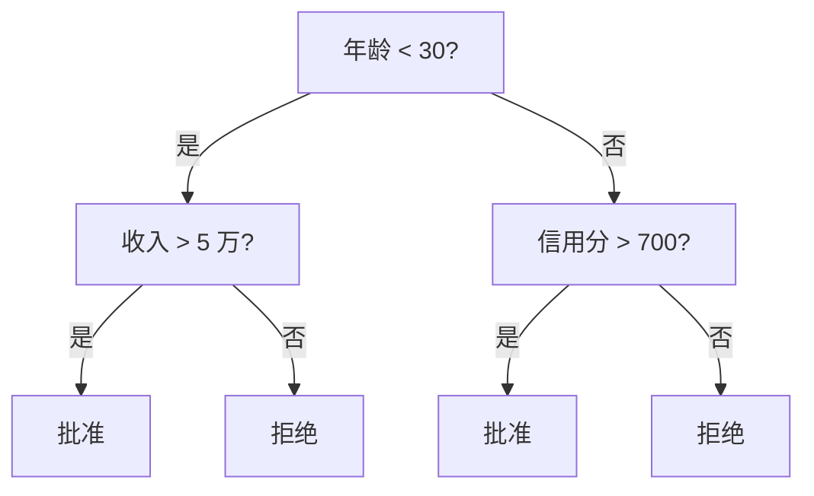
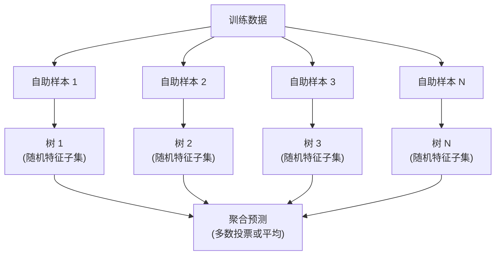

# 决策树与随机森林

> 决策树就是一张流程图。但一片树的森林,是 ML 里最强大的工具之一。

**Type:** Build
**Language:** Python
**Prerequisites:** Phase 1 (Lesson 09 信息论、06 概率)
**Time:** ~90 分钟

## 学习目标

- 实现 Gini 不纯度、熵和信息增益的计算,找到最优的决策树切分点
- 从零构建带预剪枝控制(最大深度、最小样本数)的决策树分类器
- 用自助采样和特征随机化构造随机森林,并解释它为什么能降低方差
- 对比 MDI 特征重要性和置换重要性,识别 MDI 在什么情况下有偏

## 问题引入

你手头是表格数据。行是样本,列是特征,还有一列是你要预测的目标。你可以扔个神经网络上去。但对表格数据,树模型(决策树、随机森林、梯度提升树)一直吊打深度学习。Kaggle 上结构化数据的比赛,XGBoost 和 LightGBM 统治榜单,Transformer 排不上号。

为啥?树天然处理混合特征类型(数值和类别),不用预处理;天然处理非线性关系,不用特征工程;还**可解释**——你能看着树,清清楚楚知道预测是怎么来的。随机森林把很多棵树平均起来,对中等规模数据上的过拟合特别抗造。

本课用递归切分从零搭出决策树,再在上面搭随机森林。你会亲手实现切分准则(Gini、熵、信息增益)背后的数学,理解为什么一堆弱学习器合起来会变强。

## 核心概念

### 决策树在干什么

决策树通过一连串是非问题,把特征空间切成一个个长方形区域。



每个内部节点用一个阈值测试一个特征;每个叶子节点给一个预测。预测新样本时,从根节点起按分支往下走,直到叶子。

树是自顶向下建的,每个节点选最能分开数据的特征和阈值。“最能”由切分准则定义。

### 切分准则:测不纯度

一个节点里有一批样本。我们想把它们切完以后,子节点尽量“纯”,也就是每个子节点里基本是一个类。

**Gini 不纯度**衡量的是:随机抽一个样本,如果按该节点的类别分布给它打标签,被错分的概率。

```
Gini(S) = 1 - sum(p_k^2)

其中 p_k 是集合 S 中类别 k 的比例。
```

纯节点(全一个类)Gini = 0。二元 50/50 时 Gini = 0.5。越低越好。

```
例子: 6 只猫, 4 只狗

Gini = 1 - (0.6² + 0.4²) = 1 - (0.36 + 0.16) = 0.48
```

**熵**衡量节点里的信息量(混乱度)。在 Phase 1 Lesson 09 讲过。

```
Entropy(S) = -sum(p_k * log2(p_k))
```

纯节点熵 = 0。二元 50/50 时熵 = 1.0。越低越好。

```
例子: 6 只猫, 4 只狗

Entropy = -(0.6 * log2(0.6) + 0.4 * log2(0.4))
        = -(0.6 * -0.737 + 0.4 * -1.322)
        = 0.442 + 0.529
        = 0.971 bits
```

**信息增益**是切分之后不纯度(熵或 Gini)下降了多少。

```
IG(S, feature, threshold) = Impurity(S) - weighted_avg(Impurity(S_left), Impurity(S_right))

权重是各子节点的样本比例。
```

每个节点的贪心算法:试每个特征、每个可能的阈值,挑信息增益最大的(特征, 阈值)对。

### 切分怎么工作

一个节点当前有 n 个特征、m 个样本时:

1. 对每个特征 j(j = 1 到 n):
   - 按特征 j 把样本排序
   - 试每对相邻不同值的中点作为阈值
   - 算每个阈值的信息增益
2. 选信息增益最大的特征和阈值
3. 数据切成左(feature ≤ 阈值)和右(feature > 阈值)
4. 对每个子节点递归

这种贪心法不保证全局最优。找最优决策树是 NP 难问题。但贪心切分在实际中效果很好。

### 停止条件

没有停止条件,树会一直长到每个叶子都纯(每叶子一个样本)。这就把训练数据完美背下来,泛化一塌糊涂。

**预剪枝**让树还没长全就停:
- 最大深度:树到设定深度就不切了
- 每叶子最小样本数:节点样本数低于 k 就不再切
- 最小信息增益:最好的切分带来的不纯度下降小于阈值就停
- 最大叶子数:限制叶子总数

**后剪枝**先把树长满,再往回剪:
- 成本复杂度剪枝(sklearn 用的):加一个跟叶子数成正比的惩罚,惩罚越大树越小
- 减小错误剪枝:如果删掉子树后验证误差不增加,就删

预剪枝更简单更快。后剪枝常常能产出更好的树,因为它不会过早停掉那些本可以通向更有用切分的分支。

### 回归树

回归任务里,叶子的预测值是该叶子所有目标值的均值。切分准则也要换:

**方差缩减**替代信息增益:

```
VR(S, feature, threshold) = Var(S) - weighted_avg(Var(S_left), Var(S_right))
```

选让方差降得最多的切分。树把输入空间切成一个个区域,每个区域里预测一个常数(均值)。

### 随机森林:集成之力

单棵决策树方差大。数据里的小变化能产出完全不同的树。随机森林通过平均很多棵树来解决这个问题。



两个随机源让树彼此不同:

**Bagging(自助聚合)**:每棵树在自助样本上训练——从训练数据中有放回地随机抽样。每个自助样本大约含原始数据的 63% 样本(剩下的是袋外样本,可以拿来当验证用)。

**特征随机化**:每次切分时,只考虑一个随机特征子集。分类任务默认 sqrt(n_features),回归任务默认 n_features/3。这防止所有树都切在同一个占主导的特征上。

核心洞见:平均一堆不相关的树,能降低方差但不会抬高偏差。单独一棵可能平庸,合起来就强。

### 特征重要性

随机森林天然给出特征重要性分数。最常用的方法:

**平均不纯度下降(MDI)**:对每个特征,把它在所有树、所有节点带来的不纯度下降累加。在浅切分上带来更大下降的特征更重要。

```
importance(feature_j) = 累加所有用了 feature_j 的节点:
    (节点样本数 / 总样本数) * 不纯度下降
```

这个方法快(训练时就算),但偏向高基数特征和切分点多的特征。

**置换重要性**是另一种:把某列特征的值打乱,看模型准确率掉多少。更可靠但更慢。

### 什么时候树比神经网络强

树和森林在表格数据上吊打神经网络。几个原因:

| 因素 | 树 | 神经网络 |
|------|----|---------|
| 混合类型(数值 + 类别) | 天然支持 | 需要编码 |
| 小数据集(< 10k 行) | 表现好 | 易过拟合 |
| 特征交互 | 切分时自动发现 | 需要设计架构 |
| 可解释性 | 完全透明 | 黑盒 |
| 训练时间 | 分钟级 | 小时级 |
| 超参敏感度 | 低 | 高 |

神经网络赢在数据有空间或时序结构(图、文、音频)的时候。对于扁平的特征表,树是默认选择。

```figure
decision-tree-depth
```

## 从零实现

### Step 1:Gini 不纯度和熵

把两种切分准则从零实现,验证它们对“好切分”的判断一致。

```python
import math

def gini_impurity(labels):
    n = len(labels)
    if n == 0:
        return 0.0
    counts = {}
    for label in labels:
        counts[label] = counts.get(label, 0) + 1
    return 1.0 - sum((c / n) ** 2 for c in counts.values())

def entropy(labels):
    n = len(labels)
    if n == 0:
        return 0.0
    counts = {}
    for label in labels:
        counts[label] = counts.get(label, 0) + 1
    return -sum(
        (c / n) * math.log2(c / n) for c in counts.values() if c > 0
    )
```

### Step 2:找最优切分

试每个特征、每个阈值,返回信息增益最大的那个。

```python
def information_gain(parent_labels, left_labels, right_labels, criterion="gini"):
    measure = gini_impurity if criterion == "gini" else entropy
    n = len(parent_labels)
    n_left = len(left_labels)
    n_right = len(right_labels)
    if n_left == 0 or n_right == 0:
        return 0.0
    parent_impurity = measure(parent_labels)
    child_impurity = (
        (n_left / n) * measure(left_labels) +
        (n_right / n) * measure(right_labels)
    )
    return parent_impurity - child_impurity
```

### Step 3:搭 DecisionTree 类

递归切分、预测、特征重要性追踪。

```python
class DecisionTree:
    def __init__(self, max_depth=None, min_samples_split=2,
                 min_samples_leaf=1, criterion="gini",
                 max_features=None):
        self.max_depth = max_depth
        self.min_samples_split = min_samples_split
        self.min_samples_leaf = min_samples_leaf
        self.criterion = criterion
        self.max_features = max_features
        self.tree = None
        self.feature_importances_ = None

    def fit(self, X, y):
        self.n_features = len(X[0])
        self.feature_importances_ = [0.0] * self.n_features
        self.n_samples = len(X)
        self.tree = self._build(X, y, depth=0)
        total = sum(self.feature_importances_)
        if total > 0:
            self.feature_importances_ = [
                fi / total for fi in self.feature_importances_
            ]

    def predict(self, X):
        return [self._predict_one(x, self.tree) for x in X]
```

### Step 4:搭 RandomForest 类

自助采样、特征随机化、多数投票。

```python
class RandomForest:
    def __init__(self, n_trees=100, max_depth=None,
                 min_samples_split=2, max_features="sqrt",
                 criterion="gini"):
        self.n_trees = n_trees
        self.max_depth = max_depth
        self.min_samples_split = min_samples_split
        self.max_features = max_features
        self.criterion = criterion
        self.trees = []

    def fit(self, X, y):
        n = len(X)
        for _ in range(self.n_trees):
            indices = [random.randint(0, n - 1) for _ in range(n)]
            X_boot = [X[i] for i in indices]
            y_boot = [y[i] for i in indices]
            tree = DecisionTree(
                max_depth=self.max_depth,
                min_samples_split=self.min_samples_split,
                max_features=self.max_features,
                criterion=self.criterion,
            )
            tree.fit(X_boot, y_boot)
            self.trees.append(tree)

    def predict(self, X):
        all_preds = [tree.predict(X) for tree in self.trees]
        predictions = []
        for i in range(len(X)):
            votes = {}
            for preds in all_preds:
                v = preds[i]
                votes[v] = votes.get(v, 0) + 1
            predictions.append(max(votes, key=votes.get))
        return predictions
```

完整实现见 `code/trees.py`,包含所有辅助方法。

## 拿来用

用 scikit-learn 的话,训练一个随机森林只要三行:

```python
from sklearn.ensemble import RandomForestClassifier
from sklearn.datasets import load_iris
from sklearn.model_selection import train_test_split

X, y = load_iris(return_X_y=True)
X_train, X_test, y_train, y_test = train_test_split(X, y, random_state=42)

rf = RandomForestClassifier(n_estimators=100, random_state=42)
rf.fit(X_train, y_train)
print(f"Accuracy: {rf.score(X_test, y_test):.4f}")
print(f"Feature importances: {rf.feature_importances_}")
```

实际中,梯度提升树(XGBoost、LightGBM、CatBoost)常常比随机森林更强,因为它们一棵接一棵地串行建,每棵纠正前一棵的错误。但随机森林更难配错,基本不用怎么调超参。

## 交付物

本课产出 `outputs/prompt-tree-interpreter.md`——一个把决策树切分翻译给业务方的 prompt。把训练好的树结构喂进去(深度、特征、切分阈值、准确率),它会把模型翻译成大白话规则,排序特征重要性,标出过拟合或泄露,推荐下一步动作。任何时候你要给不懂代码的人讲树模型,用它。

## 练习

1. 在一个 2 维 3 类数据集上训练单棵决策树。手动追踪切分,画出矩形决策边界。比较 max_depth=2 和 max_depth=10 时的边界。

2. 为回归树实现方差缩减切分。生成 200 个点的 y = sin(x) + noise,拟合你的回归树。把树的分段常数预测跟真实曲线画一起对比。

3. 搭一个 1、5、10、50、200 棵树的随机森林。画训练准确率和测试准确率随树数的变化。观察测试准确率会饱和但不掉(森林抗过拟合)。

4. 在 5 个不同数据集上比较 Gini 和熵作为切分准则。量准确率和树深。大多数情况下两者结果几乎一样。解释为什么。

5. 实现置换重要性。跟 MDI 在“一个特征是随机噪声但有高基数”的数据集上对比。MDI 会给噪声特征排得很高,置换重要性不会。

## 关键术语

| 术语 | 大家常说的 | 实际含义 |
|------|-----------|---------|
| Decision tree | "预测用的流程图" | 用学到的 if/else 序列把特征空间切成一个个长方形区域的模型 |
| Gini impurity | "节点有多杂" | 在该节点随机抽一个被错分的概率。0 = 纯,0.5 = 二元最大不纯 |
| Entropy | "节点里的混乱度" | 节点的信息量。0 = 纯,1.0 = 二元最大不确定。源于信息论 |
| Information gain | "切分有多好" | 切分后不纯度下降了多少。选切分时的贪心准则 |
| Pre-pruning | "早点把树停掉" | 通过设最大深度、最小样本数、最小增益阈值提前停止树生长 |
| Post-pruning | "建完再剪" | 把树长满,再把对验证性能没贡献的子树删掉 |
| Bagging | "在随机子集上训练" | 自助聚合。每个模型在不同的有放回随机样本上训练 |
| Random forest | "一堆树" | 决策树的集成,每棵在自助样本上训练,每次切分只看随机特征子集 |
| Feature importance (MDI) | "哪些特征重要" | 每个特征在所有树所有节点带来的不纯度下降总和 |
| Permutation importance | "打乱再测" | 把某特征值随机打乱后模型准确率下降多少。对噪声特征比 MDI 可靠 |
| Variance reduction | "信息增益的回归版" | 回归树里信息增益的对应物。选让目标方差降得最多的切分 |
| Bootstrap sample | "有重复的随机抽样" | 从原数据中有放回抽出的随机样本,大小一样,但含重复 |

## 延伸阅读

- [Breiman: Random Forests (2001)](https://link.springer.com/article/10.1023/A:1010933404324) —— 随机森林原始论文
- [Grinsztajn et al.: Why do tree-based models still outperform deep learning on tabular data? (2022)](https://arxiv.org/abs/2207.08815) —— 在表格任务上严谨对比树和神经网络
- [scikit-learn Decision Trees documentation](https://scikit-learn.org/stable/modules/tree.html) —— 实战指南,带可视化工具
- [XGBoost: A Scalable Tree Boosting System (Chen & Guestrin, 2016)](https://arxiv.org/abs/1603.02754) —— 统治 Kaggle 的梯度提升论文