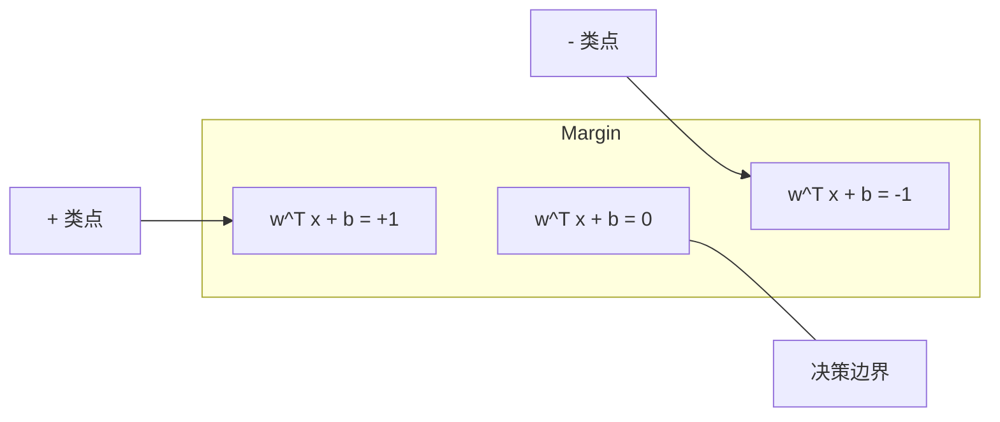
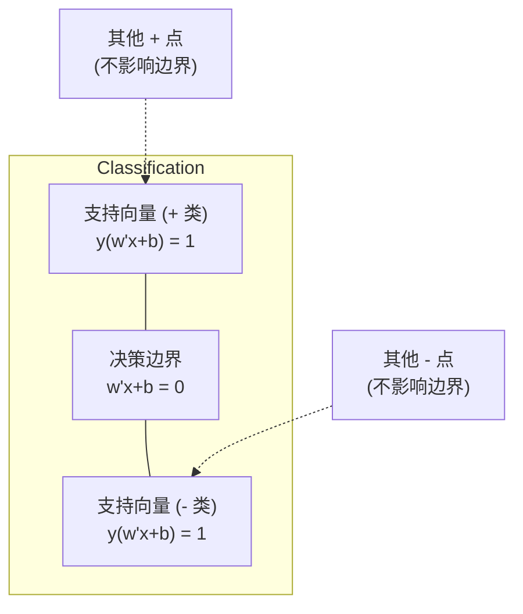
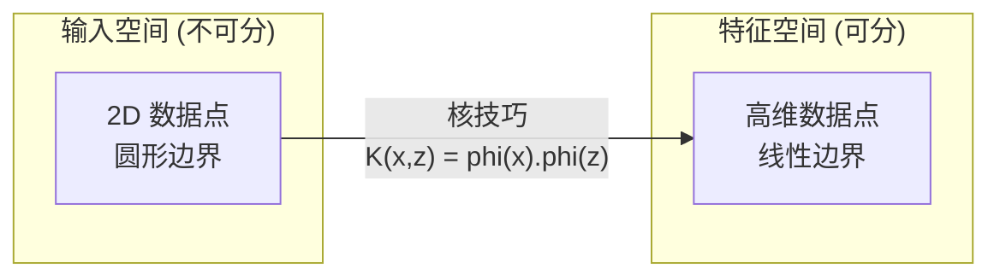

# 支持向量机

> 在两个类之间找出最宽的那条街。整个 SVM 就这一句话。

**Type:** Build
**Language:** Python
**Prerequisites:** Phase 1 (Lesson 08 优化、14 范数与距离、18 凸优化)
**Time:** ~90 分钟

## 学习目标

- 从零用 hinge 损失和梯度下降,在原问题形式上实现线性 SVM
- 解释最大间隔原理,并从训练好的模型中识别支持向量
- 对比线性、多项式、RBF 三种核函数,解释核技巧如何避开显式的高维映射
- 评估 C 参数控制的“间隔宽度 vs 分类错误”权衡

## 问题引入

你手头有两类数据点,要画一条线(或超平面)把它们分开。能画的线有无数条。选哪条?

选**间隔最大**那条。间隔是决策边界到两侧最近数据点的距离。间隔越宽,分类器越自信,在新数据上泛化越好。

这个直觉引出了支持向量机——ML 里数学上最优雅的算法之一。SVM 在深度学习之前一直是主流分类方法,在小数据集、高维数据,以及需要原理清晰、有理论保证的模型时,仍然是首选。

SVM 跟 Phase 1 直接挂钩:优化是凸的(Lesson 18),间隔用范数衡量(Lesson 14),核技巧利用点积处理非线性边界,完全不用真的去算高维空间。

## 核心概念

### 最大间隔分类器

给线性可分数据,标签 y_i ∈ {-1, +1},特征向量 x_i。我们要找一个超平面 w^T x + b = 0,把两类分开。

点到超平面的距离是:

```
distance = |w^T x_i + b| / ||w||
```

对正确分类的点:y_i * (w^T x_i + b) > 0。间隔是超平面到两侧最近点距离的两倍。



优化问题是:

```
最大化    2 / ||w||     (间隔宽度)
约束于    y_i * (w^T x_i + b) >= 1  对所有 i
```

等价形式(最小化 ||w||² 更好优化):

```
最小化    (1/2) ||w||^2
约束于    y_i * (w^T x_i + b) >= 1  对所有 i
```

这是个凸二次规划,有唯一全局解。恰好落在间隔边界上的点(就是 y_i * (w^T x_i + b) = 1 的那些)叫支持向量。它们是唯一决定决策边界的点。挪动或删掉任何非支持向量,边界都不变。

### 支持向量:关键的少数



大部分训练点都无关紧要,只有支持向量起作用。这就是 SVM 在预测时省内存的原因:你只需要存支持向量,不用存整个训练集。

支持向量的个数还能给泛化误差定个界。相对于数据集规模,支持向量越少,泛化越好。

### 软间隔:用 C 参数处理噪声

真实数据很少能完美分开。有些点可能落在错误的一侧,或者卡在间隔里。软间隔形式允许违例,引入了松弛变量。

```
最小化    (1/2) ||w||^2 + C * sum(xi_i)
约束于    y_i * (w^T x_i + b) >= 1 - xi_i
          xi_i >= 0  对所有 i
```

松弛变量 xi_i 衡量第 i 个点违反间隔的程度。C 控制权衡:

| C 值 | 行为 |
|------|------|
| 大 C | 重罚违例。间隔窄,错分少。过拟合 |
| 小 C | 允许更多违例。间隔宽,错分多。欠拟合 |

C 跟正则化强度反着来。C 大 = 正则化弱;C 小 = 正则化强。

### Hinge 损失:SVM 的损失函数

软间隔 SVM 可以改写成无约束优化:

```
最小化    (1/2) ||w||^2 + C * sum(max(0, 1 - y_i * (w^T x_i + b)))
```

max(0, 1 - y_i * f(x_i)) 就是 hinge 损失。点被正确分类且在间隔外时为零;点在间隔内或被错分时线性增长。

```
单个点的 Hinge 损失:

loss
  |
  | \
  |  \
  |   \
  |    \
  |     \_______________
  |
  +-----|-----|-------->  y * f(x)
       0     1

y*f(x) >= 1 时损失为 0(正确分类,在间隔外)
y*f(x) < 1 时线性惩罚
```

跟逻辑损失(逻辑回归)对比一下:

```
Hinge:     max(0, 1 - y*f(x))          间隔处有硬截断
Logistic:  log(1 + exp(-y*f(x)))        平滑,永远不正好为零
```

hinge 损失产生稀疏解(只有支持向量有非零贡献),逻辑损失用上所有数据点。这让 SVM 在预测时更省内存。

### 用梯度下降训练线性 SVM

用梯度下降最小化 hinge 损失 + L2 正则,你就能训出线性 SVM,不用解带约束的 QP:

```
L(w, b) = (lambda/2) * ||w||^2 + (1/n) * sum(max(0, 1 - y_i * (w^T x_i + b)))

对 w 的梯度:
  若 y_i * (w^T x_i + b) >= 1:  dL/dw = lambda * w
  若 y_i * (w^T x_i + b) < 1:   dL/dw = lambda * w - y_i * x_i

对 b 的梯度:
  若 y_i * (w^T x_i + b) >= 1:  dL/db = 0
  若 y_i * (w^T x_i + b) < 1:   dL/db = -y_i
```

这叫原问题形式。每轮 O(n * d),n 是样本数,d 是特征数。对大而稀疏的高维数据(文本分类)来说很快。

### 对偶形式与核技巧

SVM 问题的拉格朗日对偶(来自 Phase 1 Lesson 18 的 KKT 条件)是:

```
最大化    sum(alpha_i) - (1/2) * sum_ij(alpha_i * alpha_j * y_i * y_j * (x_i . x_j))
约束于    0 <= alpha_i <= C
          sum(alpha_i * y_i) = 0
```

对偶里只涉及数据点之间的点积 x_i . x_j。这是关键洞见。把每个点积替换成核函数 K(x_i, x_j),SVM 就能学非线性边界,**完全不用显式算出那个变换**。

```
线性核:           K(x, z) = x . z
多项式核:         K(x, z) = (x . z + c)^d
RBF (高斯) 核:    K(x, z) = exp(-gamma * ||x - z||^2)
```

RBF 核把数据映射到**无穷维**空间。输入空间里靠近的点核值接近 1,远的点核值接近 0。它能学任何光滑的决策边界。



核技巧在高维空间里算点积,但不用真的去那个空间。D 维 d 次多项式核,显式特征空间是 O(D^d) 维,但 K(x, z) 只要 O(D) 就能算。

### 回归 SVM (SVR)

支持向量回归在数据周围拟合一条宽度为 epsilon 的管子。管子内的点损失为零,管子外的点线性惩罚。

```
最小化    (1/2) ||w||^2 + C * sum(xi_i + xi_i*)
约束于    y_i - (w^T x_i + b) <= epsilon + xi_i
          (w^T x_i + b) - y_i <= epsilon + xi_i*
          xi_i, xi_i* >= 0
```

epsilon 控制管子的宽度。管子越宽 = 支持向量越少 = 拟合越平滑。管子越窄 = 支持向量越多 = 拟合越紧。

### 为什么 SVM 输给了深度学习(以及什么时候它还赢)

SVM 在 1990 年代末到 2010 年代初统治 ML。深度学习超越它有几个原因:

| 因素 | SVM | 深度学习 |
|------|-----|---------|
| 特征工程 | 需要手工 | 自动学 |
| 可扩展性 | 核形式 O(n²) 到 O(n³) | SGD 每轮 O(n) |
| 图像/文本/音频 | 需要手工特征 | 从原始数据学 |
| 大数据集 (>100k) | 慢 | 扩展性好 |
| GPU 加速 | 收益有限 | 大幅提速 |

SVM 在这些场景仍然胜出:
- 小数据集(几百到几千样本)
- 高维稀疏数据(TF-IDF 文本特征)
- 需要数学保证(间隔界)
- 训练时间必须很短(线性 SVM 很快)
- 有清晰间隔结构的二分类
- 异常检测(单类 SVM)

```figure
svm-margin
```

## 从零实现

### Step 1:Hinge 损失和梯度

这是基础。对一批数据算 hinge 损失和梯度。

```python
def hinge_loss(X, y, w, b):
    n = len(X)
    total_loss = 0.0
    for i in range(n):
        margin = y[i] * (dot(w, X[i]) + b)
        total_loss += max(0.0, 1.0 - margin)
    return total_loss / n
```

### Step 2:梯度下降训线性 SVM

最小化正则化 hinge 损失来训练。不用 QP 求解器。

```python
class LinearSVM:
    def __init__(self, lr=0.001, lambda_param=0.01, n_epochs=1000):
        self.lr = lr
        self.lambda_param = lambda_param
        self.n_epochs = n_epochs
        self.w = None
        self.b = 0.0

    def fit(self, X, y):
        n_features = len(X[0])
        self.w = [0.0] * n_features
        self.b = 0.0

        for epoch in range(self.n_epochs):
            for i in range(len(X)):
                margin = y[i] * (dot(self.w, X[i]) + self.b)
                if margin >= 1:
                    self.w = [wj - self.lr * self.lambda_param * wj
                              for wj in self.w]
                else:
                    self.w = [wj - self.lr * (self.lambda_param * wj - y[i] * X[i][j])
                              for j, wj in enumerate(self.w)]
                    self.b -= self.lr * (-y[i])

    def predict(self, X):
        return [1 if dot(self.w, x) + self.b >= 0 else -1 for x in X]
```

### Step 3:核函数

实现线性、多项式、RBF 三种核。

```python
def linear_kernel(x, z):
    return dot(x, z)

def polynomial_kernel(x, z, degree=3, c=1.0):
    return (dot(x, z) + c) ** degree

def rbf_kernel(x, z, gamma=0.5):
    diff = [xi - zi for xi, zi in zip(x, z)]
    return math.exp(-gamma * dot(diff, diff))
```

### Step 4:支持向量识别和间隔

训练完之后,识别哪些点是支持向量,算间隔宽度。

```python
def find_support_vectors(X, y, w, b, tol=1e-3):
    support_vectors = []
    for i in range(len(X)):
        margin = y[i] * (dot(w, X[i]) + b)
        if abs(margin - 1.0) < tol:
            support_vectors.append(i)
    return support_vectors
```

完整实现见 `code/svm.py`,包含所有 demo。

## 拿来用

用 scikit-learn:

```python
from sklearn.svm import SVC, LinearSVC, SVR
from sklearn.preprocessing import StandardScaler
from sklearn.pipeline import Pipeline

clf = Pipeline([
    ("scaler", StandardScaler()),
    ("svm", SVC(kernel="rbf", C=1.0, gamma="scale")),
])
clf.fit(X_train, y_train)
print(f"Accuracy: {clf.score(X_test, y_test):.4f}")
print(f"Support vectors: {clf['svm'].n_support_}")
```

重要:训练 SVM 前一定要先缩放特征。SVM 对特征量纲敏感,因为间隔依赖 ||w||,未缩放的特征会把几何形状扭曲。

大数据集用 `LinearSVC`(原问题形式,O(n)/轮)代替 `SVC`(对偶形式,O(n²) 到 O(n³)):

```python
from sklearn.svm import LinearSVC

clf = Pipeline([
    ("scaler", StandardScaler()),
    ("svm", LinearSVC(C=1.0, max_iter=10000)),
])
```

## 练习

1. 生成一个 2 维线性可分数据集。训练你的 LinearSVM 并识别支持向量。验证支持向量就是离决策边界最近的点。

2. 在一个带噪声的数据集上把 C 从 0.001 调到 1000。画出每个 C 值下的决策边界。观察从宽间隔(欠拟合)到窄间隔(过拟合)的过渡。

3. 造一个类别边界是圆形的数据集。展示线性 SVM 失败。算 RBF 核矩阵,展示在核诱导的特征空间里类变得可分。

4. 在同一数据集上对比 hinge 损失和逻辑损失。训练线性 SVM 和逻辑回归。数一数每个模型的决策边界有多少训练点在贡献(支持向量 vs 所有点)。

5. 实现 SVR(ε 不敏感损失)。用它拟合 y = sin(x) + noise。画出预测周围的 ε 管子,高亮支持向量(管子外的点)。

## 关键术语

| 术语 | 实际含义 |
|------|---------|
| Support vectors | 离决策边界最近的训练点。唯一决定超平面的那些点 |
| Margin | 决策边界到最近支持向量之间的距离。SVM 要最大化它 |
| Hinge loss | max(0, 1 - y*f(x))。正确分类且在间隔外时为零,否则线性惩罚 |
| C parameter | “间隔宽度 vs 分类错误”的权衡。大 C = 窄间隔,小 C = 宽间隔 |
| Soft margin | SVM 通过松弛变量允许间隔违例的形式,处理不可分数据 |
| Kernel trick | 在高维特征空间里算点积,但不显式映射过去 |
| Linear kernel | K(x, z) = x . z。等价于标准点积。用于线性可分数据 |
| RBF kernel | K(x, z) = exp(-gamma * ||x-z||²)。映射到无穷维。能学任何光滑边界 |
| Polynomial kernel | K(x, z) = (x . z + c)^d。映射到多项式组合构成的特征空间 |
| Dual formulation | SVM 问题的另一种形式,只依赖数据点之间的点积。核函数的基础 |
| SVR | 支持向量回归。在数据周围拟合 ε 管子,管内点零损失 |
| Slack variables | xi_i: 衡量一个点违反间隔的程度。对间隔外的正确分类点为零 |
| Maximum margin | 选让超平面到每类最近点距离最大的原则 |

## 延伸阅读

- [Vapnik: The Nature of Statistical Learning Theory (1995)](https://link.springer.com/book/10.1007/978-1-4757-3264-1) —— SVM 和统计学习理论的奠基之作
- [Cortes & Vapnik: Support-vector networks (1995)](https://link.springer.com/article/10.1007/BF00994018) —— SVM 原始论文
- [Platt: Sequential Minimal Optimization (1998)](https://www.microsoft.com/en-us/research/publication/sequential-minimal-optimization-a-fast-algorithm-for-training-support-vector-machines/) —— 让 SVM 训练真正跑得起来的 SMO 算法
- [scikit-learn SVM documentation](https://scikit-learn.org/stable/modules/svm.html) —— 实战指南,带实现细节
- [LIBSVM: A Library for Support Vector Machines](https://www.csie.ntu.edu.tw/~cjlin/libsvm/) —— 大部分 SVM 实现背后的 C++ 库