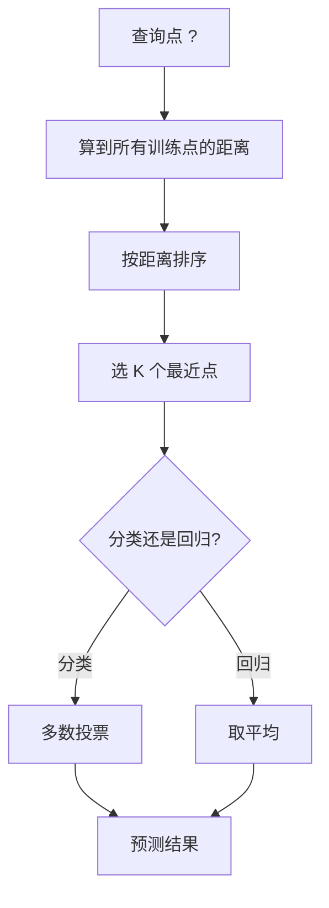
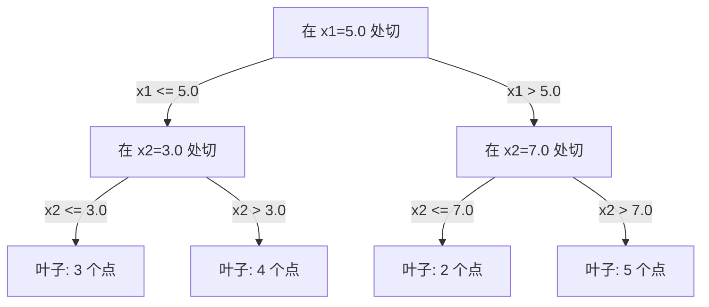

# K 近邻与距离

> 把所有数据存着,预测时看看你邻居是谁。最简单但真能用的算法。

**Type:** Build
**Language:** Python
**Prerequisites:** Phase 1 (Lesson 14 范数与距离)
**Time:** ~90 分钟

## 学习目标

- 从零实现 KNN 分类和回归,支持可配置的 K 和距离加权投票
- 对比 L1、L2、余弦、Minkowski 距离度量,为不同数据类型选最合适的
- 解释维度灾难,并展示为什么 KNN 在高维空间里会失效
- 构建 KD-tree 做高效近邻搜索,分析它什么时候比暴力搜索强

## 问题引入

你手里有数据集,新数据点来了,你要分类或者预测它的值。不用像线性回归或 SVM 那样从数据里学参数,你只要找出离新点最近的 K 个训练点,让它们投票。

这就是 K 近邻(KNN)。没有训练阶段,没有参数要学,没有损失函数要最小化。你把整个训练集存着,预测时算距离就行。

听起来简单得不像能 work。但 KNN 在很多问题上意外地能打,尤其是中小型数据集。深入理解它能揭示一些基本概念:距离度量的选择(对应 Phase 1 Lesson 14)、维度灾难、惰性学习和急切学习的区别。

KNN 在现代 AI 里到处都在,只是换了个名字。向量数据库做嵌入的 KNN 搜索;RAG 找 K 个最近的文档块;推荐系统找相似用户或商品。算法是一样的,规模和底层数据结构不同。

## 核心概念

### KNN 怎么工作

给定一组带标签的点,以及一个新查询点:

1. 算查询点到数据集中每个点的距离
2. 按距离排序
3. 取最近的 K 个点
4. 分类:K 个邻居里多数投票
5. 回归:K 个邻居的值取平均(或加权平均)



整个算法就这样。没有 fit,没有梯度下降,没有 epoch。

### 选 K

K 是唯一的超参。它控制偏差-方差权衡:

| K | 行为 |
|---|------|
| K = 1 | 决策边界贴着每个点走。训练误差为 0。高方差。过拟合 |
| 小 K(3-5) | 对局部结构敏感,能抓复杂边界 |
| 大 K | 边界更平滑,对噪声更鲁棒,可能欠拟合 |
| K = N | 对每个点都预测多数类,偏差最大 |

常见的起点是 K = sqrt(N)(N 是数据集大小)。二分类用奇数 K 避免平局。


### 距离度量

距离函数定义了“近”的含义。不同的度量给出不同的邻居、不同的预测。

**L2(欧氏距离)**是默认。直线距离。

```
d(a, b) = sqrt(sum((a_i - b_i)^2))
```

对特征量纲敏感。用 KNN + L2 前**必须**标准化特征。

**L1(曼哈顿距离)**对绝对差求和。比 L2 对离群点更鲁棒,因为它不把差值平方。

```
d(a, b) = sum(|a_i - b_i|)
```

**余弦距离**衡量向量之间的夹角,忽略模长。文本和嵌入数据必备。

```
d(a, b) = 1 - (a . b) / (||a|| * ||b||)
```

**Minkowski**用参数 p 推广 L1 和 L2。

```
d(a, b) = (sum(|a_i - b_i|^p))^(1/p)

p=1: 曼哈顿
p=2: 欧氏
p→∞: 切比雪夫(最大绝对差)
```

根据数据选度量:

| 数据类型 | 最佳度量 | 原因 |
|---------|---------|------|
| 数值特征,量纲接近 | L2 (欧氏) | 默认,适合空间数据 |
| 数值特征,有离群点 | L1 (曼哈顿) | 鲁棒,不会放大大的差值 |
| 文本嵌入 | 余弦 | 模长是噪声,方向才是语义 |
| 高维稀疏 | 余弦或 L1 | L2 受维度灾难影响 |
| 混合类型 | 自定义距离 | 按特征类型组合度量 |

### 加权 KNN

标准 KNN 给所有 K 个邻居相同权重。但距离 0.1 的邻居应该比距离 5.0 的更重要。

**距离加权 KNN**按距离倒数给每个邻居加权:

```
weight_i = 1 / (distance_i + epsilon)

分类: 加权投票
回归: 加权平均 = sum(w_i * y_i) / sum(w_i)
```

epsilon 防止查询点刚好命中训练点时分母为零。

加权 KNN 对 K 的选择不那么敏感,因为远邻居贡献本来就很小。

### 维度灾难

KNN 性能在高维下会退化。这不是模糊的担心,是个数学事实。

**问题 1:距离收敛。**维度上升时,最大距离和最小距离的比值趋近 1。所有点跟查询点都“一样远”。

```
d 维随机均匀点:

d=2:    max_dist / min_dist = 差异很大
d=100:  max_dist / min_dist ~ 1.01
d=1000: max_dist / min_dist ~ 1.001

所有距离都差不多的时候,"最近"毫无意义。
```

**问题 2:体积爆炸。**要在数据中固定比例的范围内抓到 K 个邻居,你得把搜索半径扩到覆盖特征空间的更大比例。高维里的“邻居”涵盖了大半个空间。

**问题 3:角落占主导。**d 维单位超立方体里,大部分体积集中在角落附近,不在中心。内切球只占体积的越来越小的一部分,维度越高占比越小。

实际后果:KNN 在 20-50 个特征以下工作得很好。再往上,你需要先做降维(PCA、UMAP、t-SNE),或者用能利用数据内在低维结构的树搜索结构。

### KD-tree:高效的近邻搜索

暴力 KNN 要算查询点到每个训练点的距离。每查一次 O(n * d)。数据集大了就太慢。

KD-tree 沿特征轴递归划分空间。每层按某个维度的中位数切。



找最近邻时,先走到包含查询点的叶子,然后回溯,只在邻近分区可能含更近的点时才检查。

平均查询时间:低维 O(log n)。但 KD-tree 在高维(d > 20)退化到 O(n),因为回溯时越来越少分支能被剪掉。

### Ball tree:中等维度更好

Ball tree 把数据划分成嵌套的超球,而不是轴对齐的方块。每个节点定义一个球(中心 + 半径),包含该子树所有点。

比 KD-tree 强的地方:
- 中等维度(到 ~50)下工作更好
- 能处理非轴对齐的结构
- 包围盒更紧,搜索时能剪掉更多分支

KD-tree 和 ball tree 都是精确算法。真正大规模搜索(百万点、上百维)用的是近似最近邻方法(HNSW、IVF、乘积量化)。这些在 Phase 1 Lesson 14 讲过。

### 惰性学习 vs 急切学习

KNN 是惰性学习器:训练时啥也不干,所有工作在预测时做。大部分其他算法(线性回归、SVM、神经网络)是急切学习器:训练时做大量计算搭出一个紧凑的模型,然后预测飞快。

| 维度 | 惰性 (KNN) | 急切 (SVM、神经网络) |
|------|-----------|---------------------|
| 训练时间 | O(1),只存数据 | O(n * epochs) |
| 预测时间 | 每查 O(n * d) | O(d) 或 O(参数量) |
| 预测时内存 | 存整个训练集 | 只存模型参数 |
| 适应新数据 | 直接加点 | 重新训练模型 |
| 决策边界 | 隐式,临时算 | 显式,训完固定 |

惰性学习在以下场景很合适:
- 数据集频繁变化(增删点不用重训)
- 查询很少
- 想要零训练时间
- 数据集小,暴力搜索够快

### KNN 回归

KNN 回归不投票,直接把 K 个邻居的目标值取平均。

```
prediction = (1/K) * sum(K 个最近邻居的 y_i)

或者加权:
prediction = sum(w_i * y_i) / sum(w_i)
其中 w_i = 1 / distance_i
```

KNN 回归产出分段常数(加权时是分段平滑)的预测。它不能外推到训练数据范围之外。如果训练目标都在 0 到 100 之间,KNN 永远不会预测 200。

```figure
knn-smoothness
```

## 从零实现

### Step 1:距离函数

实现 L1、L2、余弦、Minkowski 距离。这跟 Phase 1 Lesson 14 直接挂钩。

```python
import math

def l2_distance(a, b):
    return math.sqrt(sum((ai - bi) ** 2 for ai, bi in zip(a, b)))

def l1_distance(a, b):
    return sum(abs(ai - bi) for ai, bi in zip(a, b))

def cosine_distance(a, b):
    dot_val = sum(ai * bi for ai, bi in zip(a, b))
    norm_a = math.sqrt(sum(ai ** 2 for ai in a))
    norm_b = math.sqrt(sum(bi ** 2 for bi in b))
    if norm_a == 0 or norm_b == 0:
        return 1.0
    return 1.0 - dot_val / (norm_a * norm_b)

def minkowski_distance(a, b, p=2):
    if p == float('inf'):
        return max(abs(ai - bi) for ai, bi in zip(a, b))
    return sum(abs(ai - bi) ** p for ai, bi in zip(a, b)) ** (1 / p)
```

### Step 2:KNN 分类器和回归器

搭完整的 KNN,支持可配置的 K、距离度量、可选的距离加权。

```python
class KNN:
    def __init__(self, k=5, distance_fn=l2_distance, weighted=False,
                 task="classification"):
        self.k = k
        self.distance_fn = distance_fn
        self.weighted = weighted
        self.task = task
        self.X_train = None
        self.y_train = None

    def fit(self, X, y):
        self.X_train = X
        self.y_train = y

    def predict(self, X):
        return [self._predict_one(x) for x in X]
```

### Step 3:KD-tree 高效搜索

从零搭 KD-tree,按每维的中位数递归切分。

```python
class KDTree:
    def __init__(self, X, indices=None, depth=0):
        # 递归划分数据
        self.axis = depth % len(X[0])
        # 按当前维度的中位数切分
        ...

    def query(self, point, k=1):
        # 走到叶子,再回溯
        ...
```

完整实现见 `code/knn.py`,包含所有辅助方法和 demo。

### Step 4:特征缩放

KNN 需要特征缩放,因为距离对特征量纲敏感。一个范围 0 到 1000 的特征会压过范围 0 到 1 的特征。

```python
def standardize(X):
    n = len(X)
    d = len(X[0])
    means = [sum(X[i][j] for i in range(n)) / n for j in range(d)]
    stds = [
        max(1e-10, (sum((X[i][j] - means[j]) ** 2 for i in range(n)) / n) ** 0.5)
        for j in range(d)
    ]
    return [[((X[i][j] - means[j]) / stds[j]) for j in range(d)] for i in range(n)], means, stds
```

## 拿来用

用 scikit-learn:

```python
from sklearn.neighbors import KNeighborsClassifier
from sklearn.preprocessing import StandardScaler
from sklearn.pipeline import Pipeline

clf = Pipeline([
    ("scaler", StandardScaler()),
    ("knn", KNeighborsClassifier(n_neighbors=5, metric="euclidean")),
])
clf.fit(X_train, y_train)
print(f"Accuracy: {clf.score(X_test, y_test):.4f}")
```

数据集够大、维度够低时,scikit-learn 自动用 KD-tree 或 ball tree。高维时回退到暴力。可以用 `algorithm` 参数控制。

大规模近邻搜索(百万级向量),用 FAISS、Annoy,或者向量数据库:

```python
import faiss

index = faiss.IndexFlatL2(dimension)
index.add(embeddings)
distances, indices = index.search(query_vectors, k=5)
```

## 练习

1. 在 2 维 3 类数据集上实现 KNN 分类。画出 K=1、K=5、K=15、K=N 时的决策边界。观察从过拟合到欠拟合的过渡。

2. 在 2、5、10、50、100、500 维各生成 1000 个随机点。对每个维度,算最大成对距离和最小成对距离的比值。把比值随维度的变化画出来,直观感受维度灾难。

3. 在一个文本分类任务(用 TF-IDF 向量)上比较 KNN 用 L1、L2、余弦距离。哪种度量准确率最高?为什么余弦在文本上往往赢?

4. 实现 KD-tree,测一下 1k、10k、100k 点在 2D、10D、50D 下的查询时间 vs 暴力。KD-tree 在什么维度开始不比暴力快?

5. 为 y = sin(x) + noise 搭一个加权 KNN 回归器。跟不带加权的 KNN 在 K=3、10、30 下对比。展示加权产生更平滑的预测,特别是大 K 时。

## 关键术语

| 术语 | 实际含义 |
|------|---------|
| K-nearest neighbors | 非参数算法,通过找离查询点最近的 K 个训练点来预测 |
| Lazy learning | 训练时啥也不做,所有工作在预测时发生。KNN 是典型代表 |
| Eager learning | 训练时大量计算搭出紧凑模型。多数 ML 算法属于这类 |
| Curse of dimensionality | 高维下距离收敛、邻居扩展到覆盖大部分空间,KNN 失效 |
| KD-tree | 沿特征轴递归划分空间的二叉树。低维查询 O(log n) |
| Ball tree | 嵌套超球构成的树。中等维度(到 ~50)下比 KD-tree 强 |
| Weighted KNN | 邻居按距离倒数加权,近邻居对预测影响更大 |
| Feature scaling | 把特征归一到可比范围。基于距离的方法(如 KNN)必须做 |
| Majority vote | 在 K 个邻居里数哪个类最多,作为分类结果 |
| Brute force search | 算到每个训练点的距离。每查 O(n*d)。精确但 n 大时慢 |
| Approximate nearest neighbor | 用 HNSW、LSH、IVF 等算法找近似最近邻,比精确搜索快得多 |
| Voronoi diagram | 空间的一个划分,每个区域里的点离某个训练点最近。K=1 KNN 产生 Voronoi 边界 |

## 延伸阅读

- [Cover & Hart: Nearest Neighbor Pattern Classification (1967)](https://ieeexplore.ieee.org/document/1053964) —— KNN 奠基论文,证明错误率最多是贝叶斯最优的两倍
- [Friedman, Bentley, Finkel: An Algorithm for Finding Best Matches in Logarithmic Expected Time (1977)](https://dl.acm.org/doi/10.1145/355744.355745) —— KD-tree 原始论文
- [Beyer et al.: When Is "Nearest Neighbor" Meaningful? (1999)](https://link.springer.com/chapter/10.1007/3-540-49257-7_15) —— 维度灾难对近邻影响的正式分析
- [scikit-learn Nearest Neighbors documentation](https://scikit-learn.org/stable/modules/neighbors.html) —— 实战指南,带算法选择
- [FAISS: A Library for Efficient Similarity Search](https://github.com/facebookresearch/faiss) —— Meta 出品的十亿级近似最近邻搜索库