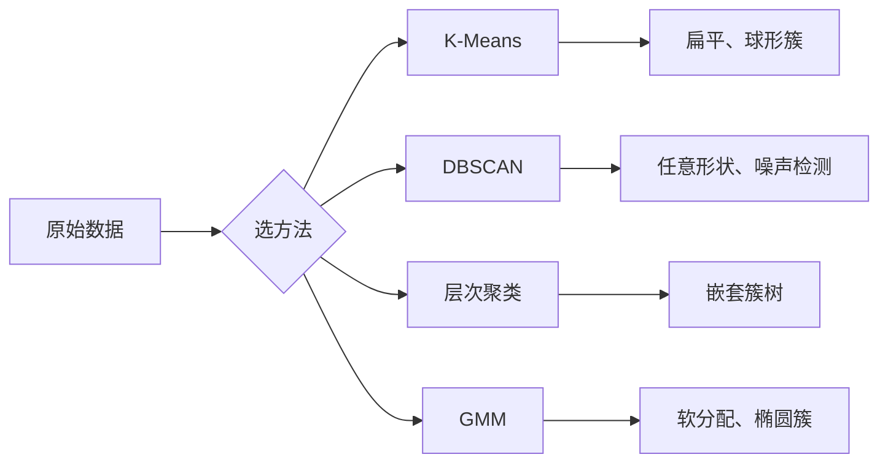

# 无监督学习

> 没标签,没老师。算法自己从数据里找结构。

**Type:** Build
**Languages:** Python
**Prerequisites:** Phase 1 (范数与距离、概率与分布)、Phase 2 Lessons 1-6
**Time:** ~90 分钟

## 学习目标

- 从零实现 K-Means、DBSCAN、高斯混合模型,对比它们的聚类行为
- 用轮廓系数和肘部法则评估聚类质量,选出最优 K
- 解释 DBSCAN 在什么场景比 K-Means 强,识别哪种算法处理非球形簇和离群点更合适
- 用聚类方法搭建异常检测流水线,标出偏离正常模式的点

## 问题引入

前面每节 ML 课都假设数据有标签:“这里有个输入,这里有正确答案”。但真实世界标签贵得要命。医院有几百万份病历,但没人给每份手动标过疾病类别;电商有几百万用户会话,但没人手标过客户分群;安全团队有网络日志,但没人标过每个异常。

无监督学习在没人告诉它要找什么的情况下找规律。它把相似的数据点归类、发现隐藏结构、暴露异常。如果说监督学习是带着答案对课本学习,无监督学习就是对着原始数据一直看,直到规律自己浮现。

坑在于:没标签,你没法直接量“对”或“错”。你需要别的工具来评估算法找到的结构有没有意义。

## 核心概念

### 聚类:把相似的东西放一起

聚类给每个数据点分一个组(cluster),让同一组内的点之间比跟其他组的点更相似。问题永远是:“相似”是什么意思?



### K-Means:主力军

K-Means 把数据分成恰好 K 个簇。每个簇有一个质心(质量中心),每个点属于最近的质心。

Lloyd 算法:

1. 随机选 K 个点作为初始质心
2. 把每个数据点分给最近的质心
3. 把每个质心重算成它分到的点的均值
4. 重复 2-3 直到分配不再变化

目标函数(inertia)量每个点到它所属质心的总平方距离。K-Means 最小化这个值,但只找到局部最小。不同初始化会得到不同结果。

### 选 K

两种标准方法:

**肘部法则:**跑 K-Means, K 取 1、2、3、…、n。把 inertia 对 K 画出来。找那个“肘部”——再加更多簇,inertia 也不再显著下降的位置。

**轮廓系数:**对每个点,量它跟自己簇的相似度(a) 和跟最近的其他簇的相似度(b)。轮廓系数是 (b - a) / max(a, b),范围从 -1(分错簇)到 +1(分得不错)。所有点上取平均得全局分数。

### DBSCAN:基于密度的聚类

K-Means 假设簇是球形的,还要你先定 K。DBSCAN 这两个假设都不做。它把簇定义为“被稀疏区域隔开的稠密区域”。

两个参数:
- **eps**:邻域半径
- **min_samples**:形成稠密区域所需的最小点数

三种点:
- **核心点**:eps 距离内有至少 min_samples 个点
- **边界点**:在某个核心点的 eps 内,但自己不是核心点
- **噪声点**:既不是核心也不是边界,这就是离群点

DBSCAN 把 eps 距离内的核心点连成同一个簇。边界点加入附近核心点的簇。噪声点不属于任何簇。

强项:找任意形状的簇,自动确定簇数,识别离群点。弱项:处理密度变化的簇比较吃力。

### 层次聚类

构造一棵嵌套簇的树(dendrogram)。

凝聚式(自底向上):
1. 一开始每个点是一个簇
2. 合并距离最近的两个簇
3. 重复直到只剩一个簇
4. 在想要的高度把树切开得到 K 个簇

簇之间的“接近度”可以这样量:
- **单链接**:两个簇里任意两点间的最小距离
- **全链接**:两个簇里任意两点间的最大距离
- **均链接**:所有点对的平均距离
- **Ward 法**:让簇内总方差增加最小的合并

### 高斯混合模型 (GMM)

K-Means 给硬分配:每个点属于且仅属于一个簇。GMM 给软分配:每个点对每个簇都有一个归属概率。

GMM 假设数据由 K 个高斯分布混合生成,每个有自己的均值和协方差。期望最大化(EM)算法在两步间交替:

- **E 步**:算每个点属于每个高斯的概率
- **M 步**:更新每个高斯的均值、协方差和混合权重,让数据似然最大

GMM 能建模椭圆簇(不像 K-Means 只能球形),天然处理重叠簇。

### 怎么选

| 方法 | 适合 | 避免场景 |
|------|------|---------|
| K-Means | 大数据集、球形簇、已知 K | 形状不规则、有离群点 |
| DBSCAN | K 未知、任意形状、要做离群检测 | 密度变化大、维度很高 |
| 层次聚类 | 小数据集、需要 dendrogram、K 未知 | 大数据集(O(n²) 内存) |
| GMM | 重叠簇、需要软分配 | 数据集特别大、维度过高 |

### 用聚类做异常检测

聚类天然支持异常检测:
- **K-Means**:离任何质心都很远的点是异常
- **DBSCAN**:噪声点天然就是异常
- **GMM**:在所有高斯下概率都很低的点是异常

```figure
kmeans-step
```

## 从零实现

### Step 1:从零实现 K-Means

```python
import math
import random


def euclidean_distance(a, b):
    return math.sqrt(sum((ai - bi) ** 2 for ai, bi in zip(a, b)))


def kmeans(data, k, max_iterations=100, seed=42):
    random.seed(seed)
    n_features = len(data[0])

    centroids = random.sample(data, k)

    for iteration in range(max_iterations):
        clusters = [[] for _ in range(k)]
        assignments = []

        for point in data:
            distances = [euclidean_distance(point, c) for c in centroids]
            nearest = distances.index(min(distances))
            clusters[nearest].append(point)
            assignments.append(nearest)

        new_centroids = []
        for cluster in clusters:
            if len(cluster) == 0:
                new_centroids.append(random.choice(data))
                continue
            centroid = [
                sum(point[j] for point in cluster) / len(cluster)
                for j in range(n_features)
            ]
            new_centroids.append(centroid)

        if all(
            euclidean_distance(old, new) < 1e-6
            for old, new in zip(centroids, new_centroids)
        ):
            print(f"  Converged at iteration {iteration + 1}")
            break

        centroids = new_centroids

    return assignments, centroids
```

### Step 2:肘部法则和轮廓系数

```python
def compute_inertia(data, assignments, centroids):
    total = 0.0
    for point, cluster_id in zip(data, assignments):
        total += euclidean_distance(point, centroids[cluster_id]) ** 2
    return total


def silhouette_score(data, assignments):
    n = len(data)
    if n < 2:
        return 0.0

    clusters = {}
    for i, c in enumerate(assignments):
        clusters.setdefault(c, []).append(i)

    if len(clusters) < 2:
        return 0.0

    scores = []
    for i in range(n):
        own_cluster = assignments[i]
        own_members = [j for j in clusters[own_cluster] if j != i]

        if len(own_members) == 0:
            scores.append(0.0)
            continue

        a = sum(euclidean_distance(data[i], data[j]) for j in own_members) / len(own_members)

        b = float("inf")
        for cluster_id, members in clusters.items():
            if cluster_id == own_cluster:
                continue
            avg_dist = sum(euclidean_distance(data[i], data[j]) for j in members) / len(members)
            b = min(b, avg_dist)

        if max(a, b) == 0:
            scores.append(0.0)
        else:
            scores.append((b - a) / max(a, b))

    return sum(scores) / len(scores)


def find_best_k(data, max_k=10):
    print("Elbow method:")
    inertias = []
    for k in range(1, max_k + 1):
        assignments, centroids = kmeans(data, k)
        inertia = compute_inertia(data, assignments, centroids)
        inertias.append(inertia)
        print(f"  K={k}: inertia={inertia:.2f}")

    print("\nSilhouette scores:")
    for k in range(2, max_k + 1):
        assignments, centroids = kmeans(data, k)
        score = silhouette_score(data, assignments)
        print(f"  K={k}: silhouette={score:.4f}")

    return inertias
```

### Step 3:从零实现 DBSCAN

```python
def dbscan(data, eps, min_samples):
    n = len(data)
    labels = [-1] * n
    cluster_id = 0

    def region_query(point_idx):
        neighbors = []
        for i in range(n):
            if euclidean_distance(data[point_idx], data[i]) <= eps:
                neighbors.append(i)
        return neighbors

    visited = [False] * n

    for i in range(n):
        if visited[i]:
            continue
        visited[i] = True

        neighbors = region_query(i)

        if len(neighbors) < min_samples:
            labels[i] = -1
            continue

        labels[i] = cluster_id
        seed_set = list(neighbors)
        seed_set.remove(i)

        j = 0
        while j < len(seed_set):
            q = seed_set[j]

            if not visited[q]:
                visited[q] = True
                q_neighbors = region_query(q)
                if len(q_neighbors) >= min_samples:
                    for nb in q_neighbors:
                        if nb not in seed_set:
                            seed_set.append(nb)

            if labels[q] == -1:
                labels[q] = cluster_id

            j += 1

        cluster_id += 1

    return labels
```

### Step 4:高斯混合模型(EM 算法)

```python
def gmm(data, k, max_iterations=100, seed=42):
    random.seed(seed)
    n = len(data)
    d = len(data[0])

    indices = random.sample(range(n), k)
    means = [list(data[i]) for i in indices]
    variances = [1.0] * k
    weights = [1.0 / k] * k

    def gaussian_pdf(x, mean, variance):
        d = len(x)
        coeff = 1.0 / ((2 * math.pi * variance) ** (d / 2))
        exponent = -sum((xi - mi) ** 2 for xi, mi in zip(x, mean)) / (2 * variance)
        return coeff * math.exp(max(exponent, -500))

    for iteration in range(max_iterations):
        responsibilities = []
        for i in range(n):
            probs = []
            for j in range(k):
                probs.append(weights[j] * gaussian_pdf(data[i], means[j], variances[j]))
            total = sum(probs)
            if total == 0:
                total = 1e-300
            responsibilities.append([p / total for p in probs])

        old_means = [list(m) for m in means]

        for j in range(k):
            r_sum = sum(responsibilities[i][j] for i in range(n))
            if r_sum < 1e-10:
                continue

            weights[j] = r_sum / n

            for dim in range(d):
                means[j][dim] = sum(
                    responsibilities[i][j] * data[i][dim] for i in range(n)
                ) / r_sum

            variances[j] = sum(
                responsibilities[i][j]
                * sum((data[i][dim] - means[j][dim]) ** 2 for dim in range(d))
                for i in range(n)
            ) / (r_sum * d)
            variances[j] = max(variances[j], 1e-6)

        shift = sum(
            euclidean_distance(old_means[j], means[j]) for j in range(k)
        )
        if shift < 1e-6:
            print(f"  GMM converged at iteration {iteration + 1}")
            break

    assignments = []
    for i in range(n):
        assignments.append(responsibilities[i].index(max(responsibilities[i])))

    return assignments, means, weights, responsibilities
```

### Step 5:生成测试数据并跑全部

```python
def make_blobs(centers, n_per_cluster=50, spread=0.5, seed=42):
    random.seed(seed)
    data = []
    true_labels = []
    for label, (cx, cy) in enumerate(centers):
        for _ in range(n_per_cluster):
            x = cx + random.gauss(0, spread)
            y = cy + random.gauss(0, spread)
            data.append([x, y])
            true_labels.append(label)
    return data, true_labels


def make_moons(n_samples=200, noise=0.1, seed=42):
    random.seed(seed)
    data = []
    labels = []
    n_half = n_samples // 2
    for i in range(n_half):
        angle = math.pi * i / n_half
        x = math.cos(angle) + random.gauss(0, noise)
        y = math.sin(angle) + random.gauss(0, noise)
        data.append([x, y])
        labels.append(0)
    for i in range(n_half):
        angle = math.pi * i / n_half
        x = 1 - math.cos(angle) + random.gauss(0, noise)
        y = 1 - math.sin(angle) - 0.5 + random.gauss(0, noise)
        data.append([x, y])
        labels.append(1)
    return data, labels


if __name__ == "__main__":
    centers = [[2, 2], [8, 3], [5, 8]]
    data, true_labels = make_blobs(centers, n_per_cluster=50, spread=0.8)

    print("=== K-Means on 3 blobs ===")
    assignments, centroids = kmeans(data, k=3)
    print(f"  Centroids: {[[round(c, 2) for c in cent] for cent in centroids]}")
    sil = silhouette_score(data, assignments)
    print(f"  Silhouette score: {sil:.4f}")

    print("\n=== Elbow Method ===")
    find_best_k(data, max_k=6)

    print("\n=== DBSCAN on 3 blobs ===")
    db_labels = dbscan(data, eps=1.5, min_samples=5)
    n_clusters = len(set(db_labels) - {-1})
    n_noise = db_labels.count(-1)
    print(f"  Found {n_clusters} clusters, {n_noise} noise points")

    print("\n=== GMM on 3 blobs ===")
    gmm_assignments, gmm_means, gmm_weights, _ = gmm(data, k=3)
    print(f"  Means: {[[round(m, 2) for m in mean] for mean in gmm_means]}")
    print(f"  Weights: {[round(w, 3) for w in gmm_weights]}")
    gmm_sil = silhouette_score(data, gmm_assignments)
    print(f"  Silhouette score: {gmm_sil:.4f}")

    print("\n=== DBSCAN on moons (non-spherical clusters) ===")
    moon_data, moon_labels = make_moons(n_samples=200, noise=0.1)
    moon_db = dbscan(moon_data, eps=0.3, min_samples=5)
    n_moon_clusters = len(set(moon_db) - {-1})
    n_moon_noise = moon_db.count(-1)
    print(f"  Found {n_moon_clusters} clusters, {n_moon_noise} noise points")

    print("\n=== K-Means on moons (will fail to separate) ===")
    moon_km, moon_centroids = kmeans(moon_data, k=2)
    moon_sil = silhouette_score(data, moon_km)
    print(f"  Silhouette score: {moon_sil:.4f}")
    print("  K-Means splits moons poorly because they are not spherical")

    print("\n=== Anomaly detection with DBSCAN ===")
    anomaly_data = list(data)
    anomaly_data.append([20.0, 20.0])
    anomaly_data.append([-5.0, -5.0])
    anomaly_data.append([15.0, 0.0])
    anomaly_labels = dbscan(anomaly_data, eps=1.5, min_samples=5)
    anomalies = [
        anomaly_data[i]
        for i in range(len(anomaly_labels))
        if anomaly_labels[i] == -1
    ]
    print(f"  Detected {len(anomalies)} anomalies")
    for a in anomalies[-3:]:
        print(f"    Point {[round(v, 2) for v in a]}")
```

## 拿来用

用 scikit-learn,这些算法都是一行调用:

```python
from sklearn.cluster import KMeans, DBSCAN, AgglomerativeClustering
from sklearn.mixture import GaussianMixture
from sklearn.metrics import silhouette_score as sklearn_silhouette

km = KMeans(n_clusters=3, random_state=42).fit(data)
db = DBSCAN(eps=1.5, min_samples=5).fit(data)
agg = AgglomerativeClustering(n_clusters=3).fit(data)
gmm_model = GaussianMixture(n_components=3, random_state=42).fit(data)
```

从零版本让你看清楚库在算什么。K-Means 在分配和重算之间迭代。DBSCAN 从稠密种子开始长出簇。GMM 在期望和最大化之间交替。库版本多出来的是数值稳定性、更聪明的初始化(K-Means++)和 GPU 加速,但核心逻辑一样。

## 交付物

本课产出 K-Means、DBSCAN、GMM 的从零可用实现。这些聚类代码可以作为更高级无监督方法的基础。

## 练习

1. 实现 K-Means++ 初始化:第一个质心随机,后续每个质心按它离最近现有质心的平方距离成比例的概率选。跟随机初始化对比收敛速度。

2. 把层次凝聚聚类加到代码里。实现 Ward 链接,产出 dendrogram(嵌套的合并列表)。在不同高度切开,跟 K-Means 结果比较。

3. 搭一个简单的异常检测流水线:在同一数据上跑 DBSCAN 和 GMM,标出两种方法都认为是离群点的点(DBSCAN 的噪声、GMM 的低概率)。量重合度,讨论什么时候两方法会分歧。

## 关键术语

| 术语 | 大家常说的 | 实际含义 |
|------|-----------|---------|
| Clustering | "把相似的东西归类" | 把数据划成子集,让组内相似度大于组间相似度,用某个距离度量衡量 |
| Centroid | "簇的中心" | 分到该簇的所有点的均值,K-Means 用来代表该簇 |
| Inertia | "簇有多紧" | 每个点到所属质心的平方距离之和,越小越紧 |
| Silhouette score | "簇分得多开" | 对每个点 (b - a) / max(a, b),a 是簇内平均距离,b 是最近簇平均距离 |
| Core point | "稠密区里的点" | DBSCAN 里 eps 距离内有至少 min_samples 个邻居的点 |
| EM algorithm | "软 K-Means" | 期望最大化:迭代算成员概率(E 步)再更新分布参数(M 步) |
| Dendrogram | "簇的树" | 层次聚类里展示簇按什么顺序、什么距离合并的树图 |
| Anomaly | "离群点" | 不符合预期模式的点,DBSCAN 标为噪声、GMM 标为低概率 |

## 延伸阅读

- [Stanford CS229 - Unsupervised Learning](https://cs229.stanford.edu/notes2022fall/main_notes.pdf) —— Andrew Ng 的讲义,讲聚类和 EM
- [scikit-learn Clustering Guide](https://scikit-learn.org/stable/modules/clustering.html) —— 实战对比所有聚类算法,带可视化例子
- [DBSCAN original paper (Ester et al., 1996)](https://www.aaai.org/Papers/KDD/1996/KDD96-037.pdf) —— 引入基于密度聚类的原始论文