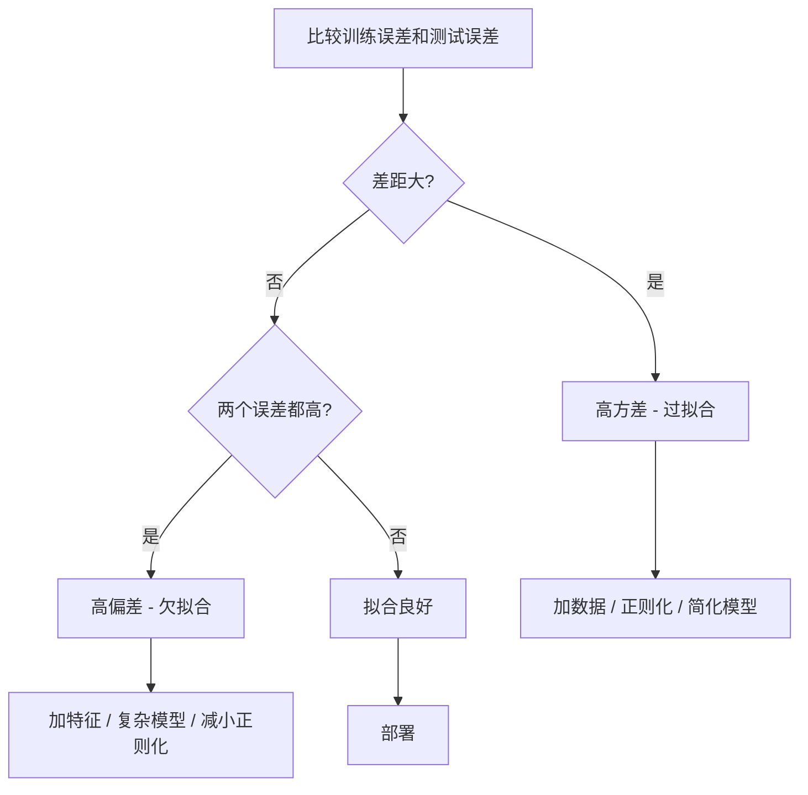
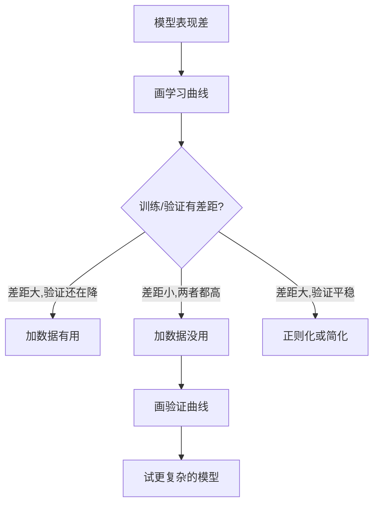

# 偏差-方差权衡

> 每个模型误差都来自三种源头之一:偏差、方差或噪声。你能控制的只有前两种。

**Type:** Learn
**Language:** Python
**Prerequisites:** Phase 2, Lessons 01-09 (ML 基础、回归、分类、评估)
**Time:** ~75 分钟

## 学习目标

- 推导期望预测误差的偏差-方差分解,解释不可消除噪声的作用
- 用训练/测试误差模式诊断模型到底有高偏差还是高方差
- 解释正则化技术(L1、L2、dropout、早停)如何在偏差和方差之间做交易
- 跑实验可视化不同复杂度模型的偏差-方差权衡

## 问题引入

你训了个模型。它在测试数据上有一些误差。这个误差从哪来?

如果模型太简单(用线性回归拟合曲线数据集),它会一直漏掉真实规律,这就是偏差。如果模型太复杂(15 个点用 20 次多项式),它会把训练数据拟合得完美,但在新数据上预测忽左忽右,这就是方差。

给定模型容量,你没法同时把两者都降到最低。压偏差方差就涨,压方差偏差就涨。理解这个权衡是机器学习里**最有用**的诊断技能。它告诉你该把模型变复杂还是变简单,该多攒数据还是做更好的特征,该加大正则化还是减小。

## 核心概念

### 偏差:系统误差

偏差衡量模型平均预测跟真值差多远。如果用从同一分布抽出的很多不同训练集分别训同一个模型,把预测取平均,偏差就是这个平均值跟真值之间的差距。

高偏差意味着模型太僵,抓不住真实模式。用直线去拟合抛物线,无论给多少数据都抓不住曲线。这就是欠拟合。

```
高偏差 (欠拟合):
  模型总是预测差不多同一个错的答案。
  训练误差: 高
  测试误差: 高
  两者差距: 小
```

### 方差:对训练数据的敏感度

方差衡量训练数据换一换,你的预测会变化多少。如果训练集的小变化能引起模型的大变化,方差就高。

高方差意味着模型在拟合训练数据里的噪声,而不是底层信号。20 次多项式能穿过每个训练点,但在点之间会剧烈震荡。这就是过拟合。

```
高方差 (过拟合):
  模型完美拟合训练数据,但在新数据上失败。
  训练误差: 低
  测试误差: 高
  两者差距: 大
```

### 分解

对任意点 x,平方损失下的期望预测误差严格分解为:

```
期望误差 = 偏差² + 方差 + 不可消除的噪声

其中:
  偏差² = (E[f̂(x)] - f(x))²
  方差   = E[(f̂(x) - E[f̂(x)])²]
  噪声   = E[(y - f(x))²]             (σ²)
```

- `f(x)` 是真实函数
- `f̂(x)` 是你模型的预测
- `E[...]` 是对不同训练集取期望
- `y` 是观测标签(真实函数加噪声)

噪声项不可消除。在有噪声的数据上,没有任何模型能做得比 σ² 更小。你的任务是找到偏差² + 方差的最优平衡。

### 模型复杂度 vs 误差


经典的 U 形曲线:

| 复杂度 | 偏差 | 方差 | 总误差 |
|--------|------|------|--------|
| 太低 | 高 | 低 | 高(欠拟合) |
| 刚好 | 中 | 中 | 最低 |
| 太高 | 低 | 高 | 高(过拟合) |

### 正则化作为偏差-方差控制

正则化故意抬高偏差以降低方差。它约束模型,让它没法去追噪声。

- **L2(Ridge)**:把所有权重往零压。保留所有特征,但削弱它们的影响。
- **L1(Lasso)**:把部分权重压到正好为零,做了特征选择。
- **Dropout**:训练时随机让神经元失活,逼出冗余表示。
- **早停**:在模型完全拟合训练数据前停止训练。

正则化强度(lambda、dropout 率、epoch 数)直接控制你落在偏差-方差曲线上的位置。正则化越强,偏差越大,方差越小。

### 双重下降:现代视角

经典理论说:过了最佳点,复杂度越高越差。但 2019 年以来的研究表明了一件意外的事:如果你继续大幅提升模型容量,远超插值阈值(模型参数足以完美拟合训练数据的那一点),测试误差可能再次下降。


“双重下降”现象解释了为什么参数远远超过训练样本数的过参数化神经网络仍能良好泛化。经典偏差-方差权衡没错,但在现代规模下不完整。

关于双重下降的关键观察:
- 线性模型、决策树、神经网络里都存在
- 插值区里更多数据反而可能有害(样本级双重下降)
- 训练更多 epoch 也能引发(epoch 级双重下降)
- 正则化能削平峰但不能消除

为什么会这样?在插值阈值处,模型的容量刚好够拟合所有训练点。它被迫走出一条穿每个点的特定解,数据小扰动会引起拟合的大变化。这就是方差峰值。过了阈值,模型有大量能完美拟合数据的可能解。学习算法(比如带隐式正则化的梯度下降)倾向于挑其中最简单那个。这种对简单解的隐式偏好就是过参数化模型能泛化的原因。

| 区间 | 参数量 vs 样本量 | 行为 |
|------|------------------|------|
| 欠参数化 | p << n | 经典权衡成立 |
| 插值阈值 | p ~ n | 方差峰值,测试误差飙升 |
| 过参数化 | p >> n | 隐式正则化生效,测试误差下降 |

实用建议:如果你用神经网络或大型树集成,别停在插值阈值。要么离它远点(用显式正则化),要么大幅越过它。最差的位置就是刚好在阈值处。

### 诊断你的模型



| 症状 | 诊断 | 修复 |
|------|------|------|
| 训练误差高,测试误差高 | 偏差 | 加特征、复杂模型、减小正则化 |
| 训练误差低,测试误差高 | 方差 | 加数据、正则化、简化模型、dropout |
| 训练误差低,测试误差低 | 拟合好 | 上线 |
| 训练误差降,测试误差涨 | 正在过拟合 | 早停 |

### 实用策略

**偏差有问题时:**
- 加多项式或交互特征
- 用更灵活的模型(树集成代替线性)
- 减小正则化强度
- 多训练几轮(如果还没收敛)

**方差有问题时:**
- 多搞训练数据
- 用 bagging(随机森林)
- 加大正则化(higher lambda、更大 dropout)
- 特征选择(删噪声特征)
- 用交叉验证早点发现

### 集成方法与方差缩减

集成方法是跟方差做斗争的最实用工具。

**Bagging(自助聚合)**在训练数据的不同自助样本上训练多个模型,然后把预测取平均。每个单独的模型方差高,但平均值方差低很多。随机森林就是把 bagging 用在决策树上。

数学上为什么有效:如果你平均 N 个独立预测,每个方差 σ²,平均值的方差就是 σ²/N。模型不是真独立的(都看过类似的数据),所以缩减比 1/N 小,但仍然很显著。

**Boosting**靠串行建模型来降偏差,每个新模型聚焦前一轮集成犯的错。梯度提升和 AdaBoost 是主要代表。Boosting 加太多模型会过拟合,所以需要早停或正则化。

| 方法 | 主要效果 | 偏差变化 | 方差变化 |
|------|---------|---------|---------|
| Bagging | 降低方差 | 不变 | 下降 |
| Boosting | 降低偏差 | 下降 | 可能上升 |
| Stacking | 两个都降 | 取决于元学习器 | 取决于基模型 |
| Dropout | 隐式 bagging | 微涨 | 下降 |

**实用规则:** 如果你的基模型方差高(深树、高次多项式),用 bagging。如果基模型偏差高(浅树桩、简单线性),用 boosting。

### 学习曲线

学习曲线把训练和验证误差画成训练集大小的函数。它们是你最实用的诊断工具。跟单次 train/test 对比不同,学习曲线展示模型的轨迹,告诉你加数据是否有帮助。


怎么读:

| 场景 | 训练误差 | 验证误差 | 差距 | 含义 | 怎么办 |
|------|---------|---------|------|------|--------|
| 高偏差 | 高 | 高 | 小 | 模型抓不住规律 | 加特征、复杂模型、减小正则化 |
| 高方差 | 低 | 高 | 大 | 模型把训练数据背下来了 | 加数据、正则化、简化模型 |
| 拟合好 | 中 | 中 | 小 | 模型泛化好 | 上线 |
| 高方差,改善中 | 低 | 随数据量下降 | 缩小 | 数据能修的方差问题 | 多攒数据 |
| 高偏差,平稳 | 高 | 高且平稳 | 小且平稳 | 加数据**没用** | 换模型架构 |

关键洞见:如果两条曲线都 plateau 了,差距小但两个误差都高,加数据没用。你要换个更好的模型。如果差距大还在缩小,加数据有用。

### 怎么画学习曲线

两种方式:

**方式 1:变训练集大小,固定模型。** 模型和超参保持不变。在越来越大的训练子集上训练。在每个大小量训练和验证误差。这是标准学习曲线。

**方式 2:变模型复杂度,固定数据。** 数据保持不变。扫一个复杂度参数(多项式次数、树深度、层数)。在每个复杂度量训练和验证误差。这是验证曲线,直接展示偏差-方差权衡。

两种互补。第一种告诉你加数据有没有用。第二种告诉你换模型有没有用。决定下一步前两种都画。



```figure
bias-variance
```

## 从零实现

`code/bias_variance.py` 跑了完整的偏差-方差分解实验。下面是分步骤的做法。

### Step 1:从已知函数生成合成数据

用 `f(x) = sin(1.5x) + 0.5x` 加高斯噪声。知道真实函数才能精确算偏差和方差。

```python
def true_function(x):
    return np.sin(1.5 * x) + 0.5 * x

def generate_data(n_samples=30, noise_std=0.5, x_range=(-3, 3), seed=None):
    rng = np.random.RandomState(seed)
    x = rng.uniform(x_range[0], x_range[1], n_samples)
    y = true_function(x) + rng.normal(0, noise_std, n_samples)
    return x, y
```

### Step 2:自助采样和多项式拟合

对每个多项式次数,抽很多自助训练集,拟合多项式,在固定的测试网格上记录预测。这给出每个测试点的预测分布。

```python
def fit_polynomial(x_train, y_train, degree, lam=0.0):
    X = np.column_stack([x_train ** d for d in range(degree + 1)])
    if lam > 0:
        penalty = lam * np.eye(X.shape[1])
        penalty[0, 0] = 0
        w = np.linalg.solve(X.T @ X + penalty, X.T @ y_train)
    else:
        w = np.linalg.lstsq(X, y_train, rcond=None)[0]
    return w
```

在 200 个不同自助样本上拟合。每个自助样本从同一底层分布抽,但含的点不同。

### Step 3:算偏差²、方差分解

有了每个测试点上的 200 组预测,可以直接从定义算分解:

```python
mean_pred = predictions.mean(axis=0)
bias_sq = np.mean((mean_pred - y_true) ** 2)
variance = np.mean(predictions.var(axis=0))
total_error = np.mean(np.mean((predictions - y_true) ** 2, axis=1))
```

- `mean_pred` 是从自助样本估出的 E[f̂(x)]
- `bias_sq` 是平均预测跟真值的平方差
- `variance` 是自助样本之间预测的平均离散度
- `total_error` 应该约等于 偏差² + 方差 + 噪声

### Step 4:学习曲线

学习曲线扫训练集大小,把模型复杂度固定。它们展示你的模型到底是受数据限制还是受容量限制。

```python
def demo_learning_curves():
    sizes = [10, 15, 20, 30, 50, 75, 100, 150, 200, 300]
    degree = 5

    for n in sizes:
        train_errors = []
        test_errors = []
        for seed in range(50):
            x_train, y_train = generate_data(n_samples=n, seed=seed * 100)
            w = fit_polynomial(x_train, y_train, degree)
            train_pred = predict_polynomial(x_train, w)
            train_mse = np.mean((train_pred - y_train) ** 2)
            test_pred = predict_polynomial(x_test, w)
            test_mse = np.mean((test_pred - y_test) ** 2)
            train_errors.append(train_mse)
            test_errors.append(test_mse)
        # 跨多次运行平均得到学习曲线点
```

高方差模型(小数据 + 5 次多项式)你会看到:
- 训练误差低开始,数据多了背不下来就涨
- 测试误差高开始,模型拿到的信号多了就降
- 差距随数据量缩小

高偏差模型(1 次)两个误差都很快收敛到同一个高值,加数据没用。

### Step 5:正则化扫描

代码还包含 `demo_regularization_sweep()`,固定高次多项式(15 次),把 Ridge 正则化强度从 0.001 扫到 100。这从另一个角度看偏差-方差权衡:不变模型复杂度,变约束强度。

```python
def demo_regularization_sweep():
    alphas = [0.001, 0.005, 0.01, 0.05, 0.1, 0.5, 1.0, 5.0, 10.0, 50.0, 100.0]
    for alpha in alphas:
        results = bias_variance_decomposition([15], lam=alpha)
        r = results[15]
        print(f"alpha={alpha:.3f}  bias={r['bias_sq']:.4f}  var={r['variance']:.4f}")
```

alpha 小时,15 次多项式几乎无约束。方差主导,模型在每个自助样本里追噪声。alpha 大时,惩罚强到模型几乎变成常数函数。偏差主导。最优 alpha 落在中间。

这就是变多项式次数时的同一条 U 曲线,但被一个连续旋钮控制而不是离散值。实际中正则化是首选的权衡控制方式,因为它能细粒度调,不用改特征集。

## 拿来用

sklearn 提供 `learning_curve` 和 `validation_curve`,不用写自助循环就能自动跑这些诊断。

### 验证曲线:扫模型复杂度

```python
from sklearn.model_selection import validation_curve
from sklearn.pipeline import make_pipeline
from sklearn.preprocessing import PolynomialFeatures
from sklearn.linear_model import Ridge

degrees = list(range(1, 16))
train_scores_all = []
val_scores_all = []

for d in degrees:
    pipe = make_pipeline(PolynomialFeatures(d), Ridge(alpha=0.01))
    train_scores, val_scores = validation_curve(
        pipe, X, y, param_name="polynomialfeatures__degree",
        param_range=[d], cv=5, scoring="neg_mean_squared_error"
    )
    train_scores_all.append(-train_scores.mean())
    val_scores_all.append(-val_scores.mean())
```

这直接给你偏差-方差权衡曲线。验证分数相对训练分数最差的地方,方差主导。两者都差的地方,偏差主导。

### 学习曲线:扫训练集大小

```python
from sklearn.model_selection import learning_curve

pipe = make_pipeline(PolynomialFeatures(5), Ridge(alpha=0.01))
train_sizes, train_scores, val_scores = learning_curve(
    pipe, X, y, train_sizes=np.linspace(0.1, 1.0, 10),
    cv=5, scoring="neg_mean_squared_error"
)
train_mse = -train_scores.mean(axis=1)
val_mse = -val_scores.mean(axis=1)
```

把 `train_mse` 和 `val_mse` 对 `train_sizes` 画出来。形状告诉你关于模型的一切。

### 带正则化扫描的交叉验证

```python
from sklearn.model_selection import cross_val_score

alphas = [0.001, 0.01, 0.1, 1.0, 10.0, 100.0]
for alpha in alphas:
    pipe = make_pipeline(PolynomialFeatures(10), Ridge(alpha=alpha))
    scores = cross_val_score(pipe, X, y, cv=5, scoring="neg_mean_squared_error")
    print(f"alpha={alpha:>7.3f}  MSE={-scores.mean():.4f} +/- {scores.std():.4f}")
```

对固定模型复杂度扫正则化强度。你会看到同样的偏差-方差权衡:alpha 小方差大,alpha 大偏差大。

### 串起来:完整的诊断工作流

实际中你按顺序跑这些诊断:

1. 训模型,算训练和测试误差。
2. 两个都高:有偏差问题。跳到第 4 步。
3. 训练低测试高:有方差问题。画学习曲线看加数据有没有用。没有就正则化。
4. 画扫主要复杂度参数的验证曲线,找最佳点。
5. 在最佳点画学习曲线。如果差距还大,需要数据或正则化。
6. 用 `cross_val_score` 试不同 alpha 的 Ridge/Lasso,挑交叉验证误差最低的。

大多数表格数据集 10-15 分钟算完,省下几小时的瞎猜。

## 交付物

本课产出: `outputs/prompt-model-diagnostics.md`

## 练习

1. 跑 `noise_std=0`(无噪声)的分解。不可消除误差项会怎样?最优复杂度变了吗?

2. 把训练集大小从 30 加到 300。方差分量怎么变?最优多项式次数移了吗?

3. 加 L2 正则化(Ridge)。固定高次多项式(15 次),把 lambda 从 0 扫到 100。画偏差² 和方差对 lambda 的图。

4. 把真实函数从多项式改成 `sin(x)`。偏差-方差分解怎么变?还有清晰的最优次数吗?

5. 实现一个简单的 bagging 包装器:在 10 个自助样本上训 10 个模型,平均预测。展示它降方差但基本不涨偏差。

## 关键术语

| 术语 | 大家常说的 | 实际含义 |
|------|-----------|---------|
| Bias | "模型太简单" | 错误假设带来的系统误差。平均模型预测跟真值的差距 |
| Variance | "模型在过拟合" | 对训练数据敏感带来的误差。预测在不同训练集之间变化多少 |
| Irreducible error | "数据里的噪声" | 真实数据生成过程随机性带来的误差。任何模型都消不掉 |
| Underfitting | "没学够" | 模型高偏差。即使在训练数据上也漏掉真实规律 |
| Overfitting | "把数据背下来了" | 模型高方差。拟合了训练数据里泛化不出来的噪声 |
| Regularization | "约束模型" | 加惩罚项以降低模型复杂度,用偏差换更低的方差 |
| Double descent | "参数多反而有用" | 模型容量远超插值阈值时,测试误差再次下降 |
| Model complexity | "模型有多灵活" | 模型拟合任意模式的能力。被架构、特征或正则化控制 |

## 延伸阅读

- [Hastie, Tibshirani, Friedman: Elements of Statistical Learning, Ch. 7](https://hastie.su.domains/ElemStatLearn/) —— 偏差-方差分解的权威论述
- [Belkin et al., Reconciling modern machine learning practice and the bias-variance trade-off (2019)](https://arxiv.org/abs/1812.11118) —— 双重下降论文
- [Nakkiran et al., Deep Double Descent (2019)](https://arxiv.org/abs/1912.02292) —— epoch 级和样本级双重下降
- [Scott Fortmann-Roe: Understanding the Bias-Variance Tradeoff](http://scott.fortmann-roe.com/docs/BiasVariance.html) —— 清晰的可视化解释