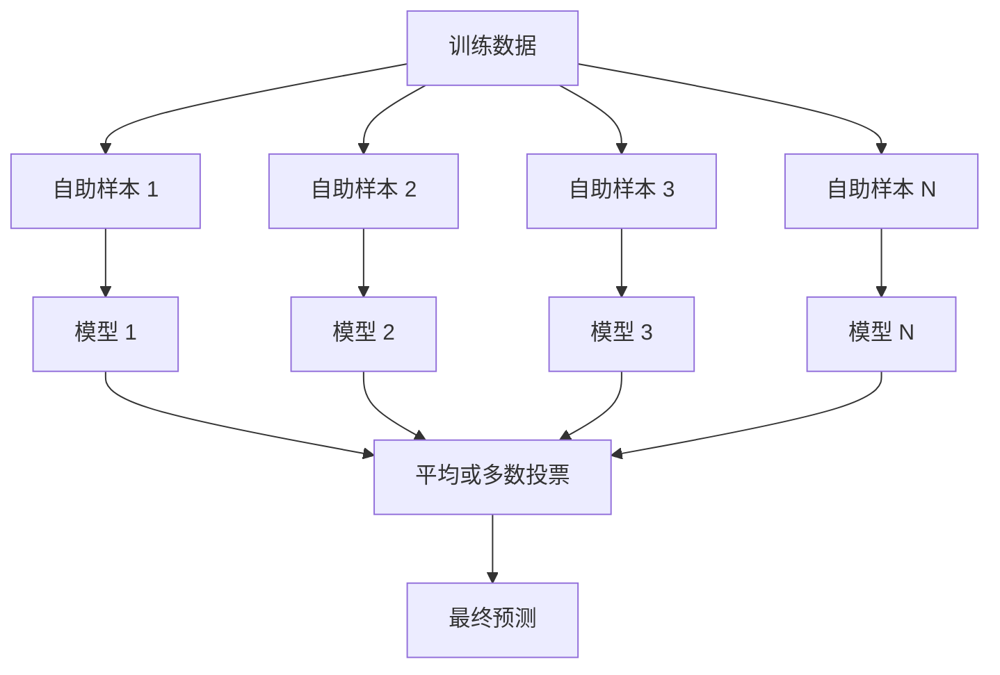
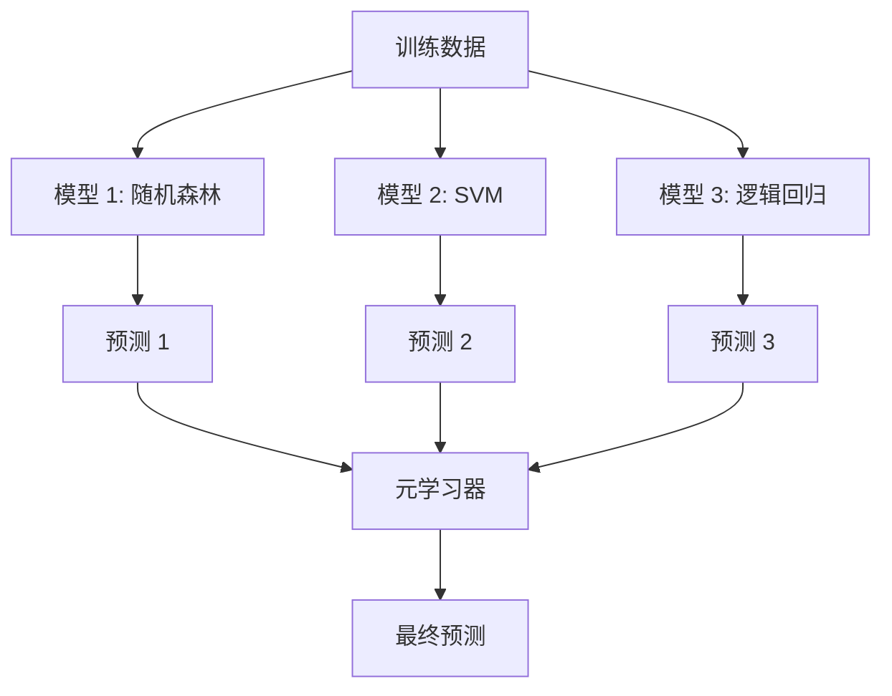

# 集成方法

> 一群弱学习器,正确组合起来,会变成一个强学习器。这不是比喻,这是个定理。

**Type:** Build
**Language:** Python
**Prerequisites:** Phase 2, Lesson 10 (偏差-方差权衡)
**Time:** ~120 分钟

## 学习目标

- 从零实现 AdaBoost 和梯度提升,解释 boosting 如何串行降低偏差
- 搭一个 bagging 集成,展示平均不相关模型如何降方差而不涨偏差
- 在每种方法针对的误差分量维度上对比 bagging、boosting、stacking
- 评估集成多样性,解释为什么多数投票的准确率会随独立弱学习器数量提升

## 问题引入

单棵决策树训练快、好解释,但过拟合。单个线性模型在复杂边界上欠拟合。你可以花好几天去设计完美的模型架构。或者你可以把一堆不完美的模型组合起来,得到一个比任何一个单独模型都强的模型。

集成方法就是这么做的。它是在表格数据上赢 Kaggle 比赛的最可靠技术,支撑着大部分生产 ML 系统,也把偏差-方差权衡演绎得淋漓尽致。Bagging 降方差。Boosting 降偏差。Stacking 学该在哪些输入上信任哪些模型。

## 核心概念

### 为什么集成有效

假设你有 N 个独立的分类器,每个准确率 p > 0.5。多数投票的准确率是:

```
P(多数对) = 对 k > N/2 求和 C(N,k) * p^k * (1-p)^(N-k)
```

21 个分类器各 60% 准确率,多数投票准确率约 74%。101 个分类器,涨到 84%。模型犯不同的错时,错误会相互抵消。

关键是**多样性**。如果所有模型犯同样的错,合起来也白搭。集成有效是因为它通过下面这些方式产出多样的模型:

- 不同的训练子集(bagging)
- 不同的特征子集(随机森林)
- 串行纠错(boosting)
- 不同的模型家族(stacking)

### Bagging(自助聚合)

Bagging 通过在训练数据的不同自助样本上训每个模型来创造多样性。



自助样本从原始数据中有放回抽样,大小跟原始数据一样。每个自助样本大约含原始数据 63.2% 的不重复样本。剩下的 36.8%(袋外样本)提供了免费的验证集。

Bagging 降方差,基本不涨偏差。每棵单独的树在它的自助样本上过拟合,但过拟合在每棵树上不同,所以平均一下就把噪声抵消了。

**随机森林**是 bagging 加一个额外扭转:每次切分时,只考虑一个随机的特征子集。这强制让树之间更多样。分类任务典型候选特征数 `sqrt(n_features)`,回归任务 `n_features / 3`。

### Boosting(串行纠错)

Boosting 串行训模型。每个新模型聚焦前面模型搞错的样本。


Boosting 降偏差。每个新模型纠正到目前为止集成的系统误差。最终预测是所有模型的加权和,更好的模型权重更高。

权衡:轮数太多会过拟合,因为它一直在拟合越来越难的样本,其中有些可能是噪声。

### AdaBoost

AdaBoost(自适应提升)是第一个实用的 boosting 算法。它配合任何基学习器都行,典型的是决策树桩(深度 1 的树)。

算法:

```
1. 初始化样本权重: w_i = 1/N 对所有 i

2. 对 t = 1 到 T:
   a. 在加权数据上训弱学习器 h_t
   b. 算加权误差:
      err_t = sum(w_i * I(h_t(x_i) != y_i)) / sum(w_i)
   c. 算模型权重:
      alpha_t = 0.5 * ln((1 - err_t) / err_t)
   d. 更新样本权重:
      w_i = w_i * exp(-alpha_t * y_i * h_t(x_i))
   e. 归一化权重让和为 1

3. 最终预测: H(x) = sign(sum(alpha_t * h_t(x)))
```

误差小的模型得到更高的 alpha。被错分的样本获得更高权重,所以下一个模型聚焦它们。

### 梯度提升

梯度提升把 boosting 推广到任意损失函数。它不再重新加权样本,而是让每个新模型拟合当前集成的残差(损失的负梯度)。

```
1. 初始化: F_0(x) = argmin_c sum(L(y_i, c))

2. 对 t = 1 到 T:
   a. 算伪残差:
      r_i = -dL(y_i, F_{t-1}(x_i)) / dF_{t-1}(x_i)
   b. 把一棵树 h_t 拟合到残差 r_i
   c. 找最优步长:
      gamma_t = argmin_gamma sum(L(y_i, F_{t-1}(x_i) + gamma * h_t(x_i)))
   d. 更新:
      F_t(x) = F_{t-1}(x) + learning_rate * gamma_t * h_t(x)

3. 最终预测: F_T(x)
```

对平方误差损失,伪残差就是真实残差:`r_i = y_i - F_{t-1}(x_i)`。每棵树真的在拟合前一轮集成的误差。

学习率(shrinkage)控制每棵树的贡献大小。学习率越小需要的树越多,但泛化更好。典型值:0.01 到 0.3。

### XGBoost:为什么它统治表格数据

XGBoost(极限梯度提升)是带工程优化的梯度提升,让它更快、更准、更抗过拟合:

- **正则化目标**:对叶子权重加 L1 和 L2 惩罚,防止单棵树太自信
- **二阶近似**:同时用损失的一阶和二阶导数,给出更好的切分决策
- **稀疏感知切分**:原生处理缺失值,在每个切分上学缺失数据的最佳走向
- **列采样**:跟随机森林一样,每个切分采样特征来增加多样性
- **加权分位数草图**:在分布式数据上高效找连续特征的切分点
- **缓存感知的块结构**:为 CPU 缓存行优化的内存布局

对表格数据,XGBoost(以及它的后继 LightGBM)一直吊打神经网络。短期不会变。如果你的数据能塞进一张行列齐整的表,从梯度提升开始。

### Stacking(元学习)

Stacking 把多个基模型的预测当作元学习器的特征。



元学习器学该在哪些输入上信任哪些基模型。如果随机森林在某片区域强、SVM 在另一片强,元学习器会学怎么路由。

为防止数据泄露,基模型预测必须用训练集上的交叉验证产生。永远不要在同样的数据上训基模型又生成元特征。

### 投票

最简单的集成。直接把预测拼起来。

- **硬投票**:对类标签多数投票。
- **软投票**:平均预测概率,选平均概率最高的类。因为用了置信度信息,通常更好。

## 从零实现

### Step 1:决策树桩(基学习器)

`code/ensembles.py` 把所有东西从零实现。我们从决策树桩开始:只有一次切分的树。

```python
class DecisionStump:
    def __init__(self):
        self.feature_idx = None
        self.threshold = None
        self.polarity = 1
        self.alpha = None

    def fit(self, X, y, weights):
        n_samples, n_features = X.shape
        best_error = float("inf")

        for f in range(n_features):
            thresholds = np.unique(X[:, f])
            for thresh in thresholds:
                for polarity in [1, -1]:
                    pred = np.ones(n_samples)
                    pred[polarity * X[:, f] < polarity * thresh] = -1
                    error = np.sum(weights[pred != y])
                    if error < best_error:
                        best_error = error
                        self.feature_idx = f
                        self.threshold = thresh
                        self.polarity = polarity

    def predict(self, X):
        n = X.shape[0]
        pred = np.ones(n)
        idx = self.polarity * X[:, self.feature_idx] < self.polarity * self.threshold
        pred[idx] = -1
        return pred
```

### Step 2:从零实现 AdaBoost

```python
class AdaBoostScratch:
    def __init__(self, n_estimators=50):
        self.n_estimators = n_estimators
        self.stumps = []
        self.alphas = []

    def fit(self, X, y):
        n = X.shape[0]
        weights = np.full(n, 1 / n)

        for _ in range(self.n_estimators):
            stump = DecisionStump()
            stump.fit(X, y, weights)
            pred = stump.predict(X)

            err = np.sum(weights[pred != y])
            err = np.clip(err, 1e-10, 1 - 1e-10)

            alpha = 0.5 * np.log((1 - err) / err)
            weights *= np.exp(-alpha * y * pred)
            weights /= weights.sum()

            stump.alpha = alpha
            self.stumps.append(stump)
            self.alphas.append(alpha)

    def predict(self, X):
        total = sum(a * s.predict(X) for a, s in zip(self.alphas, self.stumps))
        return np.sign(total)
```

### Step 3:从零实现梯度提升

```python
class GradientBoostingScratch:
    def __init__(self, n_estimators=100, learning_rate=0.1, max_depth=3):
        self.n_estimators = n_estimators
        self.lr = learning_rate
        self.max_depth = max_depth
        self.trees = []
        self.initial_pred = None

    def fit(self, X, y):
        self.initial_pred = np.mean(y)
        current_pred = np.full(len(y), self.initial_pred)

        for _ in range(self.n_estimators):
            residuals = y - current_pred
            tree = SimpleRegressionTree(max_depth=self.max_depth)
            tree.fit(X, residuals)
            update = tree.predict(X)
            current_pred += self.lr * update
            self.trees.append(tree)

    def predict(self, X):
        pred = np.full(X.shape[0], self.initial_pred)
        for tree in self.trees:
            pred += self.lr * tree.predict(X)
        return pred
```

### Step 4:跟 sklearn 对照

代码验证从零实现跟 sklearn 的 `AdaBoostClassifier` 和 `GradientBoostingClassifier` 准确率接近,并把所有方法放一起对比。

## 拿来用

### 每种方法什么时候用

| 方法 | 降什么 | 适合 | 注意 |
|------|--------|------|------|
| Bagging / 随机森林 | 方差 | 噪声数据、特征多 | 对偏差没帮助 |
| AdaBoost | 偏差 | 干净数据、简单基学习器 | 对离群点和噪声敏感 |
| 梯度提升 | 偏差 | 表格数据、比赛 | 训练慢,没调好容易过拟合 |
| XGBoost / LightGBM | 两个都降 | 生产表格 ML | 超参多 |
| Stacking | 两个都降 | 抠最后 1-2% 准确率 | 复杂,元学习器有过拟合风险 |
| Voting | 方差 | 快速拼多个多样模型 | 只有模型多样才有用 |

### 表格数据生产堆栈

对大多数表格预测问题,试试这个顺序:

1. 用默认参数的 **LightGBM 或 XGBoost**
2. 调 n_estimators、learning_rate、max_depth、min_child_weight
3. 如果还想要最后 0.5%,搭 3-5 个多样模型的 stacking 集成
4. 全程用交叉验证

表格数据上的神经网络几乎一直比梯度提升差,虽然有持续的研究尝试。TabNet、NODE 之类偶尔打平,但很少打得过调好的 XGBoost。

## 交付物

本课产出 `outputs/prompt-ensemble-selector.md`——一个帮你给数据集选集成方法的 prompt。描述你的数据(规模、特征类型、噪声水平、类平衡)和要解决的问题。prompt 会按决策清单走一遍,推荐一种方法,给起步超参,并警告该方法常见的坑。还产出 `outputs/skill-ensemble-builder.md` 包含完整选择指南。

## 练习

1. 改 AdaBoost 实现,跟踪每轮训练后的训练准确率。画准确率对估计器数的曲线。它什么时候收敛?

2. 通过给回归树加随机特征子采样,从零实现一个随机森林。训 100 棵 `max_features=sqrt(n_features)` 的树,平均预测。跟单棵树比方差缩减。

3. 在梯度提升实现里加早停:每轮跟踪验证损失,如果连续 10 轮没改进就停。实际需要多少棵树?

4. 搭一个 stacking 集成,3 个基模型(逻辑回归、决策树、K 近邻)+ 逻辑回归元学习器。用 5 折交叉验证生成元特征。跟每个基模型单独比。

5. 用默认参数在同一数据集上跑 XGBoost。跟你从零的梯度提升比准确率。计两个的时间。速度差多少?

## 关键术语

| 术语 | 大家常说的 | 实际含义 |
|------|-----------|---------|
| Bagging | "在随机子集上训练" | 自助聚合:在自助样本上训模型,平均预测以降方差 |
| Boosting | "聚焦难样本" | 串行训模型,每个纠正当前集成的误差,以降偏差 |
| AdaBoost | "重新加权数据" | 用样本权重更新做 boosting;错分点在下一轮获得更高权重 |
| Gradient boosting | "拟合残差" | 用拟合每棵新模型到损失函数的负梯度做 boosting |
| XGBoost | "Kaggle 大杀器" | 带正则化、二阶优化和系统级速度技巧的梯度提升 |
| Stacking | "模型上叠模型" | 把基模型的预测当作元学习器的输入特征 |
| Random forest | "一堆随机树" | 用决策树做 bagging,加上每个切分的随机特征子采样增加多样性 |
| Ensemble diversity | "犯不同的错" | 模型必须在错误上不相关,集成才能比单独强 |
| Out-of-bag error | "免费验证" | 自助抽样没抽到的样本(~36.8%)当验证集,不用单独留出 |

## 延伸阅读

- [Schapire & Freund: Boosting: Foundations and Algorithms](https://mitpress.mit.edu/9780262526036/) —— AdaBoost 作者写的书
- [Friedman: Greedy Function Approximation: A Gradient Boosting Machine (2001)](https://statweb.stanford.edu/~jhf/ftp/trebst.pdf) —— 梯度提升原始论文
- [Chen & Guestrin: XGBoost (2016)](https://arxiv.org/abs/1603.02754) —— XGBoost 论文
- [Wolpert: Stacked Generalization (1992)](https://www.sciencedirect.com/science/article/abs/pii/S0893608005800231) —— stacking 原始论文
- [scikit-learn Ensemble Methods](https://scikit-learn.org/stable/modules/ensemble.html) —— 实战参考