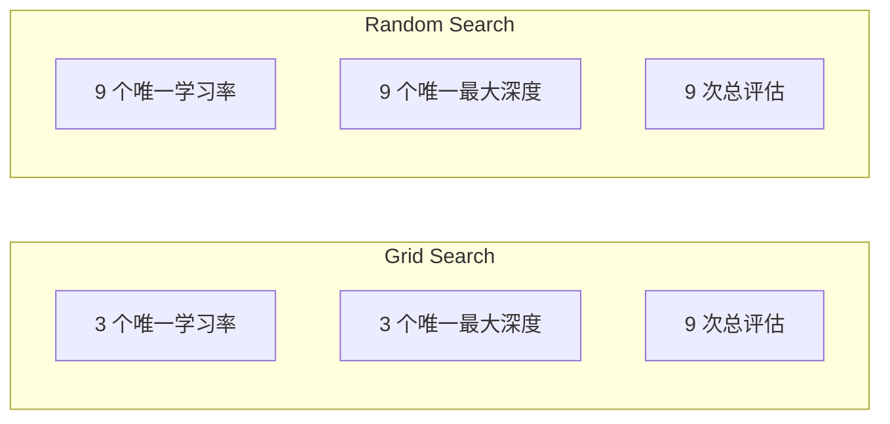
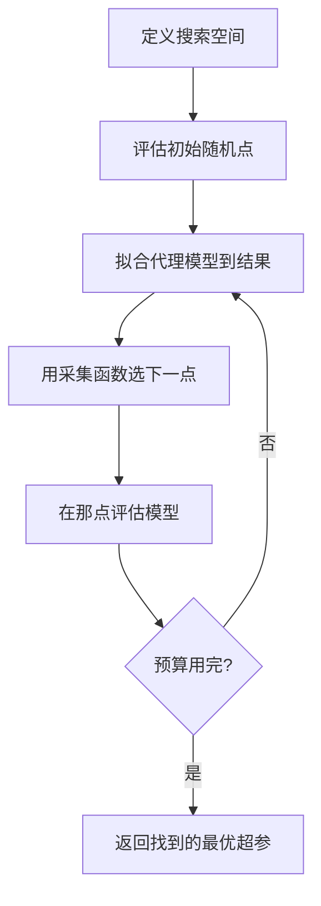
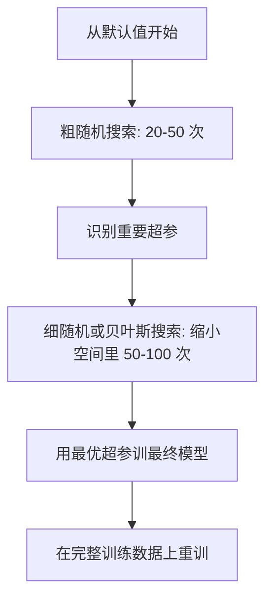
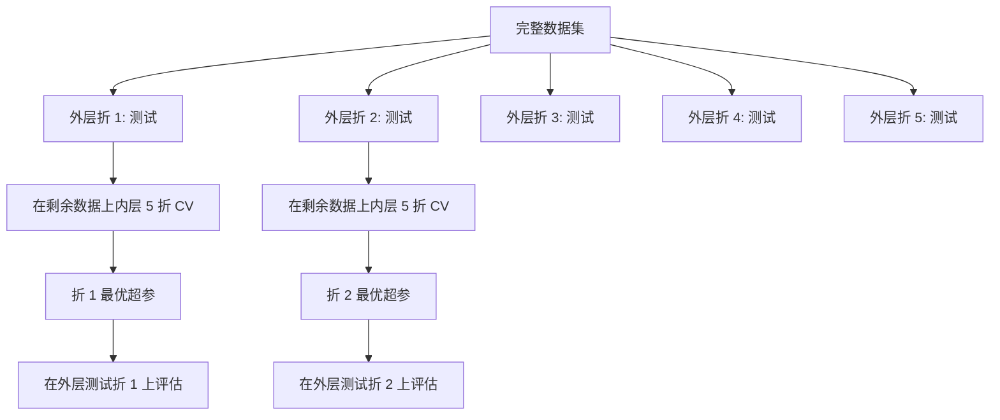

# 超参调优

> 超参是训练开始前你转的旋钮。转得好是普通模型和优秀模型的差别。

**Type:** Build
**Language:** Python
**Prerequisites:** Phase 2, Lesson 11 (集成方法)
**Time:** ~90 分钟

## 学习目标

- 从零实现网格搜索、随机搜索和贝叶斯优化,对比它们的样本效率
- 解释为什么随机搜索在大多数超参有效维度低时优于网格搜索
- 搭一个贝叶斯优化循环,用代理模型和采集函数引导搜索
- 设计一种超参调优策略,用合适的交叉验证避免对验证集过拟合

## 问题引入

你的梯度提升模型有学习率、树数、最大深度、每叶子最小样本数、子采样比例、列采样比例——6 个超参。每个取 5 个合理值,网格就是 5^6 = 15,625 个组合。每次训练 10 秒。全试一遍要 43 小时算力。

网格搜索是最显然的方法,也是规模上最糟的。随机搜索用更少算力做得更好。贝叶斯优化通过从历史评估中学习做得更好。知道用哪种策略、超参到底哪些重要,能省下好几天的 GPU 时间。

## 核心概念

### 参数 vs 超参

参数是训练时学出来的(权重、偏置、切分阈值)。超参是训练开始前设的,控制学习怎么发生。

| 超参 | 控制什么 | 典型范围 |
|------|---------|---------|
| 学习率 | 每步更新步长 | 0.001 到 1.0 |
| 树数/epoch 数 | 训练多久 | 10 到 10,000 |
| 最大深度 | 模型复杂度 | 1 到 30 |
| 正则化(lambda) | 防过拟合 | 0.0001 到 100 |
| Batch size | 梯度估计噪声 | 16 到 512 |
| Dropout 率 | 神经元失活比例 | 0.0 到 0.5 |

### 网格搜索

网格搜索评估指定值的每种组合。穷尽、易懂,但随超参数量指数级扩张。

```
2 个超参的网格:

  learning_rate: [0.01, 0.1, 1.0]
  max_depth:     [3, 5, 7]

  评估: 3 x 3 = 9 种组合

  (0.01, 3)  (0.01, 5)  (0.01, 7)
  (0.1,  3)  (0.1,  5)  (0.1,  7)
  (1.0,  3)  (1.0,  5)  (1.0,  7)
```

网格搜索有个根本缺陷:如果一个超参重要、另一个不重要,大部分评估都浪费了。9 次评估只拿到重要超参的 3 个唯一值。

### 随机搜索

随机搜索从分布中采样超参,而不是从网格。同样 9 次评估预算,每个超参你能拿到 9 个唯一值。



为什么随机胜过网格(Bergstra & Bengio, 2012):

- 大多数超参有效维度低。给定问题,6 个超参里通常只有 1-2 个重要。
- 网格搜索在不重要的维度上浪费评估。
- 同样预算下,随机搜索在重要维度上覆盖更密。
- 60 次随机试验,你就有 95% 的概率在离最优 5% 范围内找到一个点(假设搜索空间里存在)。

### 贝叶斯优化

随机搜索忽略结果。它不会学“高学习率会导致发散”或者“深度 3 一直比深度 10 强”。贝叶斯优化用历史评估决定下次搜哪里。



两个关键组件:

**代理模型**:一个廉价评估的模型(通常是高斯过程),近似昂贵的目标函数。它在搜索空间任意一点给出预测和不确定性估计。

**采集函数**:通过平衡利用(在已知好点附近搜)和探索(在不确定性高的地方搜),决定下次评估哪。常见选项:

- **Expected Improvement (EI)**:这点上我们期望比当前最优改进多少?
- **Upper Confidence Bound (UCB)**:预测加上不确定性的倍数。UCB 高意味着要么有戏、要么没探索过。
- **Probability of Improvement (PI)**:这点超过当前最优的概率多大?

贝叶斯优化通常用 2-5 倍少的评估就能找到比随机搜索更好的超参。拟合代理模型的开销跟训练实际模型相比可以忽略。

### 早停

不是每次训练都要跑完。如果一轮配在 10 epoch 后明显很差,停掉它继续往下。在超参搜索语境下这就是早停。

策略:
- **基于耐心**:验证损失连续 N epoch 没改进就停
- **中位数剪枝**:如果这轮的中间结果比同步骤已完成轮次的中位数还差,就停
- **Hyperband**:给很多配置小预算,然后逐步给最优配置加预算

Hyperband 特别有效。它给 81 个配置各跑 1 epoch,留前 1/3,给它们跑 3 epoch,留前 1/3,继续。比所有配置跑满预算快 10-50 倍找到好配置。

### 学习率调度器

学习率几乎总是最重要的超参。与其保持不变,调度器在训练中调整它。

| 调度器 | 公式 | 何时用 |
|--------|------|--------|
| 阶梯衰减 | 每 N epoch 乘以 0.1 | 经典 CNN 训练 |
| 余弦退火 | lr * 0.5 * (1 + cos(pi * t / T)) | 现代默认 |
| 预热 + 衰减 | 线性增再余弦衰减 | Transformer |
| One-cycle | 一个周期里先增后减 | 快速收敛 |
| 指标平台时降 | 指标不动时按因子降 | 安全默认 |

### 超参重要性

不是所有超参都同等重要。对随机森林(Probst 等, 2019)和梯度提升的研究显示一致的规律:

**高重要性:**
- 学习率(总是先调它)
- 估计器数/epoch 数(用早停代替调它)
- 正则化强度

**中重要性:**
- 最大深度/层数
- 每叶子最小样本数/权重衰减
- 子采样比例

**低重要性:**
- 最大特征(随机森林)
- 具体激活函数选择
- Batch size(在合理范围内)

先调重要的,其他的留默认值。

### 实用策略



具体工作流:

1. **从库默认开始**。它们是有经验的从业者挑的,常常已经走了 80%。
2. **粗随机搜索**。范围宽,20-50 次。用早停快速砍掉烂的。
3. **分析结果**。哪些超参跟性能相关?缩小搜索空间。
4. **细搜**。贝叶斯优化或聚焦的随机搜索,缩小空间里 50-100 次。
5. **在全部训练数据上重训**,用找到的最优超参。

### 交叉验证集成

在单一验证切分上调超参有风险。最优超参可能对特定验证折过拟合。嵌套交叉验证用两层循环解决:

- **外层**(评估):把数据切成 train+val 和 test。报告无偏性能。
- **内层**(调优):把 train+val 再切成 train 和 val。找最优超参。



每个外层折独立找自己的最优超参。外层分数是泛化性能的无偏估计。

用 sklearn:

```python
from sklearn.model_selection import cross_val_score, GridSearchCV
from sklearn.ensemble import GradientBoostingRegressor

inner_cv = GridSearchCV(
    GradientBoostingRegressor(),
    param_grid={
        "learning_rate": [0.01, 0.05, 0.1],
        "max_depth": [2, 3, 5],
        "n_estimators": [50, 100, 200],
    },
    cv=5,
    scoring="neg_mean_squared_error",
)

outer_scores = cross_val_score(
    inner_cv, X, y, cv=5, scoring="neg_mean_squared_error"
)

print(f"Nested CV MSE: {-outer_scores.mean():.4f} +/- {outer_scores.std():.4f}")
```

这很贵(5 外层 × 5 内层 × 27 网格点 = 675 次模型拟合),但给你一个可信的性能估计。报告最终结果或决策代价高时用它。

### 实用技巧

**从学习率开始**。它总是基于梯度的方法里最重要的超参。坏的学习率让其他一切都无关。把其他超参固定在默认,先扫学习率。

**对学习率和正则化用对数均匀分布**。0.001 和 0.01 的差别跟 0.1 和 1.0 的差别一样大。线性搜索在大端浪费预算。

**用早停代替调 n_estimators**。对 boosting 和神经网络,把 n_estimators 或 epochs 设高,让早停决定什么时候停。这从搜索里删一个超参。

**预算分配**。调优预算的 60% 花在前 2 个最重要的超参上。剩下 40% 给其他的。前 2 个占大部分性能变化。

**量纲很重要**。永远别在对数刻度上搜 batch size(16、32、64 行)。永远在对数刻度上搜学习率。匹配搜索分布和超参对模型的影响方式。

| 模型类型 | 顶部超参 | 推荐搜索 | 预算 |
|---------|---------|---------|------|
| 随机森林 | n_estimators、max_depth、min_samples_leaf | 随机搜索,50 次 | 低(训练快) |
| 梯度提升 | learning_rate、n_estimators、max_depth | 贝叶斯,100 次 + 早停 | 中 |
| 神经网络 | learning_rate、weight_decay、batch_size | 贝叶斯或随机,100+ 次 | 高(训练慢) |
| SVM | C、gamma(RBF 核) | 对数刻度网格,25-50 次 | 低(2 参) |
| Lasso/Ridge | alpha | 对数刻度 1D 搜索,20 次 | 极低 |
| XGBoost | learning_rate、max_depth、subsample、colsample | 贝叶斯,100-200 次 + 早停 | 中 |

**拿不准时:** 随机搜索用 2 倍超参数量的试验(比如 6 个超参 = 至少 12 次)。你会惊讶地发现 50 次随机搜索经常能打过精心设计的网格。

```figure
k-fold-cv
```

## 从零实现

### Step 1:从零实现网格搜索

`code/tuning.py` 把网格搜索、随机搜索和简单的贝叶斯优化器从零实现。

```python
def grid_search(model_fn, param_grid, X_train, y_train, X_val, y_val):
    keys = list(param_grid.keys())
    values = list(param_grid.values())
    best_score = -float("inf")
    best_params = None
    n_evals = 0

    for combo in itertools.product(*values):
        params = dict(zip(keys, combo))
        model = model_fn(**params)
        model.fit(X_train, y_train)
        score = evaluate(model, X_val, y_val)
        n_evals += 1

        if score > best_score:
            best_score = score
            best_params = params

    return best_params, best_score, n_evals
```

### Step 2:从零实现随机搜索

```python
def random_search(model_fn, param_distributions, X_train, y_train,
                  X_val, y_val, n_iter=50, seed=42):
    rng = np.random.RandomState(seed)
    best_score = -float("inf")
    best_params = None

    for _ in range(n_iter):
        params = {k: sample(v, rng) for k, v in param_distributions.items()}
        model = model_fn(**params)
        model.fit(X_train, y_train)
        score = evaluate(model, X_val, y_val)

        if score > best_score:
            best_score = score
            best_params = params

    return best_params, best_score, n_iter
```

### Step 3:贝叶斯优化(简化版)

核心思路:拟合一个高斯过程到观察到的(超参, 分数)对,然后用采集函数决定下次看哪里。

```python
class SimpleBayesianOptimizer:
    def __init__(self, search_space, n_initial=5):
        self.search_space = search_space
        self.n_initial = n_initial
        self.X_observed = []
        self.y_observed = []

    def _kernel(self, x1, x2, length_scale=1.0):
        dists = np.sum((x1[:, None, :] - x2[None, :, :]) ** 2, axis=2)
        return np.exp(-0.5 * dists / length_scale ** 2)

    def _fit_gp(self, X_new):
        X_obs = np.array(self.X_observed)
        y_obs = np.array(self.y_observed)
        y_mean = y_obs.mean()
        y_centered = y_obs - y_mean

        K = self._kernel(X_obs, X_obs) + 1e-4 * np.eye(len(X_obs))
        K_star = self._kernel(X_new, X_obs)

        L = np.linalg.cholesky(K)
        alpha = np.linalg.solve(L.T, np.linalg.solve(L, y_centered))
        mu = K_star @ alpha + y_mean

        v = np.linalg.solve(L, K_star.T)
        var = 1.0 - np.sum(v ** 2, axis=0)
        var = np.maximum(var, 1e-6)

        return mu, var

    def _expected_improvement(self, mu, var, best_y):
        sigma = np.sqrt(var)
        z = (mu - best_y) / (sigma + 1e-10)
        ei = sigma * (z * norm_cdf(z) + norm_pdf(z))
        return ei

    def suggest(self):
        if len(self.X_observed) < self.n_initial:
            return sample_random(self.search_space)

        candidates = [sample_random(self.search_space) for _ in range(500)]
        X_cand = np.array([to_vector(c) for c in candidates])
        mu, var = self._fit_gp(X_cand)
        ei = self._expected_improvement(mu, var, max(self.y_observed))
        return candidates[np.argmax(ei)]

    def observe(self, params, score):
        self.X_observed.append(to_vector(params))
        self.y_observed.append(score)
```

GP 代理在每个候选点给两件事:预测分数(mu)和不确定性(var)。Expected Improvement 平衡两者:它偏好模型预测分数高或不确定性高的点。早期大部分点不确定性高,所以优化器在探索。后来它聚焦最有戏的区域。

### Step 4:对比所有方法

在同一合成目标上跑所有三种方法对比。这个对比用了一个简化包装器,直接调用目标函数(不训模型),所以 API 跟上面基于模型的实现略有不同:

```python
def synthetic_objective(params):
    lr = params["learning_rate"]
    depth = params["max_depth"]
    return -(np.log10(lr) + 2) ** 2 - (depth - 4) ** 2 + 10

param_grid = {
    "learning_rate": [0.001, 0.01, 0.1, 1.0],
    "max_depth": [2, 3, 4, 5, 6, 7, 8],
}

grid_best = None
grid_score = -float("inf")
grid_history = []
for combo in itertools.product(*param_grid.values()):
    params = dict(zip(param_grid.keys(), combo))
    score = synthetic_objective(params)
    grid_history.append((params, score))
    if score > grid_score:
        grid_score = score
        grid_best = params

param_dist = {
    "learning_rate": ("log_float", 0.001, 1.0),
    "max_depth": ("int", 2, 8),
}

rand_best = None
rand_score = -float("inf")
rand_history = []
rng = np.random.RandomState(42)
for _ in range(28):
    params = {k: sample(v, rng) for k, v in param_dist.items()}
    score = synthetic_objective(params)
    rand_history.append((params, score))
    if score > rand_score:
        rand_score = score
        rand_best = params

optimizer = SimpleBayesianOptimizer(param_dist, n_initial=5)
bayes_history = []
for _ in range(28):
    params = optimizer.suggest()
    score = synthetic_objective(params)
    optimizer.observe(params, score)
    bayes_history.append((params, score))
bayes_score = max(s for _, s in bayes_history)

print(f"{'Method':<20} {'Best Score':>12} {'Evaluations':>12}")
print("-" * 50)
print(f"{'Grid Search':<20} {grid_score:>12.4f} {len(grid_history):>12}")
print(f"{'Random Search':<20} {rand_score:>12.4f} {len(rand_history):>12}")
print(f"{'Bayesian Opt':<20} {bayes_score:>12.4f} {len(bayes_history):>12}")
```

同样预算下,贝叶斯优化通常最快找到最优分数,因为它不在明显差的区域浪费评估。随机搜索覆盖面积比网格搜索大。网格搜索只在超参少、能负担穷举时赢。

## 拿来用

### 实战用 Optuna

Optuna 是严肃超参调优的推荐库。它支持剪枝、分布式搜索和开箱即用的可视化。

```python
import optuna

def objective(trial):
    lr = trial.suggest_float("learning_rate", 1e-4, 1e-1, log=True)
    n_est = trial.suggest_int("n_estimators", 50, 500)
    max_depth = trial.suggest_int("max_depth", 2, 10)

    model = GradientBoostingRegressor(
        learning_rate=lr,
        n_estimators=n_est,
        max_depth=max_depth,
    )
    model.fit(X_train, y_train)
    return mean_squared_error(y_val, model.predict(X_val))

study = optuna.create_study(direction="minimize")
study.optimize(objective, n_trials=100)

print(f"Best params: {study.best_params}")
print(f"Best MSE: {study.best_value:.4f}")
```

Optuna 关键特性:
- `suggest_float(..., log=True)` 给适合对数刻度搜索的参数(学习率、正则化)
- `suggest_int` 给整数参数
- `suggest_categorical` 给离散选择
- 内置 MedianPruner 早停烂试验
- `study.trials_dataframe()` 做分析

### Optuna 带剪枝

剪枝早早停掉没前途的试验,省下大量算力。模式:

```python
import optuna
from sklearn.model_selection import cross_val_score

def objective(trial):
    params = {
        "learning_rate": trial.suggest_float("lr", 1e-4, 0.5, log=True),
        "max_depth": trial.suggest_int("max_depth", 2, 10),
        "n_estimators": trial.suggest_int("n_estimators", 50, 500),
        "subsample": trial.suggest_float("subsample", 0.5, 1.0),
    }

    model = GradientBoostingRegressor(**params)
    scores = cross_val_score(model, X_train, y_train, cv=3,
                             scoring="neg_mean_squared_error")
    mean_score = -scores.mean()

    trial.report(mean_score, step=0)
    if trial.should_prune():
        raise optuna.TrialPruned()

    return mean_score

pruner = optuna.pruners.MedianPruner(n_startup_trials=10, n_warmup_steps=5)
study = optuna.create_study(direction="minimize", pruner=pruner)
study.optimize(objective, n_trials=200)
```

`MedianPruner` 在一轮的中间值比同步骤已完成轮次的中位数还差时停掉它。剪枝要求调用 `trial.report()` 报告中间指标和 `trial.should_prune()` 检查是否该停。`n_startup_trials=10` 保证至少 10 轮跑完再开始剪枝。典型情况下省 40-60% 总算力。

### sklearn 自带的调优器

快速实验的话,sklearn 提供 `GridSearchCV`、`RandomizedSearchCV`、`HalvingRandomSearchCV`:

```python
from sklearn.model_selection import RandomizedSearchCV
from scipy.stats import loguniform, randint

param_dist = {
    "learning_rate": loguniform(1e-4, 0.5),
    "max_depth": randint(2, 10),
    "n_estimators": randint(50, 500),
}

search = RandomizedSearchCV(
    GradientBoostingRegressor(),
    param_dist,
    n_iter=100,
    cv=5,
    scoring="neg_mean_squared_error",
    random_state=42,
    n_jobs=-1,
)
search.fit(X_train, y_train)
print(f"Best params: {search.best_params_}")
print(f"Best CV MSE: {-search.best_score_:.4f}")
```

学习率和正则化用 scipy 的 `loguniform`。整数超参用 `randint`。`n_jobs=-1` 把搜索并行到所有 CPU 核上。

### 超参调优常见错误

**预处理的数据泄露**。如果交叉验证前在完整数据集上 fit scaler,验证折的信息会泄露到训练里。把预处理放进 `Pipeline` 里,这样它只在训练折上 fit。

**对验证集过拟合**。跑几千次试验实际上就是在验证集上训练。最终性能估计用嵌套交叉验证,或者单独留一个测试集永远不碰。

**搜索范围太窄**。如果你最优值出现在搜索边界,你搜得不够宽。最优值可能在你的范围外。永远检查最优参数是不是在边缘。

**忽略交互效应**。学习率和估计器数在 boosting 里强相关。低学习率需要更多估计器。独立调它们不如一起调。

**迭代模型没用早停**。对梯度提升和神经网络,把 n_estimators 或 epochs 设高,再用早停。这严格好过把迭代次数当超参调。

## 练习

1. 用同样总预算(比如 50 次评估)跑网格搜索和随机搜索。对比找到的最优分数。用不同种子跑 10 次。随机搜索赢多少次?

2. 从零实现 Hyperband。81 个配置各训 1 epoch 开始。每轮留前 1/3,预算 ×3。对比总算力(所有配置的 epoch 总和)和跑 81 个配置满预算。

3. 给 Lesson 11 的梯度提升实现加学习率调度器(余弦退火)。跟固定学习率比有帮助吗?

4. 用 Optuna 调一个真实数据集(比如 sklearn 的乳腺癌数据集)上的 RandomForestClassifier。用 `optuna.visualization.plot_param_importances(study)` 看哪些超参最重要。跟本课的重要性排序对得上吗?

5. 实现一个简单采集函数(Expected Improvement),展示探索 vs 利用。画代理模型的均值和不确定性,展示 EI 选下一点评估的位置。

## 关键术语

| 术语 | 大家常说的 | 实际含义 |
|------|-----------|---------|
| Hyperparameter | "你选的设置" | 训练前设的值,控制学习过程,不是从数据学的 |
| Grid search | "试遍每种组合" | 在指定参数网格上穷举搜索。指数代价 |
| Random search | "随机采样" | 从分布里采样超参。比网格搜索覆盖重要维度更好 |
| Bayesian optimization | "聪明的搜索" | 用目标函数的代理模型决定下次评估哪,平衡探索和利用 |
| Surrogate model | "便宜的近似" | 一个(通常是高斯过程的)模型,从观察到的评估近似昂贵的目标函数 |
| Acquisition function | "下次看哪" | 平衡期望改进和不确定性给候选点打分。EI 和 UCB 是常见选择 |
| Early stopping | "别浪费时间" | 验证性能不再提升时终止训练 |
| Hyperband | "配置的锦标赛" | 自适应资源分配:用小预算起很多配置,留最好的再加预算 |
| Learning rate scheduler | "训练时改 lr" | 一个在训练过程中调学习率的函数,改善收敛 |

## 延伸阅读

- [Bergstra & Bengio: Random Search for Hyper-Parameter Optimization (2012)](https://jmlr.org/papers/v13/bergstra12a.html) —— 证明随机胜过网格的论文
- [Snoek et al., Practical Bayesian Optimization of Machine Learning Algorithms (2012)](https://arxiv.org/abs/1206.2944) —— ML 上的贝叶斯优化
- [Li et al., Hyperband: A Novel Bandit-Based Approach (2018)](https://jmlr.org/papers/v18/16-558.html) —— Hyperband 论文
- [Optuna: A Next-generation Hyperparameter Optimization Framework](https://arxiv.org/abs/1907.10902) —— Optuna 论文
- [Probst et al., Tunability: Importance of Hyperparameters (2019)](https://jmlr.org/papers/v20/18-444.html) —— 哪些超参重要