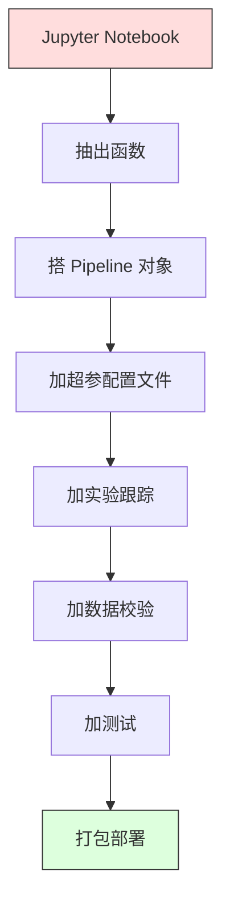

# ML 流水线

> 模型不是产品,流水线才是。流水线是从原始数据到部署预测的全过程,每一步都必须可复现。

**Type:** Build
**Language:** Python
**Prerequisites:** Phase 2, Lesson 12 (超参调优)
**Time:** ~120 分钟

## 学习目标

- 从零搭一个 ML 流水线,把填补、缩放、编码、模型训练串成一个可复现的对象
- 识别数据泄露场景,解释流水线如何通过只在训练数据上 fit 变换器来防泄露
- 构造一个 ColumnTransformer,对数值和类别特征做不同的预处理
- 实现流水线序列化,展示同一个拟合好的流水线在训练和生产中产出完全一样的结果

## 问题引入

你有个 notebook,加载数据、用中位数填缺失、缩放特征、训模型、打准确率。能用。你就上了。

一个月后,有人重训模型,结果不一样。中位数是在包含测试数据的完整数据集上算的(数据泄露)。缩放参数没存,所以推理用了不同的统计量。特征工程代码在训练和服务之间是复制粘贴的,副本之间已经分叉了。生产里某个类别列冒出一个编码器从没见过的值。

这些不是假设的,是 ML 系统在生产里挂掉的最常见原因。流水线通过把所有变换步骤打包到一个有序、可复现的对象里,把所有这些坑都填了。

## 核心概念

### 流水线是什么

流水线是一个有序的数据变换序列,最后跟一个模型。每一步把上一步的输出当输入。整个流水线在训练数据上 fit 一次。推理时,同一个拟合好的流水线变换新数据并产出预测。


流水线保证:
- 变换只在训练数据上 fit(不泄露)
- 推理时用同样的变换
- 整个对象能序列化成单个工件部署
- 交叉验证按折应用流水线,防细微的泄露

### 数据泄露:沉默的杀手

数据泄露就是测试集或未来数据的信息污染了训练。流水线防住最常见的几种。

**泄露版(错):**
```python
X = df.drop("target", axis=1)
y = df["target"]

scaler = StandardScaler()
X_scaled = scaler.fit_transform(X)

X_train, X_test = X_scaled[:800], X_scaled[800:]
y_train, y_test = y[:800], y[800:]
```

scaler 看到了测试数据。均值和标准差包含了测试样本。这把准确率估计吹大了。

**正确版:**
```python
X_train, X_test = X[:800], X[800:]

scaler = StandardScaler()
X_train_scaled = scaler.fit_transform(X_train)
X_test_scaled = scaler.transform(X_test)
```

用流水线,你不用想这些。流水线自动处理。

### sklearn Pipeline

sklearn 的 `Pipeline` 把变换器和估计器串起来。它暴露 `.fit()`、`.predict()`、`.score()`,按顺序应用所有步骤。

```python
from sklearn.pipeline import Pipeline
from sklearn.preprocessing import StandardScaler
from sklearn.linear_model import LogisticRegression

pipe = Pipeline([
    ("scaler", StandardScaler()),
    ("model", LogisticRegression()),
])

pipe.fit(X_train, y_train)
predictions = pipe.predict(X_test)
```

调用 `pipe.fit(X_train, y_train)` 时:
1. Scaler 在 X_train 上调用 `fit_transform`
2. Model 在缩放后的 X_train 上调用 `fit`

调用 `pipe.predict(X_test)` 时:
1. Scaler 在 X_test 上调用 `transform`(不是 fit_transform)
2. Model 在缩放后的 X_test 上调用 `predict`

scaler 在 fit 时永远看不到测试数据。这才是关键。

### ColumnTransformer:不同列用不同流水线

真实数据集有数值和类别列,需要不同预处理。`ColumnTransformer` 处理这个。

```python
from sklearn.compose import ColumnTransformer
from sklearn.preprocessing import StandardScaler, OneHotEncoder
from sklearn.impute import SimpleImputer

numeric_pipe = Pipeline([
    ("impute", SimpleImputer(strategy="median")),
    ("scale", StandardScaler()),
])

categorical_pipe = Pipeline([
    ("impute", SimpleImputer(strategy="most_frequent")),
    ("encode", OneHotEncoder(handle_unknown="ignore")),
])

preprocessor = ColumnTransformer([
    ("num", numeric_pipe, ["age", "income", "score"]),
    ("cat", categorical_pipe, ["city", "gender", "plan"]),
])

full_pipeline = Pipeline([
    ("preprocess", preprocessor),
    ("model", GradientBoostingClassifier()),
])
```

OneHotEncoder 里的 `handle_unknown="ignore"` 对生产至关重要。当新类别出现(模型从没见过的城市)时,它产生零向量而不是崩。

### 实验跟踪

流水线让训练可复现,但你还需要跨实验跟踪发生了什么:用了哪些超参、数据集哪个版本、指标是多少、跑的什么代码。

**MLflow** 是最常见的开源方案:

```python
import mlflow

with mlflow.start_run():
    mlflow.log_param("max_depth", 5)
    mlflow.log_param("n_estimators", 100)
    mlflow.log_param("learning_rate", 0.1)

    pipe.fit(X_train, y_train)
    accuracy = pipe.score(X_test, y_test)

    mlflow.log_metric("accuracy", accuracy)
    mlflow.sklearn.log_model(pipe, "model")
```

每次 run 都带上参数、指标、工件和完整模型记录下来。你可以对比 run、复现任何实验、部署任何模型版本。

**Weights & Biases (wandb)** 提供同样的功能,带托管面板:

```python
import wandb

wandb.init(project="my-pipeline")
wandb.config.update({"max_depth": 5, "n_estimators": 100})

pipe.fit(X_train, y_train)
accuracy = pipe.score(X_test, y_test)

wandb.log({"accuracy": accuracy})
```

### 模型版本管理

实验跟踪完了,你需要管理模型版本。哪个模型在生产?哪个在 staging?上周的是哪个?

MLflow 的 Model Registry 提供:
- **版本跟踪**:每个保存的模型都拿到一个版本号
- **阶段转换**:"Staging"、"Production"、"Archived"
- **审批工作流**:模型必须显式提升到生产
- **回滚**:瞬间切回上一个版本

### 用 DVC 做数据版本

代码用 git 版本控制。数据也应该版本控制,但 git 搞不定大文件。DVC(Data Version Control)解决这个。

```
dvc init
dvc add data/training.csv
git add data/training.csv.dvc data/.gitignore
git commit -m "Track training data"
dvc push
```

DVC 把实际数据存到远程存储(S3、GCS、Azure),在 git 里留个小 `.dvc` 文件记录 hash。你 checkout 一个 git commit,`dvc checkout` 就把当时用的数据恢复回来。

这意味着每个 git commit 都同时钉死了代码和数据。完全可复现。

### 可复现的实验

一个可复现的实验需要四样东西:

1. **固定随机种子**:给 numpy、random 和框架(torch、sklearn)设种子
2. **钉死依赖**:requirements.txt 或 poetry.lock 带精确版本
3. **数据版本化**:DVC 或同类
4. **配置文件**:所有超参在配置文件里,不硬编码

```python
import numpy as np
import random

def set_seed(seed=42):
    random.seed(seed)
    np.random.seed(seed)
    try:
        import torch
        torch.manual_seed(seed)
        torch.cuda.manual_seed_all(seed)
        torch.backends.cudnn.deterministic = True
    except ImportError:
        pass
```

### 从 Notebook 到生产流水线



典型进化路径:

1. **Notebook 探索**:快速实验、可视化、特征想法
2. **抽出函数**:把预处理、特征工程、评估挪进模块
3. **搭 Pipeline**:把变换串成 sklearn Pipeline 或自定义类
4. **配置管理**:把所有超参挪到 YAML/JSON 配置
5. **实验跟踪**:加 MLflow 或 wandb 日志
6. **数据校验**:训练前检查 schema、分布、缺失模式
7. **测试**:变换器的单元测试,完整流水线的集成测试
8. **部署**:序列化流水线,包成 API(FastAPI、Flask),容器化

### 流水线常见错误

| 错误 | 为什么糟 | 修法 |
|------|---------|------|
| 切分前在完整数据上 fit | 数据泄露 | 用 Pipeline 配合 cross_val_score |
| 特征工程在流水线外 | 训练和服务变换不同 | 把所有变换放进 Pipeline |
| 不处理未知类别 | 生产遇新值崩溃 | OneHotEncoder(handle_unknown="ignore") |
| 列名硬编码 | schema 变了就崩 | 用配置文件里的列名列表 |
| 没有数据校验 | 在烂数据上静默给出错预测 | 预测前加 schema 检查 |
| 训练/服务偏移 | 模型在生产看到不同特征 | 训练和服务用同一个 Pipeline 对象 |

## 从零实现

`code/pipeline.py` 从零搭一个完整的 ML 流水线:

### Step 1:自定义变换器

```python
class CustomTransformer:
    def __init__(self):
        self.means = None
        self.stds = None

    def fit(self, X):
        self.means = np.mean(X, axis=0)
        self.stds = np.std(X, axis=0)
        self.stds[self.stds == 0] = 1.0
        return self

    def transform(self, X):
        return (X - self.means) / self.stds

    def fit_transform(self, X):
        return self.fit(X).transform(X)
```

### Step 2:从零实现 Pipeline

```python
class PipelineFromScratch:
    def __init__(self, steps):
        self.steps = steps

    def fit(self, X, y=None):
        X_current = X.copy()
        for name, step in self.steps[:-1]:
            X_current = step.fit_transform(X_current)
        name, model = self.steps[-1]
        model.fit(X_current, y)
        return self

    def predict(self, X):
        X_current = X.copy()
        for name, step in self.steps[:-1]:
            X_current = step.transform(X_current)
        name, model = self.steps[-1]
        return model.predict(X_current)
```

### Step 3:用 Pipeline 做交叉验证

代码演示带 Pipeline 的交叉验证如何防数据泄露:scaler 在每折的训练数据上分别 fit。

### Step 4:用 sklearn 的完整生产流水线

一个完整流水线带 `ColumnTransformer`、多条预处理路径、一个模型,用合适的交叉验证和实验日志训练。

## 交付物

本课产出:
- `outputs/prompt-ml-pipeline.md` —— 一个搭建和调试 ML 流水线的 skill
- `code/pipeline.py` —— 从零到 sklearn 的完整流水线

## 练习

1. 搭一个流水线处理 3 个数值列 + 2 个类别列的数据集。用 `ColumnTransformer` 给数值列做中位数填补 + 缩放,给类别列做众数填补 + one-hot。5 折交叉验证训练。

2. 故意引入数据泄露:切分前在完整数据集上 fit scaler。交叉验证分数(泄露的)跟流水线交叉验证分数(干净的)差多少?

3. 用 `joblib.dump` 序列化你的流水线。在另一个脚本里 load 它跑预测。验证预测完全相同。

4. 给流水线加一个自定义变换器,给两个最重要的数值列造多项式特征(2 次)。它应该放在流水线哪个位置?

5. 给流水线配 MLflow 跟踪。跑 5 个不同超参的实验。用 MLflow UI(`mlflow ui`)对比 run,挑最好的模型。

## 关键术语

| 术语 | 大家常说的 | 实际含义 |
|------|-----------|---------|
| Pipeline | "变换 + 模型链" | 有序的拟合好的变换器和一个模型,作为一个整体应用,防泄露 |
| Data leakage | "测试信息漏到训练里" | 用了训练集外的信息建模型,把性能估计吹大 |
| ColumnTransformer | "按列不同预处理" | 对不同列子集用不同流水线,合并结果 |
| Experiment tracking | "记录你的 run" | 记录每次训练的参数、指标、工件和代码版本 |
| MLflow | "跟踪和部署模型" | 实验跟踪、模型注册表和部署的开源平台 |
| DVC | "数据的 git" | 大数据文件的版本控制,在 git 里存 hash,数据在远程存储 |
| Model registry | "模型版本目录" | 跟踪带阶段标签(生产、staging、归档)的模型版本的系统 |
| Training/serving skew | "notebook 里能用的" | 训练和推理时数据处理方式的差异,引起静默错误 |
| Reproducibility | "同代码同结果" | 从同样的代码、数据、配置拿到完全相同结果的能力 |

## 延伸阅读

- [scikit-learn Pipeline docs](https://scikit-learn.org/stable/modules/compose.html) —— 官方流水线参考
- [MLflow documentation](https://mlflow.org/docs/latest/index.html) —— 实验跟踪和模型注册表
- [DVC documentation](https://dvc.org/doc) —— 数据版本控制
- [Sculley et al., Hidden Technical Debt in Machine Learning Systems (2015)](https://papers.nips.cc/paper/2015/hash/86df7dcfd896fcaf2674f757a2463eba-Abstract.html) —— ML 系统复杂性的开山论文
- [Google ML Best Practices: Rules of ML](https://developers.google.com/machine-learning/guides/rules-of-ml) —— 实用生产 ML 建议