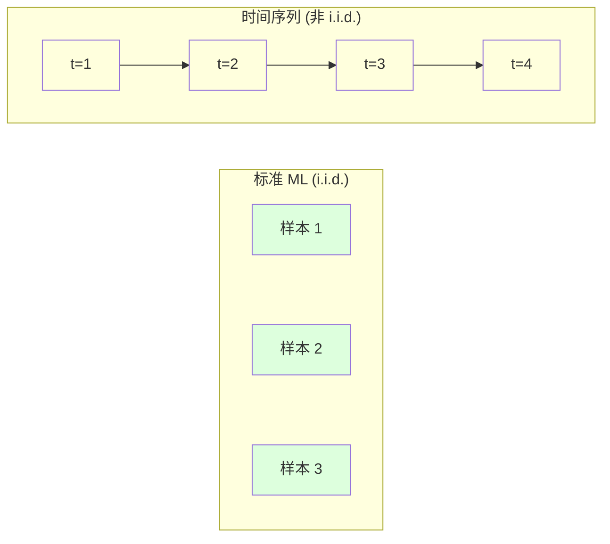
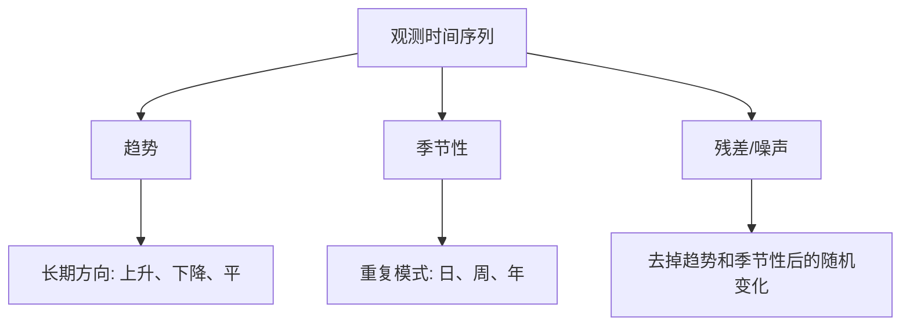
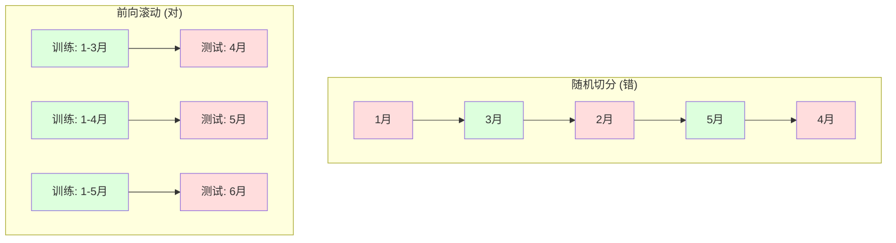

# 时间序列基础

> 过去的表现在先检查平稳性之后能预测未来。

**Type:** Build
**Language:** Python
**Prerequisites:** Phase 2, Lessons 01-09
**Time:** ~90 分钟

## 学习目标

- 把时间序列分解成趋势、季节性和残差成分,并检验平稳性
- 实现滞后特征和滚动统计,把时间序列转成监督学习问题
- 搭建前向滚动验证框架,防止未来数据泄露到训练中
- 解释为什么随机 train/test 切分对时间序列无效,展示跟合适时序切分的性能差距

## 问题引入

你的数据按时序排好。日销量、每小时温度、每分钟 CPU 占用、每周股价。你想预测下一个值、下周、下季度。

你伸手去拿标准 ML 工具箱:随机 train/test 切分、交叉验证、丢进特征矩阵、产出预测。每一步都是错的。

时间序列打破了标准 ML 依赖的假设。样本不独立——今天的温度依赖昨天。随机切分把未来信息泄露到过去。回测时看起来不错的特征在生产里挂了,因为它们依赖的规律随时间变了。

一个用随机交叉验证拿到 95% 准确率的模型,做合适时序评估可能只有 55%。这不是细节。这是纸上能用、生产里也用的差别。

本课覆盖基础:让时间数据不同的东西、怎么诚实地评估模型、怎么把时间序列变成标准 ML 模型能吃的特征。

## 核心概念

### 时间序列有什么不一样

标准 ML 假设 i.i.d.——独立同分布。每个样本从同一分布独立抽取。时间序列两个假设都违反:

- **不独立**。今天的股价依赖昨天的。这周销量跟上周相关。
- **不同分布**。分布随时间变。12 月销量跟 3 月看起来不一样。

这些违反不是小事。它们改变你怎么建特征、怎么评估模型、哪些算法 work。



标准 ML 里样本可互换,洗牌不变。时序里顺序就是一切,洗牌毁掉信号。

### 时间序列的成分

每个时间序列都是这些东西的组合:



- **趋势**:长期方向。收入年增 10%。全球气温上升。
- **季节性**:固定间隔的重复模式。零售 12 月爆量。空调 7 月高峰。
- **残差**:去掉趋势和季节性后剩下的。如果残差看起来像白噪声,分解就抓住了信号。

### 平稳性

时间序列如果它的统计性质(均值、方差、自相关)不随时间变,就是平稳的。大部分预测方法假设平稳。

**为什么重要:** 非平稳序列的均值会漂移。在 1 月数据上训练的模型学到的均值跟 2 月要展示的不同。它会系统性错。

**怎么检查:** 在窗口上算滚动均值和滚动标准差。如果它们漂移,序列非平稳。

**怎么修:** 差分。不建模原始值,而是建模相邻值的变化:

```
diff[t] = value[t] - value[t-1]
```

如果一轮差分不能让序列平稳,再来一轮(二阶差分)。大部分现实序列最多两轮。

**例子:**

原始序列: [100, 102, 106, 112, 120]
一阶差分:   [2, 4, 6, 8] (还在上升)
二阶差分:   [2, 2, 2] (常数——平稳)

原始序列有个二次趋势。一阶差分把它变成线性趋势,二阶差分变平。实际中很少需要超过两轮。

**正式检验:** Augmented Dickey-Fuller (ADF) 检验是平稳性的标准统计检验。零假设是“序列非平稳”。p 值小于 0.05 说明你可以拒绝零假设,得出平稳结论。我们不从零实现 ADF(它需要渐近分布表),但代码里用滚动统计的做法给出了实用的视觉检查。

### 自相关

自相关衡量 t 时刻的值跟 t-k 时刻(过去 k 步)的值相关多少。自相关函数 (ACF) 把这个相关对每个滞后 k 画出来。

**ACF 告诉你:**
- 序列“记得”多久以前。如果 ACF 在 lag 5 后掉到 0,5 步之前就无关了。
- 有没有季节性。如果 ACF 在 lag 12(月度数据)上有尖峰,就有年度季节性。
- 该造多少个滞后特征。用 ACF 变成可忽略之前的滞后。

**PACF (偏自相关函数)** 去掉间接相关。如果今天跟 3 天前相关只是因为两者都跟昨天相关,PACF 在 lag 3 处会是 0,而 ACF 在 lag 3 处不是。

### 滞后特征:把时间序列变成监督学习

标准 ML 模型要特征矩阵 X 和目标 y。时间序列给你一列值。桥梁就是滞后特征。

把序列 [10, 12, 14, 13, 15] 造出 lag-1 和 lag-2 特征:

| lag_2 | lag_1 | target |
|-------|-------|--------|
| 10    | 12    | 14     |
| 12    | 14    | 13     |
| 14    | 13    | 15     |

现在你有一个标准回归问题。任何 ML 模型(线性回归、随机森林、梯度提升)都能从滞后预测目标。

可以工程的额外特征:
- **滚动统计**:最近 k 个值的均值、标准差、最小值、最大值
- **日历特征**:星期几、月份、是否假期、是否周末
- **差分值**:跟前一步的变化
- **扩展统计**:累积均值、累积和
- **比率特征**:当前值 / 滚动均值(离近期均值多远)
- **交互特征**:lag_1 * 星期几(工作日对动量的影响)

**用多少滞后?** 用自相关函数。如果 ACF 在 lag 10 之前显著,就至少用 10 个滞后。如果有周季节性,加 lag 7(可能还有 14)。更多滞后给模型更多历史,但特征也更多,过拟合风险也更高。

**目标对齐陷阱**。造滞后特征时,目标必须是 t 时刻的值,所有特征必须用 t-1 时刻或更早的值。如果你不小心把 t 时刻的值当特征,你就有个完美预测器——以及一个完全没用的模型。这是时序特征工程最常见的 bug。

### 前向滚动验证

这是本课最重要的概念。标准 k 折交叉验证随机分样本到 train/test。对时序来说,这就泄露未来信息。



前向滚动验证:
1. 在 t 时刻之前的数据上训练
2. 预测 t+1 时刻(或多步预测 t+1 到 t+k)
3. 把窗口向前推
4. 重复

每个测试折只含所有训练数据之后的数据。没有未来泄露。这给你一个对模型部署时表现的诚实估计。

**扩展窗口**用所有历史数据训练(窗口长)。**滑动窗口**用固定大小的训练窗口(窗口推)。如果你觉得旧数据还相关,用扩展。如果世界在变、旧数据反而碍事,用滑动。

### ARIMA 直觉

ARIMA 是经典时序模型。三部分:

- **AR (自回归)**:从过去值预测。AR(p) 用最近 p 个值。
- **I (积分)**:差分让序列平稳。I(d) 应用 d 轮差分。
- **MA (移动平均)**:从过去预测误差预测。MA(q) 用最近 q 个误差。

ARIMA(p, d, q) 把三者合一。你基于 ACF/PACF 分析或自动搜索(auto-ARIMA)选 p、d、q。

我们不从零实现 ARIMA——它需要的数值优化超出本课范围。关键洞见是理解每部分干什么,这样你能解读 ARIMA 结果并知道什么时候用它。

### 什么时候用什么

| 方法 | 最适合 | 处理季节性 | 处理外部特征 |
|------|--------|----------|------------|
| 滞后特征 + ML | 带很多外部特征的表格 | 用日历特征 | 是 |
| ARIMA | 单变量时序、短期 | SARIMA 变体 | 否(ARIMAX 有限) |
| 指数平滑 | 简单趋势 + 季节性 | 是(Holt-Winters) | 否 |
| Prophet | 商业预测、节假日 | 是(Fourier 项) | 有限 |
| 神经网络(LSTM、Transformer) | 长序列、很多序列 | 学的 | 是 |

对大多数实际问题,滞后特征 + 梯度提升是最强的起点。它天然处理外部特征,不要求平稳,容易调试。

### 预测视野和策略

单步预测预测一步之后。多步预测预测多步。三种策略:

**递归(迭代)**:预测一步,把预测当下一步的输入。简单但误差累积——每次预测都用前一次预测,错就叠加。

**直接**:为每个视野训一个独立模型。模型 1 预测 t+1,模型 5 预测 t+5。没误差累积,但每个模型训练样本少,不共享信息。

**多输出**:训一个模型同时输出所有视野。跨视野共享信息,但要求模型支持多输出(或自定义损失函数)。

大多数实际问题里,短视野(1-5 步)用递归,长视野用直接。

### 时序常见错误

| 错误 | 怎么发生的 | 怎么修 |
|------|----------|--------|
| 随机 train/test 切分 | 标准 ML 的习惯 | 用前向滚动或时序切分 |
| 用了未来特征 | 错误地把 t 时刻的特征加进来 | 审计每个特征的时序对齐 |
| 对季节性过拟合 | 模型把日历模式背下来了 | 在测试集留出一整个季节周期 |
| 忽略量纲变化 | 收入翻倍但模式不变 | 建模百分比变化而不是绝对值 |
| 滞后特征太多 | “历史越多越好” | 用 ACF 决定相关滞后 |
| 没差分 | “模型会自己搞明白” | 树模型能处理趋势;线性模型需要平稳 |

## 从零实现

`code/time_series.py` 从零实现核心构建块。

### 滞后特征构造器

```python
def make_lag_features(series, n_lags):
    n = len(series)
    X = np.full((n, n_lags), np.nan)
    for lag in range(1, n_lags + 1):
        X[lag:, lag - 1] = series[:-lag]
    valid = ~np.isnan(X).any(axis=1)
    return X[valid], series[valid]
```

这把 1D 序列变成特征矩阵,每行有最近 `n_lags` 个值当特征,当前值当目标。

### 前向滚动交叉验证

```python
def walk_forward_split(n_samples, n_splits=5, min_train=50):
    assert min_train < n_samples, "min_train must be less than n_samples"
    step = max(1, (n_samples - min_train) // n_splits)
    for i in range(n_splits):
        train_end = min_train + i * step
        test_end = min(train_end + step, n_samples)
        if train_end >= n_samples:
            break
        yield slice(0, train_end), slice(train_end, test_end)
```

每次切分保证训练数据严格在测试数据之前。训练窗口随每折扩大。

### 简单自回归模型

纯 AR 模型就是在滞后特征上做线性回归:

```python
class SimpleAR:
    def __init__(self, n_lags=5):
        self.n_lags = n_lags
        self.weights = None
        self.bias = None

    def fit(self, series):
        X, y = make_lag_features(series, self.n_lags)
        # 用正规方程解
        X_b = np.column_stack([np.ones(len(X)), X])
        theta = np.linalg.lstsq(X_b, y, rcond=None)[0]
        self.bias = theta[0]
        self.weights = theta[1:]
        return self
```

概念上跟 Lesson 02 的线性回归一样,但用在同一变量的时滞版本上。

### 平稳性检查

代码算滚动统计来视觉和数值上评估平稳性:

```python
def check_stationarity(series, window=50):
    rolling_mean = np.array([
        series[max(0, i - window):i].mean()
        for i in range(1, len(series) + 1)
    ])
    rolling_std = np.array([
        series[max(0, i - window):i].std()
        for i in range(1, len(series) + 1)
    ])
    return rolling_mean, rolling_std
```

如果滚动均值漂移或滚动标准差变化,序列非平稳。差分后再检查。

代码还通过对比序列前半和后半检查平稳性。如果均值差超过半个标准差,或者方差比超过 2 倍,就标记为非平稳。

### 自相关

```python
def autocorrelation(series, max_lag=20):
    n = len(series)
    mean = series.mean()
    var = series.var()
    acf = np.zeros(max_lag + 1)
    for k in range(max_lag + 1):
        cov = np.mean((series[:n-k] - mean) * (series[k:] - mean))
        acf[k] = cov / var if var > 0 else 0
    return acf
```

## 拿来用

用 sklearn,你直接拿滞后特征喂任何回归器:

```python
from sklearn.linear_model import Ridge
from sklearn.ensemble import GradientBoostingRegressor

X, y = make_lag_features(series, n_lags=10)

for train_idx, test_idx in walk_forward_split(len(X)):
    model = Ridge(alpha=1.0)
    model.fit(X[train_idx], y[train_idx])
    predictions = model.predict(X[test_idx])
```

用 ARIMA,用 statsmodels:

```python
from statsmodels.tsa.arima.model import ARIMA

model = ARIMA(train_series, order=(5, 1, 2))
fitted = model.fit()
forecast = fitted.forecast(steps=30)
```

`time_series.py` 里的代码演示两种方法并用前向滚动验证对比。

### sklearn TimeSeriesSplit

sklearn 提供 `TimeSeriesSplit`,实现了前向滚动验证:

```python
from sklearn.model_selection import TimeSeriesSplit

tscv = TimeSeriesSplit(n_splits=5)
for train_index, test_index in tscv.split(X):
    X_train, X_test = X[train_index], X[test_index]
    y_train, y_test = y[train_index], y[test_index]
    model.fit(X_train, y_train)
    score = model.score(X_test, y_test)
```

跟我们从零的 `walk_forward_split` 等价,但集成进 sklearn 的交叉验证框架。可以配 `cross_val_score`:

```python
from sklearn.model_selection import cross_val_score

scores = cross_val_score(model, X, y, cv=TimeSeriesSplit(n_splits=5))
print(f"Mean score: {scores.mean():.4f} +/- {scores.std():.4f}")
```

### 评估指标

时序预测用回归指标,但带时序上下文:

- **MAE (平均绝对误差)**:|y_true - y_pred| 的平均。按原单位好解释。“平均下来预测差 3.2 度。”
- **RMSE (均方根误差)**:均方误差的平方根。比 MAE 更重罚大误差。大误差比多个小误差更不能接受时用。
- **MAPE (平均绝对百分比误差)**:|误差 / 真值| * 100 的平均。跟量纲无关,跨不同序列比较有用。但真值为零时无定义。
- **朴素基线对比**:永远跟简单基线比。季节朴素基线预测一个周期前的值(昨天、上周)。如果你的模型打不赢朴素,就有问题。

### 滚动特征

代码演示在滞后特征上加滚动统计(7 天和 14 天窗口的均值、标准差、最小、最大)。这些给模型关于近期趋势和波动性的信息,滞后特征单独抓不到。

比如,滚动均值在涨意味着上升趋势。滚动标准差在涨意味着波动性在涨。这些是树模型能学但线性模型学不来的模式。

## 交付物

本课产出:
- `outputs/prompt-time-series-advisor.md` —— 一个框定时序问题的 prompt
- `code/time_series.py` —— 滞后特征、前向滚动验证、AR 模型、平稳性检查

### 你必须打赢的基线

建任何模型前,先立基线:

1. **最后值(持续)**。预测明天跟今天一样。对很多序列,这出奇地难打。
2. **季节朴素**。预测今天跟上周(或去年)同一天一样。如果你的模型打不赢,它没学到任何超出季节性的有用模式。
3. **移动平均**。预测最近 k 个值的均值。平滑了噪声但抓不住突变。

如果你的花哨 ML 模型输给季节朴素基线,你有 bug。最常见:特征里有未来泄露、评估方法错了、或者序列真的随机不可预测。

### 实用建议

1. **先画图**。建模前,画原始序列。看趋势、季节性、离群点、结构性突变(行为的突然变化)。30 秒的肉眼观察常常比一小时的自动分析告诉你更多。

2. **先差分再建模型**。如果序列有清晰趋势,造滞后特征前先差分它。树模型能处理趋势,线性模型不行,差分从来不亏。

3. **留出至少一整个季节周期**。如果有周季节性,测试集要至少一整周。如果月度,至少一整月。否则没法评估模型抓没抓到季节模式。

4. **生产里监控**。时序模型随时间退化,世界在变。滚动跟踪预测误差。误差开始涨了,就在新数据上重训。

5. **小心状态变化**。在疫情前数据上训的模型预测不了疫情后行为。把已知状态变化的指示器当特征,或者用滑动窗口忘掉旧数据。

6. **对右偏序列取对数**。收入、价格、计数经常右偏。取对数能稳住方差,把乘法模式变加法,线性模型就能处理。在对数空间预测,然后指数化回去。

## 练习

1. **平稳性实验**。生成一个有线性趋势的序列。用滚动统计检查平稳性。应用一阶差分。再检查。二次趋势需要几轮差分?

2. **滞后选择**。在一个周期=7 的季节序列上算 ACF。哪些滞后有最高自相关?只用这些滞后造特征(不用连续滞后)。比用 lag 1 到 7 准确率高吗?

3. **前向滚动 vs 随机切分**。在滞后特征上训 Ridge 回归。用随机 80/20 切分和前向滚动验证各评估一次。随机切分把性能高估了多少?

4. **特征工程**。给滞后特征加滚动均值(窗口=7)、滚动标准差(窗口=7)、星期几特征。用前向滚动验证比一下加和不加的准确率。

5. **多步预测**。改 AR 模型预测 5 步而不是 1 步。对比两个策略:(a) 预测一步,预测当输入进下一步(递归),(b) 为每个视野训独立模型(直接)。哪个更准?

## 关键术语

| 术语 | 大家常说的 | 实际含义 |
|------|-----------|---------|
| Stationarity | "统计量不随时间变" | 均值、方差、自相关结构随时间不变的序列 |
| Differencing | "相邻值相减" | 算 y[t] - y[t-1] 去掉趋势达到平稳 |
| Autocorrelation (ACF) | "序列跟自己多相关" | 时序跟它自己滞后拷贝的相关,作为滞后函数 |
| Partial autocorrelation (PACF) | "只看直接相关" | 去掉所有更短滞后影响后的 lag k 自相关 |
| Lag features | "过去的值当输入" | 用 y[t-1]、y[t-2]、...、y[t-k] 当特征预测 y[t] |
| Walk-forward validation | "按时序的交叉验证" | 训练数据总在测试数据之前的评估 |
| ARIMA | "经典时序模型" | 自回归积分滑动平均:过去值 (AR)、差分 (I)、过去误差 (MA) 合一 |
| Seasonality | "重复的日历模式" | 跟日历周期(日、周、年)挂钩的规律可预测循环 |
| Trend | "长期方向" | 序列水平长期上升或下降 |
| Expanding window | "用所有历史" | 前向滚动验证,训练集随每折增长 |
| Sliding window | "固定大小历史" | 前向滚动验证,训练集是固定长度的窗口向前滑 |

## 延伸阅读

- [Hyndman and Athanasopoulos, Forecasting: Principles and Practice (3rd ed.)](https://otexts.com/fpp3/) —— 最好的免费时序预测教材
- [scikit-learn Time Series Split](https://scikit-learn.org/stable/modules/generated/sklearn.model_selection.TimeSeriesSplit.html) —— sklearn 的前向滚动切分器
- [statsmodels ARIMA docs](https://www.statsmodels.org/stable/generated/statsmodels.tsa.arima.model.ARIMA.html) —— 带诊断的 ARIMA 实现
- [Makridakis et al., The M5 Competition (2022)](https://www.sciencedirect.com/science/article/pii/S0169207021001874) —— 大规模预测比赛,对比 ML 方法和统计方法