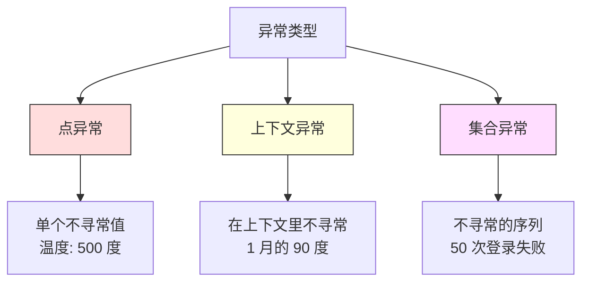
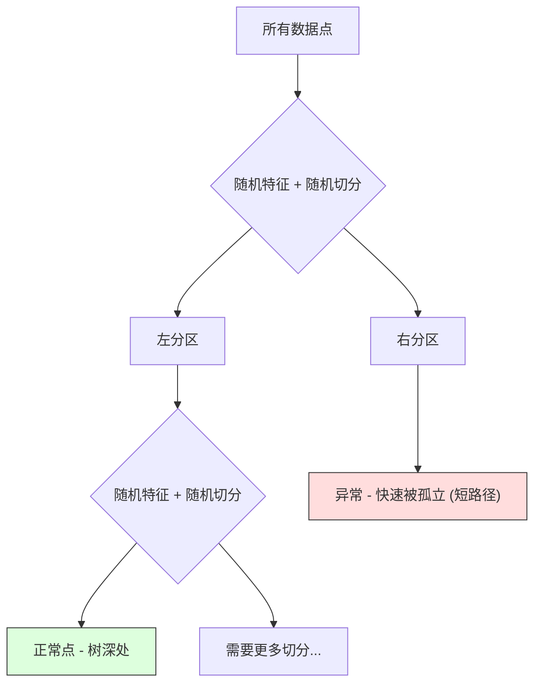

# 异常检测

> 正常容易定义,异常就是不符合的那个。

**Type:** Build
**Language:** Python
**Prerequisites:** Phase 2, Lessons 01-09
**Time:** ~75 分钟

## 学习目标

- 从零实现 Z-score、IQR、Isolation Forest 三种异常检测方法
- 区分点异常、上下文异常、集合异常,为每种选合适检测方法
- 解释为什么异常检测被框定为建模正常数据而不是分类异常
- 对比无监督异常检测和有监督分类,评估新型异常覆盖率和精确率之间的权衡

## 问题引入

信用卡在纽约下午 2 点被刷,然后 2:05 在东京又刷一次。工厂传感器读数 150 度而正常范围 80-120。服务器每秒发 50,000 个请求而日均才 200。

这些是异常。找到它们很重要。欺诈损失几十亿。设备故障损失停机时间。网络入侵损失数据。

挑战:你很少有标好的异常样本。欺诈占交易的 0.1%。设备故障一年几次。你没法训练标准分类器,因为“异常”类几乎没东西可学。就算你有些标签,你见过的异常也不是你将遇到的唯一类型。明天的欺诈手法跟今天不一样。

异常检测把问题反过来。不是学什么是异常,而是学什么是正常。任何偏离正常的都可疑。这不用标签,能适应新型异常,扩展到海量数据集。

## 核心概念

### 异常的类型

不是所有异常都一样:

- **点异常**。单个数据点,不管上下文都不寻常。一个 500 度的温度读数。一个平常花 $50 的账户突然 $50,000 的交易。
- **上下文异常**。一个数据点在它所处的上下文里不寻常。90 度在夏天正常,在冬天异常。同样的值,不同的上下文。
- **集合异常**。一组数据点作为一个整体不寻常,即使单个可能正常。五次登录失败正常。连续五十次就是暴力破解。

大多数方法检测点异常。上下文异常需要时间或位置特征。集合异常需要序列感知方法。



### 无监督的框架

标准分类里,两个类都有标签。异常检测里你通常有这三种情况之一:

1. **完全无监督**。完全没标签。在所有数据上 fit 检测器,希望异常足够少,不污染“正常”模型。
2. **半监督**。你有一份干净的纯正常数据。在这个干净集合上 fit,给其他打分。这是可能时最强的设置。
3. **弱监督**。你有一些标好的异常。用来评估,不训练。无监督训练,然后在标好子集上量精确率和召回率。

关键洞见:异常检测跟分类根本不同。你在建模正常数据的分布,而不是两个类之间的决策边界。

### 有监督 vs 无监督:权衡

如果你有标好的异常,应该拿它们去训练(有监督分类)还是只用来评估(无监督检测)?

**有监督(当分类处理):**
- 抓到你之前见过的异常类型
- 对已知异常类型精确率高
- 完全漏掉新型异常
- 新异常类型出现时要重训
- 需要足够的异常样本(通常太少)

**无监督(建模正常,标偏差):**
- 抓任何对正常的偏离,包括新型
- 不需要标好的异常
- 假阳性率高(不寻常的不都是坏的)
- 对分布漂移更鲁棒

实际中,最好的系统两者结合:无监督检测做广覆盖,有监督模型覆盖已知高优先级异常类型,模糊的让人来审。

### Z-score 方法

最简单。算每个特征的均值和标准差。标离均值超过 k 个标准差的点。

```text
z_score = (x - mean) / std
如果 |z_score| > threshold 就是异常
```

默认阈值是 3.0(正态分布下 99.7% 的正常数据落在 3 个标准差内)。

**强项:** 简单、快、可解释(“这个值离正常 4.5 个标准差”)。

**弱项:** 假设数据正态分布。对训练数据里的离群点敏感(离群点把均值拉走、把标准差撑大,让它们更难被发现)。在多峰分布上失效。

**什么时候好用:** 数据大致钟形的单特征监控。服务器响应时间、制造容差、基线稳定的传感器读数。

**什么时候失效:** 多簇数据(两个办公室有不同的基线温度)、偏态分布(交易金额里 $1000 稀少但不是异常)、训练集里有离群点。

### IQR 方法

比 Z-score 更鲁棒。用四分位距代替均值和标准差。

```
Q1 = 第 25 百分位
Q3 = 第 75 百分位
IQR = Q3 - Q1
下界 = Q1 - factor * IQR
上界 = Q3 + factor * IQR
如果 x < 下界 或 x > 上界 就是异常
```

默认 factor 是 1.5。

**强项:** 对离群点鲁棒(百分位不受极端值影响)。能用偏态分布。不要求正态。

**弱项:** 只单变量(对每特征独立)。抓不到只在特征组合下才不寻常的异常(一个点在每特征单独都正常但联合空间里异常)。

**实操提示:** IQR 里 1.5 factor 对应箱线图的须。在须之外的点是潜在离群。用 3.0 代替 1.5 让检测器更保守(少标记、少假阳)。对的 factor 取决于你对误报的容忍度。

### Isolation Forest

关键洞见:异常少且不同。在数据的随机切分里,异常更容易被孤立——它们需要的随机切分更少就能跟其他分开。



**怎么工作:**
1. 搭很多随机树(一棵隔离森林)
2. 在每个节点,随机选一个特征和该特征 min/max 之间的一个随机切分值
3. 一直切直到每个点都被孤立(在自己的叶子)
4. 异常在所有树上有更短的平均路径长度

**为什么 work:** 正常点住在稠密区。需要很多随机切分才能把它跟邻居分开。异常住在稀疏区。一两个随机切分就够。

异常分数基于所有树的平均路径长度,按随机二叉搜索树的期望路径长度归一化:

```
score(x) = 2^(-average_path_length(x) / c(n))
```

`c(n)` 是 n 个样本的期望路径长度。分数接近 1 是异常。接近 0.5 是正常。接近 0 非常正常(在稠密簇深处)。

**强项:** 没分布假设。能在高维工作。扩展性好(对样本量次线性,因为每棵树用子样本)。处理混合特征类型。

**弱项:** 在稠密区里的异常吃力(掩蔽效应)。很多不相关特征时随机切分效率低。

**关键超参:**
- `n_estimators`:树数。100 通常够。更多树分数更稳定但更慢。
- `max_samples`:每棵树的样本数。原论文默认 256。越小单棵树越不准但多样性越高。子采样是 Isolation Forest 快的原因——每棵树只看一小片数据。
- `contamination`:异常占比。仅用于设阈值。不影响分数本身。

### 局部离群因子 (LOF)

LOF 比较一个点周围的局部密度跟它邻居的密度。在稠密区被稀疏区包围的点异常。

**怎么工作:**
1. 对每个点,找它的 k 近邻
2. 算局部可达密度(邻域多稠)
3. 比较每个点的密度跟它邻居的密度
4. 一个点如果密度远低于邻居,就是离群

**LOF 分数:**
- LOF 接近 1.0:跟邻居密度类似(正常)
- LOF 大于 1.0:密度比邻居低(可能异常)
- LOF 远大于 1.0(比如 2.0+):密度显著低于邻居(很可能异常)

“局部”这部分很关键。考虑一个数据集两簇:一簇 1000 点的稠密簇,一簇 50 点的稀疏簇。稀疏簇边缘的点全局看不异常——它有 50 个邻居。但它局部不寻常,如果它紧邻的邻居比它稠密。LOF 抓到了这种全局方法漏掉的细微差别。

**强项:** 检测局部异常(在邻域里不寻常的点,即使全局不异常)。能处理密度不同的簇。

**弱项:** 大数据集慢(朴素实现 O(n²))。对 k 选择敏感。很高维度下不行(维度灾难影响距离计算)。

### 对比

| 方法 | 假设 | 速度 | 处理高维 | 检测局部异常 |
|------|------|------|---------|------------|
| Z-score | 正态分布 | 极快 | 是(每特征) | 否 |
| IQR | 无(每特征) | 极快 | 是(每特征) | 否 |
| Isolation Forest | 无 | 快 | 是 | 部分 |
| LOF | 距离有意义 | 慢 | 差 | 是 |

### 评估的挑战

评估异常检测器比评估分类器难:

- **极端不平衡**。0.1% 异常时,全预测“正常”有 99.9% 准确率。准确率没用。
- **AUROC 会骗人**。在严重不平衡下,即使模型在实际阈值下漏了大部分异常,AUROC 也能看起来不错。
- **更好的指标:** Precision@k(前 k 个标记的中,多少真异常)、AUPRC(PR 曲线下面积)、固定假阳性率下的召回率。


### 异常检测流水线

实际中异常检测按这个流程:

1. **收集基线数据**。理想情况是确认没(或很少)异常的一段时间。
2. **特征工程**。原始特征加派生特征(滚动统计、时间特征、比率)。
3. **训练检测器**。在基线数据上 fit。模型学“正常”长什么样。
4. **给新数据打分**。每个新观测拿到一个异常分数。
5. **选阈值**。选分数切分点。这是业务决策:阈值高 = 少误报但多漏报。
6. **告警和调查**。标好的点走人工审查或自动响应。
7. **反馈收集**。记录标记项到底真异常还是误报。用这些数据评估检测器并随时间调阈值。

流水线永远不“完”。分布漂移、新型异常出现、阈值要调。把异常检测当活的系统,不是一次性模型。

## 从零实现

`code/anomaly_detection.py` 从零实现 Z-score、IQR、Isolation Forest。

### Z-score 检测器

```python
def zscore_detect(X, threshold=3.0):
    mean = X.mean(axis=0)
    std = X.std(axis=0)
    std[std == 0] = 1.0
    z = np.abs((X - mean) / std)
    return z.max(axis=1) > threshold
```

简单且矢量化。只要任一特征超阈值就标。

### IQR 检测器

```python
def iqr_detect(X, factor=1.5):
    q1 = np.percentile(X, 25, axis=0)
    q3 = np.percentile(X, 75, axis=0)
    iqr = q3 - q1
    iqr[iqr == 0] = 1.0
    lower = q1 - factor * iqr
    upper = q3 + factor * iqr
    outside = (X < lower) | (X > upper)
    return outside.any(axis=1)
```

### 从零实现 Isolation Forest

从零实现随机切分特征空间搭出隔离树:

```python
class IsolationTree:
    def __init__(self, max_depth):
        self.max_depth = max_depth

    def fit(self, X, depth=0):
        n, p = X.shape
        if depth >= self.max_depth or n <= 1:
            self.is_leaf = True
            self.size = n
            return self
        self.is_leaf = False
        self.feature = np.random.randint(p)
        x_min = X[:, self.feature].min()
        x_max = X[:, self.feature].max()
        if x_min == x_max:
            self.is_leaf = True
            self.size = n
            return self
        self.threshold = np.random.uniform(x_min, x_max)
        left_mask = X[:, self.feature] < self.threshold
        self.left = IsolationTree(self.max_depth).fit(X[left_mask], depth + 1)
        self.right = IsolationTree(self.max_depth).fit(X[~left_mask], depth + 1)
        return self
```

把一个点孤立起来的路径长度决定它的异常分数。路径越短越异常。

`IsolationForest` 类包装多棵树:

```python
class IsolationForest:
    def __init__(self, n_estimators=100, max_samples=256, seed=42):
        self.n_estimators = n_estimators
        self.max_samples = max_samples

    def fit(self, X):
        sample_size = min(self.max_samples, X.shape[0])
        max_depth = int(np.ceil(np.log2(sample_size)))
        for _ in range(self.n_estimators):
            idx = rng.choice(X.shape[0], size=sample_size, replace=False)
            tree = IsolationTree(max_depth=max_depth)
            tree.fit(X[idx])
            self.trees.append(tree)

    def anomaly_score(self, X):
        avg_path = average path length across all trees
        scores = 2.0 ** (-avg_path / c(max_samples))
        return scores
```

归一化因子 `c(n)` 是 n 元素二叉搜索树里一次不成功搜索的期望路径长度。它等于 `2 * H(n-1) - 2*(n-1)/n`,其中 H 是调和数。这个归一化保证分数在不同规模数据集之间可比。

### Demo 场景

代码生成多个测试场景:

1. **单簇带离群点**。2 维高斯簇,远处注入异常。所有方法在这里都该 work。
2. **多峰数据**。三个大小和密度不同的簇。簇之间的点异常。Z-score 难,因为每特征的范围很宽。
3. **高维数据**。50 个特征,但异常只在其中 5 个上不同。测试方法能不能在特征子集里找到异常。

每个 demo 用精确率、召回率、F1、Precision@k 对比所有方法。

## 拿来用

用 sklearn(用库实现,不是从零):

```python
from sklearn.ensemble import IsolationForest
from sklearn.neighbors import LocalOutlierFactor

iso = IsolationForest(n_estimators=100, contamination=0.05, random_state=42)
iso.fit(X_train)
predictions = iso.predict(X_test)

lof = LocalOutlierFactor(n_neighbors=20, contamination=0.05, novelty=True)
lof.fit(X_train)
predictions = lof.predict(X_test)
```

注意 `contamination` 设定异常占比期望。设对了很重要——太低漏异常,太高造成误报。

`anomaly_detection.py` 里的代码在同一数据上对比从零实现跟 sklearn。

### sklearn 的 Contamination 参数

sklearn 里 `contamination` 决定把连续异常分数转成二值预测的阈值。它不改底层分数。

```python
iso_5 = IsolationForest(contamination=0.05)
iso_10 = IsolationForest(contamination=0.10)
```

两个产出同样的异常分数。但 `iso_5` 标前 5%,`iso_10` 标前 10%。如果你不知道真实异常率(你通常不知道),把 contamination 设成 “auto”,直接用原始分数。根据假阳和假阴的代价权衡自己设阈值。

### One-Class SVM

另一个值得知道的无监督异常检测器。One-Class SVM 在高维特征空间里(用核技巧)给正常数据拟合一个边界。

```python
from sklearn.svm import OneClassSVM

oc_svm = OneClassSVM(kernel="rbf", gamma="auto", nu=0.05)
oc_svm.fit(X_train)
predictions = oc_svm.predict(X_test)
```

`nu` 参数近似异常占比。One-Class SVM 在中小数据集上表现好,但不能扩展到很大数据(核矩阵平方增长)。

### 自编码器方法(预告)

自编码器是学习压缩和重建数据的神经网络。在正常数据上训练。测试时,异常有高重建误差,因为网络只学了重建正常模式。

这块 Phase 3(深度学习)讲,但原理一样:建模正常,标偏差。

### 集成异常检测

跟集成方法改进分类一样(Lesson 11),组合多个异常检测器改进检测。最简单的方法:

1. 跑多个检测器(Z-score、IQR、Isolation Forest、LOF)
2. 把每个检测器的分数归一到 [0, 1]
3. 平均归一后的分数
4. 标平均分数超阈值的点

这降低假阳,因为不同方法有不同的失败模式。被四种方法都标的点几乎肯定是异常。只被一种标的可能是那个方法的怪癖。

更复杂的集成按估计的可靠性(在有已知异常的验证集上量的,如果可用)给每个检测器加权。

### 生产考量

1. **阈值漂移**。数据分布漂移时,固定阈值就过时了。监控异常分数分布,定期调。
2. **告警疲劳**。太多误报,操作员就不看了。先用高阈值(少而可靠的告警),等信任建立了再降。
3. **集成方法**。生产里组合多个检测器。只在多个方法一致同意异常时才标。这大幅降低假阳。
4. **特征工程**。原始特征很少够。加滚动统计、比率、自上次事件以来时间、领域特定特征。好特征比选哪个检测器更重要。
5. **反馈循环**。操作员调查标记项、确认或否决时,把反馈喂回系统。随时间积累有标签数据来评估改进检测器。

## 交付物

本课产出:
- `outputs/skill-anomaly-detector.md` —— 一个帮你选对检测器的决策 skill
- `code/anomaly_detection.py` —— 从零的 Z-score、IQR、Isolation Forest,带 sklearn 对比

### 选阈值

异常分数是连续的。你需要阈值做二值决策。这是业务决策,不是技术决策。

考虑两个场景:
- **欺诈检测**。漏掉欺诈贵(退单、客户信任)。误报让人花 5 分钟查。把阈值设低,抓更多欺诈,接受更多误报。
- **设备维护**。误报意味着不必要停机损失 $50,000。漏报意味着 $500,000 的维修。设阈值平衡这两个成本。

两种情况下最优阈值取决于假阳和假阴的代价比。画不同阈值下的精确率和召回率,把成本函数叠上去,挑成本最小点。

### 扩展到生产

实时生产异常检测:

1. **批训练,在线打分**。定期(每天、每周)在最近的正常数据上训。新观测到达时打分。
2. **特征计算必须匹配**。如果你训时用 30 天滚动统计,新观测需要 30 天历史算特征。缓存所需历史。
3. **分数分布监控**。跟踪异常分数分布随时间变化。如果中位数分数漂移上去,要么数据在变,要么模型过时。
4. **可解释性**。当你标一个异常,说清为什么。Z-score:“特征 X 离正常 4.2 个标准差”。Isolation Forest:“这个点平均 3.1 切分就被孤立(正常点平均 8.5)”。

## 练习

1. **阈值调优**。Z-score 检测器用 1.0 到 5.0 步长 0.5 的阈值跑。画每个阈值下的精确率和召回率。你的数据的最优点在哪?

2. **多变量异常**。造 2 维数据,每特征单独看都正常,但组合异常(比如离主簇对角线远的点)。展示每特征 Z-score 漏掉这些但 Isolation Forest 抓到。

3. **从零实现 LOF**。用 k 近邻实现 Local Outlier Factor。在同一数据上跟 sklearn 的 LocalOutlierFactor 对比。用 k=10 和 k=50,k 选择怎么影响结果?

4. **流式异常检测**。改 Z-score 检测器在流式设置下工作:新点到达时更新运行均值和方差(Welford 在线算法)。在同一数据上跟批量 Z-score 比。

5. **真实世界评估**。拿一个有已知异常的数据集(Kaggle 信用卡欺诈)。用 precision@100、precision@500、AUPRC 评估四种方法。哪个最好?为什么?

## 关键术语

| 术语 | 大家常说的 | 实际含义 |
|------|-----------|---------|
| Anomaly | "离群点, 不寻常的点" | 偏离正常数据期望模式的数据点 |
| Point anomaly | "单个奇怪的值" | 单个观测,不管上下文都不寻常 |
| Contextual anomaly | "正常值,错的上下文" | 在上下文(时间、位置等)里不寻常的观测,换个上下文可能正常 |
| Isolation Forest | "随机切分找离群" | 随机树集成,用比正常点更少的切分孤立异常 |
| Local Outlier Factor | "跟邻居比密度" | 标局部密度远低于邻居的点 |
| Z-score | "离均值几个标准差" | (x - mean) / std,衡量一个点离中心几个标准差 |
| IQR | "四分位距" | Q3 - Q1,衡量中间 50% 数据的扩散,用于鲁棒离群检测 |
| Contamination | "异常占比期望" | 超参,告诉检测器数据里应该标多少比例的异常 |
| Precision@k | "前 k 个标的中多少真" | 只对最可疑的 k 个点算的精确率,不平衡异常检测有用 |
| AUPRC | "PR 曲线下面积" | 跨所有阈值的精确率-召回率性能总结,不平衡数据上比 AUROC 好 |

## 延伸阅读

- [Liu et al., Isolation Forest (2008)](https://cs.nju.edu.cn/zhouzh/zhouzh.files/publication/icdm08b.pdf) —— Isolation Forest 原始论文
- [Breunig et al., LOF: Identifying Density-Based Local Outliers (2000)](https://dl.acm.org/doi/10.1145/342009.335388) —— LOF 原始论文
- [scikit-learn Outlier Detection docs](https://scikit-learn.org/stable/modules/outlier_detection.html) —— sklearn 所有异常检测器总览
- [Chandola et al., Anomaly Detection: A Survey (2009)](https://dl.acm.org/doi/10.1145/1541880.1541882) —— 异常检测方法的综合综述
- [Goldstein and Uchida, A Comparative Evaluation of Unsupervised Anomaly Detection Algorithms (2016)](https://journals.plos.org/plosone/article?id=10.1371/journal.pone.0152173) —— 10 种方法在真实数据集上的实证对比