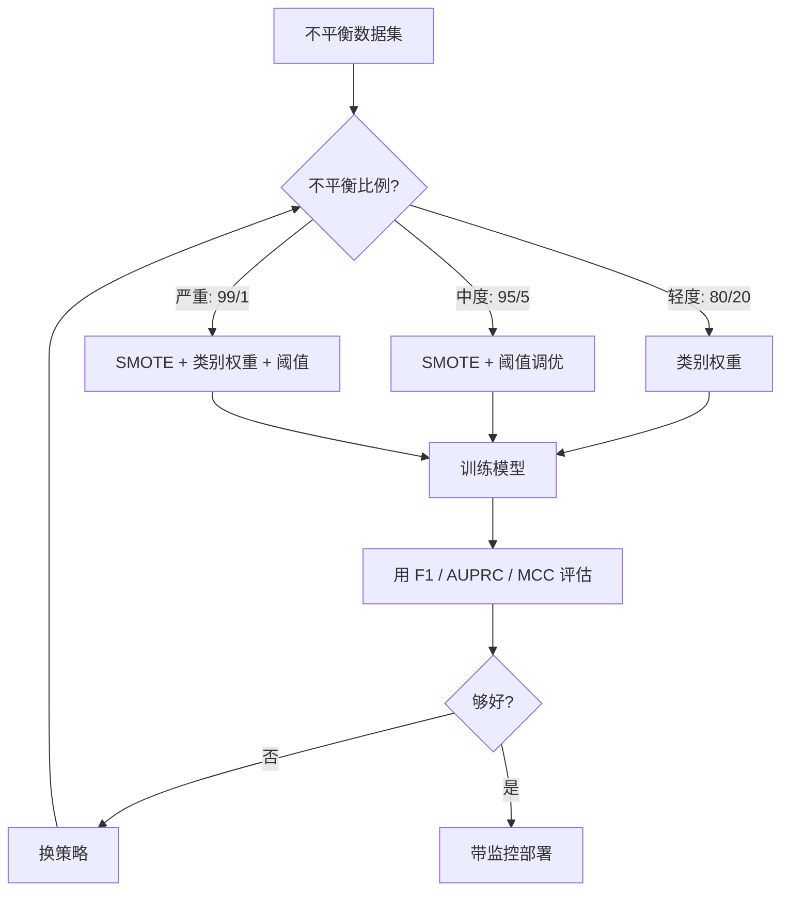
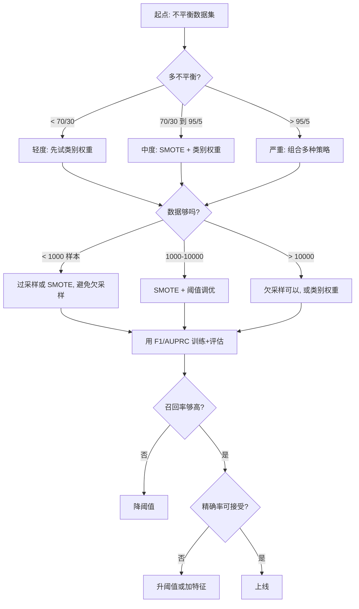

# 处理不平衡数据

> 当 99% 的数据是“正常”时,准确率是个谎言。

**Type:** Build
**Language:** Python
**Prerequisites:** Phase 2, Lessons 01-09 (尤其是评估指标)
**Time:** ~90 分钟

## 学习目标

- 从零实现 SMOTE,解释合成过采样跟随机复制的不同
- 用 F1、AUPRC、Matthews 相关系数代替准确率评估不平衡分类器
- 对比类别权重、阈值调优、重采样策略,为给定不平衡比例选对路
- 搭一个完整不平衡数据流水线,把 SMOTE、类别权重、阈值优化组合起来

## 问题引入

你搭了个欺诈检测模型。准确率 99.9%。你庆祝。然后你意识到它对每一笔交易都预测“正常”。

这不是 bug。这是只有 0.1% 交易是欺诈时的合理选择。模型学到永远猜多数类能让总误差最小。它技术上对,但完全没用。

真实分类重要的地方都这样。疾病诊断:1% 阳性率。网络入侵:0.01% 攻击。制造缺陷:0.5% 次品。垃圾邮件过滤:20% 垃圾。客户流失预测:5% 流失者。少数类越重要,往往越稀有。

准确率不行,是因为它把所有正确预测一视同仁。正确标一笔合法交易和正确抓到一笔欺诈都算一个准确率点。但抓欺诈才是模型存在的全部理由。我们需要指标、技术、训练策略,逼模型关注那个稀有但重要的类。

## 核心概念

### 为什么准确率不行

考虑 1000 个样本的数据集:990 负,10 正。一个永远预测负的模型:

|  | 预测正 | 预测负 |
|--|-------|-------|
| 实际正 | 0 (TP) | 10 (FN) |
| 实际负 | 0 (FP) | 990 (TN) |

准确率 = (0 + 990) / 1000 = 99.0%

模型一个欺诈没抓到。一个病没抓到。一个次品没抓到。但准确率说 99%。这就是为什么准确率对不平衡问题很危险。

### 更好的指标

**精确率** = TP / (TP + FP)。所有标为正的中,真的正的有多少?精确率高意味着少误报。

**召回率** = TP / (TP + FN)。所有实际为正的中,我们抓到了多少?召回率高意味着少漏报。

**F1 分数** = 2 * 精确率 * 召回率 / (精确率 + 召回率)。调和平均。比算术平均更重罚精确率和召回率之间的极端不平衡。

**F-beta 分数** = (1 + beta²) * 精确率 * 召回率 / (beta² * 精确率 + 召回率)。beta > 1 时召回率更重要,beta < 1 时精确率更重要。F2 在欺诈检测里常见(漏欺诈比误报警更糟)。

**AUPRC**(精确率-召回率曲线下面积)。像 AUC-ROC 但对不平衡数据更有信息量。随机分类器的 AUPRC 等于正类比例(不是 ROC 的 0.5)。这让改进更容易看见。

**Matthews 相关系数** = (TP * TN - FP * FN) / sqrt((TP+FP)(TP+FN)(TN+FP)(TN+FN))。范围从 -1 到 +1。只有当模型在两个类上都好时才给高分。类大小差异很大时也平衡。

对上面“永远预测负”的模型:精确率 = 0/0(未定义,常设 0),召回率 = 0/10 = 0,F1 = 0,MCC = 0。这些指标正确地指出模型毫无价值。

### 不平衡数据流水线



### SMOTE:合成少数类过采样技术

随机过采样复制已有少数样本。能用,但因为模型反复看同样的点,有过拟合风险。

SMOTE 创造新的合成少数样本,合理但不复制。算法:

1. 对每个少数样本 x,在其他少数样本里找它的 k 近邻
2. 随机挑一个邻居
3. 在 x 和那个邻居之间的线段上造一个新样本

公式: `new_sample = x + random(0, 1) * (neighbor - x)`

这在真实少数点之间插值,在同一片特征空间里造样本,而不是复制已有数据。


### 采样策略对比

**随机过采样**:复制少数样本到匹配多数。
- 优点:简单,无信息损失
- 缺点:完全复制引起过拟合,增加训练时间

**随机欠采样**:删多数样本到匹配少数。
- 优点:训练快,简单
- 缺点:丢掉可能有用的多数数据,方差高

**SMOTE**:通过插值创造合成少数样本。
- 优点:生成新数据点,比随机过采样减少过拟合
- 缺点:可能在决策边界附近造出噪声样本,不照顾多数类分布

| 策略 | 数据变了 | 风险 | 何时用 |
|------|---------|------|--------|
| 过采样 | 少数被复制 | 过拟合 | 小数据集,中等不平衡 |
| 欠采样 | 多数被删 | 信息损失 | 大数据集,想要快训练 |
| SMOTE | 少数合成样本被加 | 边界噪声 | 中等不平衡,少数样本够 k-NN |

### 类别权重

不改数据,改模型对待错误的方式。给少数类误分更高权重。

二元问题,950 负 50 正:
- 负类权重 = n_samples / (2 * n_negative) = 1000 / (2 * 950) = 0.526
- 正类权重 = n_samples / (2 * n_positive) = 1000 / (2 * 50) = 10.0

正类拿到 19 倍权重。误分一个正样本的代价等于误分 19 个负样本。模型被迫关注少数类。

在逻辑回归里,这改损失函数:

```
weighted_loss = -sum(w_i * [y_i * log(p_i) + (1-y_i) * log(1-p_i)])
```

w_i 取决于样本 i 的类别。

类别权重在数学期望上等价于过采样,但不创造新数据点。这让它们更快,避免了复制样本的过拟合风险。

### 阈值调优

大多数分类器输出概率。默认阈值是 0.5:P(正) >= 0.5 就预测正。但 0.5 是武断的。类不平衡时,最优阈值通常低得多。

流程:
1. 训模型
2. 在验证集上拿预测概率
3. 阈值从 0.0 扫到 1.0
4. 在每个阈值下算 F1(或你选的指标)
5. 挑最大化你指标的那个阈值


模型可能对一笔欺诈交易输出 P(欺诈) = 0.15。阈值 0.5 时,这个被分到非欺诈。阈值 0.10 时,被正确抓到。概率校准没排名重要——只要欺诈拿到的概率比非欺诈高,就存在一个阈值分开它们。

### 代价敏感学习

类别权重的推广。不给统一代价,给具体的误分代价:

|  | 预测正 | 预测负 |
|--|-------|-------|
| 实际正 | 0 (对) | C_FN = 100 |
| 实际负 | C_FP = 1 | 0 (对) |

漏一笔欺诈交易(FN)代价是误报(FP)的 100 倍。模型优化总代价,不是总错误数。

能估计真实世界代价时,这是最有原则的方法。漏一次癌症诊断跟误报警导致一次额外活检,代价天差地别。把这些代价显式化,逼出对的权衡。

### 决策流程图



```figure
class-imbalance
```

## 从零实现

### Step 1:生成不平衡数据集

```python
import numpy as np


def make_imbalanced_data(n_majority=950, n_minority=50, seed=42):
    rng = np.random.RandomState(seed)

    X_maj = rng.randn(n_majority, 2) * 1.0 + np.array([0.0, 0.0])
    X_min = rng.randn(n_minority, 2) * 0.8 + np.array([2.5, 2.5])

    X = np.vstack([X_maj, X_min])
    y = np.concatenate([np.zeros(n_majority), np.ones(n_minority)])

    shuffle_idx = rng.permutation(len(y))
    return X[shuffle_idx], y[shuffle_idx]
```

### Step 2:从零实现 SMOTE

```python
def euclidean_distance(a, b):
    return np.sqrt(np.sum((a - b) ** 2))


def find_k_neighbors(X, idx, k):
    distances = []
    for i in range(len(X)):
        if i == idx:
            continue
        d = euclidean_distance(X[idx], X[i])
        distances.append((i, d))
    distances.sort(key=lambda x: x[1])
    return [d[0] for d in distances[:k]]


def smote(X_minority, k=5, n_synthetic=100, seed=42):
    rng = np.random.RandomState(seed)
    n_samples = len(X_minority)
    k = min(k, n_samples - 1)
    synthetic = []

    for _ in range(n_synthetic):
        idx = rng.randint(0, n_samples)
        neighbors = find_k_neighbors(X_minority, idx, k)
        neighbor_idx = neighbors[rng.randint(0, len(neighbors))]
        t = rng.random()
        new_point = X_minority[idx] + t * (X_minority[neighbor_idx] - X_minority[idx])
        synthetic.append(new_point)

    return np.array(synthetic)
```

### Step 3:随机过采样和欠采样

```python
def random_oversample(X, y, seed=42):
    rng = np.random.RandomState(seed)
    classes, counts = np.unique(y, return_counts=True)
    max_count = counts.max()

    X_resampled = list(X)
    y_resampled = list(y)

    for cls, count in zip(classes, counts):
        if count < max_count:
            cls_indices = np.where(y == cls)[0]
            n_needed = max_count - count
            chosen = rng.choice(cls_indices, size=n_needed, replace=True)
            X_resampled.extend(X[chosen])
            y_resampled.extend(y[chosen])

    X_out = np.array(X_resampled)
    y_out = np.array(y_resampled)
    shuffle = rng.permutation(len(y_out))
    return X_out[shuffle], y_out[shuffle]


def random_undersample(X, y, seed=42):
    rng = np.random.RandomState(seed)
    classes, counts = np.unique(y, return_counts=True)
    min_count = counts.min()

    X_resampled = []
    y_resampled = []

    for cls in classes:
        cls_indices = np.where(y == cls)[0]
        chosen = rng.choice(cls_indices, size=min_count, replace=False)
        X_resampled.extend(X[chosen])
        y_resampled.extend(y[chosen])

    X_out = np.array(X_resampled)
    y_out = np.array(y_resampled)
    shuffle = rng.permutation(len(y_out))
    return X_out[shuffle], y_out[shuffle]
```

### Step 4:带类别权重的逻辑回归

```python
def sigmoid(z):
    return 1.0 / (1.0 + np.exp(-np.clip(z, -500, 500)))


def logistic_regression_weighted(X, y, weights, lr=0.01, epochs=200):
    n_samples, n_features = X.shape
    w = np.zeros(n_features)
    b = 0.0

    for _ in range(epochs):
        z = X @ w + b
        pred = sigmoid(z)
        error = pred - y
        weighted_error = error * weights

        gradient_w = (X.T @ weighted_error) / n_samples
        gradient_b = np.mean(weighted_error)

        w -= lr * gradient_w
        b -= lr * gradient_b

    return w, b


def compute_class_weights(y):
    classes, counts = np.unique(y, return_counts=True)
    n_samples = len(y)
    n_classes = len(classes)
    weight_map = {}
    for cls, count in zip(classes, counts):
        weight_map[cls] = n_samples / (n_classes * count)
    return np.array([weight_map[yi] for yi in y])
```

### Step 5:阈值调优

```python
def find_optimal_threshold(y_true, y_probs, metric="f1"):
    best_threshold = 0.5
    best_score = -1.0

    for threshold in np.arange(0.05, 0.96, 0.01):
        y_pred = (y_probs >= threshold).astype(int)
        tp = np.sum((y_pred == 1) & (y_true == 1))
        fp = np.sum((y_pred == 1) & (y_true == 0))
        fn = np.sum((y_pred == 0) & (y_true == 1))

        if metric == "f1":
            precision = tp / (tp + fp) if (tp + fp) > 0 else 0.0
            recall = tp / (tp + fn) if (tp + fn) > 0 else 0.0
            score = 2 * precision * recall / (precision + recall) if (precision + recall) > 0 else 0.0
        elif metric == "recall":
            score = tp / (tp + fn) if (tp + fn) > 0 else 0.0
        elif metric == "precision":
            score = tp / (tp + fp) if (tp + fp) > 0 else 0.0

        if score > best_score:
            best_score = score
            best_threshold = threshold

    return best_threshold, best_score
```

### Step 6:评估函数

```python
def confusion_matrix_values(y_true, y_pred):
    tp = np.sum((y_pred == 1) & (y_true == 1))
    tn = np.sum((y_pred == 0) & (y_true == 0))
    fp = np.sum((y_pred == 1) & (y_true == 0))
    fn = np.sum((y_pred == 0) & (y_true == 1))
    return tp, tn, fp, fn


def compute_metrics(y_true, y_pred):
    tp, tn, fp, fn = confusion_matrix_values(y_true, y_pred)
    accuracy = (tp + tn) / (tp + tn + fp + fn)
    precision = tp / (tp + fp) if (tp + fp) > 0 else 0.0
    recall = tp / (tp + fn) if (tp + fn) > 0 else 0.0
    f1 = 2 * precision * recall / (precision + recall) if (precision + recall) > 0 else 0.0

    denom = np.sqrt(float((tp + fp) * (tp + fn) * (tn + fp) * (tn + fn)))
    mcc = (tp * tn - fp * fn) / denom if denom > 0 else 0.0

    return {
        "accuracy": accuracy,
        "precision": precision,
        "recall": recall,
        "f1": f1,
        "mcc": mcc,
    }
```

### Step 7:对比所有方法

```python
X, y = make_imbalanced_data(950, 50, seed=42)
split = int(0.8 * len(y))
X_train, X_test = X[:split], X[split:]
y_train, y_test = y[:split], y[split:]

# 基线: 不处理
w_base, b_base = logistic_regression_weighted(
    X_train, y_train, np.ones(len(y_train)), lr=0.1, epochs=300
)
probs_base = sigmoid(X_test @ w_base + b_base)
preds_base = (probs_base >= 0.5).astype(int)

# 过采样
X_over, y_over = random_oversample(X_train, y_train)
w_over, b_over = logistic_regression_weighted(
    X_over, y_over, np.ones(len(y_over)), lr=0.1, epochs=300
)
preds_over = (sigmoid(X_test @ w_over + b_over) >= 0.5).astype(int)

# SMOTE
minority_mask = y_train == 1
X_minority = X_train[minority_mask]
synthetic = smote(X_minority, k=5, n_synthetic=len(y_train) - 2 * int(minority_mask.sum()))
X_smote = np.vstack([X_train, synthetic])
y_smote = np.concatenate([y_train, np.ones(len(synthetic))])
w_sm, b_sm = logistic_regression_weighted(
    X_smote, y_smote, np.ones(len(y_smote)), lr=0.1, epochs=300
)
preds_smote = (sigmoid(X_test @ w_sm + b_sm) >= 0.5).astype(int)

# 类别权重
sample_weights = compute_class_weights(y_train)
w_cw, b_cw = logistic_regression_weighted(
    X_train, y_train, sample_weights, lr=0.1, epochs=300
)
probs_cw = sigmoid(X_test @ w_cw + b_cw)
preds_cw = (probs_cw >= 0.5).astype(int)

# 阈值调优 (在留出的验证集上调, 不是测试集)
probs_val = sigmoid(X_val @ w_cw + b_cw)
best_thresh, best_f1 = find_optimal_threshold(y_val, probs_val, metric="f1")
preds_thresh = (probs_cw >= best_thresh).astype(int)
```

代码文件在一个脚本里跑全部这些并打印结果。

## 拿来用

用 scikit-learn 和 imbalanced-learn,这些技术都是一行调用:

```python
from sklearn.linear_model import LogisticRegression
from sklearn.metrics import classification_report, f1_score
from sklearn.model_selection import train_test_split
from imblearn.over_sampling import SMOTE
from imblearn.under_sampling import RandomUnderSampler
from imblearn.pipeline import Pipeline

X_train, X_test, y_train, y_test = train_test_split(X, y, stratify=y)

model_weighted = LogisticRegression(class_weight="balanced")
model_weighted.fit(X_train, y_train)
print(classification_report(y_test, model_weighted.predict(X_test)))

smote = SMOTE(random_state=42)
X_resampled, y_resampled = smote.fit_resample(X_train, y_train)
model_smote = LogisticRegression()
model_smote.fit(X_resampled, y_train)
print(classification_report(y_test, model_smote.predict(X_test)))

pipeline = Pipeline([
    ("smote", SMOTE()),
    ("model", LogisticRegression(class_weight="balanced")),
])
pipeline.fit(X_train, y_train)
print(classification_report(y_test, pipeline.predict(X_test)))
```

从零实现让你看清每种技术在干嘛。SMOTE 就是少数类上的 k-NN 插值。类别权重乘损失。阈值调优是对切分点的 for 循环。没魔法。

## 交付物

本课产出:
- `outputs/skill-imbalanced-data.md` —— 处理不平衡分类问题的决策清单

## 练习

1. **Borderline-SMOTE**:改 SMOTE 实现,只为靠近决策边界的少数点造合成样本(那些 k 近邻含多数类样本的点)。在类有重叠的数据集上跟标准 SMOTE 比结果。

2. **代价矩阵优化**:实现代价敏感学习,代价矩阵是参数。写一个函数拿代价矩阵返回最小期望代价的最优预测。用不同代价比(1:10、1:100、1:1000)测,画精确率-召回率权衡怎么变。

3. **阈值校准**:实现 Platt scaling(在模型原始输出上拟合一个逻辑回归产出校准过的概率)。对比校准前后的精确率-召回率曲线。展示校准不改排名(AUC 不变),但让概率更有意义。

4. **平衡 bagging 集成**:训多个模型,每个在平衡自助样本上(全少数 + 多数随机子集)。平均预测。跟单个带 SMOTE 的模型比。同时量性能和跨多次运行的方差。

5. **不平衡比例实验**:拿一个平衡数据集,逐渐增加不平衡比例(50/50、70/30、90/10、95/5、99/1)。每个比例下带和不带 SMOTE 训练。画两种方法的 F1 对不平衡比例。SMOTE 在什么比例开始有显著差异?

## 关键术语

| 术语 | 大家常说的 | 实际含义 |
|------|-----------|---------|
| Class imbalance | "一个类样本多很多" | 数据集类分布显著偏斜,模型偏袒多数类 |
| SMOTE | "合成过采样" | 通过在已有少数样本和它们的 k 近邻少数样本之间插值创造新少数样本 |
| Class weights | "让稀有类的错更贵" | 在损失函数上乘类特定权重,模型对少数误分惩罚更重 |
| Threshold tuning | "移决策边界" | 把分类概率切分从默认 0.5 改成优化目标指标的某值 |
| Precision-recall tradeoff | "两个不能兼得" | 降阈值抓更多正(高召回),但也标更多假正(低精确),反之亦然 |
| AUPRC | "PR 曲线下面积" | 把精确率-召回率曲线总结成一个数;类严重不平衡时比 AUC-ROC 更有信息量 |
| Matthews Correlation Coefficient | "平衡的指标" | 预测和实际标签的相关,只有模型在两个类上都好时才给高分 |
| Cost-sensitive learning | "不同错代价不同" | 把真实世界误分代价纳入训练目标,模型优化总代价而非错误数 |
| Random oversampling | "复制少数类" | 重复少数类样本平衡类数;简单但有对复制点过拟合的风险 |

## 延伸阅读

- [SMOTE: Synthetic Minority Over-sampling Technique (Chawla et al., 2002)](https://arxiv.org/abs/1106.1813) —— SMOTE 原始论文,不平衡学习被引最多的工作
- [Learning from Imbalanced Data (He & Garcia, 2009)](https://ieeexplore.ieee.org/document/5128907) —— 覆盖采样、代价敏感、算法方法的综合综述
- [imbalanced-learn documentation](https://imbalanced-learn.org/stable/) —— Python 库,带 SMOTE 变体、欠采样策略和流水线集成
- [The Precision-Recall Plot Is More Informative than the ROC Plot (Saito & Rehmsmeier, 2015)](https://journals.plos.org/plosone/article?id=10.1371/journal.pone.0118432) —— 什么时候为什么 PR 曲线优于 ROC 曲线