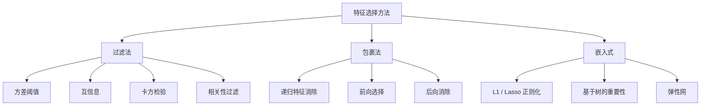
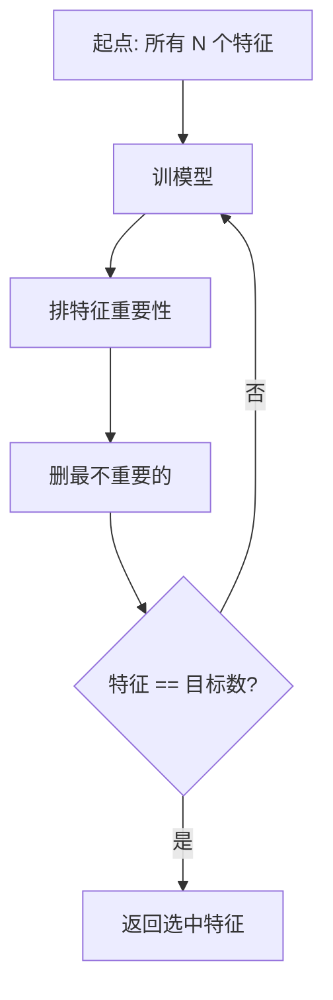
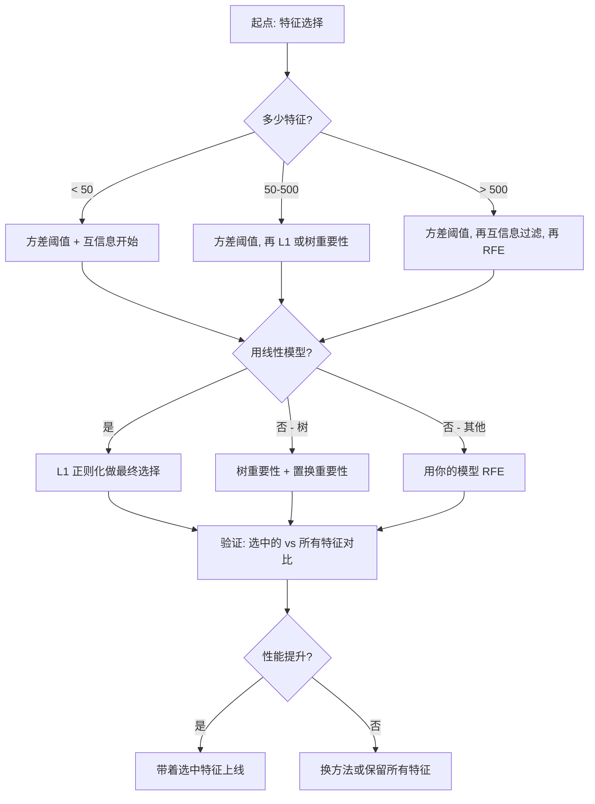

# 特征选择

> 特征多不一定好。对的特征才好。

**Type:** Build
**Language:** Python
**Prerequisites:** Phase 2, Lessons 01-09, 08 (特征工程)
**Time:** ~75 分钟

## 学习目标

- 从零实现过滤法(方差阈值、互信息、卡方)和包裹法(RFE、前向选择)
- 解释为什么互信息能抓相关抓不到的非线性特征-目标关系
- 对比 L1 正则化(嵌入式)和 RFE(包裹式),评估它们的计算权衡
- 搭一个组合多种方法的特征选择流水线,展示在留出数据上改进的泛化能力

## 问题引入

你有 500 个特征。模型训练慢、一直过拟合,没人能解释它学了什么。你加更多特征希望改进,反而更差。

这就是维度灾难。特征数增加,特征空间体积爆炸。数据点变稀疏,点之间距离收敛,模型需要指数级更多数据找真规律,噪声特征淹没信号特征,过拟合成了默认。

特征选择是解药。剥掉噪声,删掉冗余,留下带目标信息的特征。结果:训练更快,泛化更好,模型还能解释。

目标不是用上所有可用信息,而是用对的信息。

## 核心概念

### 特征选择的三类

每种特征选择方法都归三类之一:



**过滤法**用统计度量独立给每个特征打分。不用模型。快,但抓不到特征交互。

**包裹法**训模型评估特征子集。用模型性能当打分。结果更好,但贵因为要重训很多次。

**嵌入式**特征选择是模型训练的一部分。L1 正则化把权重压到零。决策树在最有用的特征上切分。选择发生在 fit 时,不是单独的步骤。

### 方差阈值

最简单的过滤。如果一个特征在样本间几乎不变,它几乎不带信息。

考虑一个特征 1000 个样本里 999 个都是 0.0。它的方差接近 0。没有任何模型能用它区分类。删掉。

```
variance(x) = mean((x - mean(x))^2)
```

设阈值(比如 0.01)。扔掉所有方差低于阈值的特征。这能在不看目标的情况下删掉常量或近常量特征。

何时用:作为其他方法前的预处理。以近零成本抓住明显没用的特征。

局限:一个特征可以方差很高但仍是纯噪声。方差阈值必要但不充分。

### 互信息

互信息衡量知道特征 X 的值能减少多少对目标 Y 的不确定性。

```
I(X; Y) = sum_x sum_y p(x, y) * log(p(x, y) / (p(x) * p(y)))
```

如果 X 和 Y 独立,p(x, y) = p(x) * p(y),log 项为零,I(X; Y) = 0。X 告诉你 Y 的越多,互信息越高。

比相关性的关键优势:互信息抓非线性关系。一个特征可能跟目标零相关但互信息很高,因为关系是二次或周期的。

对连续特征,先离散化成 bin(基于直方图估计)。bin 数影响估计——bin 太少丢信息,bin 太多加噪声。常见选择:sqrt(n) 个 bin 或 Sturges 法则(1 + log2(n))。


### 递归特征消除 (RFE)

RFE 是包裹法。它用模型自己的特征重要性迭代修剪:

1. 用所有特征训模型
2. 按重要性排特征(线性模型用系数,树用不纯度下降)
3. 删掉最不重要的特征
4. 重复直到剩下目标数量的特征



RFE 考虑特征交互,因为模型看到的是所有剩下的特征一起。删一个特征会改变其他特征的重要性。这让它比过滤法更彻底。

代价:你要训 N - 目标 次模型。500 个特征目标 10 个,490 次训练。模型贵的话慢。你可以每步删多个特征加速(比如每轮删底部 10%)。

### L1 (Lasso) 正则化

L1 正则化把权重的绝对值加到损失函数里:

```
loss = 预测误差 + alpha * sum(|w_i|)
```

alpha 参数控制剪枝多激进。alpha 越大,更多权重变到正好为零。

为什么正好为零?L1 惩罚在权重空间里造一个菱形约束区。最优解倾向于落在菱形的角上,那里一个或多个权重为零。L2 正则化(岭回归)造的是圆形约束,权重收缩但很少到零。

这就是嵌入式特征选择:模型在训练中学哪些特征要忽略。零权重的特征相当于被删。

优势:单次训练,处理相关特征(选一个其他归零),内置在大多数线性模型实现里。

局限:只对线性模型 work。抓不到非线性特征重要性。

### 基于树的特征重要性

决策树和它们的集成(随机森林、梯度提升)天然排特征。每次切分降低不纯度(分类用 Gini 或熵,回归用方差)。带来更大不纯度下降的特征更重要。

对 T 棵树的随机森林:

```
importance(feature_j) = (1/T) * 对所有树求和
    对所有用 feature_j 切的节点求和
        (n_samples * 不纯度下降)
```

这给出每个特征的归一化重要性分数。它自动处理非线性关系和特征交互。

注意:基于树的重要性偏向有多个唯一值的特征(高基数)。一个随机 ID 列会显得很重要,因为它能完美切分每个样本。用置换重要性当 sanity check。

### 置换重要性

模型无关的方法:

1. 训模型,在验证数据上记录基线性能
2. 对每个特征:随机洗牌它的值,量性能下降
3. 下降越多,特征越重要

如果洗牌一个特征不伤性能,模型不依赖它。如果性能崩,那个特征关键。

置换重要性避免基于树的重要性的基数偏差。但慢:每特征一次完整评估,要重复多次才稳定。

### 对比表

| 方法 | 类型 | 速度 | 非线性 | 特征交互 |
|------|------|------|-------|---------|
| 方差阈值 | 过滤 | 极快 | 否 | 否 |
| 互信息 | 过滤 | 快 | 是 | 否 |
| 相关性过滤 | 过滤 | 快 | 否 | 否 |
| RFE | 包裹 | 慢 | 取决于模型 | 是 |
| L1 / Lasso | 嵌入式 | 快 | 否(线性) | 否 |
| 树重要性 | 嵌入式 | 中 | 是 | 是 |
| 置换重要性 | 模型无关 | 慢 | 是 | 是 |

### 决策流程图



## 从零实现

### Step 1:生成有已知特征结构的合成数据

```python
import numpy as np


def make_feature_selection_data(n_samples=500, seed=42):
    rng = np.random.RandomState(seed)

    x1 = rng.randn(n_samples)
    x2 = rng.randn(n_samples)
    x3 = rng.randn(n_samples)
    x4 = x1 + 0.1 * rng.randn(n_samples)
    x5 = x2 + 0.1 * rng.randn(n_samples)

    informative = np.column_stack([x1, x2, x3, x4, x5])

    correlated = np.column_stack([
        x1 * 0.9 + 0.1 * rng.randn(n_samples),
        x2 * 0.8 + 0.2 * rng.randn(n_samples),
        x3 * 0.7 + 0.3 * rng.randn(n_samples),
        x1 * 0.5 + x2 * 0.5 + 0.1 * rng.randn(n_samples),
        x2 * 0.6 + x3 * 0.4 + 0.1 * rng.randn(n_samples),
    ])

    noise = rng.randn(n_samples, 10) * 0.5

    X = np.hstack([informative, correlated, noise])
    y = (2 * x1 - 1.5 * x2 + x3 + 0.5 * rng.randn(n_samples) > 0).astype(int)

    feature_names = (
        [f"info_{i}" for i in range(5)]
        + [f"corr_{i}" for i in range(5)]
        + [f"noise_{i}" for i in range(10)]
    )

    return X, y, feature_names
```

我们知道真相:特征 0-4 有信息(3 和 4 是 0 和 1 的相关副本),5-9 跟有信息特征相关,10-19 是纯噪声。好的选择方法应该把 0-4 排最高,10-19 排最低。

### Step 2:方差阈值

```python
def variance_threshold(X, threshold=0.01):
    variances = np.var(X, axis=0)
    mask = variances > threshold
    return mask, variances
```

### Step 3:互信息(离散)

```python
def discretize(x, n_bins=10):
    min_val, max_val = x.min(), x.max()
    if max_val == min_val:
        return np.zeros_like(x, dtype=int)
    bin_edges = np.linspace(min_val, max_val, n_bins + 1)
    binned = np.digitize(x, bin_edges[1:-1])
    return binned


def mutual_information(X, y, n_bins=10):
    n_samples, n_features = X.shape
    mi_scores = np.zeros(n_features)

    y_vals, y_counts = np.unique(y, return_counts=True)
    p_y = y_counts / n_samples

    for f in range(n_features):
        x_binned = discretize(X[:, f], n_bins)
        x_vals, x_counts = np.unique(x_binned, return_counts=True)
        p_x = dict(zip(x_vals, x_counts / n_samples))

        mi = 0.0
        for xv in x_vals:
            for yi, yv in enumerate(y_vals):
                joint_mask = (x_binned == xv) & (y == yv)
                p_xy = np.sum(joint_mask) / n_samples
                if p_xy > 0:
                    mi += p_xy * np.log(p_xy / (p_x[xv] * p_y[yi]))
        mi_scores[f] = mi

    return mi_scores
```

### Step 4:递归特征消除

```python
def simple_logistic_importance(X, y, lr=0.1, epochs=100):
    n_samples, n_features = X.shape
    w = np.zeros(n_features)
    b = 0.0

    for _ in range(epochs):
        z = X @ w + b
        pred = 1.0 / (1.0 + np.exp(-np.clip(z, -500, 500)))
        error = pred - y
        w -= lr * (X.T @ error) / n_samples
        b -= lr * np.mean(error)

    return w, b


def rfe(X, y, n_features_to_select=5, lr=0.1, epochs=100):
    n_total = X.shape[1]
    remaining = list(range(n_total))
    rankings = np.ones(n_total, dtype=int)
    rank = n_total

    while len(remaining) > n_features_to_select:
        X_subset = X[:, remaining]
        w, _ = simple_logistic_importance(X_subset, y, lr, epochs)
        importances = np.abs(w)

        least_idx = np.argmin(importances)
        original_idx = remaining[least_idx]
        rankings[original_idx] = rank
        rank -= 1
        remaining.pop(least_idx)

    for idx in remaining:
        rankings[idx] = 1

    selected_mask = rankings == 1
    return selected_mask, rankings
```

### Step 5:L1 特征选择

```python
def soft_threshold(w, alpha):
    return np.sign(w) * np.maximum(np.abs(w) - alpha, 0)


def l1_feature_selection(X, y, alpha=0.1, lr=0.01, epochs=500):
    n_samples, n_features = X.shape
    w = np.zeros(n_features)
    b = 0.0

    for _ in range(epochs):
        z = X @ w + b
        pred = 1.0 / (1.0 + np.exp(-np.clip(z, -500, 500)))
        error = pred - y

        gradient_w = (X.T @ error) / n_samples
        gradient_b = np.mean(error)

        w -= lr * gradient_w
        w = soft_threshold(w, lr * alpha)
        b -= lr * gradient_b

    selected_mask = np.abs(w) > 1e-6
    return selected_mask, w
```

### Step 6:基于树的重要性(简单决策树)

```python
def gini_impurity(y):
    if len(y) == 0:
        return 0.0
    classes, counts = np.unique(y, return_counts=True)
    probs = counts / len(y)
    return 1.0 - np.sum(probs ** 2)


def best_split(X, y, feature_idx):
    values = np.unique(X[:, feature_idx])
    if len(values) <= 1:
        return None, -1.0

    best_threshold = None
    best_gain = -1.0
    parent_gini = gini_impurity(y)
    n = len(y)

    for i in range(len(values) - 1):
        threshold = (values[i] + values[i + 1]) / 2.0
        left_mask = X[:, feature_idx] <= threshold
        right_mask = ~left_mask

        n_left = np.sum(left_mask)
        n_right = np.sum(right_mask)

        if n_left == 0 or n_right == 0:
            continue

        gain = parent_gini - (n_left / n) * gini_impurity(y[left_mask]) - (n_right / n) * gini_impurity(y[right_mask])

        if gain > best_gain:
            best_gain = gain
            best_threshold = threshold

    return best_threshold, best_gain


def tree_importance(X, y, n_trees=50, max_depth=5, seed=42):
    rng = np.random.RandomState(seed)
    n_samples, n_features = X.shape
    importances = np.zeros(n_features)

    for _ in range(n_trees):
        sample_idx = rng.choice(n_samples, size=n_samples, replace=True)
        feature_subset = rng.choice(n_features, size=max(1, int(np.sqrt(n_features))), replace=False)

        X_boot = X[sample_idx]
        y_boot = y[sample_idx]

        tree_imp = _build_tree_importance(X_boot, y_boot, feature_subset, max_depth)
        importances += tree_imp

    total = importances.sum()
    if total > 0:
        importances /= total

    return importances


def _build_tree_importance(X, y, feature_subset, max_depth, depth=0):
    n_features = X.shape[1]
    importances = np.zeros(n_features)

    if depth >= max_depth or len(np.unique(y)) <= 1 or len(y) < 4:
        return importances

    best_feature = None
    best_threshold = None
    best_gain = -1.0

    for f in feature_subset:
        threshold, gain = best_split(X, y, f)
        if gain > best_gain:
            best_gain = gain
            best_feature = f
            best_threshold = threshold

    if best_feature is None or best_gain <= 0:
        return importances

    importances[best_feature] += best_gain * len(y)

    left_mask = X[:, best_feature] <= best_threshold
    right_mask = ~left_mask

    importances += _build_tree_importance(X[left_mask], y[left_mask], feature_subset, max_depth, depth + 1)
    importances += _build_tree_importance(X[right_mask], y[right_mask], feature_subset, max_depth, depth + 1)

    return importances
```

### Step 7:跑所有方法对比

代码文件在同一合成数据集上跑五种方法,打印对比表展示每个方法选了哪些特征。

## 拿来用

用 scikit-learn,特征选择内置在流水线里:

```python
from sklearn.feature_selection import (
    VarianceThreshold,
    mutual_info_classif,
    RFE,
    SelectFromModel,
)
from sklearn.linear_model import Lasso, LogisticRegression
from sklearn.ensemble import RandomForestClassifier

vt = VarianceThreshold(threshold=0.01)
X_filtered = vt.fit_transform(X)

mi_scores = mutual_info_classif(X, y)
top_k = np.argsort(mi_scores)[-10:]

rfe_selector = RFE(LogisticRegression(), n_features_to_select=10)
rfe_selector.fit(X, y)
X_rfe = rfe_selector.transform(X)

lasso_selector = SelectFromModel(Lasso(alpha=0.01))
lasso_selector.fit(X, y)
X_lasso = lasso_selector.transform(X)

rf = RandomForestClassifier(n_estimators=100)
rf.fit(X, y)
importances = rf.feature_importances_
```

从零实现让你看清每种方法里在发生什么。方差阈值就是 `var(X, axis=0)` 加 mask。互信息是列联表里数联合和边缘频率。RFE 是训、排、剪的循环。L1 是带软阈值的梯度下降。树重要性是累加切分的不纯度下降。没什么魔法——就是统计和循环。

sklearn 版本加了鲁棒性(比如 `mutual_info_classif` 用 k-NN 密度估计而不是分箱)、速度(C 实现)和流水线集成。

## 交付物

本课产出:
- `outputs/skill-feature-selector.md` —— 选对特征选择方法的快速决策树参考

## 练习

1. **前向选择**:实现 RFE 的反面。从零特征开始。每步加一个对模型性能提升最大的特征。停在加特征没帮助的时候。跟 RFE 选的特征比。哪个快?哪个结果好?

2. **稳定选择**:跑 L1 特征选择 50 次,每次在随机 80% 子样本上,用稍不同的 alpha。数每个特征被选中的次数。被选中 > 80% 的特征是“稳定”的。跟单次 L1 选的比。哪个更可靠?

3. **多重共线性检测**:算所有特征的相关矩阵。实现一个函数,给定相关性阈值(比如 0.9),从每个高相关对里删一个特征(留跟目标互信息高的那个)。在合成数据集上测,验证它删了冗余的相关特征。

4. **特征选择流水线**:把方差阈值、互信息过滤、RFE 串成一条流水线。先删近零方差特征,留按互信息排前 50% 的,再对幸存者跑 RFE。跟直接在所有特征上跑 RFE 比。这个流水线更快吗?一样准吗?

5. **从零实现置换重要性**:对每个特征洗牌 10 次,量平均 F1 下降。跟基于树的重要性比排名。找它们分歧的例子解释为什么(提示:相关特征)。

## 关键术语

| 术语 | 大家常说的 | 实际含义 |
|------|-----------|---------|
| Filter method | "独立打分特征" | 用统计度量排特征的特征选择方法,不训练模型,独立评估每个特征 |
| Wrapper method | "用模型挑特征" | 训模型、用模型性能当选择标准来评估特征子集的特征选择方法 |
| Embedded method | "模型训练时挑特征" | 选择作为模型 fit 的一部分发生的特征选择,比如 L1 正则化把权重压到零 |
| Mutual information | "一个变量告诉你另一个多少" | 知道 X 后 Y 的不确定性减少多少,抓线性和非线性依赖 |
| Recursive Feature Elimination | "训、排、剪、重复" | 训模型、删最不重要的特征、重复直到目标数量的迭代包裹法 |
| L1 / Lasso regularization | "杀死特征的惩罚" | 把权重绝对值之和加到损失函数,把不重要特征的权重压到正好为零 |
| Variance threshold | "删常量特征" | 扔掉跨样本方差低于指定阈值的特征,过滤不带信息的特征 |
| Feature importance | "哪些特征最重要" | 分数,衡量每个特征对模型预测的贡献,从切分增益(树)或系数大小(线性)算 |
| Permutation importance | "洗牌再量伤害" | 通过随机洗牌每个特征的值,量模型性能下降来评估特征重要性 |
| Curse of dimensionality | "特征太多数据不够" | 加特征指数级增加特征空间体积,让数据稀疏、距离无意义的现象 |

## 延伸阅读

- [An Introduction to Variable and Feature Selection (Guyon & Elisseeff, 2003)](https://jmlr.org/papers/v3/guyon03a.html) —— 特征选择方法的奠基性综述,今天还被广泛引用
- [scikit-learn Feature Selection Guide](https://scikit-learn.org/stable/modules/feature_selection.html) —— 过滤、包裹、嵌入式方法的实战参考,带代码例子
- [Stability Selection (Meinshausen & Buhlmann, 2010)](https://arxiv.org/abs/0809.2932) —— 子采样配特征选择做鲁棒可复现的结果
- [Beware Default Random Forest Importances (Strobl et al., 2007)](https://bmcbioinformatics.biomedcentral.com/articles/10.1186/1471-2105-8-25) —— 展示基于树的重要性的基数偏差,提条件重要性作替代